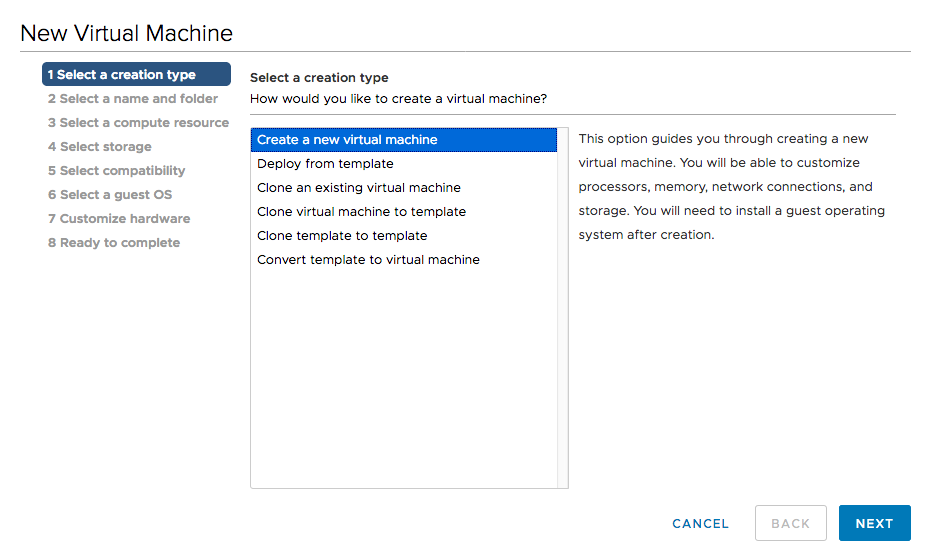
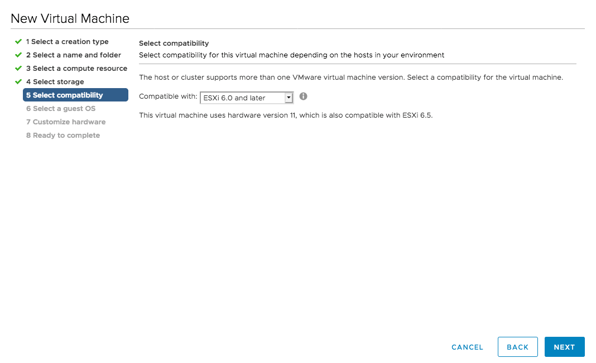
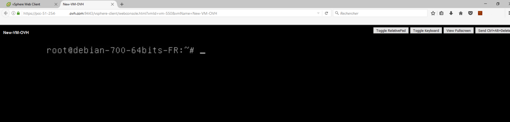

**Ostatnia aktualizacja z dnia 29-06-2020**

## Wprowadzenie

Z poziomu interfejsu vSphere możesz wdrażać maszyny wirtualne na wiele różnych sposobów. 

**Odkryj, jak wdrożyć maszynę wirtualną za pomocą pliku ISO**

## Wymagania początkowe

- Posiadanie usługi [Hosted Private Cloud](https://www.ovhcloud.com/pl/enterprise/products/hosted-private-cloud/){.external}
- Dostęp do [interfejsu vSphere](/pages/hosted_private_cloud/hosted_private_cloud_powered_by_vmware/vsphere_interface_connexion)

## W praktyce

### Wdrożenie maszyny wirtualnej

Nową maszynę wirtualną należy wdrożyć z poziomu klienta vSphere, w widoku `Hosty i klastry`.

Kliknij prawym przyciskiem myszy wybrany klaster, a następnie wybierz opcję `Nowa maszyna wirtualna`{.action}.

{.thumbnail}

Podczas tworzenia maszyny wirtualnej masz wiele możliwości:

- Utworzenie maszyny wirtualnej z pliku ISO obecnego w centrum danych. Plik ten należy zaimportować zgodnie z [przewodnikiem łączenia się przez SFTP](/pages/hosted_private_cloud/hosted_private_cloud_powered_by_vmware/sftp_connexion)
- Możesz także wdrożyć maszynę wirtualną na podstawie posiadanego szablonu lub też za pomocą [szablonu OVH](/pages/hosted_private_cloud/hosted_private_cloud_powered_by_vmware/ovf_template)
- Inną opcją jest sklonowanie już istniejącej maszyny wirtualnej (uważając jednak na ryzyko konfliktu adresów IP).
- Możesz sklonować maszynę wirtualną jako szablon, by móc szybciej wdrażać maszyny wirtualne w przyszłości.
- Istnieje też możliwość sklonowania szablonu jako innego szablonu, by np. dysponować szablonem w różnych centrach danych i nie odczuwać spadku wydajności podczas masowego wdrażania.
- Możesz też przekonwertować szablon na maszynę wirtualną, co spowoduje utratę szablonu, lecz może być to dobre rozwiązanie, jeśli chcesz go zmodyfikować.

{.thumbnail}

Tutaj dowiesz się, jak wdrożyć maszynę wirtualną na podstawie pliku ISO.

Następny etap umożliwia określenie nazwy Twojej maszyny wirtualnej i wybór jej lokalizacji. Jeśli nie wybierzesz katalogu, zostanie on utworzony w katalogu głównym centrum danych.

{.thumbnail}

Następnie możesz wybrać klaster, hosta,[pulę zasobów](https://docs.vmware.com/en/VMware-vSphere/6.7/com.vmware.vsphere.resmgmt.doc/GUID-60077B40-66FF-4625-934A-641703ED7601.html){.external-link} lub [vApp](https://docs.vmware.com/en/VMware-vSphere/6.7/com.vmware.vsphere.vm_admin.doc/GUID-E6E9D2A9-D358-4996-9BC7-F8D9D9645290.html){.external-link}, w której chcesz ją umieścić.

W takim przypadku maszyna wirtualna zostanie wdrożona zgodnie ze skonfigurowanymi regułami DRS i  umieszczona w katalogu głównym klastra.

{.thumbnail}

Następnie należy wybrać magazyn danych, w którym będą przechowywane pliki konfiguracji i dysku.

Odradzamy umieszczanie maszyny wirtualnej w „storageLocal”, który odpowiada lokalnemu magazynowi danych Twojego hosta. W razie awarii hosta maszyna wirtualna nie będzie mogła się uruchomić i nie będzie dostępna.

{.thumbnail}

Następnie wybierz rodzaj kompatybilności między Twoją maszyną wirtualną i hostem. Za wyjątkiem szczególnych przypadków zaleca się, by wykorzystać najnowszą wersję.

{.thumbnail}

Następnie wybierz wirtualizowany system operacyjny, tzw. „guest OS”. Nie spowoduje to instalacji systemu operacyjnego. Zamiast tego vSphere konfiguruje maszynę wirtualną w sposób automatyczny (liczba CPU/ pamięci RAM, typ karty sieciowej, obsługa instalacji VMware tools).

{.thumbnail}

### Konfiguracja maszyny wirtualnej

Następne etapy umożliwiają skonfigurowanie zasobów maszyny wirtualnej.

Wiersz `Nowa sieć` pozwala dodać kartę sieciową:

- „VM Network” będzie obsługiwać sieć publiczną i bezpośredni dostęp do Internetu.
- VLAN umożliwiają korzystanie z sieci prywatnej między Twoimi maszynami wirtualnymi (a także z innymi usługami OVHcloud za pośrednictwem vRack).

{.thumbnail}

W wierszu `Nowy napęd CD/DVD`, możesz wybrać opcję „Plik ISO w magazynie danych”.

Otworzy się wówczas okno umożliwiające wskazanie pliku ISO. Plik ISO można dodać także po utworzeniu maszyny wirtualnej.

{.thumbnail}

Wybrany plik wyświetla się tak, jak przedstawiono poniżej. Pamiętaj, by go podłączyć, zaznaczając pole `Podłącz przy uruchomieniu`{.action}.

{.thumbnail}

Wyświetlone zostanie wówczas podsumowanie dotyczące tworzenia maszyny wirtualnej. Jeśli chcesz zmienić swoją konfigurację, kliknij bezpośrednio jeden z etapów po lewej.

Kliknij opcję `ZAKOŃCZ`{.action}, aby zakończyć wdrażanie.

{.thumbnail}

Kiedy maszyna będzie już dostępna w wykazie, możesz ją uruchomić, klikając kolejno prawym przyciskiem myszy `Uruchamianie`{.action} i `Włącz`{.action}. 

Następnie kliknij `Otwórz Remote Console`{.action}, aby uzyskać dostęp do „ekranu” maszyny wirtualnej i rozpocząć instalację systemu operacyjnego.

{.thumbnail}

Konsola otworzy się w nowej karcie i, po przeprowadzeniu instalacji, będzie można rozpocząć korzystanie z maszyny wirtualnej.

{.thumbnail}

> [!primary]
> Zaleca się, by po zainstalowaniu maszyny wirtualnej odłączyć plik ISO w ustawieniach. W przeciwnym przypadku nie będzie można zmieniać lokalizacji maszyny wirtualnej.
>

## Sprawdź również

Dołącz do społeczności naszych użytkowników na stronie <https://community.ovh.com/en/>.
