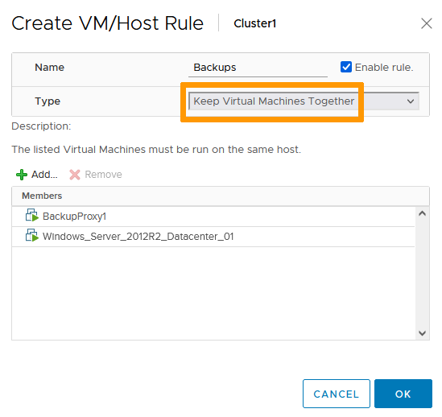
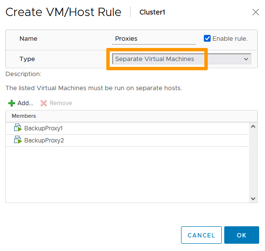

> [!primary]
> Tłumaczenie zostało wygenerowane automatycznie przez system naszego partnera SYSTRAN. W niektórych przypadkach mogą wystąpić nieprecyzyjne sformułowania, na przykład w tłumaczeniu nazw przycisków lub szczegółów technicznych. W przypadku jakichkolwiek wątpliwości zalecamy zapoznanie się z angielską/francuską wersją przewodnika. Jeśli chcesz przyczynić się do ulepszenia tłumaczenia, kliknij przycisk "Zgłóś propozycję modyfikacji" na tej stronie.
>

## Wprowadzenie

W procesie tworzenia kopii zapasowej, po usunięciu snapshota wirtualnej maszyny na Twoim datastore NFS może wystąpić trwająca 30 sekund blokada dysku (disk lock) lub zamrożenie (freeze) wirtualnej maszyny.
Wynika to z faktu, że snapshot Twojej wirtualnej maszyny jest zainstalowany na backupie proxy, który działa na innym hoście. Jeśli proxy i wirtualna maszyna są umieszczone na tym samym hoście, taka blokada nie wystąpi.

**Niniejszy przewodnik wyjaśnia, jak wdrożyć rozwiązanie, które pozwala uniknąć blokady wirtualnej maszyny dzięki mechanizmowi VMware DRS.**

## Wymagania początkowe

- Posiadanie kontaktu administracyjnego infrastruktury [Hosted Private Cloud](https://www.ovhcloud.com/pl/enterprise/products/hosted-private-cloud/), aby otrzymać dane do logowania.
- Posiadanie aktywnego identyfikatora użytkownika (utworzonego w [Panelu klienta OVHcloud](https://www.ovh.com/auth/?action=gotomanager&from=https://www.ovh.pl/&ovhSubsidiary=pl))
- Włącz opcję [Veeam Backup Managed](https://www.ovhcloud.com/pl/enterprise/products/hosted-private-cloud/veeam-backup-managed/){.external}.

## W praktyce

> [!primary]
>
> Przed rozpoczęciem procesu zapoznaj się z poniższymi informacjami:
>
> - w przypadku dużych środowisk utworzenie wielu reguł DRS może potrwać długo;
> - użytkownik powinien dodać ręcznie nowe wirtualne maszyny do reguł DRS;
> - wszystkie maszyny wirtualne, które mają być objęte kopią zapasową, ale nie zostały ujęte w regułach DRS, mogą nadal doświadczać blokady dysku lub zamrożenia (freeze).
>

Aby wdrożyć to rozwiązanie, kliknij na odpowiedni klaster, przejdź do zakładki `Configure`{.action}, następnie sekcji `VM/Host Rules`{.action}.

{.thumbnail}

Utwórz regułę DRS, aby **maszyny wirtualne były przechowywane w jednym miejscu** i dodaj je wraz z serwerem proxy wykonującym backup. Jeśli posiadasz dużą liczbę wirtualnych maszyn, których kopie zapasowe chcesz wykonać, możesz utworzyć kilka reguł DRS i powiązać je z kilkoma serwerami proxy. Algorytm OVH gwarantuje, że proces tworzenia kopii zapasowej wirtualnej maszyny jest realizowany przez serwer proxy znajdujący się na tym samym hoście ESXi, na którym znajduje się wirtualna maszyna.

> [!warning]
>
> Dodanie nowego backup proxy wiąże się z dodatkowymi kosztami.
>

{.thumbnail}

Utwórz inną regułę DRS, aby **oddzielić wirtualne maszyny** i utrzymywać serwery proxy wykonujące backupy na różnych hostach:

{.thumbnail}

Pamiętaj, aby utworzyć regułę „anti-affinity”, dzięki czemu serwery proxy wykonujące backu nie znajdą się nigdy na tym samym hoście. Liczba utworzonych reguł musi odpowiadać liczbie serwerów proxy.

## Sprawdź również

Przyłącz się do społeczności naszych użytkowników na stronie <https://community.ovh.com/en/>.
