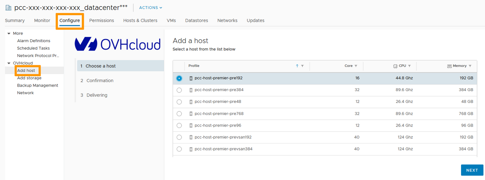
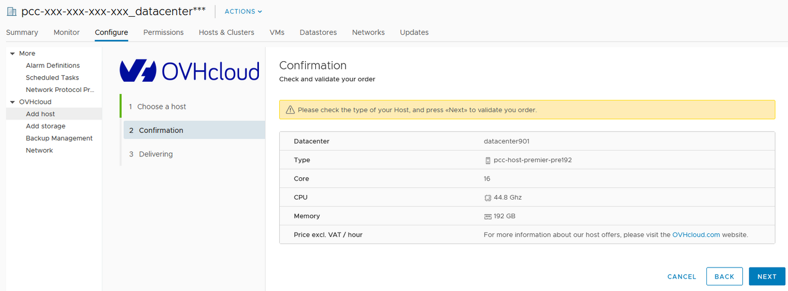
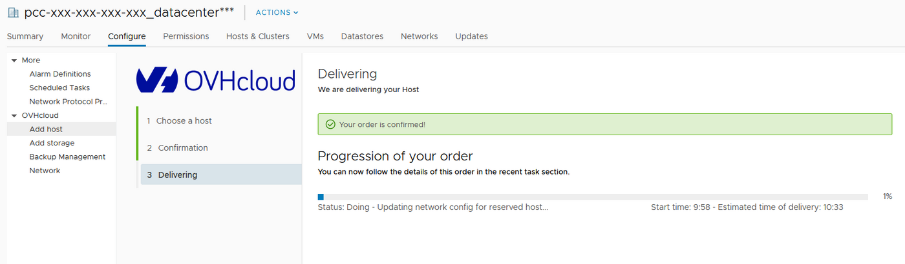

**Last updated 1st February 2022**

## Objective

Within your OVHcloud environment, you can add a new dedicated host in just a few minutes.

**Learn how to add compute capabilities to your infrastructure.**

## Requirements

- Being an administrative contact of your [Hosted Private Cloud infrastructure](https://www.ovhcloud.com/en/enterprise/products/hosted-private-cloud/) to receive login credentials
- A user account with access to vSphere (created in the [OVHcloud Control Panel](https://ca.ovh.com/auth/?action=gotomanager&from=https://www.ovh.com/world/&ovhSubsidiary=we))

## Instructions

> [!warning]
>
> Adding resources through vSphere adds them as hourly resources for billing purposes. If you wish to switch them to monthly resources, it can be changed in the [OVHcloud Control Panel](https://ca.ovh.com/auth/?action=gotomanager&from=https://www.ovh.com/world/&ovhSubsidiary=we).
> For more info on this, check out our [Introduction to the Hosted Private Cloud Control Panel](/pages/hosted_private_cloud/hosted_private_cloud_powered_by_vmware/manager_ovh_private_cloud)
> 

In the vSphere interface menu, go to the `Hosts and Clusters`{.action} dashboard.

{.thumbnail}

The `Configure`{.action} tab gives you access to the OVHcloud plugin. 
in the `Add Host`{.action} menu, choose the type of host you would like to add and click `Next`{.action}.

{.thumbnail}

Verify your order and confirm by clicking `Next`{.action}.

{.thumbnail}

Your order is then confirmed. The progression of the delivery is showing with an estimated time of availability.

{.thumbnail}

Once done, a new host is showing in your datacenter and is ready for use.

## Go further

Join our community of users on <https://community.ovh.com/en/>.
