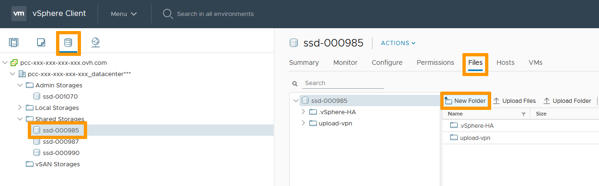
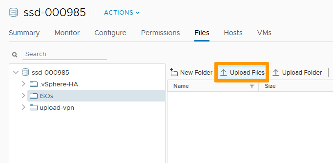
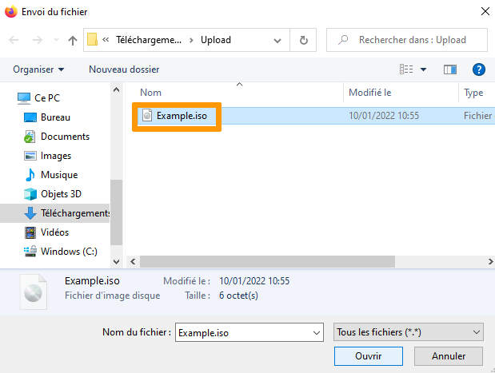
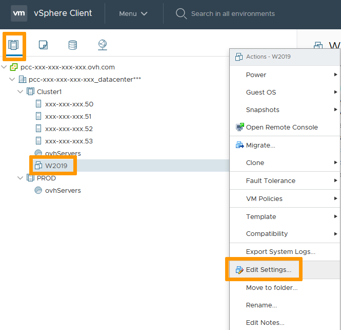
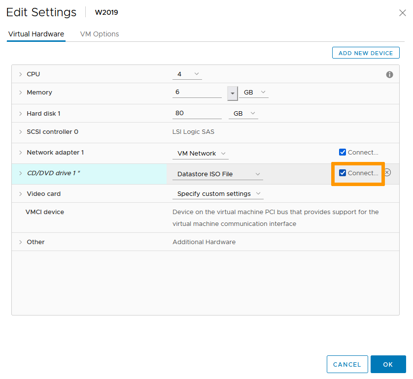

## Objective

You can set up an ISO library in your infrastructure to be used for OS and software deployment.

**This guide will run you through the process of connectioning an ISO image to a VM.**

## Requirements

- Being an administrative contact of your [Hosted Private Cloud infrastructure](https://www.ovhcloud.com/en-ca/enterprise/products/hosted-private-cloud/) to receive login credentials
- A user account with access to vSphere (created in the [OVHcloud Control Panel](https://ca.ovh.com/auth/?action=gotomanager&from=https://www.ovh.com/ca/en/&ovhSubsidiary=ca))

## Instructions

### Library Creation

In the vSphere interface menu, go to the `Storage`{.action} section. 
Choose the Datastore you will be building the library in (prefer Shared Storage over Local to avoid file access issues). 
In the `Files`{.action} tab, Click on `New Folder`{.action}.

{.thumbnail}

After naming your folder (ISOs in our study case), select it and click `Upload Files`{.action}.

{.thumbnail}

Browse to the ISO file(s) you wish to upload and click `Open`{.action}.

{.thumbnail}

Your library is set. You can add more ISO images as you need and as storage space allows.

{.thumbnail}

### Connect Image to VM

In the vSphere interface menu, go to the `Hosts & Clusters`{.action} section. 
Right click the VM you need the ISO image attached to and click on `Edit Settings`{.action}. 

{.thumbnail}

Change the CD/DVD drive setting to Datastore ISO File.

{.thumbnail}

In the browsing window that pops up, navigate to the library previously created and select the image you wish to use.

Click on `OK`{.action}.

{.thumbnail}

Back in the "Edit Settings" menu, make sure the "Connect" box is checked and click `OK`{.action}.

{.thumbnail}

The ISO image is now connected to your VM and can be accessed as if it were an attached physical media.

## Go further

Join our community of users on <https://community.ovh.com/en/>.
