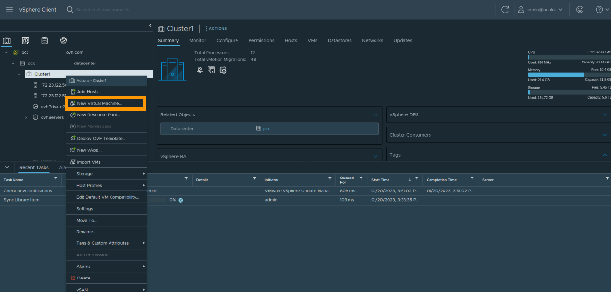
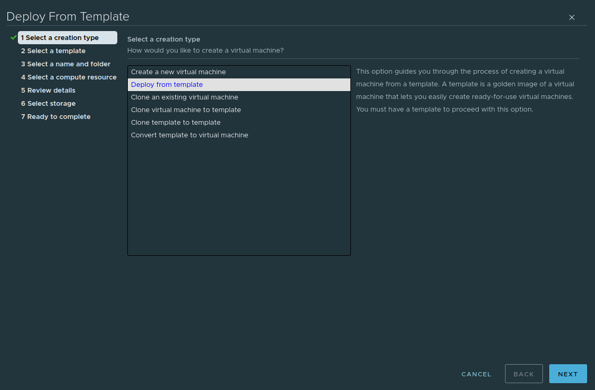

 
## Objective

OVHcloud offers OVF templates that you can deploy directly from your vSphere *(version 7.0 or later)* across [content libraries](https://docs.vmware.com/en/VMware-vSphere/7.0/com.vmware.vsphere.vm_admin.doc/GUID-254B2CE8-20A8-43F0-90E8-3F6776C2C896.html){.external}.

**This guide will explain how to deploy these templates.**

## Requirements

- Web client access (HTML5)

## Instructions

### Step 1 - Deploying a template

#### Deploy a template from a content library

You can find the content libraries that your vSphere has signed up to via your vSphere homepage, by clicking the `Content libraries`{.action} icon.

{.thumbnail}

Then click on one of the libraries to view their contents and deploy a new virtual machine from the `OVF & OVA Templates`{.action} tab.

{.thumbnail}

#### Deploy a template directly from the Cluster view

You can also deploy content from libraries directly from the *Cluster* view by right-clicking one of your clusters and selecting `New Virtual Machine`{.action}.

{.thumbnail}

Then select the `Deploy from template`{.action} option.

{.thumbnail}

Click on one of the templates offered by the content libraries installed on your vSphere.

{.thumbnail}

### Step 2 - Configuring the template

The template deployment process will ask you to confirm the details, as well as a destination for the new virtual machine (datacentre, cluster, datastore, etc.).

{.thumbnail}

Some templates accept deployment properties that allow you to quickly configure the new virtual machine by creating, for example, a privileged user or configuring the main network interface.

{.thumbnail}

Templates that do not offer customisation will have the default credentials specified in the virtual machine notes.

## Go further

If you need training or technical support to implement our solutions, contact your sales representative or click on [this link](https://www.ovhcloud.com/en-ie/professional-services/) to get a quote and request a customised analysis of your project from our Professional Services team experts.

Join our community of users on <https://community.ovh.com/en/>.