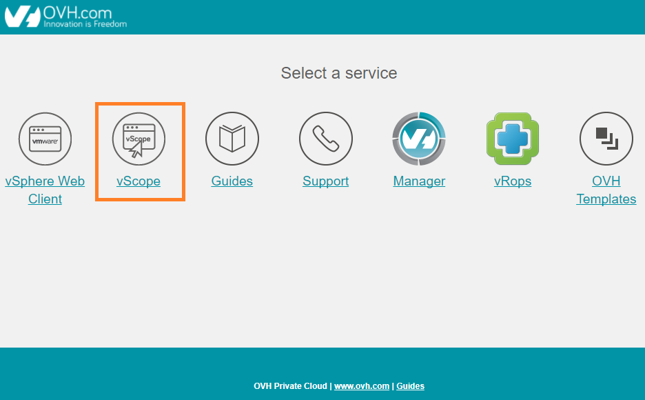
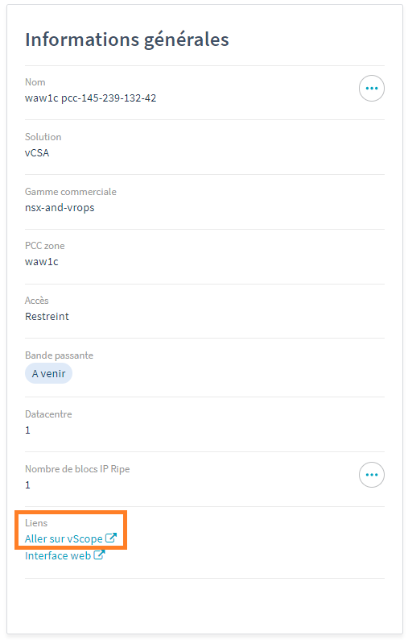

**Dernière mise à jour le 28/01/2022**

## Objectif

OVHcloud vous met à disposition un outil de **supervision** et **monitoring** de vos machines virtuelles et de votre infrastructure qui se nomme **vScope**.

Il s’agit d’une page web où sont rassemblées toutes les informations **utiles** sur vos ressources.

**Ce guide décrit la lecture de l'interface vScope.**

## Prérequis

- Être contact administrateur de l'infrastructure [Hosted Private Cloud](https://www.ovhcloud.com/fr/enterprise/products/hosted-private-cloud/), afin de recevoir des identifiants de connexion.
- Avoir un identifiant utilisateur actif (créé dans l'[espace client OVHcloud](https://www.ovh.com/auth/?action=gotomanager&from=https://www.ovh.com/fr/&ovhSubsidiary=fr))

## En pratique

Pour accèder à l'interface vScope, rendez vous sur le portail de votre Hosted Private Cloud et cliquez sur l'icone vScope.

{.thumbnail}

Un lien d'accès à l'interface **vScope** est aussi disponible dans votre espace client OVHcloud.

{.thumbnail}

Dans les deux cas, vous ouvrirez un nouvel onglet dans votre navigateur avec cette URL.

{.thumbnail}

Munissez-vous de votre **utilisateur** et votre **mot de passe**, servant habituellement à la connexion de votre client vSphere, afin de vous connecter à cette interface.

{.thumbnail}

Vous êtes maintenant connecté sur la page de votre **vScope** qui regroupe l'ensemble des informations utiles de vos ressources. Par exemple, pour chaque host, vous visualisez immédiatement le nombre de Cores et de VM, la charge CPU et RAM, ainsi que le trafic réseau.

{.thumbnail}

Nous allons détailler chaque élément de cette page.

En cas de différents **data-centres** dans un même **Hosted Private Cloud**, vous pouvez le choisir dans le menu déroulant. Concernant le **Last refresh**, il correspond au dernier rafraîchissement de la **page Web** et non du **vScope** qui lui est mis à jour toutes les **2 à 5 minutes**.

{.thumbnail}

Le menu **Filer** renseigne sur l'utilisation de vos data-stores, que ce soit au niveau du nombre de machines virtuelles ainsi que de l'espace consommé.

{.thumbnail}

En cliquant sur l'icône **Graphs**, vous pouvez obtenir des données **précises** concernant la ressource.

{.thumbnail}

Le menu pour les hosts affiche en détails les caractéristiques de chaque host dans votre data-centre (**Cores, vCPUs, VM**) ainsi que leurs pourcentages d'utilisation et enfin la connectivité réseau et le nombre de cartes réseau physiques (**VMNic**).

{.thumbnail}

Voici la page qui détaille précisément la ressource. Vous avez également accès à un historique d’utilisation sur un jour, une semaine, un mois ou même un an.

{.thumbnail}

Voici la dernière catégorie qui détaille l'utilisation de chaque **machine virtuelle** dans votre data-centre avec notamment les informations suivantes :

- Etat des VMtools
- Trafic réseau
- Taille de la VM
- Activation FT (Fault Tolerance)
- CPU Ready Time
- Disk IO
- Disk Latency

{.thumbnail}

## Aller plus loin

Échangez avec notre communauté d'utilisateurs sur <https://community.ovh.com/>.
