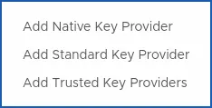

> [!primary]
>
> Cette fonctionnalité est disponible en bêta. Ce guide peut être incomplet et sera mis à jour dans les versions futures. N’hésitez pas à nous faire part de vos feedbacks sur le canal [Discord](<https://discord.gg/ovhcloud>) dédié.
>

## Objectif

**Ce guide complet introduit les fonctionnalités KMS et vous explique comment configurer et optimiser l'utilisation d'un service de gestion de clé OVHcloud au sein votre infrastructure Hosted Private Cloud VMware on OVHcloud.**

## Prérequis
- Disposer d'un [compte client OVHcloud](/pages/account_and_service_management/account_information/ovhcloud-account-creation).
- Avoir souscrit une offre [VMware on OVHcloud](https://www.ovhcloud.com/fr/enterprise/products/hosted-private-cloud/){.external}.
- Avoir accès à l’interface de gestion vSphere de votre PCC (Hosted Private Cloud VMware on OVHcloud).
- Disposez des droits IAM suffisant avec votre compte de service OVHcloud et vos ressources KMS Hosted Private Cloud VMware on OVHcloud, pour ça vous pouvez voir les guides :
  - [IAM pour VMware on OVHcloud - Présentation et FAQ](/pages/hosted_private_cloud/hosted_private_cloud_powered_by_vmware/vmware_iam_getting_started).
  - [IAM pour VMware on OVHcloud - Comment activer IAM](/pages/hosted_private_cloud/hosted_private_cloud_powered_by_vmware/vmware_iam_activation).
  - [IAM pour VMware on OVHcloud - Comment créer un rôle vSphere IAM](/pages/hosted_private_cloud/hosted_private_cloud_powered_by_vmware/vmware_iam_role).
  - [IAM pour VMware on OVHcloud - Comment associer un rôle vSphere à une politique IAM](/pages/hosted_private_cloud/hosted_private_cloud_powered_by_vmware/vmware_iam_role_policy).
  - [IAM pour VMware on OVHcloud - Comment associer un utilisateur à une politique IAM globale](/pages/hosted_private_cloud/hosted_private_cloud_powered_by_vmware/vmware_iam_role_policy).

## En pratique

> [!primary]
>
> Prenez en compte que l'activation de KMS est gratuite, mais vous serez facturé pour l'utilisation du service KMS OVHcloud selon le tarif standard.
> Pour plus d'information, consultez la page [Labs KMS OVHcloud](<https://labs.ovhcloud.com/en/key-management-service/>).{.external}.
>

/// details | Le KMS OVHcloud est un service managé conçu pour?

1. Protégez vos données au sein de vos services et applications OVHcloud via des techniques de chiffrement entièrement gérées par OVHcloud.
Générez et stockez en toute sécurité vos clés de chiffrement. Vous pouvez les utiliser soit pour vos services OVHcloud, soit pour vos propres applications sans vous inquiéter de les voir volées, falsifiées ou perdues.

2. Pour assurer la réversibilité complète de vos services, le KMS OVHcloud fournit une API KMIP (Key Management Interoperability Protocol) et une API Rest. L'API KMIP vous permet de réutiliser les clés de chiffrement du KMS OVHcloud dans tous les services non-OVHcloud supportant ce protocole. De plus, vous pouvez transférer en toute transparence vos clés de chiffrement vers un autre KMS compatible KMIP sans perturber l'intégration de vos applications.

3. Avoir l'infrastructure d'un service managé redondante et serverless.

Nous détaillerons ici les étapes qu'il faudra suivre pour une configuration réussie de KMS avec votre Hosted Private Cloud VMware on OVHcloud.

### L'authentification

L'authentification à ce jour est uniquement possible au sein du KMS OVHcloud (OKMS) grâce à la méthode **mtls** (mutual tls), du protocol officiel tls, [rfc8705](<https://www.rfc-editor.org/rfc/rfc8705.html>){.external}. Et KMIP pour la gestion (création, suppression etc..) au sein de l'environnement VMware on OVHcloud.

### Cas d'usages

- Chiffrement et déchiffrement des données Hosted Private VMware on OVHcloud (stratégies de chiffrement de VM au sein de vSphere, vApp etc..).
- Génération de clé KMS depuis vSphere avec le KMS OVHcloud.
- Stockage des clés de chiffrement avec le KMS OVHcloud au sein d'un environnement Hosted Private Cloud VMware on OVHcloud.
- Gestion du cycle de vie de vos clés (utilisation, rotation, révocation, etc..) KMS.
- Utiliser IAM et le KMS OVHcloud (OKMS) avec votre Hosted Private Cloud VMware on OVHcloud.
- Interconnection des services OVHcloud ou pas avec le KMS.

### Avantages du KMS OVHcloud

Le KMS OVHcloud vous permet de profiter des avantages d'un service managé de gestion de clé (KMS as a service) au sein de l'univers Hosted Private Cloud VMware on OVHcloud.

Pour plus d'information sur les avantages de l'usage du KMS OVHcloud, consultez le:
- [Guide 5 - Aperçu de l'architecture KMS (KMS guide 2 overview)](/pages/manage_and_operate/kms/architecture-overview).

Cette architecture est redondante et permet ainsi de subir des pannes sans que celles-ci, n'affectent son service.

### KMIP

KMIP pour VMware on OVHcloud fournit un service de gestion des clés compatibles avec le chiffrement VMware on OVHcloud vSAN et le chiffrement basé sur l'hôte au sein de vSphere.

///

## Étape 1 - Apprenez comment faire l'intégration d'un KMS au sein d'OVHcloud

/// details | Quelles options s'offrent à vous pour activer le chiffrement de VM?

### Option 1 : KMS externe (non OVHcloud)

Si vous disposez déja d'un service de gestion de clés (KMS) et vous voulez l'utiliser sur votre Hosted Private Cloud VMware on OVHcloud. Pour chiffrer vos machines virtuelles vSphere par exemple.

#### Comment activer le chiffrement des disques sur vos machines virtuelles Hosted Private Cloud VMware on OVHcloud ?

Pour ça il vous faut configurer KMS sur votre Hosted Private Cloud VMware on OVHcloud, suivez donc le :
- [Guide 1 - Configurez le chiffrement des machines virtuelles sur vSphere avec mon serveur KMS](/pages/hosted_private_cloud/hosted_private_cloud_powered_by_vmware/vmware_kms_vsphere_configuration).

Vous disposez ici des appels API nécessaires à la verification et l'activation du chiffrement sur vos machines virtuelles Hosted Private Cloud VMware on OVHcloud. 

Ainsi que des paramètres à l'ajout d'un cluster KMS externe :
- [Guide 4 - Appel API pour configurer le chiffrement des machines virtuelles (VM encrypt 2020)](/pages/hosted_private_cloud/hosted_private_cloud_powered_by_vmware/vm_encrypt).

### Option 2 : OVHcloud KMS (avec OKMS)

### Si vous n'avez pas de service de gestion de clé KMS

Vous ne disposez donc pas de service de gestion de clé (KMS) et vous voulez utiliser celui proposé par OVHcloud (OKMS) pour chiffrer vos données Hosted Private Cloud VMware on OVHcloud.

### Comment activer le KMS OVHcloud avec votre Hosted Private Cloud VMware on OVHcloud?

Si vous n'avez pas de serveur KMS et que vous voulez utiliser celui d'OVHcloud (OKMS), vous pouvez suivre le :
- [Guide 3 - Activer le chiffrement de VM avec un KMS OVHcloud au sein de votre Hosted Private Cloud VMware on OVHcloud](/pages/hosted_private_cloud/hosted_private_cloud_powered_by_vmware/vmware_okms_vm-encrypt).

Une fois votre KMS commandé et activer avec votre Hosted Private Cloud il vous reste la synchronisation avec votre environnement VMware on OVHcloud pour activer le chiffrement. Pour ça allez dans le guide 1 :
- [Guide 3 - Activer le chiffrement de VM avec un KMS OVHcloud au sein de votre Hosted Private Cloud VMware on OVHcloud (VM encrypt with OKMS)](/pages/hosted_private_cloud/hosted_private_cloud_powered_by_vmware/vmware_okms_vm-encrypt).

Nous utiliserons pour cette option un `Standard Key Provider`{.action}.

{.thumbnail}

### Comment activer le chiffrement des machines virtuelles avec le KMS d'OVHcloud ?

Une fois le KMS d'OVHcloud commandé, vous avez la possibilité de le configurer pour qu'il puisse fonctionner en accord avec votre Hosted Private Cloud VMware on OVHcloud.

Pour plus d'information, suivez le guide : [Guide 3 - Activer le chiffrement de VM avec un KMS OVHcloud au sein de votre Hosted Private Cloud VMware on OVHcloud (VM encrypt with OKMS)](/pages/hosted_private_cloud/hosted_private_cloud_powered_by_vmware/vmware_okms_vm-encrypt).

Si vous avez quelques zones d'ombres sur l'ensemble des étapes à suivre, de la commande jusqu'à l'activation du chiffrement de machine virtuelle au sein de vSphere: [Guide 5 - Activation du chiffrement sur Hosted Private Cloud avec le KMS OVHcloud (OKMS)](/pages/hosted_private_cloud/hosted_private_cloud_powered_by_vmware/vmware_okms_vm-encrypt).

Nous utiliserons pour cette option un: `Standard Key Provider`{.action}.

{.thumbnail}

### Option 3 : Avec vNKP (sans OKMS) 

### Si vous n'avez pas de service de gestion de clé externe et que vous ne voulez pas utiliser celui de OVHcloud (OKMS).

### Comment créer votre propre KMS avec vNKP au sein de Hosted Private Cloud VMware on OVHcloud ?

Si vous ne voulez pas profiter des avantages du service managé de KMS OVHcloud (OKMS) et que vous voulez créer votre propre KMS pour activer le chiffrement de vos données vSphere. Vous pouvez le faire avec vNKP.

Vous pouvez utiliser l'option native de vSphere, vNKP, en ajoutant un fournisseur: `Native Key Provider`{.action}.

{.thumbnail}

Ce guide vous détaille comment le faire: [Guide 6 - Activation du chiffrement des machines virtuelles avec un vSphere Native Key Provider (VM encrypt with vNKP)](/pages/hosted_private_cloud/hosted_private_cloud_powered_by_vmware/vm_encrypt-vnkp).

///

## Aller plus loin

KMS pour Hosted Private Cloud VMware on OVHcloud - Index des guides:

- Guide 1 : [Configurez le chiffrement des machines virtuelles dans vSphere grâce à un serveur KMS externe (VM encrypt 2024)](/pages/hosted_private_cloud/hosted_private_cloud_powered_by_vmware/vmware_kms_vsphere_configuration).
- Guide 2 : [Commande d'un KMS managé par OVHcloud pour votre Hosted Private Cloud VMware on OVHcloud - Premier pas (KMS guide 1 - Quick start)](/pages/manage_and_operate/kms/quick-start).
- Guide 3 : [Activer le chiffrement de VM avec un KMS OVHcloud au sein de votre Hosted Private Cloud VMware on OVHcloud (VM encrypt with OKMS)](/pages/hosted_private_cloud/hosted_private_cloud_powered_by_vmware/vmware_okms_vm-encrypt).
- Guide 4 : [Appel API pour configurer le chiffrement des machines virtuelles (VM encrypt 2020)](/pages/hosted_private_cloud/hosted_private_cloud_powered_by_vmware/vm_encrypt).
- Guide 5 : [Aperçu de l'architecture KMS (KMS guide 2 overview)](/pages/manage_and_operate/kms/architecture-overview).
- Guide 6 : [Activation du chiffrement des machines virtuelles avec un vSphere Native Key Provider (VM encrypt with vNKP)](/pages/hosted_private_cloud/hosted_private_cloud_powered_by_vmware/vm_encrypt-vnkp).

Documentation officiel VMware:
- [Présentation VMware de vSphere Native Key Provider](<https://docs.vmware.com/fr/VMware-vSphere/7.0/com.vmware.vsphere.security.doc/GUID-54B9FBA2-FDB1-400B-A6AE-81BF3AC9DF97.html#GUID-54B9FBA2-FDB1-400B-A6AE-81BF3AC9DF97>){.external}.
- [Documentation VMware du processus de chiffrement sur vSphere](<https://docs.vmware.com/fr/VMware-vSphere/7.0/com.vmware.vsphere.security.doc/GUID-4A8FA061-0F20-4338-914A-2B7A57051495.html#GUID-4A8FA061-0F20-4338-914A-2B7A57051495>){.external}.

Vous pouvez aussi suivre le lab KMS OVHcloud: [Labs KMS OVHcloud](<https://labs.ovhcloud.com/en/key-management-service/>){.external}

Rejoignez et échangez avec notre [communauté d'utilisateurs](/links/community).