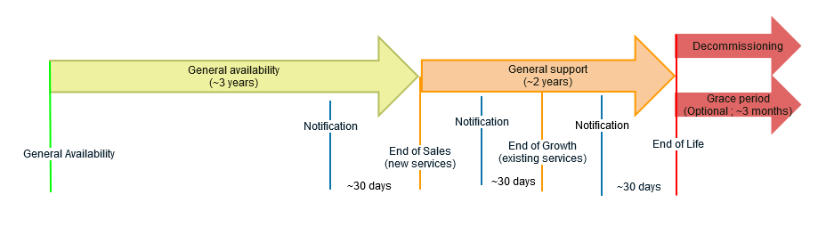

> [!warning]
>
> Cette page est uniquement à des fins d'information générale et OVHcloud ne garantit pas l'exhaustivité ni l'actualité des informations. Les contrats régissant ce produit (notamment les conditions générales et spécifiques d'utilisation, consultables dans le compte client) et les communications adressées par OVHcloud aux clients prévalent sur toute information affichée sur cette page.
>

## Objectif

**Cette page donne un aperçu de la politique de cycle de vie des services VMware on OVHcloud.**

Le service Hosted Private Cloud VMware on OVHcloud propose une infrastructure dédiée basée sur les technologies VMware SDDC ainsi que sur les technologies d'autres partenaires (Veeam, Zerto...).

OVHcloud a une politique de cycle de vie du service pour prendre en compte plusieurs facteurs, tels que :

- le cycle de vie des composants logiciels intégrés, tel que déterminé par leurs éditeurs (VMware, Veeam, Zerto, etc.) ;
- le cycle de vie des composants matériels ;
- la compatibilité entre composants matériels et/ou logiciels ;
- les autres facteurs affectant la qualité du service.

Cette politique de cycle de vie est fournie pour aider les clients à comprendre les raisons sous-jacentes des changements de version ou de gamme, à évaluer l'impact de chaque phase du cycle de vie sur le service et à préparer la transition vers une nouvelle version ou gamme.

### Gamme commerciale concernée

**Hosted Private Cloud VMware on OVHcloud** :

- Public VMware Cloud Foundation as-a-Service
- Managed VMware vSphere
- Private VMware Cloud Foundation as-a-Service - 1AZ
- Private VMware Cloud Foundation as-a-Service - Stretched Cluster 3AZ

## Chronologie du cycle de vie et définitions

### Définitions

#### Mode Maintenance

Dans le cadre de notre démarche d’innovation continue, nous avons décidé de concentrer nos efforts de développement sur des solutions plus récentes et avancées. Par conséquent, les services et fonctionnalités suivants passent en mode Maintenance. Cela signifie :

- Les clients existants utilisant ces fonctionnalités continueront de bénéficier du support, y compris des mises à jour critiques de sécurité et de disponibilité. Ils peuvent donc être assurés de la bonne continuité de leurs services.
- Aucune nouvelle fonctionnalité ou amélioration ne sera ajoutée à ces services.
- Les nouveaux clients ne pourront plus souscrire à ces services spécifiques.

Nos équipes restent engagées pour vous accompagner dans cette transition et garantir une expérience fluide.

#### Mode Sunset

Le mode Sunset indique qu’un service ou une fonctionnalité approche de sa fin de support. À ce stade, le service ou la fonctionnalité reste disponible, mais ne bénéficie plus de mises à jour régulières, de nouvelles fonctionnalités ou de correctifs importants.

Durant cette phase, OVHcloud accompagne les clients dans la migration vers d’autres services ou solutions plus adaptées à leurs besoins en évolution. Notre objectif est d’assurer une transition fluide et de minimiser toute perturbation de l’activité.

Pendant la phase Sunset, les clients peuvent s’attendre à :

- Un accès continu au service ou à la fonctionnalité, mais avec un support limité et sans nouveau développement.
- Un accompagnement par OVHcloud pour la migration vers d’autres offres.
- Une communication régulière sur la date de fin de support à venir et les prochaines étapes recommandées.
- L’accès à la documentation et aux ressources dédiées pour faciliter la migration.

#### Fin de Support

Les services et fonctionnalités suivants ont atteint leur fin de support et ne sont plus disponibles.

### Chronologie

{.thumbnail}

## Statut de la gamme commerciale OVHcloud

### Produits (Plateformes)

|                   Commercial Range                    | Disponibilité générale| Mode Maintenance | Mode Sunset | Fin de Support |
|:-----------------------------------------------------:|:--------------------:|:------------:|:-------------:|:-----------:|
|     Managed VMware vSphere                            |          2016        |  2027-05-31  |  2027-10-31   | 2027-10-31  |
|     Public VMware Cloud Foundation as-a-Service       |          2025        |              |               |             |
|Private VMware Cloud Foundation as-a-Service - 1AZ                  |          2027        |              |               |             |
|Private VMware Cloud Foundation as-a-Service - Stretched Cluster 3AZ|          2027        |              |               |             |

### Hôtes Managed VMware vSphere (calcul)

Pour le produit Managed VMware vSphere, un cycle de vie matériel spécifique s’applique :

- **Sales** désigne la date à partir de laquelle la création de nouveaux clusters n’est plus possible. Au-delà de cette date, les clients ne peuvent plus démarrer de service sur ce matériel.
- **Growth** désigne la date à partir de laquelle l’ajout de nouveaux nœuds pour un cluster existant n’est plus possible. Au-delà de cette date, les clients ne peuvent plus commander cette génération matérielle. Cela n’affecte toutefois pas les engagements contractuels pour les clusters existants (mises à jour, pièces de rechange, SLA).

|                   Génération matérielle               | General Availability |    Sales    |     Growth     | Fin de Support |
|:-----------------------------------------------------:|:--------------------:|:------------:|:-------------:|:-----------:|
| SDDC2014 & SDDC2016 (Intel Ivy Bridge, Intel Haswell) |          2016        |  2017-04-30  |  2026-06-01   | 2027-05-31  |
|              SDDC2018 (Intel Broadwell)               |          2018        |  2018-11-30  |  2026-06-01   | 2027-05-31  |
|             Essentials (Intel Broadwell)              |          2020        |  2026-06-01  |  2026-06-01   | 2027-05-31  |
|               Premier (Intel Xeon Gold)               |          2020        |  2026-05-29  |  2027-03-30   | 2027-10-31  |
|           Premier2026 (Intel Emerald Rapids)          |          2026        |  2027-06-30  |               |             |
|           Premier2027 (Intel Granite Rapids)          |          2027        |              |               |             |

## Logiciels intégrés

### Cycle de vie VMware

Pour connaître la politique de cycle de vie des produits VMware, consultez la page de l'éditeur :

[VMware Lifecycle](https://support.broadcom.com/group/ecx/productlifecycle)

### Cycle de vie Veeam Backup & Replication

Pour connaître la politique de cycle de vie des produits Veeam, consultez la page de l'éditeur :

- [Veeam Lifecycle](https://www.veeam.com/product-lifecycle.html)

### Cycle de vie Zerto

Pour connaître la politique de cycle de vie des produits Zerto, consultez la page de l'éditeur :

- [Zerto Virtual Replication Product Version Lifecycle Matrix](https://help.zerto.com/bundle/Lifecycle.Matrix.HTML/page/Content/Lifecycle_Matrix/Lifecycle_Matrix.htm#zerto_virtual_replication_product_version_lifecycle_matrix_r_893035264_1010900)

## Aller plus loin

Échangez avec notre [communauté d'utilisateurs](/links/community).
