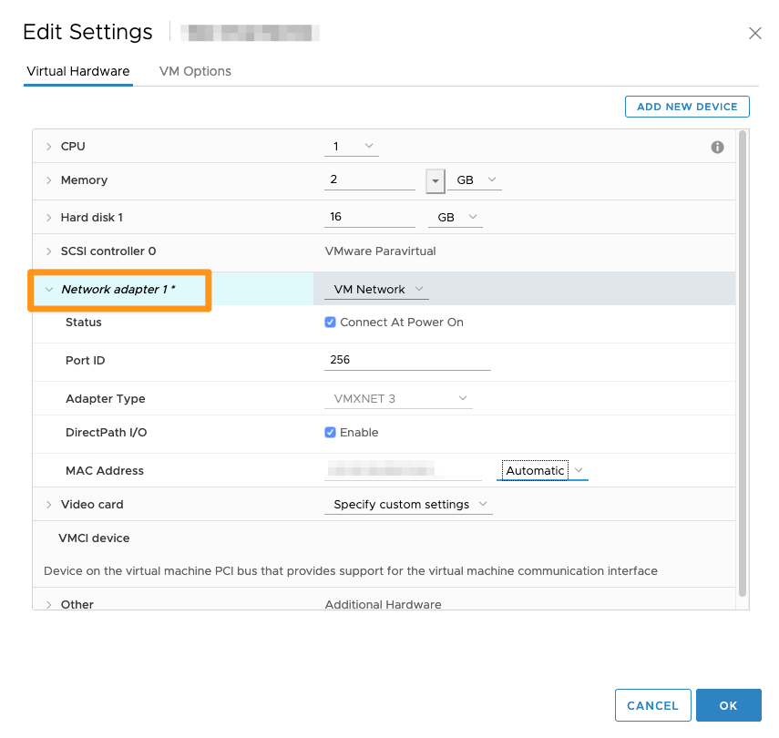

## Ziel

Wenn Sie Ihre virtuelle Maschine erstellt haben, stehen deren Ressourcen nicht permanent fest, sondern können (mit ein paar Einschränkungen) neu zugewiesen werden, um so für eine agile Infrastruktur zu sorgen.

**Diese Anleitung erklärt, wie Sie Ihre virtuelle Maschine skalieren.**

## Voraussetzungen

- Sie haben eine virtuelle Maschine auf einer [Hosted Private Cloud Infrastruktur](https://www.ovhcloud.com/de/enterprise/products/hosted-private-cloud/) erstellt.
- Sie haben einen Benutzeraccount mit Zugriff auf vSphere (erstellt im [OVHcloud Kundencenter](https://www.ovh.com/auth/?action=gotomanager&from=https://www.ovh.de/&ovhSubsidiary=de)).

## In der praktischen Anwendung

Alle nachstehend beschriebenen Änderungen werden über Ihre Private Cloud in vSphere vorgenommen, indem Sie mit der rechten Maustaste auf eine virtuelle Maschine und dann auf `Einstellungen bearbeiten`{.action} klicken.

{.thumbnail}

In diesem Menü können Sie die Ressourcen Ihrer virtuellen Maschine erweitern. 

{.thumbnail}

Wie Sie sehen, können Sie oben rechts auf dieser Seite Geräte hinzufügen. Wir kommen später auf diesen Punkt zurück.

### Prozessor (CPU)

Die Anzahl der CPUs ist auf die in Ihrem Host verfügbaren Slots begrenzt.

Wird Ihre virtuelle Maschine auf einen Host migriert, der über weniger Prozessoren verfügt, als Ihrer Maschine zugewiesen sind, so wird diese in den Status `CPU ready` versetzt, was die Leistung verringert.

{.thumbnail}

Sie können auch eine bestimmte Frequenz (Minimum und Maximum) festlegen oder die Anzahl der Kerne pro Socket auswählen.

Wenn Sie den Haken bei `CPU-Hotplug`{.action} setzen, können Sie diese Werte verändern, während die Maschine läuft.

Je nach verwendetem Betriebssystem kann das Hinzufügen im laufenden Betrieb möglicherweise nicht korrekt verarbeitet werden und führt zu Fehlern auf dem Host.

Sie können Ihrer virtuellen Maschine ein Minimum an *MHz* (Megahertz) zuweisen.

In der Standardeinstellung unbegrenzt, kann der Prozessor Ihrer virtuellen Maschine so auf einen bestimmten Wert in *MHz* limitiert werden. So können Sie beispielsweise eine Entwicklungsmaschine nach Wunsch beschränken.

### Arbeitsspeicher (RAM)

Genau wie die CPU ist auch der Arbeitsspeicher (RAM) auf die Hostressourcen begrenzt.

Auch hier können Sie eine Reservierung vornehmen, damit Ihre virtuelle Maschine immer über eine bestimmte RAM-Kapazität verfügt.

{.thumbnail}

### Festplatte

Was die Festplatte betrifft, können Sie deren Größe abhängig vom verbleibenden Speicherplatz auf dem von der virtuellen Maschine verwendeten Datastore vergrößern.

{.thumbnail}

Es wird empfohlen, SCSI-Festplatten-Controller anstelle von IDE-Controllern zu verwenden, da zum Beispiel Backups über Veeam mit IDE-Controllern nicht möglich sind.

Sie können auch den Modus der Festplatte auswählen:

- `Abhängig`: Festplatten sind in Snapshots enthalten.

- `Unabhängig – Persistent`: Dieser Modus erlaubt das Speichern von Daten auch beim Neustart einer Maschine. Bei einem Snapshot werden die Daten jedoch nicht berücksichtigt.

- `Unabhängig – Nicht persistent`: In diesem Modus werden die Daten nicht gespeichert. Wenn Sie Ihre Maschine neu starten, werden sämtliche Daten gelöscht.

### Netzwerkkarte

Sie können die Netzwerkkarte Ihrer virtuellen Maschine, die Verbindung der Karte beim Starten der virtuellen Maschine sowie den Kartentyp ändern. Außerdem können Sie die Port-ID und Ihre MAC-Adresse überprüfen.

{.thumbnail}

Dieses Interface ist besonders nützlich im Falle eines Netzwerkfehlers. Sie können sicherstellen, dass die *Port ID* mit der ID übereinstimmt, die in den Tabs `Networking`{.action} und `Ports`{.action} für die betreffende Netzwerkkarte aufgeführt wird.

### CD/DVD-Laufwerk

Mithilfe des CD/DVD-Laufwerks können Sie zum Beispiel ISO-Images auf Ihrer virtuellen Maschine mounten.

{.thumbnail}

Es wird empfohlen, das CD/DVD-Laufwerk nach seiner Verwendung zu löschen, da es das Verschieben der virtuellen Maschine verhindern kann.

### Geräte hinzufügen

Oben rechts in diesem Fenster haben Sie die Möglichkeit, zusätzliche Geräte hinzuzufügen.

Sie können Festplatten eines anderen Datastores oder auch Netzwerkkarten hinzufügen, wenn Sie mehrere private Netzwerke verwenden möchten.

{.thumbnail}

## Weiterführende Informationen

Für den Austausch mit unserer User Community gehen Sie auf <https://community.ovh.com/en/>.
