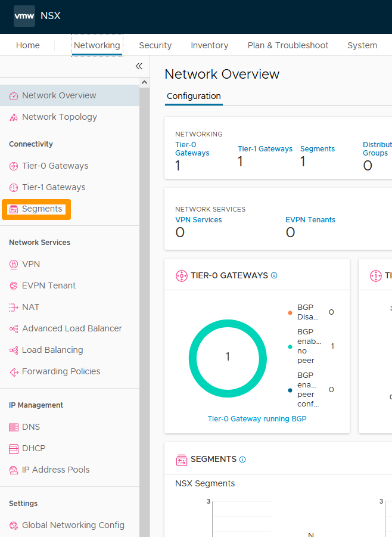
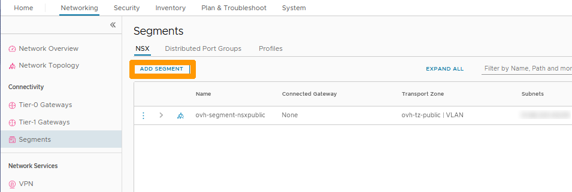
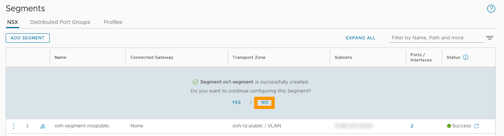
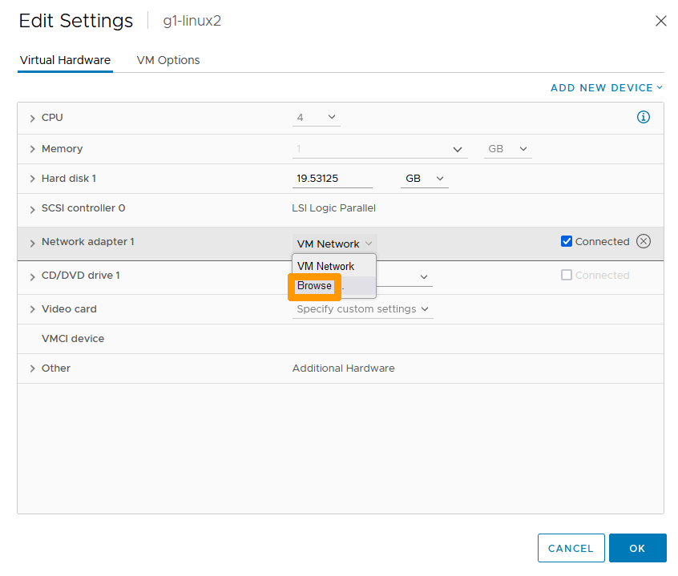
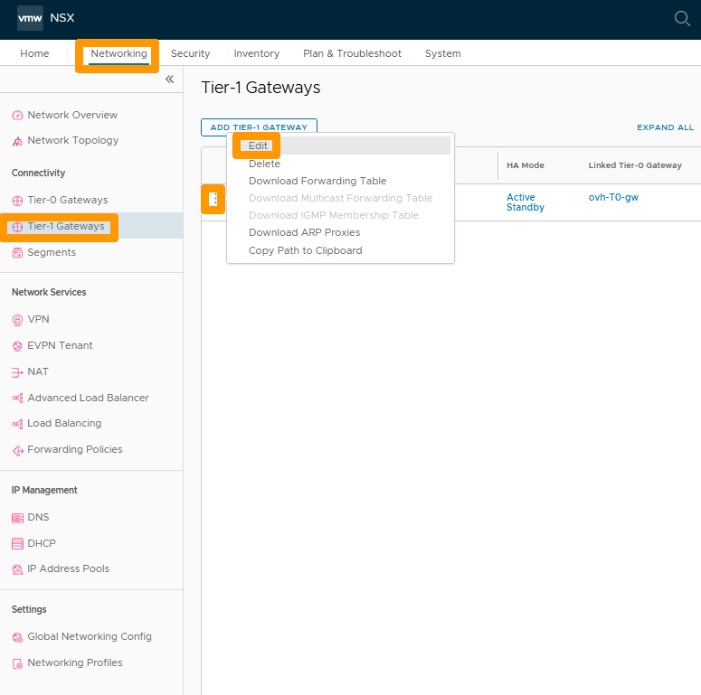
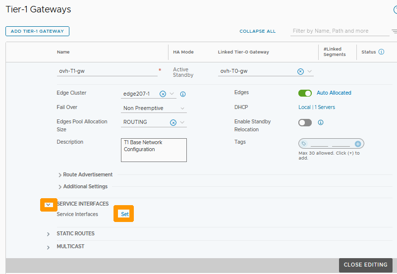
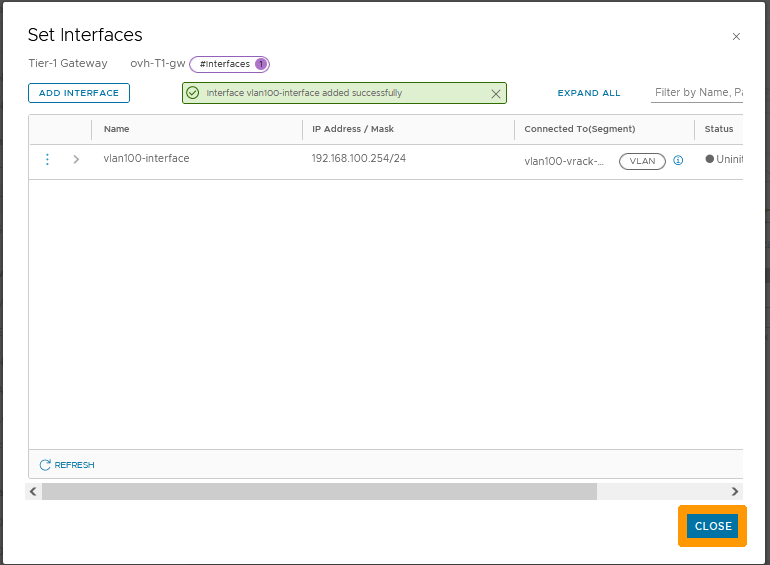
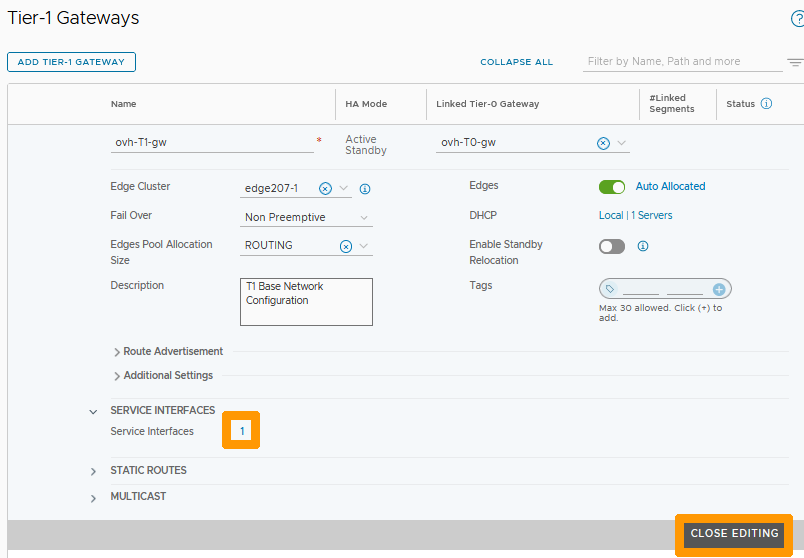
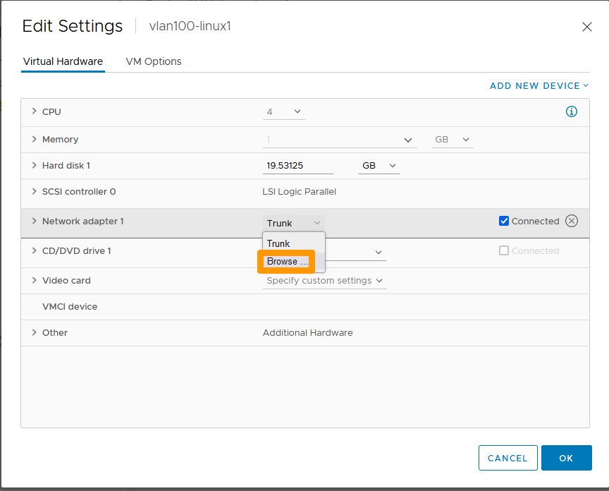

**Last updated 27th February 2023**

## Objective

In an NSX solution a segment is a virtual level 2 domain, it can be of two types :

- **VLAN-backed segments** : Communication between hosts and virtual machines is done through VLANs and a Layer 2 switch of the OSI model. In order for these segments to communicate with the elements of NSX (Internet and other segments), an interface must be added to the **Tier-1 Gateways** or **Tier-0 Gateways** gateways.
- **Overlay-backed segments**: The connection is made using a software overlay that establishes tunnels between hosts. You must add an address to a subnet that will be used for routing outside this segment. They must be connected to a **Tier-1 Gateways** gateway such as **ovh-T1-gw**.

The segments are linked to transport zones that are predefined by OVHcloud.

- **system-owned-vlan-transport-zone-for-rtep | VLAN** : Area for extended RTEP networks.
- **system-owned-vlan-transport-zone-for-evpn | VLAN** : Zone for VPNs.
- **ovh-tz-overlay | VLAN** : Zone for Overlay segments behind the **ovh-t1-gw** gateway.
- **ovh-tz-public | VLAN** : Area connected to the public network on a single VLAN provided by OVHcloud.
- **ovh-tz-vrack | VLAN** : Area connected to the OVHcloud vRack where it is possible to create segments with a particular VLAN.

**Discover the creation and use of segments in the NSX and vCenter interfaces.**

> [!warning]
> OVHcloud provides services for which you are responsible, with regard to their configuration and management. It is therefore your responsibility to ensure that they work properly.
>
> This guide is designed to assist you as much as possible with common tasks. However, we recommend contacting a [specialist provider](https://partner.ovhcloud.com/en/directory/) if you experience any difficulties or doubts when it comes to managing, using or setting up a service on a server.
>

## Requirements

- Being an administrative contact of your [Hosted Private Cloud infrastructure](https://www.ovhcloud.com/en/enterprise/products/hosted-private-cloud/) to receive login credentials.
- A user account with access to the [OVHcloud Control Panel](https://ca.ovh.com/auth/?action=gotomanager&from=https://www.ovh.com/world/&ovhSubsidiary=we).
- **NSX** deployed.

## Instructions

### Creating a segment in the NSX interface

We will create an *Overlay-backed segment* connected to **ovh-T1-gw** in a subnet in 192.168.1.0/24 with gateway 192.168.1.254.

From the NSX interface go to the `Networking`{.action} tab.

Click on `Segments`{.action} on the left.

Click on `ADD SEGMENT`{.action} on the right.

Fill-in this information:

- **Name**: Your segment name.
- **Connected Gateway**: Predefined gateway ovh-T1-gw | Tier1.
- **Transport Zone**: ovh-tz-overlay predefined zone.
- **Subnet**: The gateway address of the segment in this format 192.168.1.254/24.

Then click on `SAVE`{.action} on the right.

Click `NO`{.action} when prompted.

The new segment appears in the list.

In the Networking tab, click on `Network Topology`{.action} on the left to see the new segment and its location in the network.

### Connecting a virtual machine to this segment.

Go to the vCenter interface of your Hosted Private Cloud cluster.

Right-click the virtual machine and click `Edit Settings`{.action}.

Scroll to the right of your network adapter and choose `Browse`{.action}.

Select the `network`{.action} that is named after your segment and click `OK`{.action}.

Click `OK`{.action}.

Now that your virtual machine is connected to the segment, go back to the NSX interface.

Go to the `Networking`{.action} tab, choose `Network Topology`{.action}.

The virtual machine associated with the network appears in the network topology.

Use the first part of the guide to create a second segment named ov2-segment with these parameters **192.168.2.254/24** in order to have two segments connected to **ovh-T1-gw**.

Then, from the **vCenter** console, put two virtual machines on the first segment and two more on the second segment.

Return to the NSX interface in `Network Topology`{.action} to bring up the new network configuration.

Both segments are connected to the gateway **ovh-T1-gw**. Routing between the two subnets is enabled without any network restrictions by default.

### Creating a segment on a VLAN 

Through the NSX interface, click on the `Networking`{.action} tab and click on `Segments`{.action} on the left in the **Connectivity** section. Then click `ADD SEGMENT`{.action}.

{.thumbnail}

Fill in this information :

- **Name** : Type `vlan100-vrack-segment`.
- **Transport Zone** : Select `ovh-tz-vrack`.
- **VLAN** : Write the number `100`.
- **Subnets** : Enter the gateway address and range on this segment `192.168.100.254/24`

Then click `SAVE`{.action}.

{.thumbnail}

Click `NO`{.action} when prompted.

{.thumbnail}

### Connecting a VLAN segment to the ovh-T1-gw gateway

You can route the network from a VLAN segment to the Internet and other segments by creating an interface on the **ovh-T1-gw** gateway. When creating the interface, use the same IP address as the one specified in the segment subnet.

Through the NSX interface go to the `Networking`{.action} tab and click on `Tier-1 Gateways`{.action} on the left in the **Connectivity** section.

Then click on the `three vertical points`{.action} and choose `Edit`{.action} from the menu.

{.thumbnail}

Click on the `Down Arrow`{.action} to the left of **SERVICE INTERFACES** and click the `Set`{.action} button that just appeared to the right of **Service Interfaces**.

{.thumbnail}

Click `ADD INTERFACE`{.action}.

{.thumbnail}

Choose this information :

- **Name** : Type `vlan100-interface` as the name of your interface.
- **IP Address / Mask** : Enter the IP address of the interface `192.168.100.254/24` that should match the gateway.
- **Connected To(Segment)** : Take the segment that is on vlan 100 on the vRack named `vlan100-vrack-segment`.

Then click `SAVE`{.action} to confirm the creation of the interface on **ovh-T1-gw**.

{.thumbnail}

Click `CLOSE`{.action}.

{.thumbnail}

The number `1` next to **Service Interfaces** indicates that the interface is created, click `CLOSE EDITING`{.action} to complete the creation of the interface.

{.thumbnail}

You can now connect outside this segment through the interface with gateway 192.168.100.254/24.

### Assigning a VLAN Segment to a Virtual Machine

Go to your vSphere interface; right-click your virtual machine and choose `Change settings`{.action}.

{.thumbnail}

Go to your network adapter and click `Browse`{.action}.

{.thumbnail}

Click the `segment`{.action} associated with your VLAN and click `OK`{.action}.

{.thumbnail}

Click `OK`{.action} to commit the changes.

{.thumbnail}

### Displaying a network topology with overlay segments and other segments on VLANs

Go back to the NSX interface, go to the `Networking`{.action} tab and click on `Network Topology`{.action} on the left to view a graphical view of the network. You will see networks of type Overlay and those of type VLAN connected through an interface on **ovh-t1-gw**.

{.thumbnail}

## Go further 

[Getting started with NSX](/pages/hosted_private_cloud/hosted_private_cloud_powered_by_vmware/nsx-01-first-steps)

If you need training or technical assistance to implement our solutions, contact your sales representative or click on [this link](https://www.ovhcloud.com/en/professional-services/) to get a quote and ask our Professional Services experts for a custom analysis of your project.

Join our community of users on <https://community.ovh.com/en/>.
