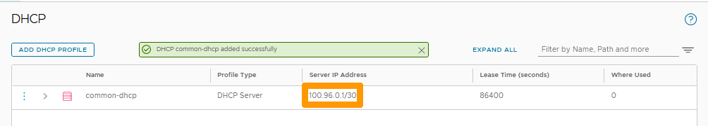
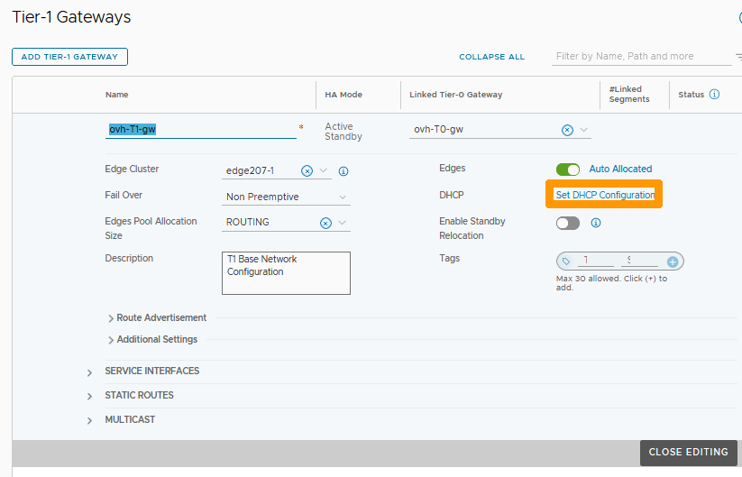
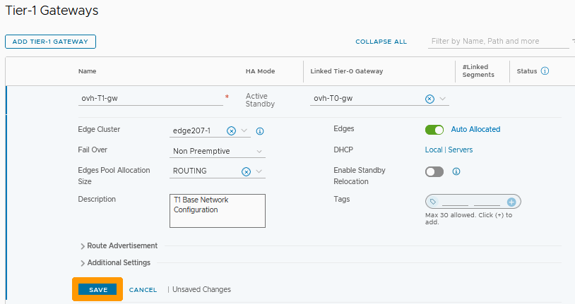
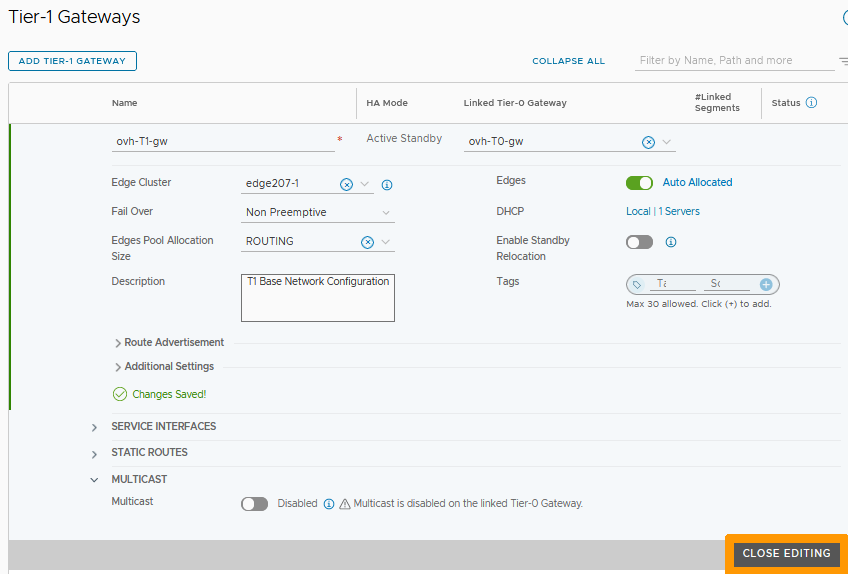
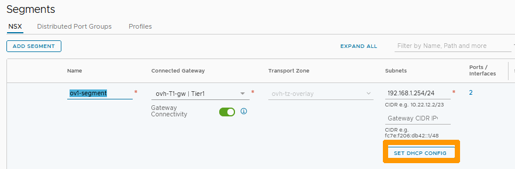
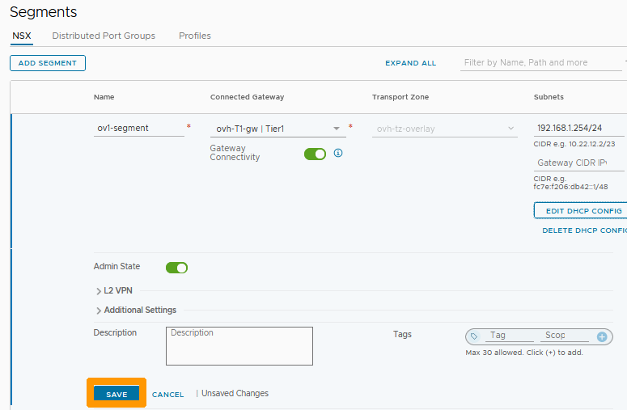
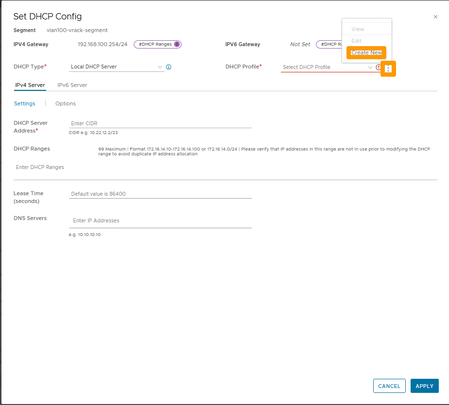
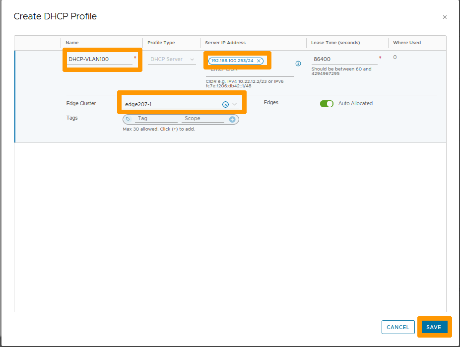
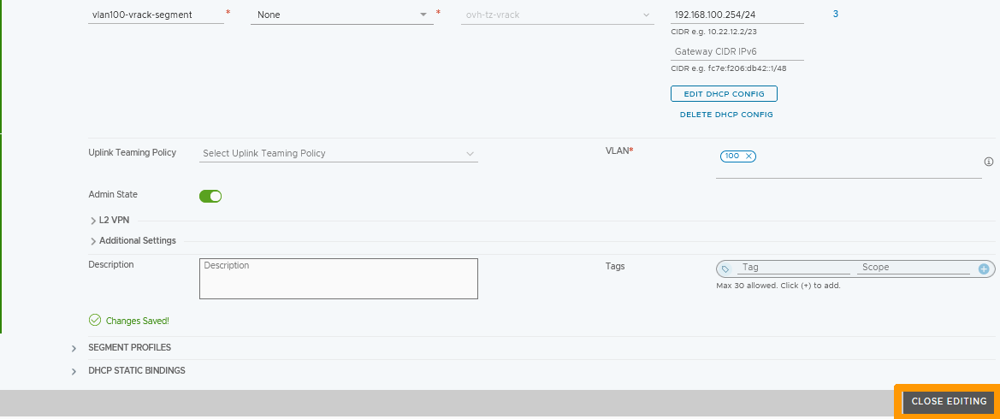

**Last updated 27th February 2023**

## Objective

**Learn how to configure a DHCP server in a segment**

> [!warning]
> OVHcloud provides services for which you are responsible, with regard to their configuration and management. It is therefore your responsibility to ensure that they work properly.
>
> This guide is designed to assist you as much as possible with common tasks. However, we recommend contacting a [specialist provider](https://partner.ovhcloud.com/it/directory/) if you experience any difficulties or doubts when it comes to managing, using or setting up a service on a server.
>

## Requirements

- Being an administrative contact of your [Hosted Private Cloud infrastructure](https://www.ovhcloud.com/it/enterprise/products/hosted-private-cloud/) to receive login credentials
- A user account with access to the [OVHcloud Control Panel](https://www.ovh.com/auth/?action=gotomanager&from=https://www.ovh.it/&ovhSubsidiary=it)
- Having **NSX** deployed with two overlay and VLAN segments configured in your NSX configuration. Use our guide on [segment management in NSX](/pages/hosted_private_cloud/hosted_private_cloud_powered_by_vmware/nsx-02-segment-management) for more information.

## Instructions

We will configure DHCP for : 

- An overlay segment behind the gateway **ovh-T1-gw** 
- A segment on a VLAN connected to the gateway **ovh-T1-gw**.

### Common DHCP configuration for all overlay segments

First we will create a DCHP server common to all segments in Overlay.

Through the NSX interface, go to the `Networking`{.action} tab and click on `Networking Profiles`{.action} on the left in the **Settings** section. Then go to the `DHCP`{.action} tab and click `ADD DHCP PROFILE`{.action}.

{.thumbnail}

Type `Name`{.action} in **Name** and click `SAVE`{.action}.

{.thumbnail}

The DCHP server is active, it uses a network in 100.96.0.1/30, do not use this network in one of your segments.

{.thumbnail}

### DHCP assignment to the ovh-T1-gw gateway

In the `Networking`{.action} tab, click on `Tier-1-Gateways`{.action} on the left in the **Connectivity** section.

{.thumbnail}

Click the `three vertical dots`{.action} and choose `Edit`{.action} from the menu.

{.thumbnail}

Click `Set DHCP Configuration`{.action}.

{.thumbnail}

Choose `DHCP Server`{.action} from **Type** and your `DHCP profile`{.action} from **DHCP Server Profile**. Then click `SAVE`{.action}.

{.thumbnail}

Click `SAVE`{.action}.

{.thumbnail}

Click `CLOSE EDITING`{.action}.

{.thumbnail}

### Setting up DHCP on an Overlay segment

From the NSX interface, go to the `Networking`{.action} tab and click on `Segments`{.action} on the left in the **Connectivity** section.

Go to the `Segments`{.action} section, click on the configuration icon indicated with `three vertical dots`{.action} to the left of your segment and choose `Edit`{.action}.

{.thumbnail}

Click `Set DHCP CONFIG`{.action}.

{.thumbnail}

Fill in this information :

- **DHCP Type** : Leave `DHCP Server Gateway`{.action}.
- **DHCP Ranges** : Enter your range `192.168.1.10-192.168.1.200`{.action}.
- **DNS Servers** : Add OVHcloud DNS server `213.186.33.99`{.action}.

Click on `APPLY`{.action}.

{.thumbnail}

Click `SAVE`{.action}.

{.thumbnail}

Click `CLOSE EDITING`{.action}.

{.thumbnail}

Virtual machines in this segment can now be configured with DHCP.

### Setting up DCHP on a VLAN segment

On a VLAN segment it is not possible to use the profile created for Overlay segments.

In order to have a DHCP server on this segment, we will create a DHCP configuration with a new profile directly attached to the segment.

If you do not have a VLAN type segment, use the [Segment Management in NSX](/pages/hosted_private_cloud/hosted_private_cloud_powered_by_vmware/nsx-02-segment-management) guide to create it with these settings :

- **VLAN Subnet**: 192.168.100.0/24.
- **Gateway and interface IP address** : 192.168.100.254/24.

Go to the `Networking`{.action} tab, click on `Segments`{.action} on the left in the **Connectivity** section, then click on the `three vertical dots`{.action} on the left of your VLAN segment and choose `Edit`{.action} from the menu.

{.thumbnail} 

Click `SET DHCP CONFIG`{.action}.

{.thumbnail} 

Leave `Local DHCP Server`{.action} in **DHCP Type**, click the `three vertical dots`{.action} to the right of **DHCP Profile** and choose `Create New`{.action} from the menu.

{.thumbnail}

Enter this information :

- **Name**: Leave `DHCP-VLAN100`.
- **Server IP Address** : IP address of DHCP server `192.168.100.253/24`.

Then select your `Edge Cluster`{.action} and click `SAVE`{.action}.

{.thumbnail}

Verify in **DHCP Profile** that the profile is present and enter this information :

- **DHCP Server** : DHCP server address `192.168.100.253/24`.
- **DHCP Ranges** : DHCP Server range `192.168.100.10-192.168.100.200`.
- **DNS Servers** : OVHcloud DNS server IP address `213.186.33.99`.

Then click `APPLY`{.action}.

{.thumbnail}

Click `SAVE`{.action}.

{.thumbnail}

Click `CLOSE EDITING`{.action}.

{.thumbnail}

The DHCP server is active on this VLAN segment.

## Go further 

[Getting started with NSX](/pages/hosted_private_cloud/hosted_private_cloud_powered_by_vmware/nsx-01-first-steps)

[Segment management in NSX](/pages/hosted_private_cloud/hosted_private_cloud_powered_by_vmware/nsx-02-segment-management)

If you need training or technical assistance to implement our solutions, contact your sales representative or click on [this link](https://www.ovhcloud.com/it/professional-services/) to get a quote and ask our Professional Services experts for a custom analysis of your project.

Join our community of users on <https://community.ovh.com/en/>.
