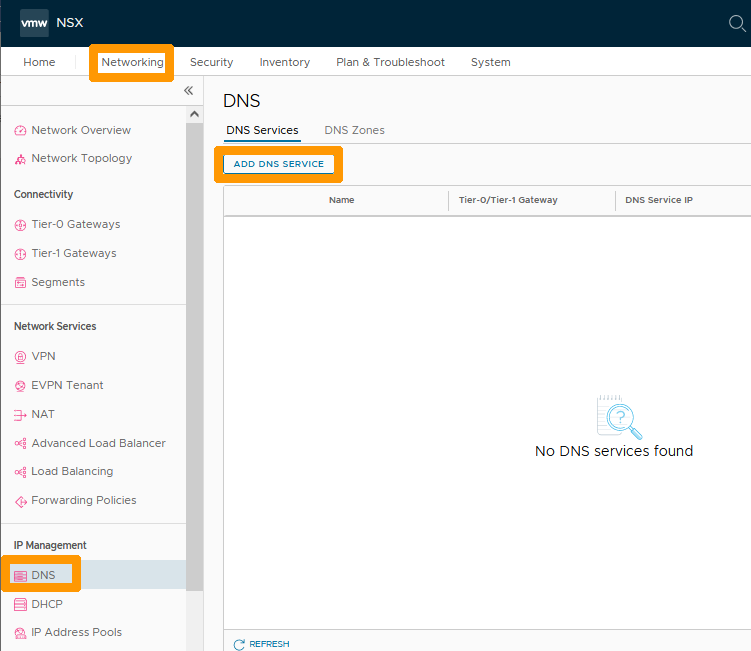
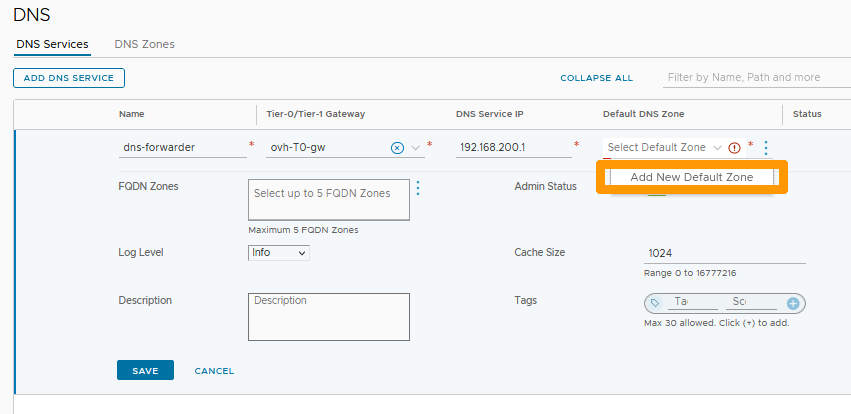
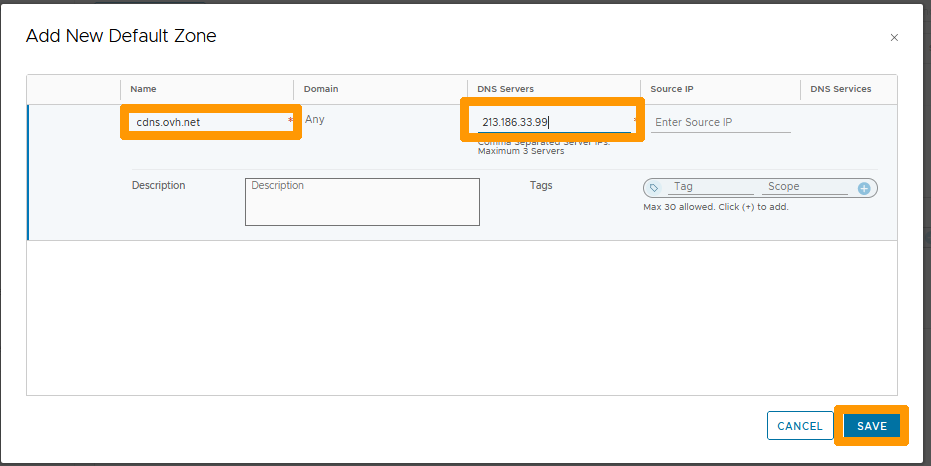
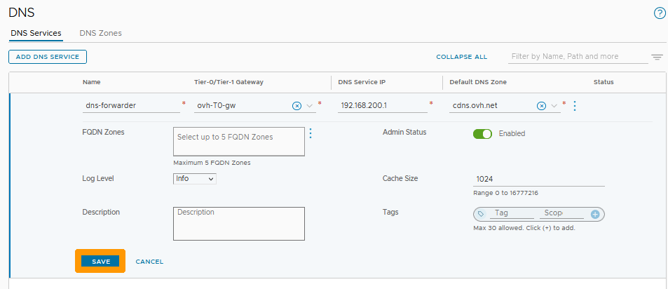
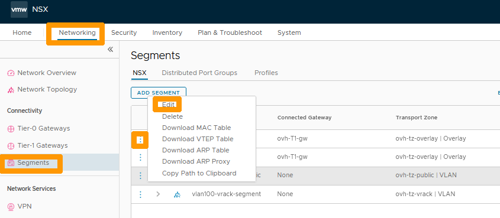
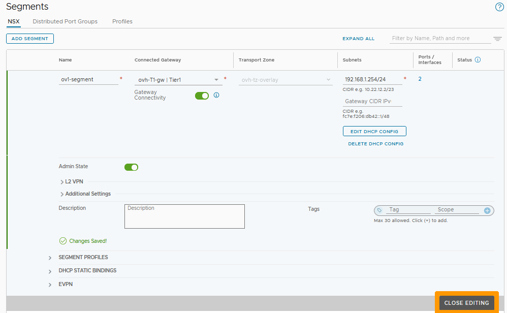

**Last updated 27th February 2023**

## Objective

You can use a DNS forwarder in NSX that centralises all DNS queries and redirects them to external DNS servers, which reduces network traffic. You can attach the DNS forwarder to the north-south gateway (ovh-T0-gw) or the east-west gateway (ovh-T1-gw), depending on your needs.

**Discover how to configure a DNS forwarder.**

> [!warning]
> OVHcloud provides services for which you are responsible, with regard to their configuration and management. It is therefore your responsibility to ensure that they work properly.
>
> This guide is designed to assist you as much as possible with common tasks. However, we recommend contacting a [specialist provider](https://partner.ovhcloud.com/es-es/directory/) if you experience any difficulties or doubts when it comes to managing, using or setting up a service on a server.
>

## Requirements

- Being an administrative contact of your [Hosted Private Cloud infrastructure](https://www.ovhcloud.com/es-es/enterprise/products/hosted-private-cloud/) to receive login credentials
- A user account with access to the [OVHcloud Control Panel](https://www.ovh.com/auth/?action=gotomanager&from=https://www.ovh.es/&ovhSubsidiary=es)
- You need to have **NSX** deployed with a segment configured in your NSX configuration. Use our guide on [segment management in NSX](/pages/hosted_private_cloud/hosted_private_cloud_powered_by_vmware/nsx-02-segment-management) for more information.

## Instructions

We will create a DNS redirector and attach it to the north-south gateway (ovh-t0-gw), it will be usable on all segments of NSX.

### DNS forwarder configuration

Through the NSX interface go to the `Networking`{.action} tab and click on `DNS`{.action} on the left in the **IP Management** section. Then click `ADD DNS SERVICE`{.action}.

{.thumbnail}

Enter this information :

- **Name** : Your service name, such as `dns-forwarder`.
- **Tier-0/Tier-1 Gateway** : Your North-South gateway `ovh-T0-gw`.
- **DNS Service IP** : a private IP address not used in your segments, such as `192.168.200.1`.

Next, click the `three vertical dots`{.action} below **Default DNS Zone**.

{.thumbnail}

Click `Add New Default Zone`{.action}.

{.thumbnail}

Fill in these values :

- **Name** : The name of the zone, such as `cdns.ovh.net`.
- **DNS Servers** : OVHcloud DNS server `213.186.33.99`.

Then click `SAVE`{.action}.

{.thumbnail}

Click `SAVE`{.action}.

{.thumbnail}

Your DNS forwarder is active and usable on all your overlay or VLAN segments connected to your north-south gateway (ovh-t0-gw).

{.thumbnail}

### Editing the DHCP server to use a DNS forwarder

If you have configured DHCP servers in NSX as described in our [Configuring DHCP](/pages/hosted_private_cloud/hosted_private_cloud_powered_by_vmware/nsx-03-configure-dhcp-onsegment) guide, you have the option to modify the configuration to use the DNS forwarder in your DHCP configurations.

We will see how to modify the DNS server on the DHCP configuration of one of your segments.

Still from the `Networking`{.action} tab, click `Segments`{.action} on the left in the **Connectivity** section. 

Then click on the `three vertical dots`{.action} next to your segment and choose `Edit`{.action} from the menu.

{.thumbnail}

Click `EDIT DHCP CONFIG`{.action}.

{.thumbnail}

Click the `X`{.action} to the right of the existing DNS in the **DNS Servers** option to remove it from the configuration.

{.thumbnail}

Add your DNS redirector IP address in **DNS Servers** as `192.168.200.1`{.action} and click `APPLY`{.action}.

{.thumbnail}

Click `SAVE`{.action}.

{.thumbnail}

Click `CLOSE EDITING`{.action}.

{.thumbnail}

Your segment's DHCP settings now use the DNS forwarder you created earlier.

## Go further 

[Getting started with NSX](/pages/hosted_private_cloud/hosted_private_cloud_powered_by_vmware/nsx-01-first-steps)

[Segment management in NSX](/pages/hosted_private_cloud/hosted_private_cloud_powered_by_vmware/nsx-02-segment-management)

[DHCP Configuration](/pages/hosted_private_cloud/hosted_private_cloud_powered_by_vmware/nsx-03-configure-dhcp-onsegment)

[VMware documentation on DNS in NSX](https://docs.vmware.com/en/VMware-NSX-T-Data-Center/3.2/administration/GUID-A0172881-BB25-4992-A499-14F9BE3BE7F2.html)

If you need training or technical assistance to implement our solutions, contact your sales representative or click on [this link](https://www.ovhcloud.com/es-es/professional-services/) to get a quote and ask our Professional Services experts for a custom analysis of your project.

Join our community of users on <https://community.ovh.com/en/>.
