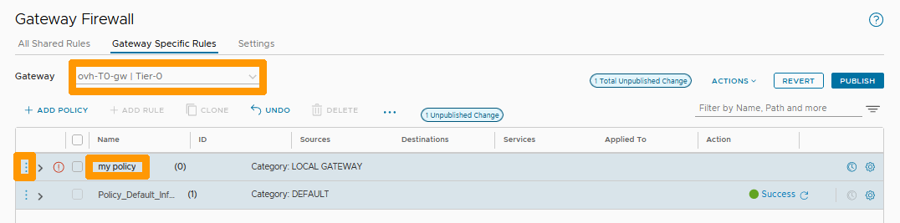
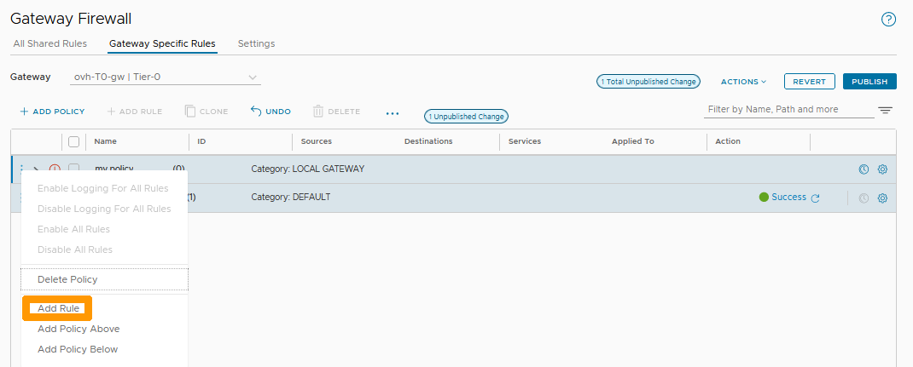
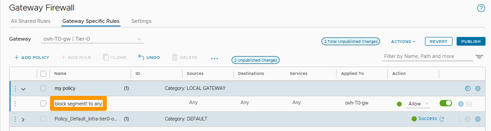
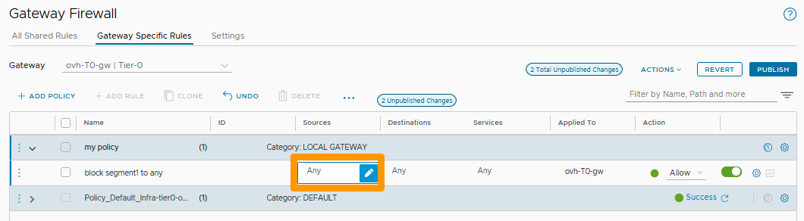

## Objectif

Le pare-feu de passerelles permet le filtrage entre les segments internes et le réseau extérieur au cluster en entrée ou en sortie. 

Il fonctionne sur les passerelles de type nord-sud (Tier-0 Gateways) et est-ouest (Tier-1 Gateways) si la source ou la destination ne se trouvent pas à l'intérieur du cluster.

Si vous souhaitez créer des règles de filtrage entre des segments internes, il sera nécessaire d'utiliser le pare-feu distribué, en vous aidant de notre guide sur la [gestion du pare-feu distribué](/pages/hosted_private_cloud/hosted_private_cloud_powered_by_vmware/nsx-05-manage-distributed-firewall).

**Découvrez comment administrer le pare-feu des passerelles dans NSX.**

> [!warning]
> OVHcloud vous met à disposition des services dont la configuration, la gestion et la responsabilité vous incombent. Il vous appartient donc de ce fait d’en assurer le bon fonctionnement.
>
> Ce guide a pour but de vous accompagner au mieux sur des tâches courantes. Néanmoins, nous vous recommandons de faire appel à un [prestataire spécialisé](https://partner.ovhcloud.com/fr/) si vous éprouvez des difficultés ou des doutes concernant l’administration, l’utilisation ou la mise en place d’un service sur un serveur.
>

## Prérequis

- Être contact administrateur de l'infrastructure [Hosted Private Cloud powered by VMware](https://www.ovhcloud.com/fr-ca/enterprise/products/hosted-private-cloud/), celui-ci recevant les identifiants de connexion.
- Avoir un identifiant utilisateur actif avec les droits spécifiques pour NSX (créé dans l'[espace client OVHcloud](https://ca.ovh.com/auth/?action=gotomanager&from=https://www.ovh.com/ca/fr/&ovhSubsidiary=qc)).
- Avoir **NSX** déployé avec un segment configuré dans votre configuration NSX. Vous pouvez vous aider de notre guide sur la [gestion des segments dans NSX](/pages/hosted_private_cloud/hosted_private_cloud_powered_by_vmware/nsx-02-segment-management).

## En pratique

Nous allons créer une stratégie afin d'améliorer la visibilité et l'administration des règles en fonction de leur utilité.

Nous allons ensuite ajouter, à l'intérieur de notre stratégie, une règle qui bloque l'accès à tout le réseau externe d'un cluster depuis un groupe qui contient un segment (vous pouvez vous aider du guide sur la [gestion du pare-feu distribué](/pages/hosted_private_cloud/hosted_private_cloud_powered_by_vmware/nsx-05-manage-distributed-firewall) pour créer des groupes) et de **any** pour la destination. 

Allez sur l'onglet `Security`{.action}, sélectionnez `Gateway Firewall`{.action} et cliquez sur `+ ADD POLICY`{.action}.

{.thumbnail}

Sélectionnez `ovh-T0-gw`{.action} à droite de **Gateway**, nommez votre stratégie `my policy`{.action} en dessous de la colonne **Name** et cliquez sur les ` trois points verticaux`{.action} à gauche de votre stratégie.

{.thumbnail}

Cliquez sur `Add Rule`{.action} dans le menu.

{.thumbnail}

Nommez votre règle `block segment1 to any`{.action} en dessous de la colonne **Name**.

{.thumbnail}

Cliquez sur le bouton `stylo`{.action} à droite de Any dans la colonne **Source**.

{.thumbnail}

Restez dans l'onglet `Group`{.action}, sélectionnez le groupe `g-segment1`{.action} et cliquez sur `APPLY`{.action}.

{.thumbnail}

Choisissez `Drop`{.action} sous la colonne **Action** et cliquez sur `PUBLISH`{.action}.

{.thumbnail}

Votre règle est active sur la passerelle **ovh-T0-gw**. Elle bloque tout le trafic sortant depuis les membres du groupe **g-segment01**.

## Aller plus loin

[Premiers pas avec NSX](/pages/hosted_private_cloud/hosted_private_cloud_powered_by_vmware/nsx-01-first-steps)

[Gestion des segment dans NSX](/pages/hosted_private_cloud/hosted_private_cloud_powered_by_vmware/nsx-02-segment-management)

[Gestion du pare-feu distribué](/pages/hosted_private_cloud/hosted_private_cloud_powered_by_vmware/nsx-05-manage-distributed-firewall).

[Documentation VMware sur les pare-feux de passerelles dans NSX](https://docs.vmware.com/fr/VMware-NSX-T-Data-Center/3.2/administration/GUID-A52E1A6F-F27D-41D9-9493-E3A75EC35481.html)

Si vous avez besoin d'une formation ou d'une assistance technique pour la mise en oeuvre de nos solutions, contactez votre commercial ou cliquez sur [ce lien](https://www.ovhcloud.com/fr-ca/professional-services/) pour obtenir un devis et demander une analyse personnalisée de votre projet à nos experts de l’équipe Professional Services.

Échangez avec notre communauté d'utilisateurs sur <https://community.ovh.com>.
