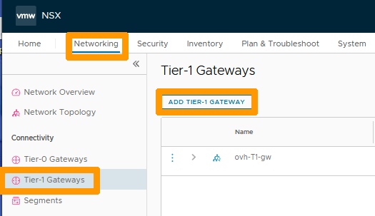
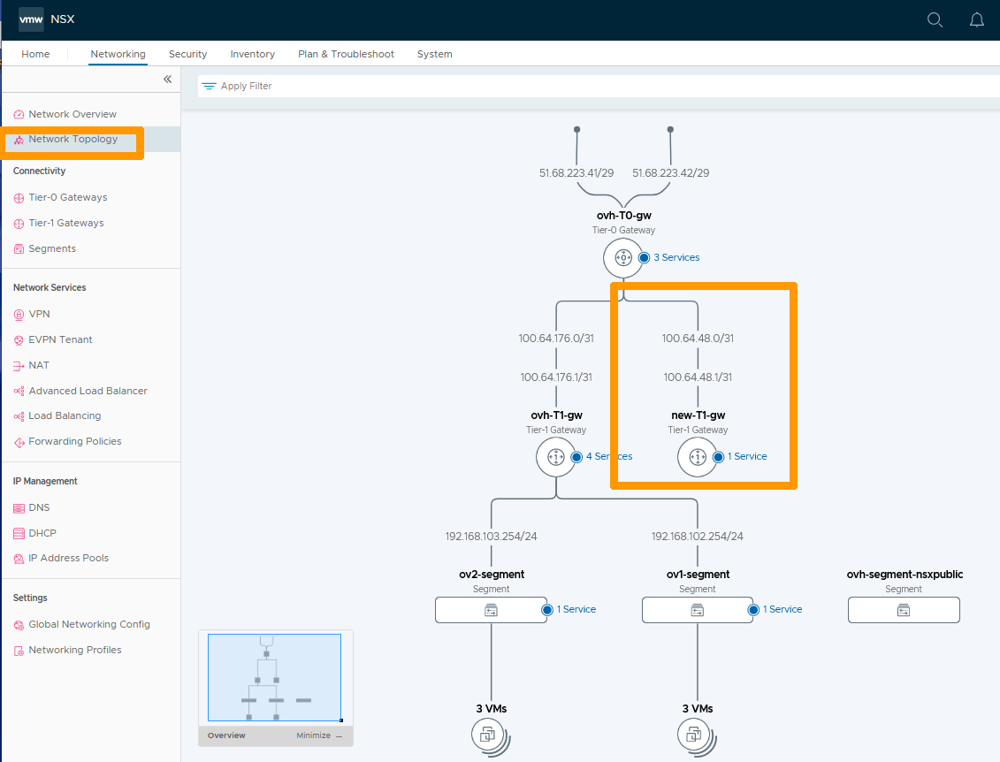

**Dernière mise à jour le 27/02/2023**

## Objectif

OVHcloud vous fournit NSX avec deux passerelles, une passerelle de type nord-sud (ovh-T0-gw) et une passerelle de type est-ouest (ovh-T1-gw). Il vous est possible de créer des passerelles supplémentaires de type est-ouest.

**Découvrez comment ajouter une passerelle est-ouest (Tier-1 Gateway) dans votre configuration NSX.**

> [!warning]
> OVHcloud vous met à disposition des services dont la configuration, la gestion et la responsabilité vous incombent. Il vous appartient donc de ce fait d’en assurer le bon fonctionnement.
>
> Ce guide a pour but de vous accompagner au mieux sur des tâches courantes. Néanmoins, nous vous recommandons de faire appel à un [prestataire spécialisé](https://partner.ovhcloud.com/fr/) si vous éprouvez des difficultés ou des doutes concernant l’administration, l’utilisation ou la mise en place d’un service sur un serveur.
>

## Prérequis

- Être contact administrateur de l'infrastructure [Hosted Private Cloud powered by VMware](https://www.ovhcloud.com/fr-ca/enterprise/products/hosted-private-cloud/), celui-ci recevant les identifiants de connexion.
- Avoir un identifiant utilisateur actif avec les droits spécifiques pour NSX (créé dans l'[espace client OVHcloud](https://ca.ovh.com/auth/?action=gotomanager&from=https://www.ovh.com/ca/fr/&ovhSubsidiary=qc)).
- Avoir **NSX** déployé.

> [!warning]
> Au travers de votre interface NSX, il vous est possible de créer des passerelles de type nord-sud.
>
> Ne le faites pas car certaines options ne sont pas disponibles et vous ne pourrez pas faire fonctionner ces passerelles correctement. 

Pour plus d'informations sur NSX chez OVHcloud, consultez le guide « [Premiers pas avec NSX](/pages/hosted_private_cloud/hosted_private_cloud_powered_by_vmware/nsx-01-first-steps) ».

## En pratique

Nous allons ajouter une nouvelle passerelle de type est-ouest (Tier-1-Gateways) et la relier à la passerelle nord-sud fournie par OVHcloud (ovh-T0-gw).

Nous allons ensuite créer un segment et lui attacher une machine virtuelle. 

### Création de la nouvelle passerelle de type est-ouest

Dans l'interface NSX, allez dans l'onglet `Networking`{.action} et cliquez sur `Tier-1 Gateway`{.action} à gauche.

Cliquez ensuite sur `ADD TIER-1 GATEWAY`{.action}.

{.thumbnail}

Saisissez le nom de votre nouvelle passerelle, tel que `new-T1-gw`{.action}, en dessous de **Name** et choisissez ces paramètres :

- **Linked Tier-0-Gateway** : votre passerelle nord-sud `ovh-T0-gw`{.action}.
- **Edge Cluster** : votre `edgeXXX-X`{.action}.
- **Fail Over** : `Non Preemptive`{.action}.
- **Edge Pool Allocation Size** : `Routing`{.action}.

Cliquez ensuite sur la `Flèche vers le bas`{.action} à gauche de **Route Advertissement**.

{.thumbnail}

Activez le `bouton`{.action} à droite de **All Connected Segment & Service Ports** si vous souhaitez vous connecter en dehors de cette passerelle et cliquez sur `SAVE`{.action}.

{.thumbnail}

Cliquez sur `NO`{.action}.

{.thumbnail}

Votre nouvelle passerelle est affichée et nous voyons qu'elle est connectée à votre passerelle nord-sud (ovh-T0-gw).

{.thumbnail}

Cliquez sur `Network Topology`{.action} dans la barre de menu verticale à gauche pour afficher votre topologie réseau et pour faire apparaître votre nouvelle passerelle **new-T1-gw** reliée à **ovh-T0-gw**.

{.thumbnail}

### Ajout d'un segment sur votre nouvelle passerelle

Allez sur `Segments`{.action} à gauche et cliquez sur `ADD SEGMENT`{.action}.

{.thumbnail}

Renseignez les informations suivantes : 

* **Name** : nom de votre segment `ov3-segment`{.action}.
* **Connected Gateway** : votre nouvelle passerelle `new-T1-gw`{.action}.
* **Transport Zone** : votre sous-réseau `192.168.120.254/24`.

Cliquez sur `SAVE`{.action}.

{.thumbnail}

Cliquez sur `NO`{.action}.

{.thumbnail}

Votre nouveau segment est créé et il est relié à votre nouvelle passerelle **new-T1-gw**. 

{.thumbnail}

### Affichage d'une configuration complète avec une machine virtuelle sur votre segment.

Le segment créé est de type Overlay mais il est possible d'ajouter un segment de type VLAN et de le connecter à votre nouvelle passerelle.

Aidez-vous du guide sur la [gestion des segments dans NSX](/pages/hosted_private_cloud/hosted_private_cloud_powered_by_vmware/nsx-02-segment-management) pour ajouter une nouvelle machine virtuelle à votre nouveau segment. 

Cliquez ensuite sur `Network Topology`{.action}.

{.thumbnail}

## Aller plus loin

[Premiers pas avec NSX](/pages/hosted_private_cloud/hosted_private_cloud_powered_by_vmware/nsx-01-first-steps)

[Gestion des segments dans NSX](/pages/hosted_private_cloud/hosted_private_cloud_powered_by_vmware/nsx-02-segment-management)

[Documentation VMware pour le rajout d'une passerelle Tier-1 Gateway](https://docs.vmware.com/fr/VMware-NSX-T-Data-Center/3.2/administration/GUID-EEBA627A-0860-477A-95A7-7645BA562D62.html)

Si vous avez besoin d'une formation ou d'une assistance technique pour la mise en oeuvre de nos solutions, contactez votre commercial ou cliquez sur [ce lien](https://www.ovhcloud.com/fr-ca/professional-services/) pour obtenir un devis et demander une analyse personnalisée de votre projet à nos experts de l’équipe Professional Services.

Échangez avec notre communauté d'utilisateurs sur <https://community.ovh.com>.

