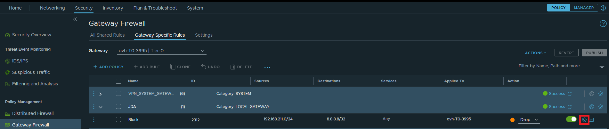
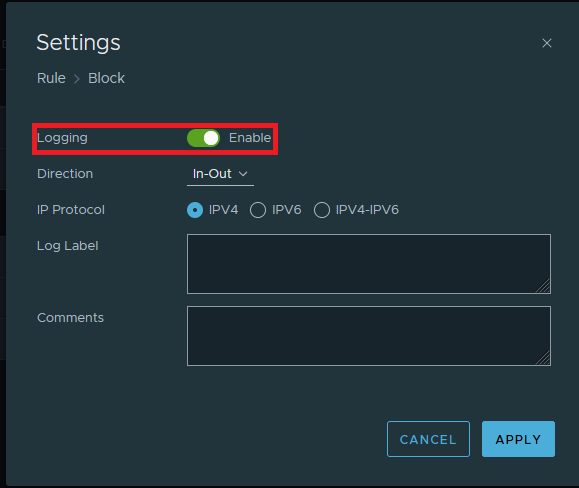
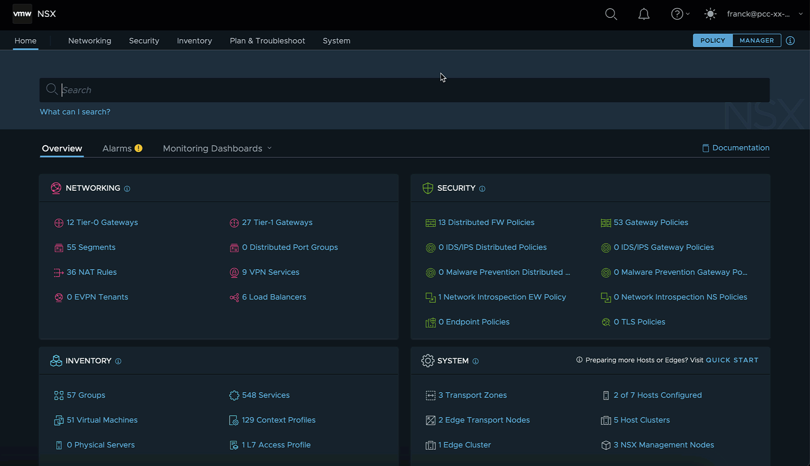

## Objective

NSX is a Software-Defined Networking (SDN) solution provided by VMware. OVHcloud is offering this service in place of NSX-V in its [VMware on OVHcloud](https://www.ovhcloud.com/fr/hosted-private-cloud/vmware/) solution.

At the moment (18th September 2023), due to the implementation by OVHcloud, it is not possible to export the logs of an NSX-T via a syslog server. To remedy this, you can retrieve a few logs via API calls.

**Find out how to get NSX node logs using the dedicated API.**

## Requirements

For the current version of NSX to work, two hosts are deployed with a dedicated virtual machine for NSX on each host, allowing redundancy in the event of one of the hosts failing.

Moreover, the following prerequisites are required:

- NSX hosts are deployed.
- A user with NSX access rights.
- You need to verify that the node is enabled.

## Instructions

### Enabling logs

Before logs can be retrieved, you will need to enable the `logging` option on the corresponding rule.

> [!warning]
> Warning: by default, logs are not enabled on rules!

For example, consider a rule that blocks all IP addresses between `192.168.211.0/24` and `8.8.8.8/32`.

To access the configuration of a rule, click the settings button (in the form of a cogwheel) to the right of the rule you have chosen.

{.thumbnail}

The rule settings are then available. Enable the `logging`{.action} option that should switch to green.

{.thumbnail}

Make sure to apply the new configuration and publish it.

### Gather the logs with API

- To have access to the logs, you must identify the Edge NSX ID. To do this, use this first API call:

```bash
curl -k -u user@pcc-123-123-123-123.ovh.com:<password> https://nsxt.pcc-123-123-123-123.ovh.com/api/v1/transport-nodes/
```

- This API call returns the two IDs of your two Edge nodes:

```bash
"resource_type" : "EdgeNode",

      "external_id" : "8a8e0033-9eee-4d13-a5e2-7cd2dbdebc6c",


 "resource_type" : "EdgeNode",

      "external_id" : "b35873da-ca7f-48ff-961e-5d6fa8bc5bf7"
```

- Once you have retrieved the ID of your Edge node, make an API call to get the logs for your Edge node:

```bash
curl -k -u user@pcc-123-123-123-123.ovh.com:<password> https://nsxt.pcc-123-123-123-123.ovh.com/api/v1/transport-nodes/8a8e0033-9eee-4d13-a5e2-7cd2dbdebc6c/node/logs/firewallpkt.log/data
```

- The call then returns the logs associated with your rule:

```bash
2023-09-15T13:15:05.548Z edge321-3995b.sbg1a.pcc.ovh.net NSX 5188 FIREWALL [nsx@6876 comp="nsx-edge" subcomp="datapathd" s2comp="firewallpkt" level="INFO"] <30 d612293055f3431f:8b01687591afe36e> INET reason-match DROP 2312 OUT 84 PROTO 1 192.168.211.169->8.8.8.8
```

### Retrieving logs with bundle

To download the bundle support for your nodes or cluster to your file server/machine, follow the [official VMware documentation](https://docs.vmware.com/en/VMware-vSphere/7.0/vmware-vsphere-with-tanzu/GUID-794C691E-B950-4838-97E4-A10D9873D852.html)

{.thumbnail}

## Go further

[NSX-T Datacenter Rest API documentation](https://developer.vmware.com/apis/1707/)

Join our community of users on <https://community.ovh.com/en/>.