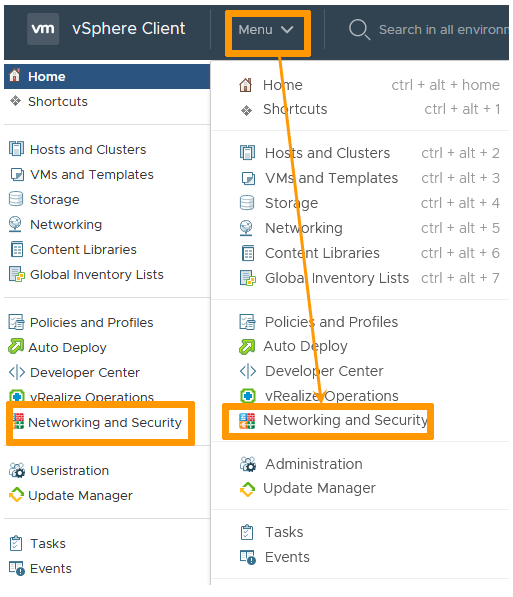

## Objective

NSX is a Software Defined Network (SDN) solution developed by VMware that is activated from the vCenter and managed directly from the vSphere interface. With NSX, you can configure rules to access your networks, create your security policy, and quickly deploy the various network services needed to build your infrastructure.

**This guide provides an introduction to the NSX interface.**

## Requirements

- Being an administrative contact of your [Hosted Private Cloud infrastructure](https://www.ovhcloud.com/es-es/enterprise/products/hosted-private-cloud/) to receive login credentials.
- Having a user account with access to vSphere as well as the specific rights for NSX (created in the [OVHcloud Control Panel](https://www.ovh.com/auth/?action=gotomanager&from=https://www.ovh.es/&ovhSubsidiary=es))

## Instructions

VMware NSX is only available from the vSphere web client.

From the vSphere web client homepage, click on `Networking and Security`{.action} in the left-hand side of your screen.
You can also click on `Networking and Security`{.action} in the main menu.

{.thumbnail}

You will now be able to access the NSX dashboard and all the related menus.

{.thumbnail}


> [!primary]
>
> To access the NSX API, you have to use https://nsx.pcc-x-x-x-x.ovh.com/api
>
> For example, to retrieve your firewall configuration:
>
> ```
> curl -u "admin:xxxx" -XGET "https://nsx.pcc-x-x-x-x.ovh.com/api/4.0/firewall/globalroot-0/defaultconfig"
> ```
>
> For security reasons, /api/1.0/ is not supported.
>

## Go further

Join our community of users on <https://community.ovh.com/en/>.
