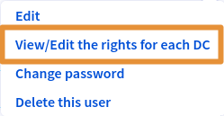
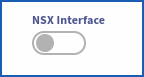
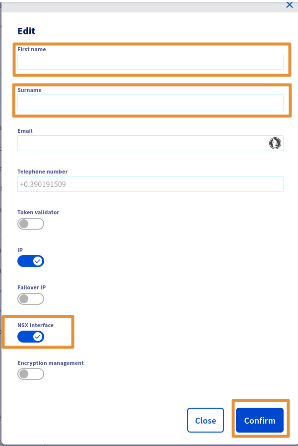
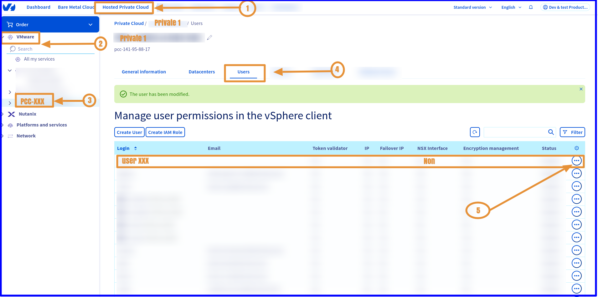
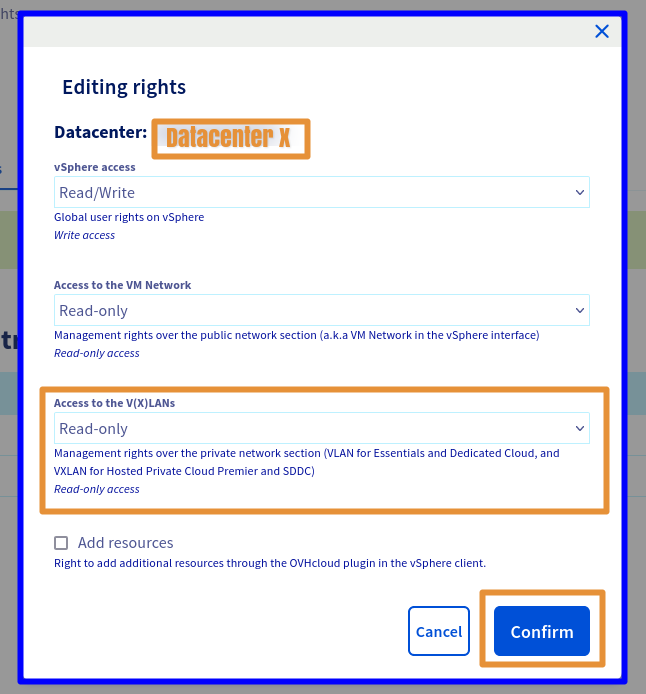
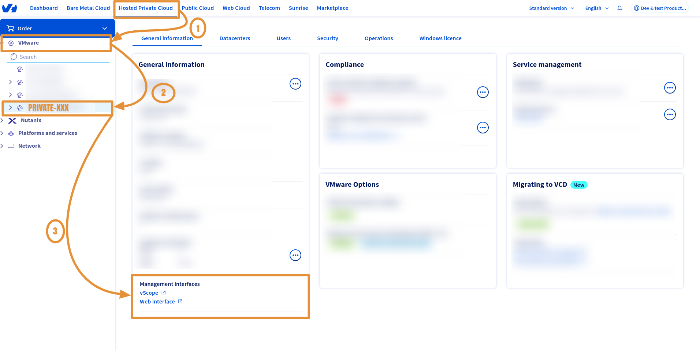
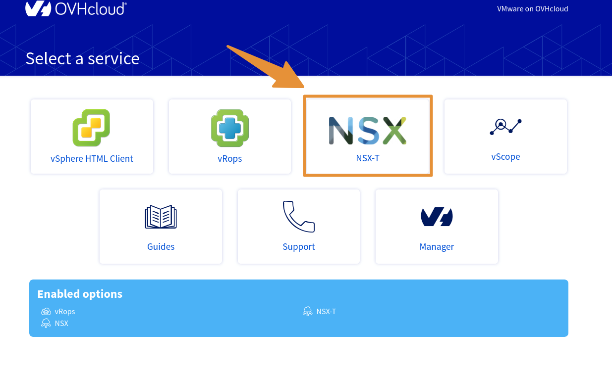
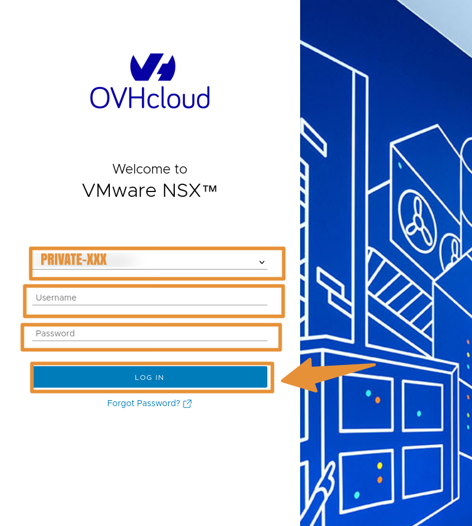
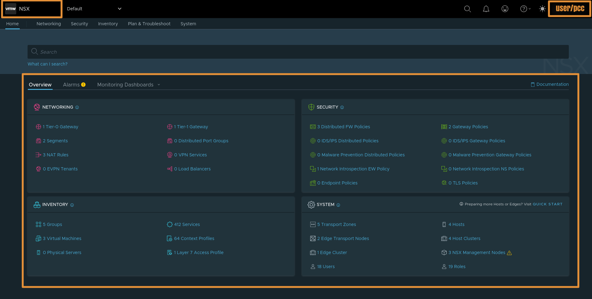

<style>
details>summary {
	color:rgb(33, 153, 232) !important;
	cursor: pointer;
}
details>summary::before {
	content:'\25B6';
	padding-right:1ch;
}
details[open]>summary::before {
	content:'\25BC';
}
</style>


## Objective

**This guide explains how to add a user access for the NSX-T web console of your VMware on OVHcloud Hosted Private Cloud.**

## Requirements

- You have a [Hosted Private Cloud](/links/hosted-private-cloud/vmware) service with the option **"Network Security Virtualization"** or **"Software-Defined Datacenter"**.
- You are the administrator on your VMware on OVHcloud infrastructure, with the login credentials to create NSX-T user access.
- You have followed the steps in the guide: [Getting started with NSX](/pages/hosted_private_cloud/hosted_private_cloud_powered_by_vmware/nsx-01-first-steps).

<!-- CP-NAV-START:privatecloud-vmware-vsphere -->
---

### OVHcloud Control Panel Access

- **Direct link:** [VMware vSphere](/links/control-panel/privatecloud-vmware-vsphere)
- **Navigation path:** `Hosted Private Cloud`{.action} > `Managed VMware vSphere`{.action} > Select your vSphere service

---
<!-- CP-NAV-END:privatecloud-vmware-vsphere -->

## Instructions

### Step 1 - Enable NSX-T

#### In the OVHcloud Control Panel

<details>

<summary>How to enable the NSX-T web console for a user</summary>

Click [this link](/links/control-panel/privatecloud-vmware-vsphere) to access the `VMware vSphere`{.action} section, then select your service and go to `Users`{.action} > `Edit`{.action}. Activate the button `NSX Interface`{.action}.

<p></p>
<p></p>
<p></p>

</details>

### Step 2 - Add NSX-T permissions

#### In the OVHcloud Control Panel

<details>
<summary>How to grant permissions to a user</summary>

Click [this link](/links/control-panel/privatecloud-vmware-vsphere) to access the `VMware vSphere`{.action} section, then select your service and go to `Users`{.action} > `Edit`{.action}.

<p></p>

</details>

### Step 3 - Add NSX-T permissions to a Datacenter

#### In the OVHcloud Control Panel

<details>
<summary>How to add permissions to a Datacenter</summary>

At this stage, you just need to modify the permissions for each Datacenter.
<br><br>
Click [this link](/links/control-panel/privatecloud-vmware-vsphere) to access the `VMware vSphere`{.action} section, then select your service and go to `Users`{.action} > `View / Edit rights for each DC`{.action} > `Modify rights`{.action}.
<br><br>
In the new window, choose the required permissions from the 3 main sections: <code class="action">Vsphere access</code> > <code class="action">Access to vmNetwork</code> > <code class="action">Access to the V(X)LANs</code>.
<br><br>
The following rights are available: <strong>Operator</strong> / <strong>Administrator</strong> / <strong>None</strong> / <strong>Read-only</strong>
<br><br>
Only access to <code class="action">V(X)LANs</code> in <strong>Read-only</strong> is necessary to access the NSX-T web console.
<br><br>
Select <code class="action">Read-only</code> mode.
<br><br>
If you want to make changes in the NSX-T web interface, then additional rights will be required, such as <strong>Operator</strong> or <strong>Administrator</strong>.
<p></p>
</details>

### Step 4 - Access NSX-T

#### In the OVHcloud Control Panel

<details>
<summary>How to access the NSX-T web console</summary>

Click [this link](/links/control-panel/privatecloud-vmware-vsphere) to access the `VMware vSphere`{.action} section, then select your service.
<br><br>

<br><br>

<br><br>

<br><br>


</details>

### Step 5 - Useful information

You can check if NSX-T is enabled on your Datacenter. You can also find your NSX-T URL and version:

#### Via the OVHcloud API

> [!api]
>
> @api {v1} /dedicatedCloud GET /dedicatedCloud/{serviceName}/nsxt

> **Parameters:**
>
> serviceName: The reference for your PCC as `pcc-XX-XX-XX-XX`.
>

Response example:

```sh
{
  "version": "4.1.1.0.0-22224312",
  "state": "enabled",
  "url": "https://nsxt.pcc-XX-X-X-X.ovh.X",
  "datacentersState": [
    {
      "id": 1542,
      "state": "disabled"
    },
    {
      "state": "enabled",
      "id": 1345
    }
  ]
}
```

> [!primary]
>
>  Find more information on the OVHcloud API in our guide on [Getting started with the OVHcloud API](/pages/manage_and_operate/api/first-steps).


## Go further

Read our guides to go further with NSX:

- [Segment management in NSX](/pages/hosted_private_cloud/hosted_private_cloud_powered_by_vmware/nsx-02-segment-management)
- [NSX FAQ](/pages/hosted_private_cloud/hosted_private_cloud_powered_by_vmware/nsx-11-faq)

If you need training or technical assistance to implement our solutions, contact your sales representative or click on [this link](/links/professional-services) to get a quote and ask our Professional Services experts for a custom analysis of your project.

Join our community of users on <https://community.ovh.com/en/>.