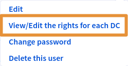
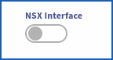

<style>
details>summary {
	color:rgb(33, 153, 232) !important;
	cursor: pointer;
}
details>summary::before {
	content:'\25B6';
	padding-right:1ch;
}
details[open]>summary::before {
	content:'\25BC';
}
</style>

---
## Objective

**This guide details how to add access to a user for NSX-T web console of your Hosted Private Cloud - VMware on OVHcloud.**

---
## Requirements

- Have subscribed to a [Hosted Private Cloud](https://www.ovhcloud.com/en-gb/hosted-private-cloud/vmware/) offer with the options : **"Network Security Virtualization"** or **"Software-Defined Datacenter"**.
- To know how to access the [OVHcloud Control Panel](/links/manager).
- You must be an administrator on your VMware infrastructure on OVHcloud with the login credentials to add a user NSX-T access.
- Have knowledge on NSX, for this read : [Getting started with NSX](/pages/hosted_private_cloud/hosted_private_cloud_powered_by_vmware/nsx-01-first-steps).

---
## Instructions

### Step 1 - Access your Hosted Private Cloud

#### From the control panel :

<details>

<summary>How to access your Hosted Private Cloud - VMware On OVHcloud?</summary>

Once you have logged in to the OVHcloud Control Panel : 

1. Click on your `Hosted Private Cloud`{.action}

**Link** : https://www.ovh.com/manager/#/dedicated/dedicated_cloud/PCC-XXX -> `Replace PCC-XXX with the name of your private organization.`{.action}


</details>

### Step 2 - Enable NSX-T

#### From the control panel :

<details>

<summary>How do I enable the NSX-T web console for a user ?</summary>

From the previous page (check screenshot), on your **Hosted Private Cloud (PCC)** :

1. Edit the user with whom you want to access the NSX-T web interface -> <code class="action">VMware</code> -> <code class="action">PCC-XX..</code> -> <code class="action">Users</code> -> <code class="action">Edit</code> and activate the button<code class="action">NSX Interface</code>.

{.thumbnail}

{.thumbnail}

{.thumbnail}

</details>

### Step 3 - Add NSX-T permissions

#### From the control panel :
<details>
<summary>How do I add permissions to a user ?</summary>

From the users page on your **Hosted Private Cloud (PCC)** :

1. Clic on : <code class="action">VMware</code> > <code class="action">PCC-XX-XX-XX-XX</code> > <code class="action">Users</code> > <code class="action">Edit</code>.

{.thumbnail}

</details>

### Step 4 - Add NSX-T permissions to a Datacenter

#### From the control panel :

<details>
<summary>How do I add permissions to my datacenters ?</summary>

At this stage, you just need to modify the permissions for each datacentre you want by : 
</br></br>
1. Clicking on : `VMware`{.action} > `PCC-XX-XX-XX-XX`{.action} > `Users`{.action} > `View / Edit rights for each DC`{.action}
</br></br>
The users page of you Datacenter :
</br></br>
2. Clic on : `...` > `Modify rights`
</br></br>
3. Choose the required permissions from the 3 main sections -> <code class="action">Vsphere access</code> > <code class="action">Access to vmNetwork</code> > <code class="action">Access to the V(X)LANs</code>.
</br></br>
The following rights are available: <strong>Operator</strong> / <strong>Administrator</strong> / <strong>None</strong> / <strong>Read-only</strong>
</br></br>
Only access to <code class="action">V(X)LANs</code> in <strong>Read Only</strong> is necessary to access NSX-T Web console.
</br></br>
Choose then <code class="action">Read Only</code> mode.
</br></br>
If you want to make changes in the NSX-T web interface, then additional rights will be required, such as <strong>Operator</strong> or <strong>Administrator</strong>.

{.thumbnail}

</details>

### Step 5 - Access the NSX-T

#### From the control panel :

<details>
<summary>How to access NSX-T Web console?</summary>
Always from your Hosted Private Cloud PCC tree :
</br></br>
1. Clic on <code class="action">VMware</code> > <code class="action">PCC-XX-XX-XX-XX</code>.

Link -> https://www.ovh.com/manager/#/dedicated/dedicated_cloud/PCC-XX-XX-XX-XX > Replace `PCC-XX-XX-XX-XX`{.action} with yours.
</br></br>

{.thumbnail}

{.thumbnail}

{.thumbnail}

{.thumbnail}

</details>

### Step 5 - Useful information

Check if NSX-T is enabled on your datacenters. You can also find your NSX-T url and version : 

**From the API** :

> [!api]
>
> @api {v1} GET /dedicatedCloud/{serviceName}/nsxt

> **Parameters:**
>
> serviceName: The reference for your PCC as `pcc-XX-XX-XX-XX`.
> 

RESPONSE:
```Shell
{
  "version": "4.1.1.0.0-22224312",
  "state": "enabled",
  "url": "https://nsxt.pcc-XX-X-X-X.ovh.X",
  "datacentersState": [
    {
      "id": 1542,
      "state": "disabled"
    },
    {
      "state": "enabled",
      "id": 1345
    }
  ]
}
```

> [!primary]
>
>  Find more information on the OVHcloud API in our guide on [Getting started with the OVHcloud API](/pages/manage_and_operate/api/first-steps).

---
## Go further

You can read this guide to follow go further with NSX :
- [Gestion des segments dans NSX](/pages/hosted_private_cloud/hosted_private_cloud_powered_by_vmware/nsx-02-segment-management)
- [FAQ NSX](/pages/hosted_private_cloud/hosted_private_cloud_powered_by_vmware/nsx-11-faq)

If you require training or technical support to implement our solutions, please contact your sales representative or click [this link](/links/professional-services) to get a quote and request a custom analysis of your project from our Professional Services team experts.

Join our community of users on <https://community.ovh.com/en/>.