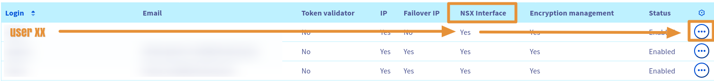

## Objective

**Ce guide permet d'expliquer comment accéder à NSX depuis la console OVH manager.**

## Requirements

- Un compte OVH
- Une infrastructure NSX

## Instructions

Se loguer sur la plateforme Cloud OVH manager :
Log in to the IBM Cloud® for VMware as a Service – single tenant instance's VMware Cloud Director Console:

1. Dans la console OVH Manager allez dans la section du bandeau central `Hosted Private Cloud`
2. Dérouler jusqu'à arriver sur : `"VMware" -> PCC... -> Users -> Edit` puis activer le boutton `NSX Interface`
3. Ensuite Cliquez sur : `"VMware" -> PCC... -> Users -> View-Edit the right for each DC`
3. Il ne vous reste plus que à modifier les droits de chaque Datacenter souhaité en cliquant sur : `Modify rights`  
4. Une fenetre s'ouvre et choisissez les droits necessaires, vous avez 3 sections : `Vsphere access, Acess to the VM Network, Access to the V(X)Lans` vous avez le choix entre : ` Operator / Administrator / None / Read-Only`
5. Uniquement l'option `V(x)LANs` est necessaire pour accéder à NSX

---
{.thumbnail}

---
{.thumbnail}

---
{.thumbnail}

---
{.thumbnail}

---
{.thumbnail}

---
{.thumbnail}

---
{.thumbnail}

## Go further

Join our community of users on <https://community.ovh.com/en/>.