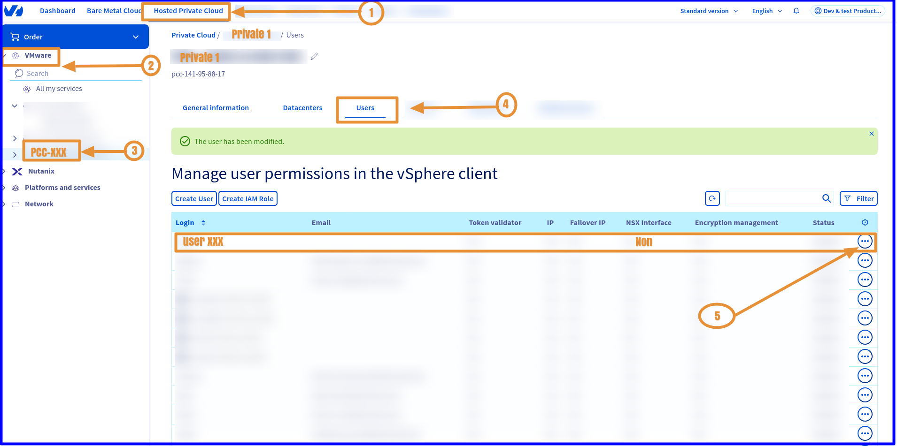
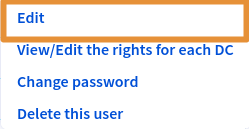
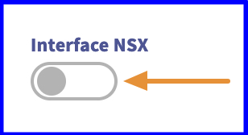
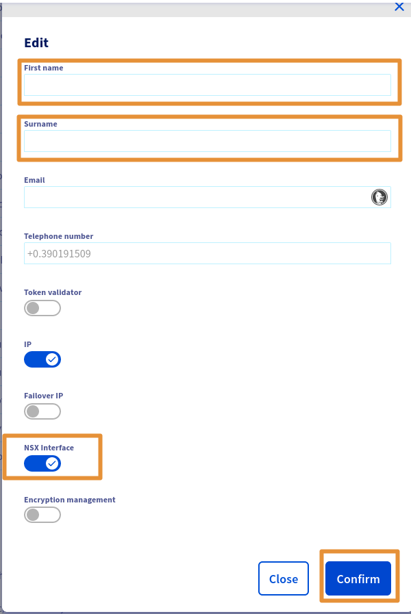
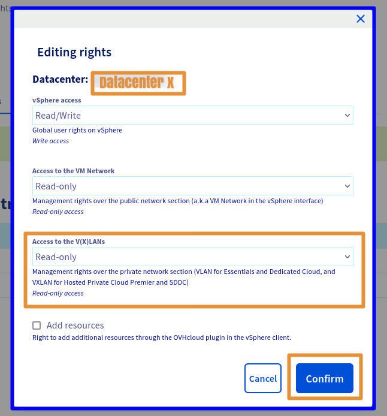
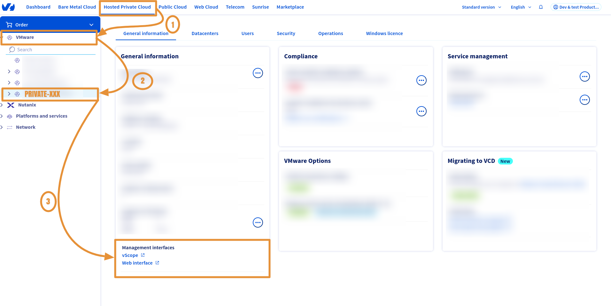
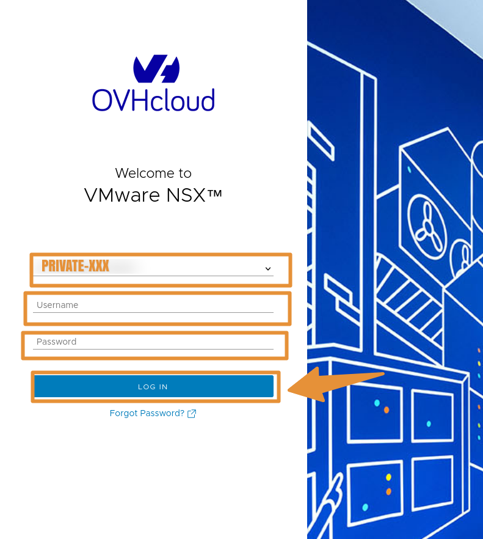
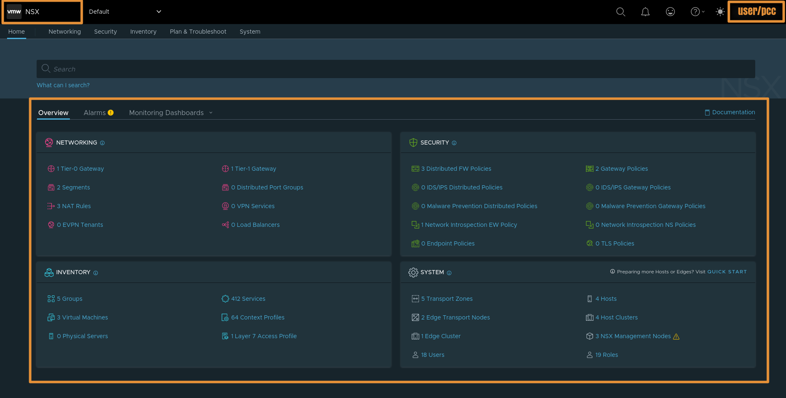

## Objectif

Ce guide permet de vous expliquer comment ajouter les droits de lecture à un utilisateur pour accéder à la console Web NSX-T de votre Hosted Private Cloud - VMware On OVHcloud.

Ces droits sont données depuis la console [OVHcloud Manager](https://www.ovh.com/manager).

## Prérequis

- Avoir souscrit une offre [Hosted Private Cloud](https://www.ovhcloud.com/en/hosted-private-cloud/vmware/)
avec les options **"Network Security Virtualization"** ou **"Software-Defined Datacenter"** 
- Se connecter à votre compte OVHcloud (Si vous ne savez pas: suivez ce guide : [Se connecter à votre compte OVHcloud](https://help.ovhcloud.com/csm/en-account-log-in-ovhcloud-control-panel?id=kb_article_view&sysparm_article=KB0043032)

- Être contact administrateur de l'infrastructure VMware sur OVHcloud, celui-ci recevant les identifiants de connexion.
- Avoir lu ce guide : [Premiers pas avec NSX](https://help.ovhcloud.com/csm/fr-vmware-nsx-first-steps?id=kb_article_view&sysparm_article=KB0056837)

## Instructions

### Etape 1 : Accéder à votre Hosted Private Cloud - VMware sur OVHcloud

Comment accéder à votre Hosted Private Cloud - VMware On OVHcloud ?

1. Dans la console OVHcloud Manager allez dans la section du bandeau du haut central : `Hosted Private Cloud`
- <ins>Lien OVHcloud</ins> : https://www.ovh.com/manager/#/dedicated/dedicated_cloud/PCC-XXX -> Remplacez le par le nom de vôtre organization privée.

{.thumbnail}

### Etape 2 : Activer NSX-T

Comment activer l'interface NSX-T pour votre utilisateur ?

2. Depuis la capture précedente, éditez l'utilisateur avec lequel vous souhaitez accéder à l'interface Web NSX-T : `"VMware" -> PCC-XX.. -> Utilisateur -> Modifier` puis activer le boutton `NSX Interface`

{.thumbnail}

{.thumbnail}

{.thumbnail}

### Etape 3 : Ajouter les droits NSX-T

Comment ajouter les droits pour votre utilisateur ?

3. Ensuite Cliquez sur : `VMware -> PCC-XX-XX-XX-XX -> Utilisateur -> Modifier`

{.thumbnail}

### Etape 4 : Ajouter les droits NSX-T aux Datacentres

Comment ajoutez les droits aux Datacentres ?

4. Il ne vous reste plus que à modifier les droits de chaque Datacenter souhaité en cliquant sur : `VMware -> PCC-XX-XX-XX-XX -> Utilisateur -> Voir / Modifier les droits par DC -> Modifier`

Comment activez l'accès au V(x)Lans ? 

4.1.  Une fenetre s'ouvre et choisissez les droits necessaires, vous avez 3 sections principales ->  `Accès Vsphere / Accès au vmNetwork / Accès aux V(x)Lans` 
   
   Avec comme droits : **Operateur / Administrateur / Aucun / Lecture seule**

   Pour accéder à l'interface NSX-T uniquement les droits vXlan sont necessaire en **Lecture seule**
   
   Choississez -> `Lecture seule`

4.1.2. Uniquement l'accès aux `V(x)Lans` en **Lecture seule** est necessaire pour accéder à l'interface Web NSX-T, si vous voulez faire des modifications dans l'interface. 

Des droits supplémentaire seront necessaires, tel que : **Opérateur ou Administrateur**

{.thumbnail}

### Etape 5 : Accéder à l'interface NSX-T

Comment accéder à l'interface Web NSX-T ?

5. Toujours depuis votre arborescence Hosted Private Cloud, Cliquez sur : `VMware -> PCC-XX-XX-XX-XX`
-  <ins>Lien OVHcloud</ins> : https://www.ovh.com/manager/#/dedicated/dedicated_cloud/PCC-XX-XX-XX-XX -> Remplacez le par le nom de vôtre organization privée PCC.

{.thumbnail}

{.thumbnail}

{.thumbnail}

{.thumbnail}

## Allez plus loin
Allez plus loin avec nos offres réseaux VMware managé par OVHcloud : ["Contactez Nous"](https://www.ovhcloud.com/fr/contact/)
- Vous pouvez poursuivre avec cette documentation : [Gestion des ségments dans NSX](https://help.ovhcloud.com/csm/fr-vmware-nsx-segment-management?id=kb_article_view&sysparm_article=KB0056848)
- Ainsi que la [FAQ NSX](https://help.ovhcloud.com/csm/fr-vmware-nsx-faq?id=kb_article_view&sysparm_article=KB0058413)

Si vous avez besoin d'une formation ou d'une assistance technique pour la mise en oeuvre de nos solutions, contactez votre commercial ou cliquez sur le lien "Contactez nous"  ci-dessus pour obtenir un devis et demander une analyse personnalisée de votre projet à nos experts de l’équipe Professional Services.

Vous pouvez aussi vous joindre à notre communité d'utilisateurs OVHcloud sur :  <https://community.ovh.com/en/>.
