## Objectif

**Ce guide vous détaille comment configurer votre réseau BGP pour inter-connecter deux machines virtuelles provenant de deux PCC différents.**

## Prérequis

- Avoir deux PCC.
- Avoir un Vlan de créé.

## En pratique

### Configuration des PCC

Pour la configuration d'exemple, deux PCC sont utilisés : 

- DE
- UK

Pour la connection entre nos deux PCCs, nous utiliserons le VLAN 12.

> [!primary]
> Pour la configuration des PCCs, veuillez accéder à votre interface NSX dans la section `Networking`{.action}. Puis suivez les différentes étapes ci-dessous.
> Notez aussi que chaque étape de la configuration s'effectue sur les deux environnements.

#### Création d'un segment

Dans la section `Segments` > `Add Segment`, créez un segment dans la région de transport **ovh-tz-vrack** sur le VLAN 12. Attribuez une adresse IP quelconque à la passerelle, car nous n'avons pas l'intention de l'utiliser.

> [!tabs]
> **DE**
>>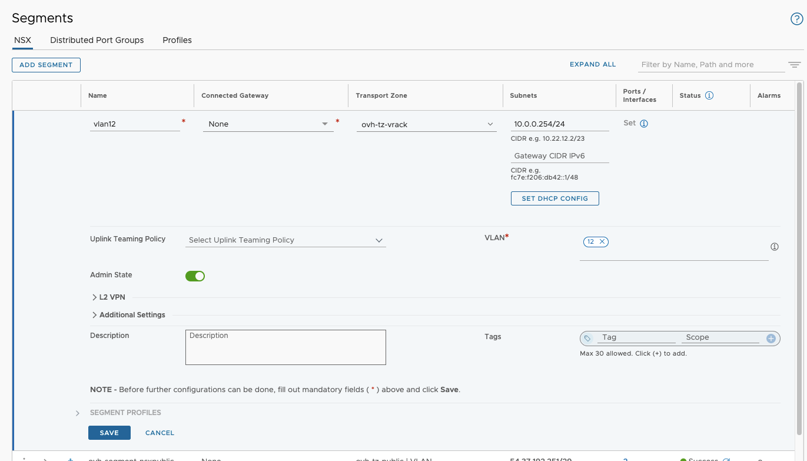{.thumbnail}
> **UK**
>> 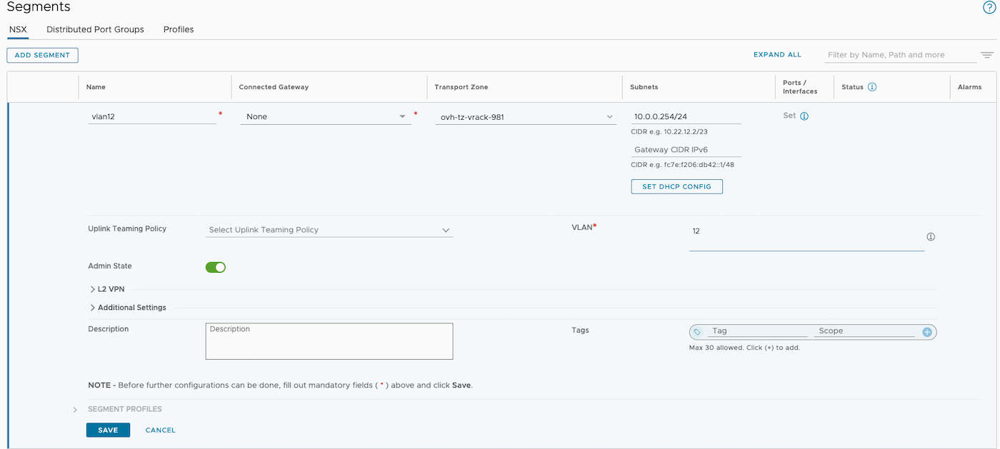{.thumbnail}

#### Création d'un segment d'overlay

Créez un segment d'overlay à l'emplacement prévu pour le déploiement de notre machine virtuelle. Utilisez 172.16.0.254 (DE) ou 192.168.0.254 (UK) comme adresse IP de la passerelle sur ce segment. Configurez éventuellement un serveur DHCP pour simplifier le déploiement, bien que cela ne soit pas obligatoire. Veuillez noter que nous connectons actuellement notre segment au ovh-T1-gw T1, mais cette configuration sera modifiée ultérieurement.

> [!tabs]
> **DE**
>>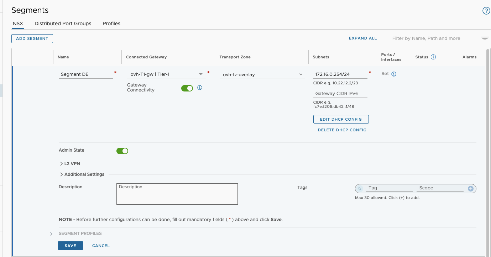{.thumbnail}
>>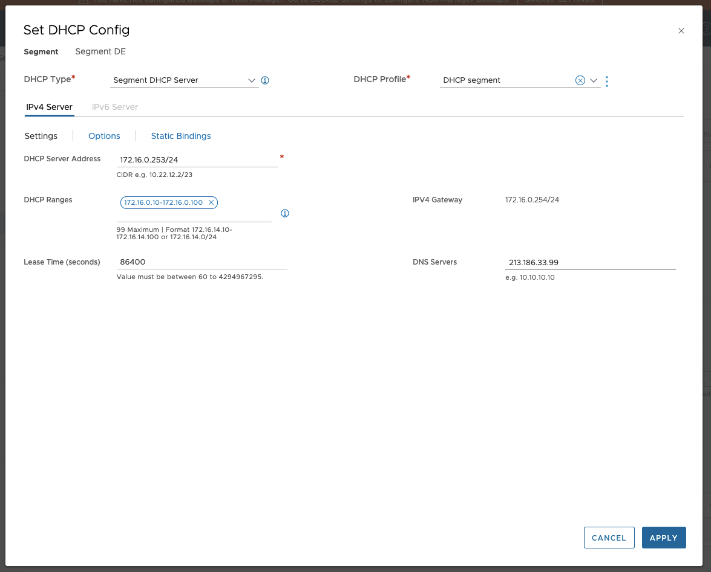{.thumbnail}
> **UK** 
>>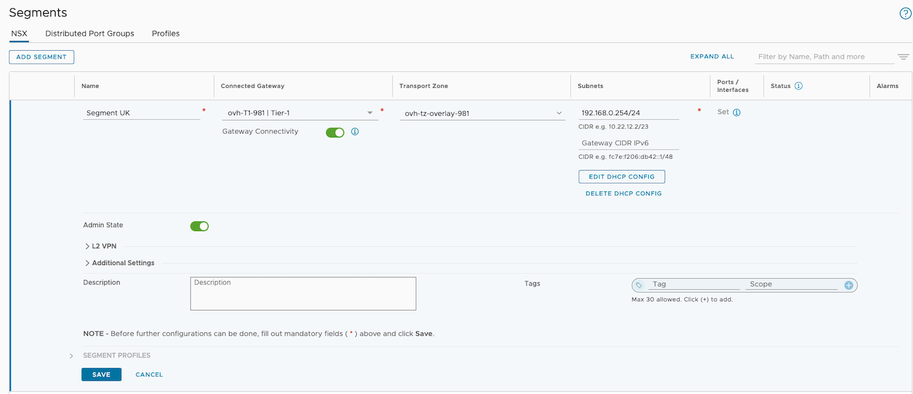{.thumbnail}
>>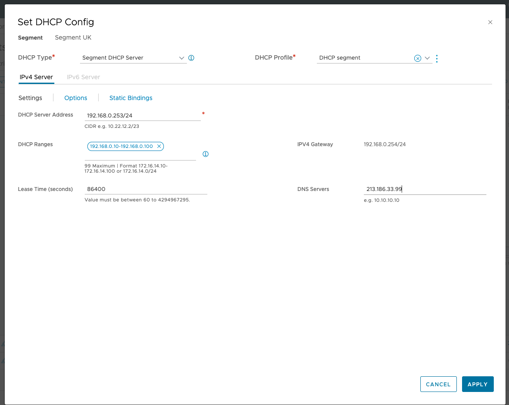{.thumbnail}

#### Création d'un VRF DE

1\. Pour la création d'un Virtual Routing Firewall (VRF), rendez vous dans la section `Connectivity` > `Tier-0 Gateways` > `Add Gateway` > `VRF`.

> [!tabs]
> **DE**
>> 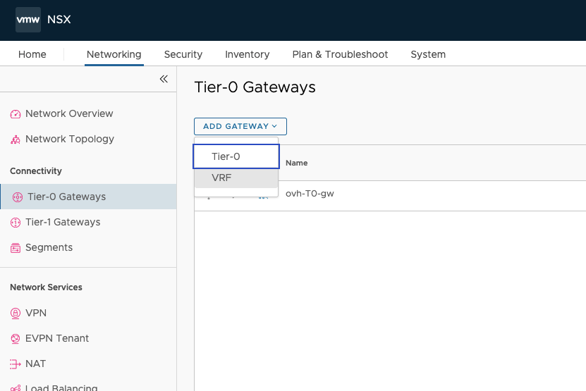{.thumbnail}
> **UK**
>> 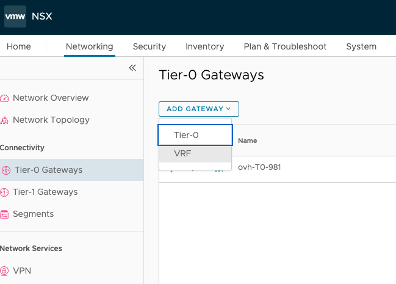{.thumbnail}

2\. Nommez votre VRF selon vos besoins et connectez-le à la passerelle **ovh-T0-gw**, enregistrez et continuez la configuration.

> [!tabs]
> **DE**
>> 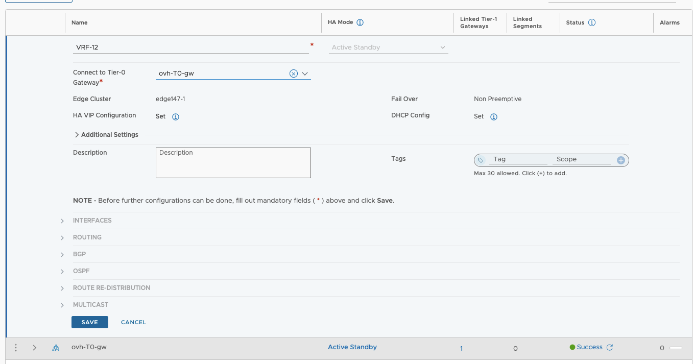{.thumbnail}
>> {.thumbnail}
> **UK**
>> 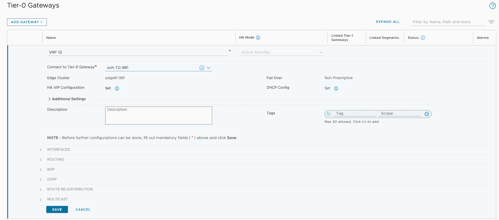{.thumbnail}
>> {.thumbnail}

3\. Configurez deux interfaces, une pour chaque edge. Choisissez deux adresses libres de votre plage IP du VLAN (pour l'exemple nous prenons 10.0.0.1/.2/.3/.4) puis connectez-les au segment VLAN12 précédemment créé.

> [!tabs]
> **DE**
>> 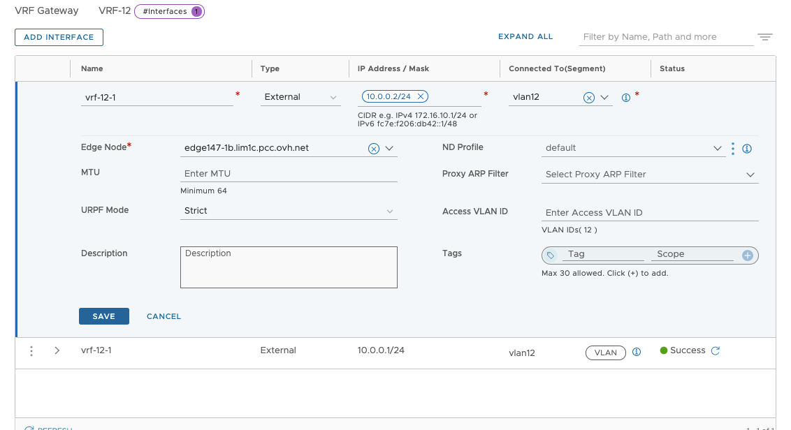{.thumbnail}
>> 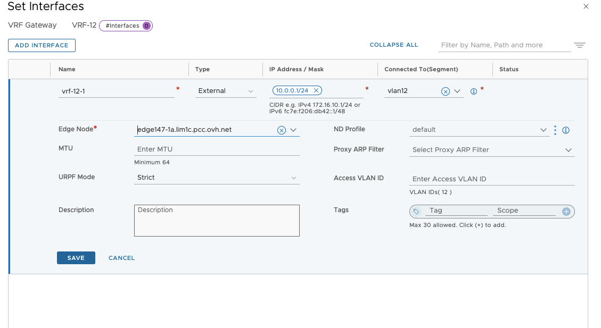{.thumbnail}
> **UK**
>> 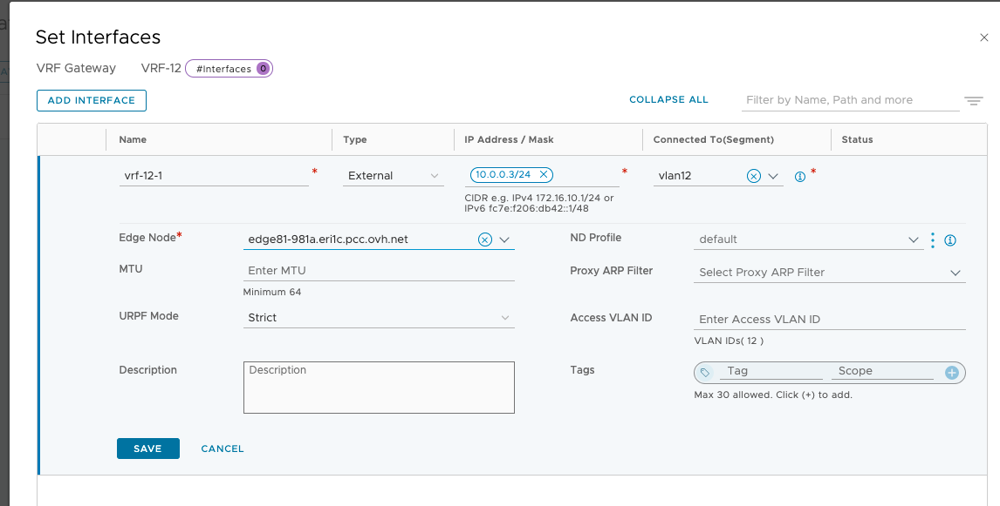{.thumbnail}
>> {.thumbnail}

4\. Vérifiez que vos deux interfaces sont créées et que leur statut est en `Success` (section `Tier-0 Gateway`).

> [!tabs]
> **DE**
>> 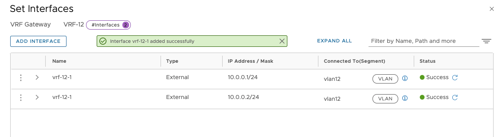{.thumbnail}
> **UK**
>> {.thumbnail}

#### Création d'un T1

Dans la section `Tier-1 Gateways` > `Add Tier-1 Gateway` créez une nouvelle passerelle T1. Choisissez un nom en fonction de vos besoins puis connectez-la au VRF précédemment créé et, enfin, reliez-la votre cluster Edge.

> [!tabs]
> **DE**
>> {.thumbnail}
> **UK**
>> 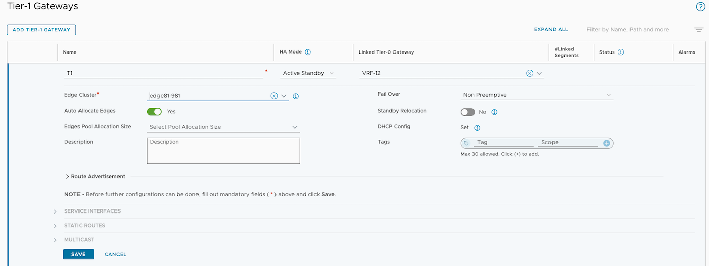{.thumbnail}

#### Connection du Segment & T1

Modifiez le Segment DE que vous venez de créer et changez la passerelle **GW** en **T1**.

Vous devriez obtenir ce résultat :

> [!tabs]
> **DE**
>> 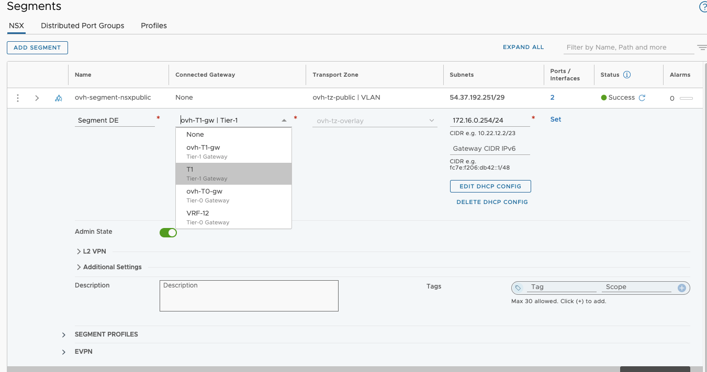{.thumbnail}.
>> 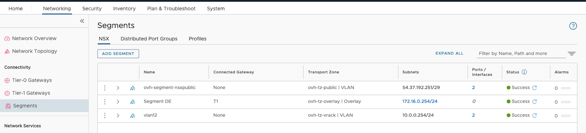{.thumbnail}
> **UK**
>> 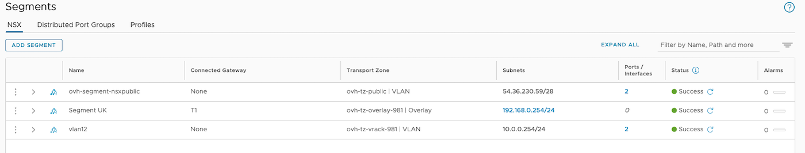{.thumbnail}

#### Création des machines virtuelles

Créez une machine virtuelle dans le portgroup respectif **DE Segment** ou **UK Segment**. Si vous avez déployé un service DHCP, l'adresse IP devrait être attribuée automatiquement. Dans le cas contraire, configurez une adresse IP statique pour votre machine virtuelle.

> [!tabs]
> **DE**
>> 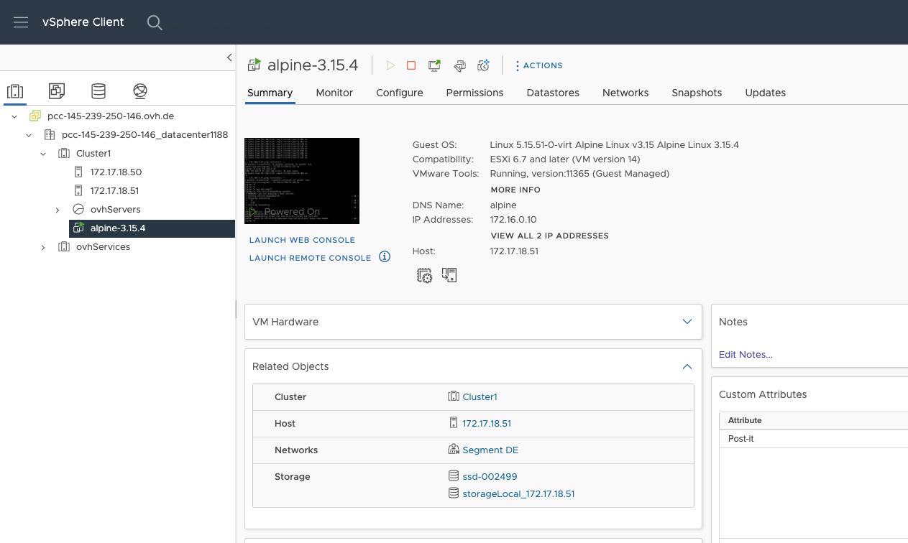{.thumbnail}
> **UK**
>> {.thumbnail}

### Préparation du NSX pour le routage BGP

>[!primary]
> Actuellement la fonctionnalité des nombres AS n'est pas disponible au niveau VRF. Elle le sera avec la version 4.1.1 de NSX. L'AS est 65000 sur les deux PCC si vous ne modifiez rien, car il est configuré nativement au niveau T0 par l'automatisation.

Vous pouvez voir vos configuration BGP en éditant votre passerelle T0.

> [!tabs]
> **DE**
>> L'AS de l'environnement DE est 65000, les IPs des Edges sont 10.0.0.1 and 10.0.0.2
>> 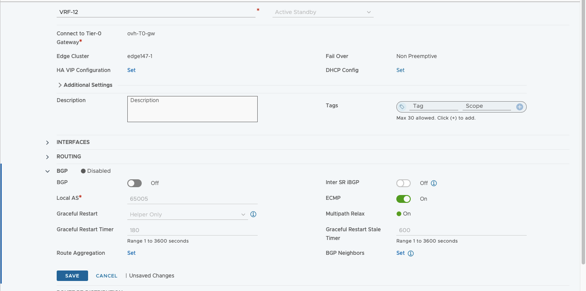{.thumbnail}
> **UK**
>> L'AS de l'environnement UK est 65000, les IPs des Edges sont 10.0.0.3 et 10.0.0.4.
>> 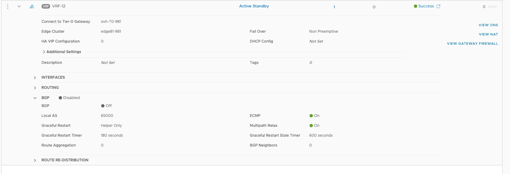{.thumbnail}

#### Configuration du VRF

Toujours sur l'edition de votre VRF, activez le BGP et ajoutez l'environnement à joindre.

> [!tabs]
> **DE**
>> {.thumbnail}
>> 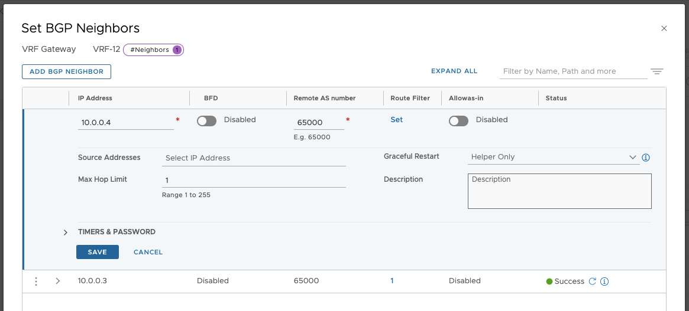{.thumbnail}
> **UK**
>> {.thumbnail}
>> {.thumbnail}

**Configurer une redistribution de routes**

Il est nécessaire de mettre en place une redistribution des routes des segments connectés.
Pour cela, rendez-vous dans la section `Route Re-distribution` de votre VRF (en dessous de celle du BGP).

{.thumbnail}

Ajoutez une règle de route de redistribution qui sera connectée à votre segment T1.

> [!tabs]
> **DE**
>> 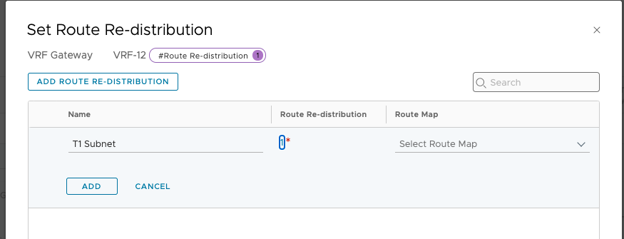{.thumbnail}
>> {.thumbnail}
>> {.thumbnail}
> **UK**
>> {.thumbnail}
>> {.thumbnail}
>> {.thumbnail}

**Sur votre passerelle T1**

Dans la section `Route Advertisement` de votre passerelle T1, autorisez `All Connected Segments & Service Ports`.

> [!tabs]
> **DE**
>> 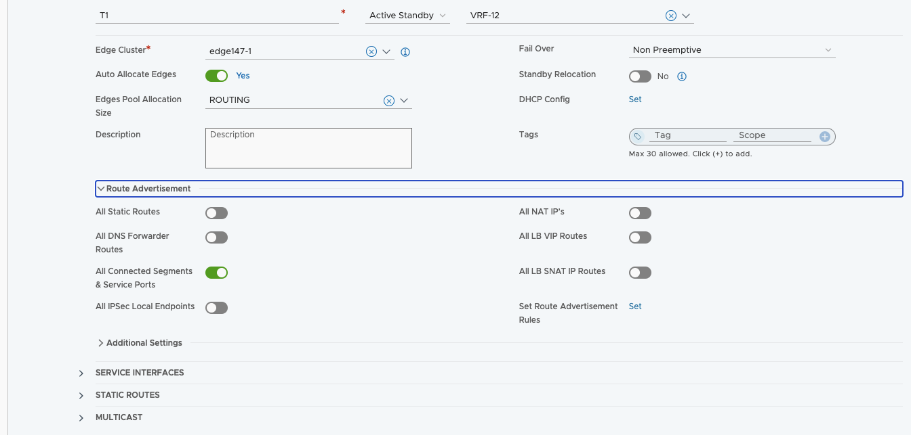{.thumbnail}
> **UK**
>> {.thumbnail}

### Résultats

Pour vérifier le bon fonctionnement de vos configurations et de votre lien, effectuez un test de ping entre les différentes machines virtuelles.

> [!tabs]
> **DE**
>> {.thumbnail}
> **UK**
>> {.thumbnail}

### Vue Topology

Vous pouvez retrouver la vue topologique de votre configuration dans les différents NSX dans la section `Networking` > `Networking Topology`.

> [!tabs]
> **DE**
>> {.thumbnail}
> **UK**
>> {.thumbnail}

## Aller plus loin

Échangez avec notre communauté d'utilisateurs sur <https://community.ovh.com>.
