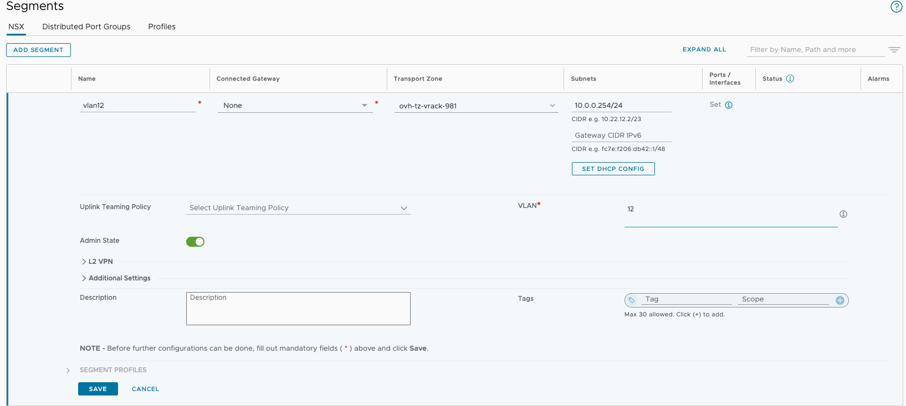
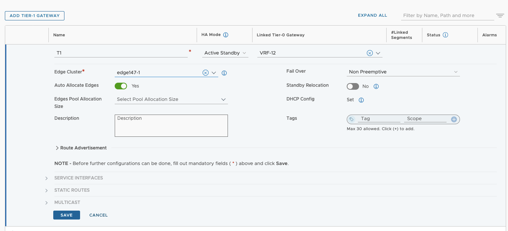
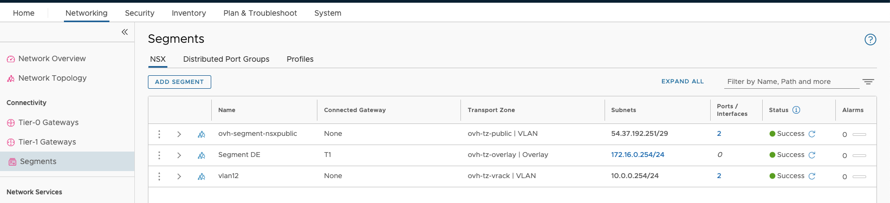
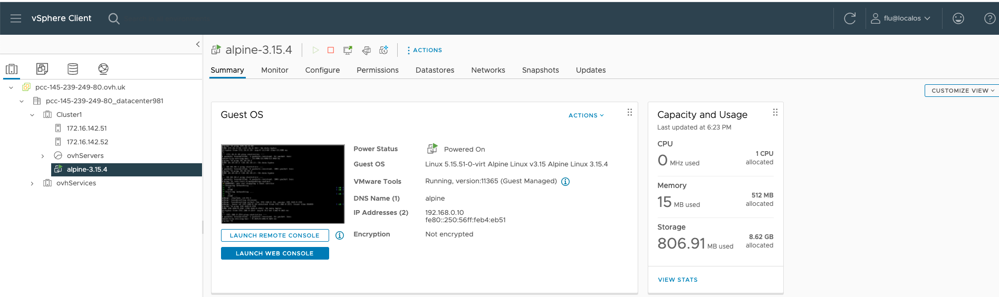
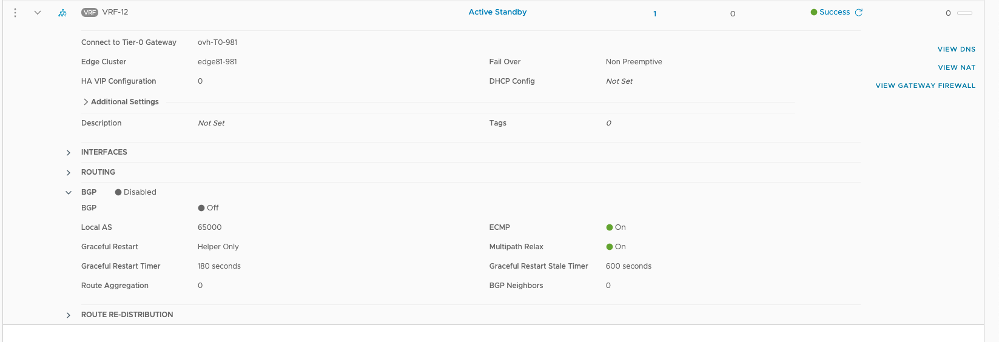
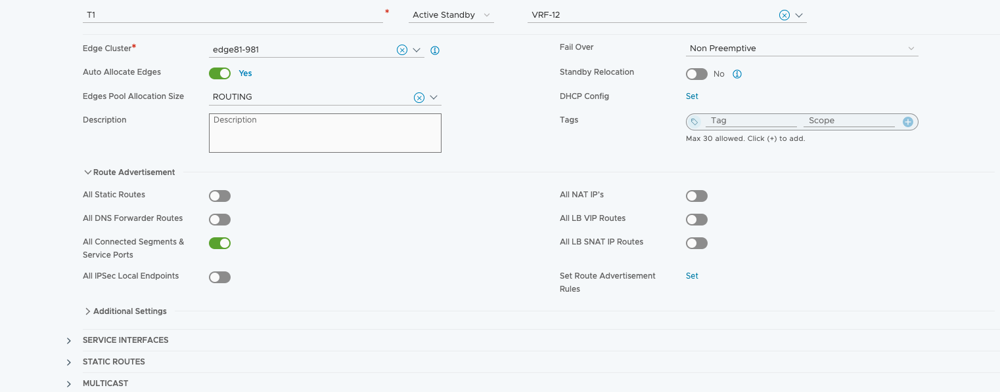
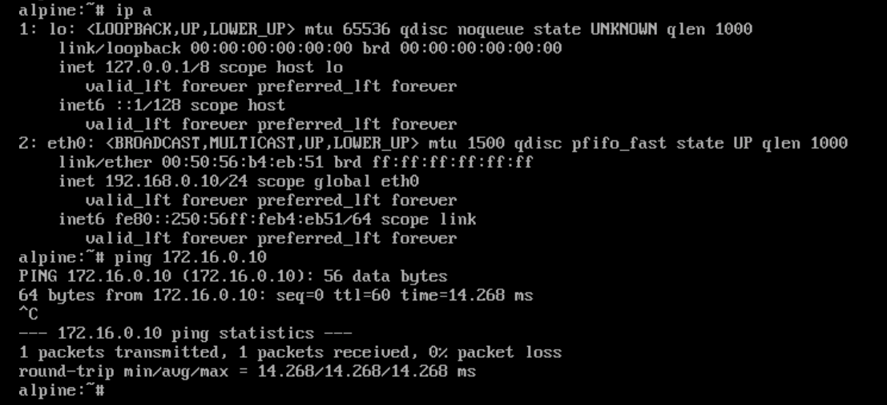

 
## Objective
  
**This guide details how to configure your BGP network to interconnect two virtual machines from two different Dedicated Cloud servers**
  
## Requirements

- Have two Dedicated Cloud.
- You need to have created a VLAN.

## Instructions
  
### PCC Configuration

For our example configuration, two PCC are used: 
  - DE
  - UK
  
For the connection between our two PCCs, we will use VLAN 12.

> [!primary]
> To configure PCCs, please access your NSX interface in the `Networking`{.action} section. Then follow the steps below.
> Also note that for each step of the configuration, it is done on both environments.

#### Segment Creation

In the `Segments` > `Add Segment` section, create a segment in the transport region **ovh-tz-vrack** on VLAN 12. Assign any IP address to the gateway, as we do not intend to use it.

> [!tabs]
> **De**
>>
> **UK**
>> 

#### Overlay Segment

Create an overlay segment in the location where we plan to deploy our virtual machine. Use 172.16.0.254 (DE) or 192.168.0.254 (UK) as the gateway IP address on this segment. Optionally, configure a DHCP server to simplify deployment, although this is not required. Please note that we are currently connecting our segment to the ovh-T1-gw T1, but this configuration will be modified later.

> [!tabs]
> **DE**
>>
>>
> **UK** 
>>
>>

#### VRF Creation DE

1. For creating a Virtual Routing Firewall (VRF). Go to `Connectivity` > `Tier-0 Gateways` > `Add Gateway` > `VRF`.

> [!tabs]
> **DE**
>> 
> **UK**
>> 

2. Name your VRF as needed and connect it to the gateway **ovh-T0-gw**, save and continue the configuration.

> [!tabs]
> **DE**
>> 
>> 
> **UK**
>> 
>> 

3. Configure two interfaces, one for each edge. Choose two free addresses from your VLAN IP range (for example, we will take 10.0.0.1/.2/.3/.4), then connect them to the VLAN12 segment you have created.

> [!tabs]
> **DE**
>> 
>> 
> **UK**
>> 
>> 

4. Verify that your two interfaces are created and that their status is in `Success` (section `Tier-0 Gateway`).

> [!tabs]
> **DE**
>> 
> **UK**
>> 

#### T1 Creation

In the `Tier-1 Gateways` > `Add Tier-1 Gateway` section, create a new T1 gateway. Choose a name to suit your needs, then connect it to the VRF you have created , and finally, connect it to your Edge cluster.

> [!tabs]
> **DE**
>> 
> **UK**
>> 

#### Connection Segment & T1

Change the DE Segment we just created and change the gateway **GW** to **T1**.
You should get that result.

> [!tabs]
> **DE**
>> .
>> 
> **UK**
>> 

#### Create Virtual Machines

Create a virtual machine in the respective portgroup **De Segment** or **UK Segment**. If you have deployed a DHCP service, the IP address should be assigned automatically. Otherwise, configure a static IP address for your virtual machine.

> [!tabs]
> **DE**
>> 
> **UK**
>> 

### Preparing NSX for BGP routing

>[!primary]
> Currently, AS number functionality is not available at the VRF level. It will be compatible with NSX version 4.1.1. The AS is 65000 on both PCCs if you do not modify anything, as it is natively configured at level T0 by automation.

You can view your BGP configurations by editing your T0 gateway.

> [!tabs]
> **DE**
>> AS of DE environment is 65000, the IPs of the Edges are 10.0.0.1 and 10.0.0.2
>> 
> **UK**
>> AS from the UK environment is 65000, the IPs of the Edges are 10.0.0.3 and 10.0.0.4
>> 

#### VRF configuration

Still on your VRF edition, enable BGP and add the environment to attach.

> [!tabs]
> **DE**
>> 
>> 
> **UK**
>> 
>> 

**Configure a route redistribution**

You need to redistribute the routes of the connected segments.
To do this, go to the `Route Redistribution` section of your VRF (Below that of the BGP).

Add a redistribution route rule that will be connected to your T1 segment.

> [!tabs]
> **DE**
>> 
>> 
>> 
> **UK**
>> 
>> 
>> 

**On your T1 Gateway**

In the `Route Advertisement` section of your T1 gateway, authorize `All Connected Segments & Service Ports`.

> [!tabs]
> **DE**
>> 
> **UK**
>> 

### Results

To check that your configurations and link are working properly, perform a ping test between the different virtual machines.

> [!tabs]
> **DE**
>> 
> **UK**
>> 

### Topology View

You can find the topology view of your configuration in the different NSX in the `Networking` > `Networking Topology` section.

> [!tabs]
> **DE**
>> 
> **UK**
>> 

## Go further
  
Join our community of users on <https://community.ovh.com/en/>.