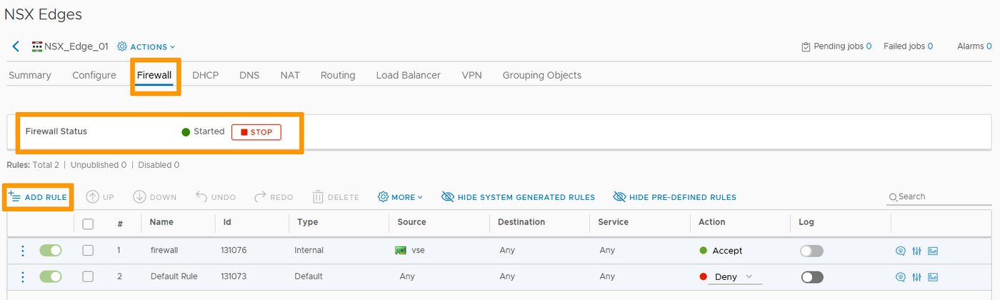
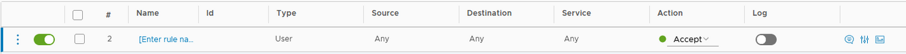
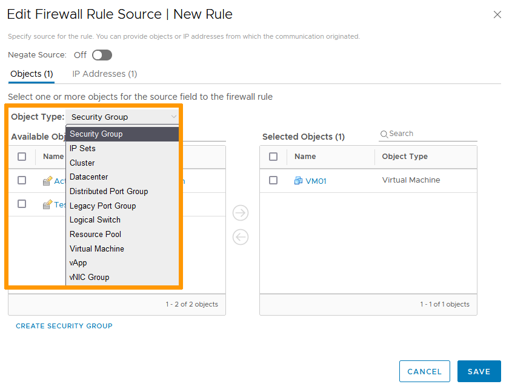
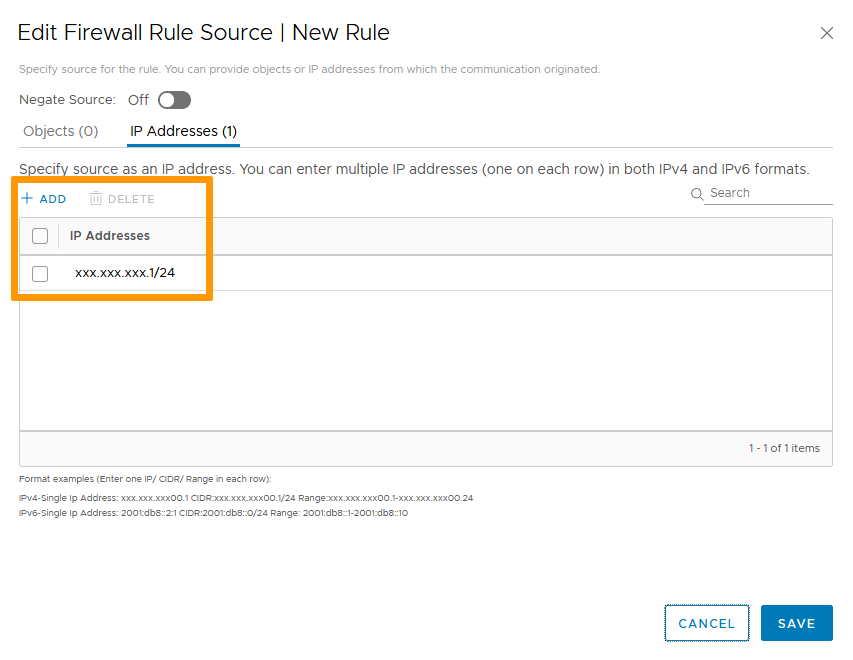
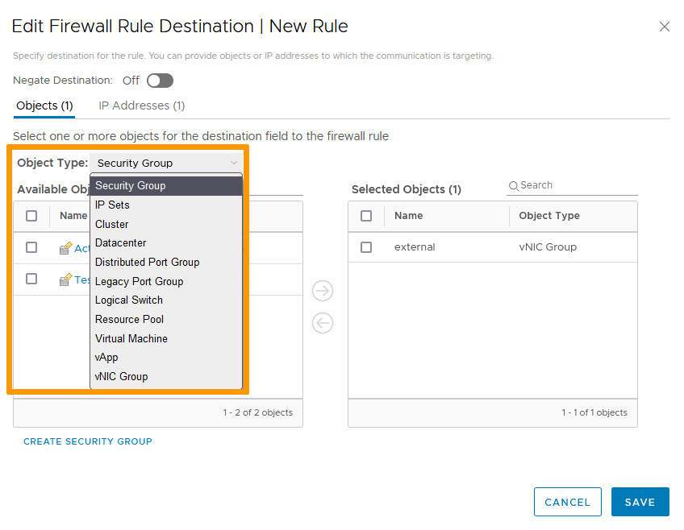
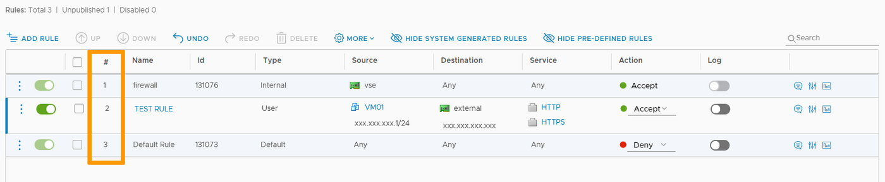
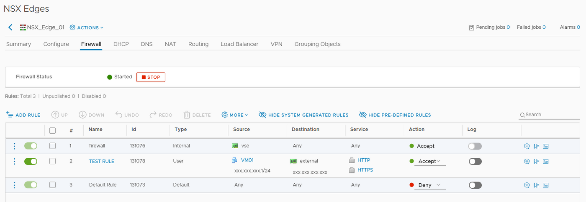

## Objective

The NSX firewall service restricts or allows network traffic based on rules applied to network nodes or groups.

**This guide explain how to create rules.**

## Requirements

- being an administrative contact of your [Hosted Private Cloud infrastructure](https://www.ovhcloud.com/de/enterprise/products/hosted-private-cloud/) to receive login credentials
- a user account with access to vSphere as well as the specific rights for NSX (created in the [OVHcloud Control Panel](https://www.ovh.com/auth/?action=gotomanager&from=https://www.ovh.de/&ovhSubsidiary=de))
- a deployed [NSX Edge Services Gateway](/pages/hosted_private_cloud/hosted_private_cloud_powered_by_vmware/nsx_deploying_edge_gateway)

## Instructions

### Interface access

In the vSphere interface menu, go to the `Networking and Security`{.action} dashboard.

{.thumbnail}

On the left side, navigate to the `NSX Edges`{.action} section then click on the appliance you're setting up.

{.thumbnail}

The Firewall tab shows the status with a simple button to stop or start the service.

> [!primary]
>
> Any change made will need to be published to be validated, so you will not shut down the service at the single push of a button.     

{.thumbnail}

### Firewall Rules

The basics of a firewall rule is to manage identified service(s) from specified source(s) to specified destination(s).     

Click on `+ Add Rule`{.action}.

The new rule shows with:

- An activation slider
- A selection box for specific actions (order change, deletion...)
- Name
- ID
- Type
- Source
- Destination
- Service
- Action
- Log slider
- Advanced settings    

{.thumbnail}

> [!warning]
>
> By default, rules have *Any* as source and destination, meaning it encompasses all traffic. To avoid security issues, it is best practices to avoid broad targets.
>

Name the rule by clicking the `Name`{.action} field. ID and Type fields are automatically populated.

#### Source

The source field defines the origin of the traffic.

Hover over the field and click on the `pencil`{.action} icon. You can add objects and/or IP addresses as needed.     

> [!primary]
>
> If "Negate Source" is turned on, the rule is applied to all sources except for the sources selected.
    
Click `Save`{.action} when ready.

{.thumbnail}

{.thumbnail}

#### Destination

The destination field defines the target of the traffic.

Hover over the field and click on the `pencil`{.action} icon. You have the same choices for destination as you had for source.    

> [!primary]
>
> If "Negate Source" is turned on, the rule is applied to all destinations except for the destinations selected.

Click `Save`{.action} when ready.

{.thumbnail}

{.thumbnail}

#### Service

The service field defines the type of traffic aimed at.

Hover over the field and click on the `pencil`{.action} icon. You have the choice between using existing services and groups or add raw ports/protocols.

> [!primary]
>
> Clicking on an existing service or group will show you a description with the ports and protocols involved.

Click `Save`{.action} when ready.

{.thumbnail}

{.thumbnail}

{.thumbnail}

#### Action

The action field defines how to handle the traffic.

You have three possible options to choose from:

- Accept: The traffic will go through.
- Deny: The traffic will be blocked with no further communication.
- Reject: The traffic will be blocked and a "port unreachable" message will be sent to the source.     

{.thumbnail}

#### Log

The log slider allows you to keep a journal of events on the rule.

#### Advanced Settings

Aside from a comments section and a statistics section, the advanced settings section allows you to define if the target traffic is inbound, outbound or both. In case of NAT traffic, you can choose if the rule applies to the original or translated source.

{.thumbnail}

### Rules priorities

Once the rule is set up, you see it in the list. The number of the rule in the list defines its priority.

Rules are applied from top to bottom. 
The first rule that matches the traffic overrides all the other rules below. 
That means that in the case of conflicting rules, the rule with the highest priority (lowest number) will be applied.

You can modify the rule order by selecting a rule and using the up and down arrows.    

{.thumbnail}

### Publishing rules

No creation/modification of a rule will be registered until you click the `Publish`{.action} button.

{.thumbnail}

{.thumbnail}

## Go further

Join our community of users on <https://community.ovh.com/en/>.
