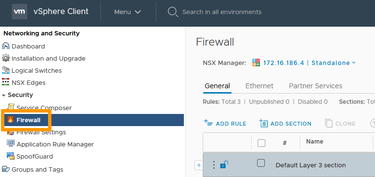
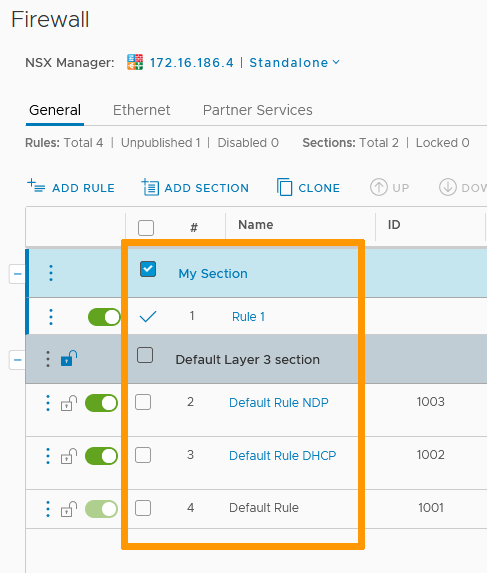
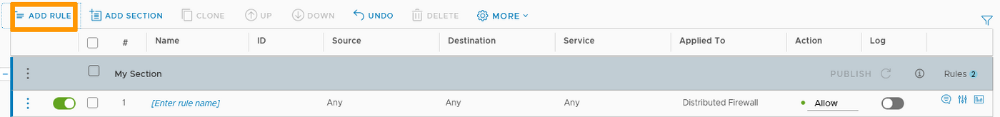
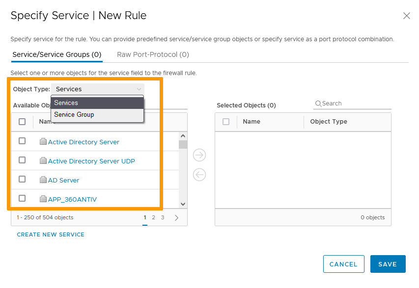
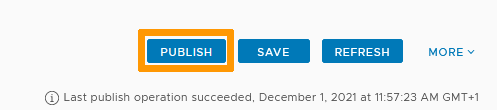

**Dernière mise à jour le 01/12/2021**

## Objectif

Comme le [pare-feu NSX Edge](/pages/hosted_private_cloud/hosted_private_cloud_powered_by_vmware/nsx_configurer_le_edge_firewall), le pare-feu distribué  accepte ou refuse le trafic réseau en fonction de règles appliquées à des objets ou groupes d’objets.
Le pare-feu distribué optimise le trafic et la consommation de bande passante en appliquant des règles aux paquets avant qu'ils ne soient envoyés au pare-feu Edge.

**Ce guide explique comment créer des règles.**

## Prérequis

- Être contact administrateur de l'infrastructure [Hosted Private Cloud](https://www.ovhcloud.com/fr/enterprise/products/hosted-private-cloud/), afin de recevoir des identifiants de connexion.
- Avoir un identifiant utilisateur actif avec les droits spécifiques pour NSX (créé dans l'[espace client OVHcloud](https://www.ovh.com/auth/?action=gotomanager&from=https://www.ovh.com/fr/&ovhSubsidiary=fr))

## En pratique

### Accès à l'interface

Dans l'interface vSphere, rendez-vous dans le tableau de bord `Mise en réseau et sécurité`{.action}.

{.thumbnail}

Sur la gauche de votre écran, naviguez vers `Pare-feu`{.action}.

{.thumbnail}

Le pare-feu distribué permet trois types de paramètres :

- `Général`{.action} pour des règles sur la couche 3 et supérieures.
- `Ethernet`{.action} pour des règles sur la couche 2.
- `Services de partenaires`{.action} pour des règles sur des services tiers (à intégrer au préalable).

{.thumbnail}

### Prioritié

Avant de créer de nouvelles règles, il est important de comprendre quand et comment elles seront appliquées. 

Le pare-feu distribué a trois niveaux de priorisation :

- Types
- Sections
- Règles

#### Types

Le type de règle/section est défini par la couche OSI sur laquelle elle agit. 
Les règles de couche 2 seront appliquées avant celles de couche 3 et supérieures. 
Ce qui veut dire que les règles de l'onglet Ethernet seront prioritaires sur celles de l'onglet Général.

#### Sections

Les sections sont des dossiers de règles qui permettent une meilleure segmentation et une gestion plus aisée. 
Les sections sont appliquées de haut en bas. 
Cela implique qu'en cas de conflit entre règles de différentes sections, c'est la règle de la section la plus haute qui sera appliquée.

#### Règles

Les règles contrôlent des services identifiés, en provenance de sources spécifiques et en direction de destinations définies. 
Les règles sont appliquées de haut en bas. 
La première règle qui s'applique au trafic annule toutes les suivantes. 
Cela implique qu'en cas de conflit entre deux règles d'une même section, c'est la règle avec la plus forte priorité (le plus petit nombre) qui sera appliquée.

#### Ordre

Vous pouvez ajouter des règles et/ou sections dans tous les onglets du pare-feu. 
Vous pouvez modifier l'ordre des règles et sections en les cochant puis en utilisant les flèches haut et bas. 

{.thumbnail}

### Règles de pare-feu

Cliquez sur `+ Ajouter une règle`{.action}.

La nouvelle règle apparaît avec les champs suivants :

- Bouton (*slider*) d'activation
- Coche de sélection pour des actions spécifiques (changement de priorité, suppression...)
- Nom
- ID
- Source
- Destination
- Service
- Appliqué à
- Action
- Bouton (*slider*) de journal (*log*)
- Paramètres avancés

{.thumbnail}

> [!warning]
>
> Par défaut, une règle a pour source et destination `Quelconque`, soit une sélection de tout le trafic. Pour des raisons de sécurité, il est recommandé d'éviter les règles globales.
>

#### Nom

Nommez la règle via un clic sur le nom. Le champ `ID` sera automatiquement complété.

#### Source

La source définit l'origine du trafic.

Survolez le champ et cliquez sur le symbole du `crayon`{.action}. Vous pouvez ajouter des objets et/ou des addresses IP.

> [!primary]
>
> Si vous activez « Inverser la source », la règle s'appliquera à toutes les sources sauf celles sélectionnées.

Cliquez sur `Enregistrer`{.action}.

{.thumbnail}

{.thumbnail}

#### Destination

La destination définit la cible du trafic.

Survolez le champ et cliquez sur le symbole du `crayon`{.action}. Les possibilités sont les mêmes que pour les sources.

> [!primary]
>
> Si vous activez « Inverser la source », la règle s'appliquera à toutes les destinations sauf celles sélectionnées.

Cliquez sur `Enregistrer`{.action}.

{.thumbnail}

{.thumbnail}

#### Service

Le service définit le type de trafic visé.

Survolez le champ et cliquez sur le symbole du `crayon`{.action}. Vous pouvez utiliser des services et groupes existants ou ajouter des ports/protocoles bruts. 

> [!primary]
>
> Cliquer sur un service ou un groupe existant vous montrera une descripion des ports et protocoles utilisés.

Cliquez sur `Enregistrer`{.action}.

{.thumbnail}

{.thumbnail}

{.thumbnail}

#### Appliqué à

Le champ « Appliqué à » définit la portée d'une règle.

Survolez le champ et cliquez sur le symbole du `crayon`{.action}. 
Par défaut, une règle est appliquée à tous les clusters sur lesquels le pare-feu distribué est installé, ce qui entraîne son application à toutes les VMs. 
Vous pouvez ajouter toutes les passerelles Edge ou les objets spécifiques disponibles dans la liste.   

Cliquez sur `Enregistrer`{.action}.

{.thumbnail}

#### Action

L'action définit comment le trafic sera dirigé.

Trois options vous sont proposées, sélectionnez celle qui vous convient :

- Autoriser : Le trafic est autorisé.
- Bloquer : Le trafic est bloqué sans autre forme de communication.
- Rejeter : Le trafic est bloqué et un message de port inaccessible est envoyé à la source.     

{.thumbnail}

#### Journal

S'il est activé, le bouton *slider* de journal (Log) enregistre les évenements qui concernent la règle.

#### Paramètres avancés

Outre la possibilité d'ajouter des commentaires et de consulter des statistiques, une section de **paramètres avancés** vous permet de définir si le trafic visé est entrant, sortant ou bidirectionnel et de limiter les règles à l'IPv4 ou l'IPv6.

Cliquez sur `Enregistrer`{.action}.

{.thumbnail}

### Publier les règles

La création/modification de règles/sections n'est pas enregistrée tant que vous ne cliquez pas sur `Publier`{.action}.

{.thumbnail}

## Aller plus loin

Échangez avec notre communauté d'utilisateurs sur <https://community.ovh.com>.
