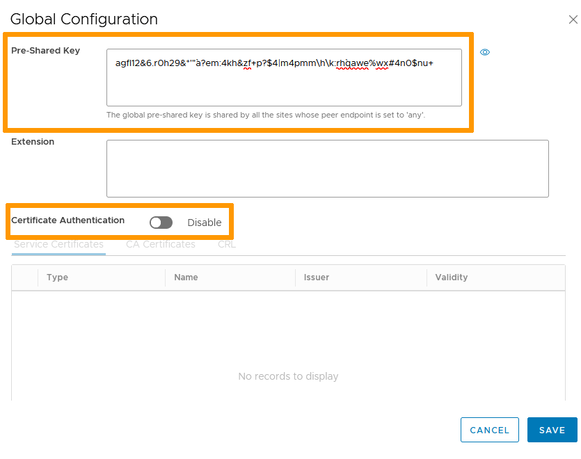
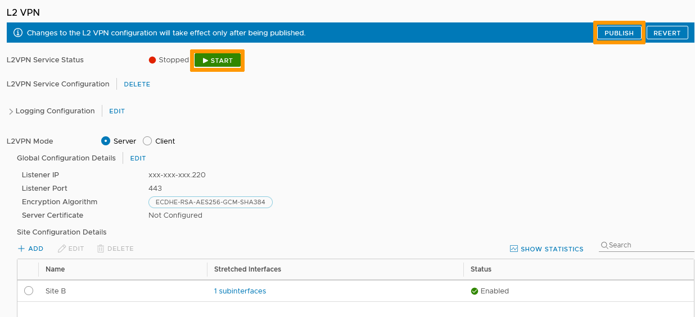
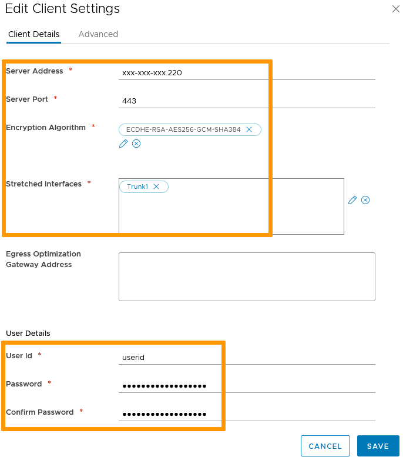

**Dernière mise à jour le 30/11/2021**

## Objectif

Le VPN crée un tunnel securisé pour connecter des clients ou sites distants au travers de réseaux publics.

**Ce guide explique les deux méthodes pour établir un VPN sur la NSX Edge Gateway**

## Prérequis

- Être contact administrateur de l'infrastructure [Hosted Private Cloud](https://www.ovhcloud.com/fr/enterprise/products/hosted-private-cloud/), afin de recevoir les identifiants de connexion.
- Avoir un identifiant utilisateur actif avec les droits spécifiques pour NSX (créé dans l'[espace client OVHcloud](https://www.ovh.com/auth/?action=gotomanager&from=https://www.ovh.com/fr/&ovhSubsidiary=fr))
- Avoir déployé une [NSX Edge Services Gateway](/pages/hosted_private_cloud/hosted_private_cloud_powered_by_vmware/nsx_deploying_edge_gateway)

## En pratique

### Accès à l'interface

Dans l'interface vSphere, rendez-vous dans le tableau de bord `Mise en réseau et sécurité`{.action}.

{.thumbnail}

Sur la gauche de votre écran, naviguez vers `Dispositifs NSX Edge`{.action} puis cliquez sur le dispositif à paramétrer.

{.thumbnail}

Dans l'onglet `VPN`{.action}, vous voyez deux types de VPN :

- VPN IPsec : le VPN Internet Protocol Security sécurise le trafic entre deux réseaux privés connectés à travers des réseaux publics par des passerelles IPsec appellées points de terminaisons. Tout matériel compatible peut être utilisé.
- VPN L2 : Dans le cadre de la NSX Edge Gateway, le VPN Layer 2 connecte des appliances NSX sur de multiples sites et sécurise la connection avec IPsec.

### VPN IPsec

Dans la section `VPN IPsec`{.action}, cliquez sur `Modifier`{.action} la configuration globale.

{.thumbnail}

Créez la clé pré-partagée (*Pre-Shared Key*) qui sera utilisée par les points de terminaison.

Si vous utilisez des certificats tiers, ils peuvent être ajoutés dans cette fenêtre. 

Cliquez ensuite sur `Enregistrer`{.action}.

{.thumbnail}

Cliquez sur `+ Ajouter`{.action} dans la section `Sites VPN IPsec`.

{.thumbnail}

Nommez et activez le site.

Dans l'onglet `Point de terminaison`{.action} :

- L'**ID local** est l'IP publique ou le FQDN du VPN.
- Le **Point de terminaison local** est l'adresse IP ou FQDN de la NSX Edge Gateway (généralement identique à l'ID local).
- Les **Sous-réseaux locaux** sont les sous-réseaux partagés par le VPN.
- L'**ID homologue** est l'IP publique ou FQDN du site distant.
- Le **Point de terminaison homologue** a pour valeur par défaut `any` mais elle peut être changée pour une IP ou un FQDN. *Si vous conservez `any`, assurez-vous que la clé pré-partagée globale est bien renseignée.*
- Les **Sous-réseaux homologues** sont les sous-réseaux utilisés sur le site distant.

{.thumbnail}

Dans l'onglet `Configuration de tunnel`{.action}, entrez vos paramètres de chiffrement (y compris vos certificats) puis cliquez sur `Ajouter`{.action}.

{.thumbnail}

Vous pouvez `Démarrer`{.action} le service VPN IPsec et `Publier`{.action} vos changements.

{.thumbnail}

Le tunnel est fonctionnel et actif.

### VPN L2

Le VPN L2 utilise une architecture client-serveur.

#### Serveur

Dans l'onglet `VPN L2`{.action}, selectionnez le **mode Serveur** puis cliquez sur `Modifier`{.action} à côté de `Détails de la configuration globale`.

{.thumbnail}

Entrez les paramètres du serveur:

- **Adresse IP de l'écouteur** est l'adresse IP publique de la NSX Edge Gateway.
- **Port de l'écouteur** est 443 par défaut (standard https) mais peut être modifié.
- Choisissez l'**Algorithme de chiffrement**.
- Utilisez le certificat généré par le système ou sélectionnez un tiers si vous en avez ajouté un.

Cliquez sur `OK`{.action} puis sur `Enregister`{.action}.

{.thumbnail}

De retour dans l'onglet **VPN L2**, cliquez sur `+ Ajouter`{.action} dans `Détails de la configuration du site`.

Paramétrez le site homologue :

- Activez le site.
- Nommez le.
- Définissez un  **ID d'utilisateur** et un **mot de passe** qui serviront à l'authentification du tunnel VPN
- Les **Interfaces étirées** sont les interfaces internes qui communiqueront avec le site homologue. *Ces interfaces doivent être en mode Trunk.*

Cliquez sur `Ajouter`{.action}.

{.thumbnail}

Vous pouvez `Démarrer`{.action} le service VPN L2 et `Publier`{.action} vos changements.

{.thumbnail}

Le serveur est fonctionnel et actif.

#### Client

Sur le NSX coté client, dans l'onglet `VPN L2`{.action}, selectionnez le **mode Client** puis cliquez sur `Modifier`{.action} à côté de `Détails de la configuration globale`.

{.thumbnail}

Les paramètres dépendent de ceux du serveur :

- L'**Adresse du serveur** est l'IP publique du serveur
- Le **Port du serveur** est celui défini (443 par défaut)
- L'**Algorithme de chiffrement** doit être identique à celui du serveur
- Cette fois, les **Interfaces étirées** sont celles du côté client
- L'**ID d'utilisateur** et le **mot de passe** doivent aussi être identiques à ceux du serveur.

Cliquez sur `Enregistrer`{.action}.

{.thumbnail}

Vous pouvez `Démarrer`{.action} le service VPN L2 et `Publier`{.action} vos changements.

{.thumbnail}

Le côté client est paramétré et la communication inter-sites est fonctionnelle.

## Aller plus loin

Échangez avec notre communauté d'utilisateurs sur <https://community.ovh.com>.
