## Objective

**This guide details how to deploy a standalone NSX Edge Server to extend the L2 to L2VPN range to an NSX infrastructure (previously NSX-t). The standalone Edge Server can be deployed on an infrastructure with or without NSX-V.**

## Requirements

- Acces to NSX
- Two PCCs

> [!primary]
> Please note that the IPs listed in this guide are examples only, and must be modified to suit your configuration.

## Instructions

> [!primary]
> To configure PCCs, please go to your NSX interface in the Networking section. Then follow the steps below. Also note that each step of the configuration is performed on both environments.

### NSX L2VPN configuration on NSX-T

#### Segment creation

In the `Segments`{.action} > `Add Segments`{.action} section of your NSX-T, create a segment. Name it and choose your gateway to match your VLAN. We will change its configuration later.

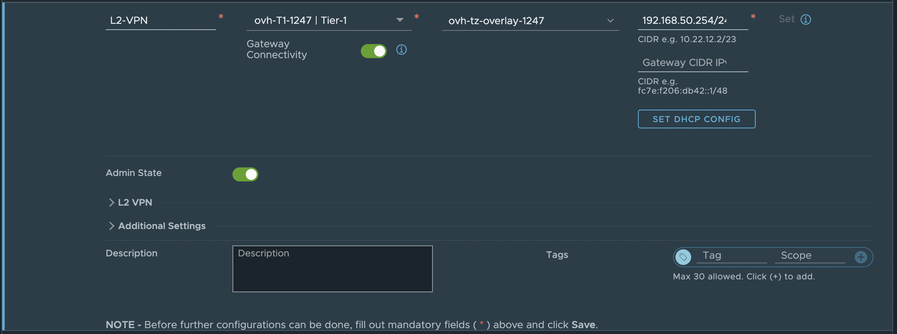{.thumbnail}

##### IPSec service creation

In the `VPN`{.action} > `VPN Services`{.action} > `Add Service`{.action} > `IPSec`{.action} section, create an IPsec service that will encrypt the L2VPN. In its configuration, use the same gateway as your previous segment. In addition, ensure that the **Admin Status** and **Session Sync** options are enabled.

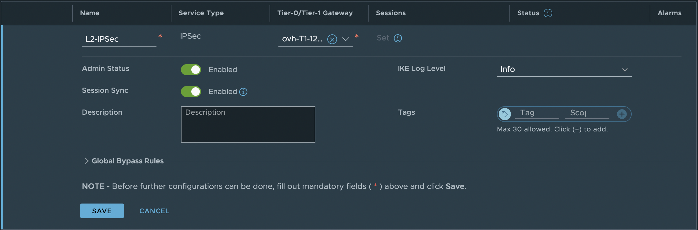{.thumbnail}

#### L2VPN service creation

In the `VPN`{.action} > `VPN Services`{.action} > `Add Service`{.action} > `L2 VPN Server`{.action} section, create a L2VPN server service. Once again, use the same gateway.

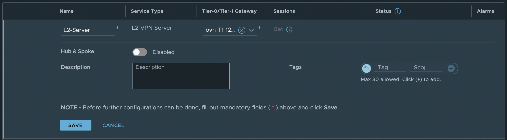{.thumbnail}

#### Local Endpoint creation

In the `VPN`{.action} > `Local Endpoints`{.action} > `Add Local Endpoint`{.action} section, create a Local Endpoint for the IPsec service. Use an IP in the IP block delivered with the PCC.

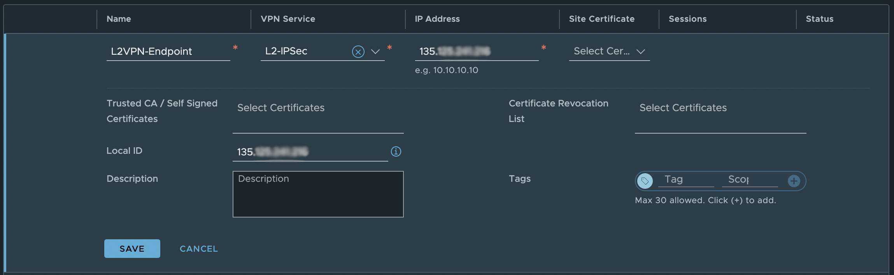{.thumbnail}

Ensure that the **All IPSec Local Endpoints** option is enabled in the T1 Gateway you are using (`Tier-1 Gateways`{.action} > `Route Advertisement`{.action}).

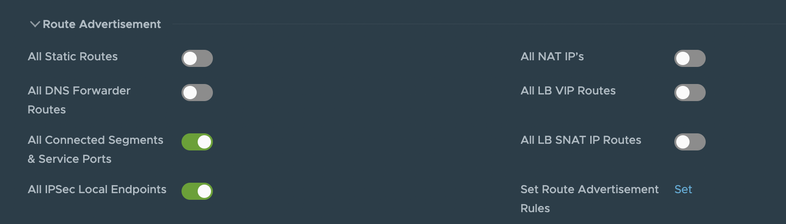{.thumbnail}

#### L2VPN server for LocalEndpoint creation

In the `VPN`{.action} > `VPN Services`{.action} > `Add Service`{.action} > `L2 VPN Server`{.action} section, create a L2VPN server service using the LocalEndpoint and the remote IP address of the L2VPN client that we will deploy later. The tunnel interface corresponds to a new IP address used for the tunnel.

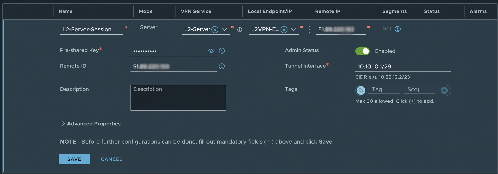{.thumbnail}

Next, go back to configuring your segment in `Segments`{.action} > `Your Segment`{.action} > `L2VPN`{.action}. Select a VPN ID tunnel for this segment.

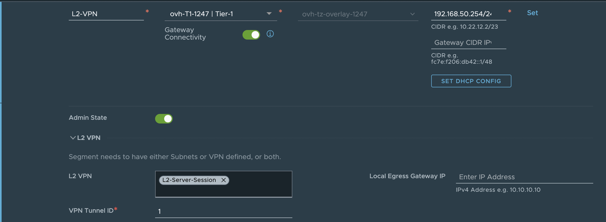{.thumbnail}

Simply download the L2VPN server configuration

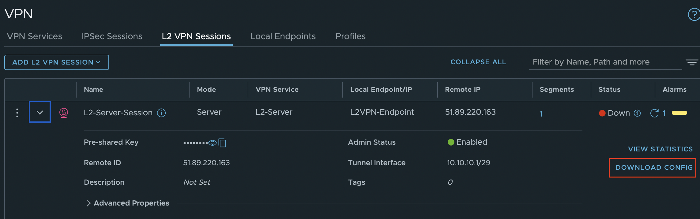{.thumbnail}

### Deploying NSX Standalone Edge on NSX-V PCC

Deploy OVF (Open Virtual Format). You can find it on the VMware customer portal in the same section where you download NSX (NSX-t).

You can also find it on this [download page](https://customerconnect.vmware.com/downloads/details?downloadGroup=NSXV_6414_EDGE&productId=417)

> [!primary]
> If you are not sure how to deploy an OVF, you can refer to our guide [here](/pages/hosted_private_cloud/hosted_private_cloud_powered_by_vmware/ovf_template).
>

#### OVF template configuration

| Source Network | Destination Network |
| ------ | ----- |
| Public | Use a VLAN of your choice and configure a NAT to exit |
| Trunk | Here we use the VXLAN from the NSX-V |
| HA interface | Not used in this case |

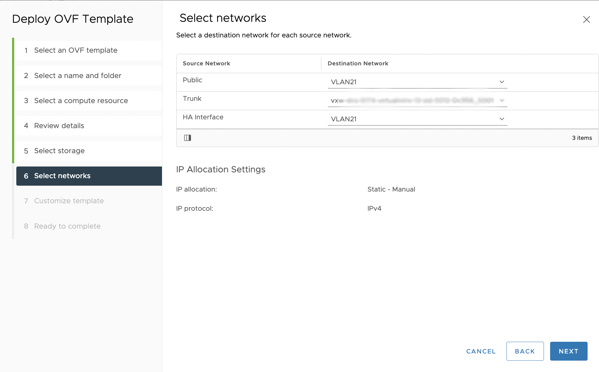{.thumbnail}

The **Peer code** can be found in the L2VPN server configuration file you downloaded earlier.

The **Sub-Interface** must match the VLAN and tunnel ID that you configured earlier in the NSX segment (NSX-t).

Don't forget to set the HA index to 0.

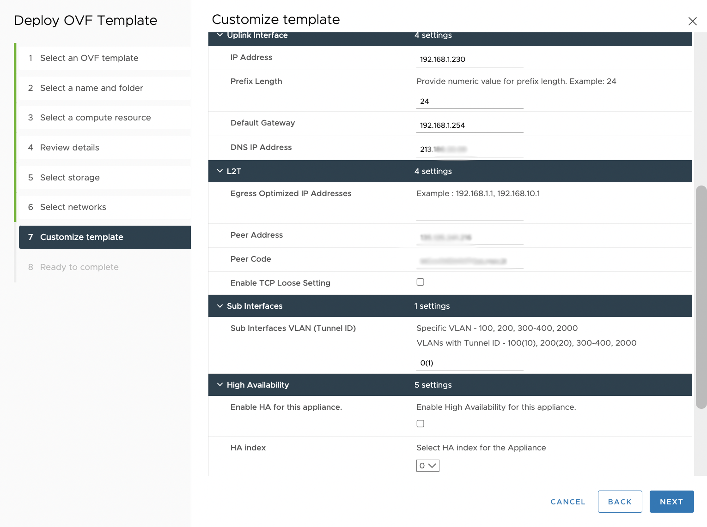{.thumbnail}

The NAT has been configured on ports **5000** & **4500** for the IPSec tunnel.

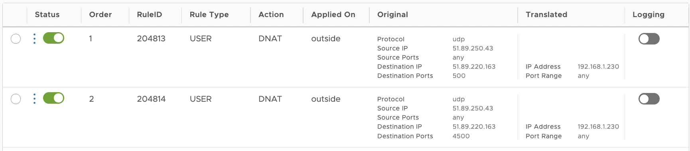{.thumbnail}

#### Configuration of Promiscuous Policies

You need to call an APIv6 call to enable Promiscuous mode on your port. If you use a VLAN portgroup, you have all the access and rights to do so using the vSphere WebClient.

If you are using vxlan, NSX-v vxlan, you cannot. To do this, you need to use the “enableCarp” APIv6 call. To enable Carp on the VMs on a specific network adapter, we need to enable promiscuous mode on the port. 

Go to [our API](https://api.ovh.com/console/#/dedicatedCloud) and locate this call:

> [!api]
>
> @api {v1} /dedicatedCloud POST /dedicatedCloud/{serviceName}/datacenter/{datacenterId}/vm/{vmId}/enableCarp
>

> [!primary]
> Before executing the API call, click on your VM portgroup then click on your VM port.
>
> 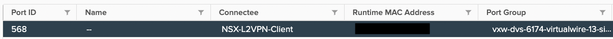{.thumbnail}

You will see on the **Policies** of your portgroup that the Promiscuous port is disabled.

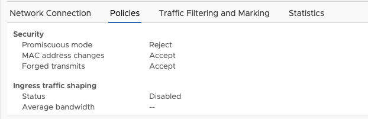{.thumbnail}

Now, on the swagger APIv6, locate the VM you have deployed (NSX-L2VPN-Client) in our case with this call:

> [!api]
>
> @api {v1} /dedicatedCloud  GET /dedicatedCloud/{serviceName}/datacenter/{datacenterId}/vm
>

Once the VM has been located, use the enableCarp API call:

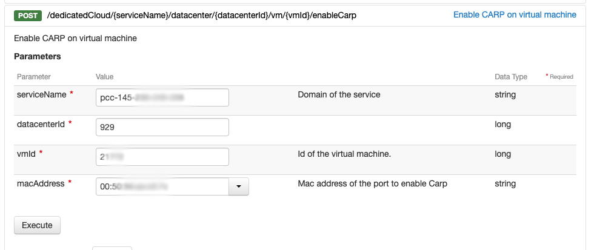{.thumbnail}

Wait for the automation to run and you will see that your port's Promiscuous mode has changed to `Accept`.

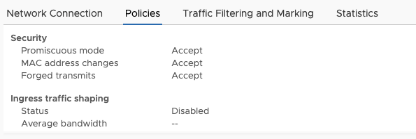{.thumbnail}

### Verifying the configuration

To check that the L2VPN service is running, open the console and log in.

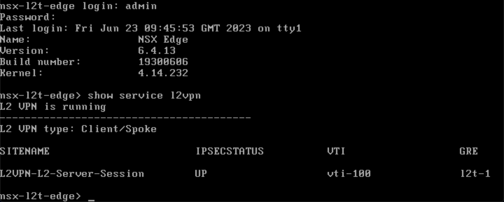{.thumbnail}

You can also check the NSX-T.

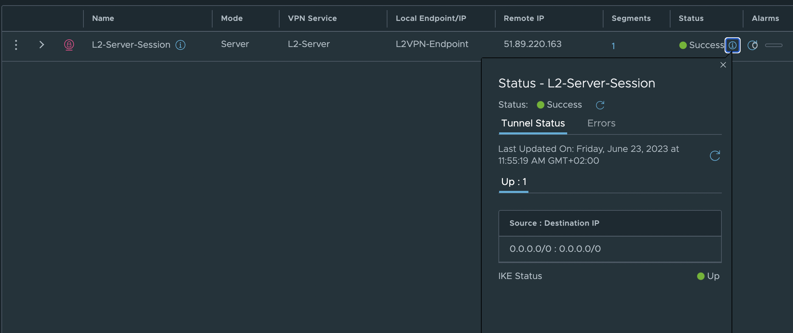{.thumbnail}

To confirm the correct L2 extension, let's create a VM in the NSX segment (NSX-t) and in the NSX-v VXLAN in the same subnet to confirm that they can communicate with each other.

- 192.168.2.5 is on NSX (NSX-t)
- 192.168.2.1 is on NSX-v
- 192.168.2.254 Edge Interface on NSX-v

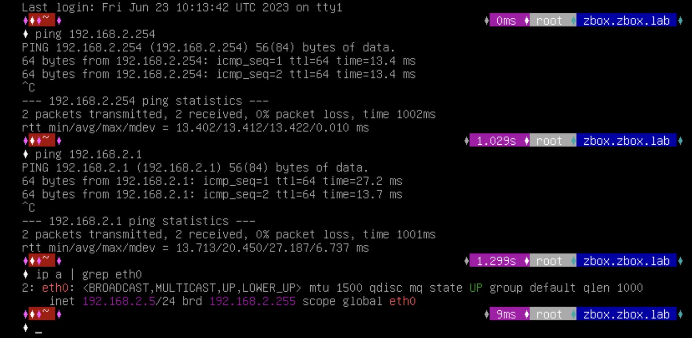{.thumbnail}

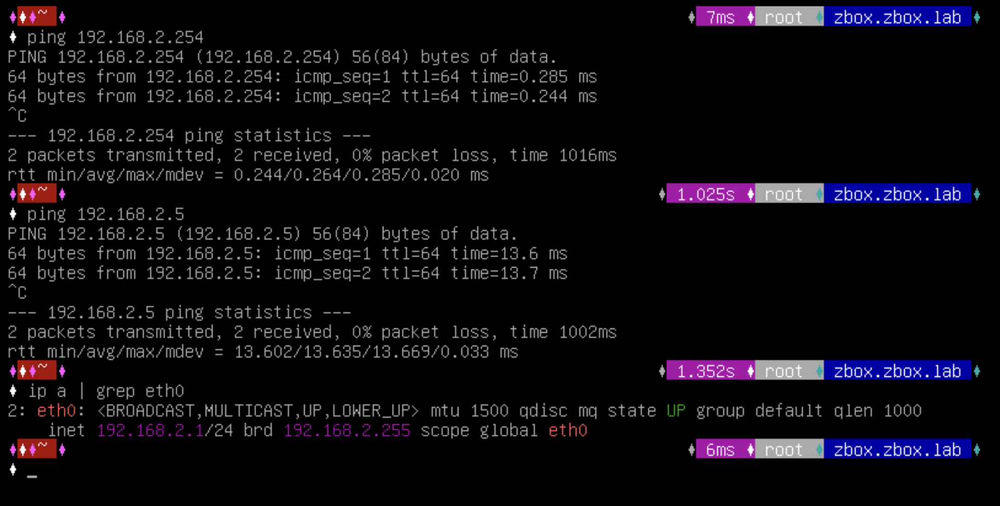{.thumbnail}

The communication between the VMs is successful, confirming our configuration is functional.

## Go further

If you need training or technical assistance to implement our solutions, contact your sales representative or click on [this link](https://www.ovhcloud.com/en-gb/professional-services/) to get a quote and ask our Professional Services experts for a custom analysis of your project.

Join our community of users on <https://community.ovh.com/en/>.