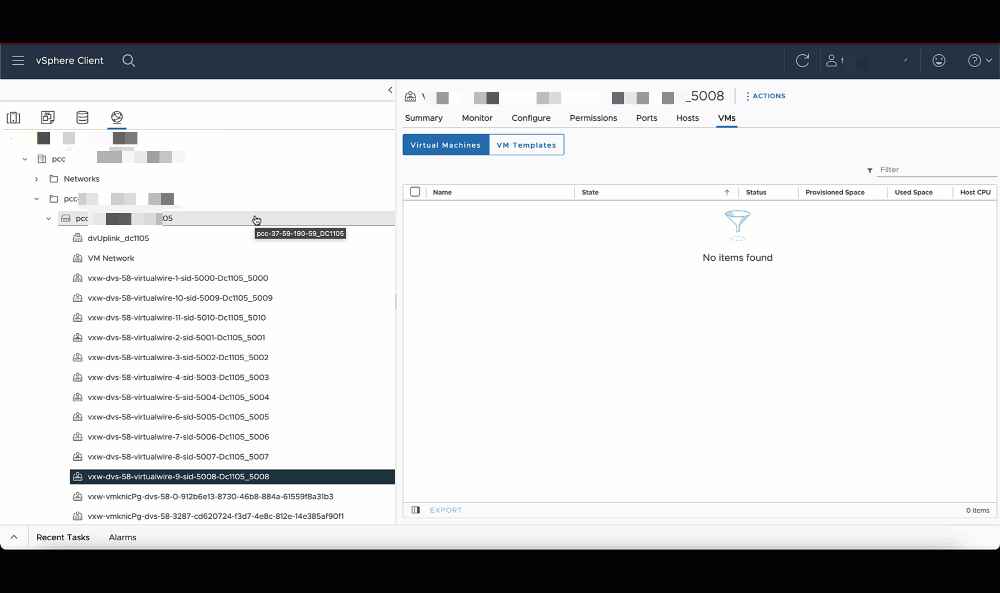
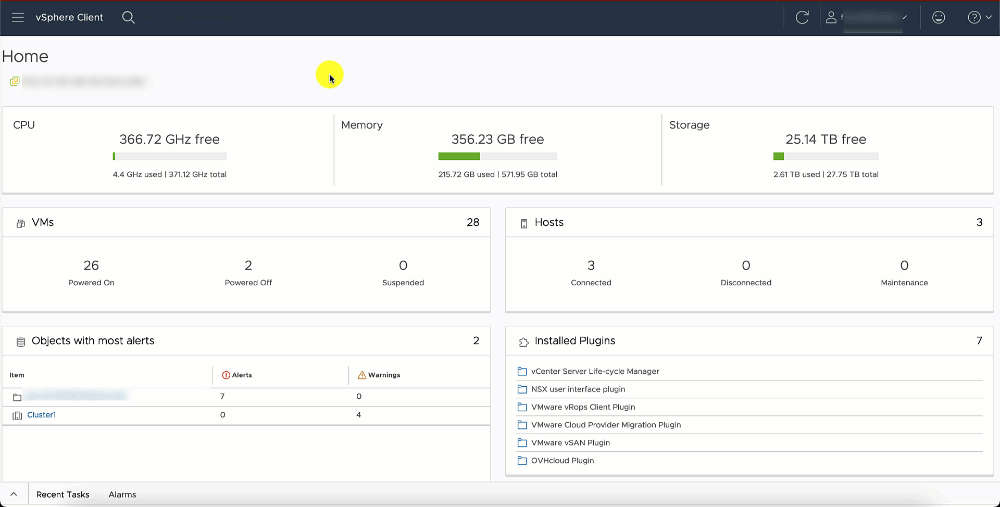
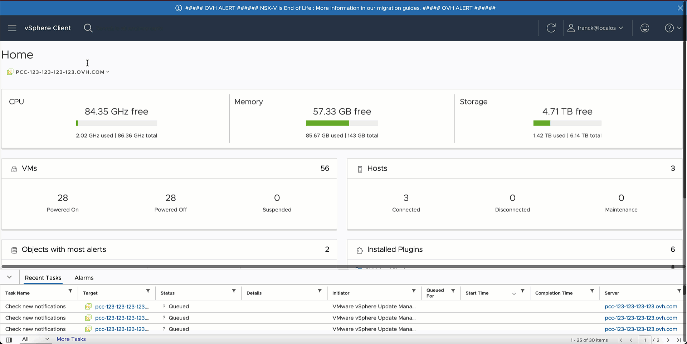

## Objective

You are using the VMware NSX-V component (Network and Security Virtualization); we inform you that this component will no longer be maintained by OVHcloud as of July 31, 2024, and will therefore be deactivated on that date.

This guide helps you analyse your use of NSX-V features and therefore offers you different evolution scenarios: From disabling the NSX-V component to migrating to its successor NSX-T (named NSX by VMware since version 4.0).

## Instructions

### Identifying your NSX-V usage

To identify your usage of the NSX-V feature in your Hosted Private Cloud environment, you have to ask yourself the following questions:

- Am I using VXLAN?

{.thumbnail}

- Am I using a Distributed Firewall rules?

{.thumbnail}

- Am I using a Distributed Logical Router or an Edge Services Gateway?

{.thumbnail}

- Am I using an SSL VPN?
From latest version of NSX-v the features was already disabled. 

#### I do not use any of the NSX-V features

We will disable NSX-V from 31 March 2024 if you are not using any NSX-V features.

Regardless of your Hosted Private Cloud range, if you want to disable NSX-V, you won't have to migrate to a new Datacentre. You will be able to keep your current resources. For the maintenance task to run properly and deactivate NSX-V, you need to make sure to clean the NSX-V environnement.

Make sure to remove all NSX-V EDGES (DLR or Gateway).

You should remove all the NSX-V Edges, Distributed Logical Gateway and Edges Services Gateway.

{.thumbnail}

Make sure to remove existing Distributed Rules (you should have 3 rules created by default with NSX-V or no rules at all).

{.thumbnail}

Make sure to move every VMs from vxlan to portgroup vRACK.

You can follow the documentation here to migrate VMs.

{.thumbnail}

At the end, you can use the API call to check that you have cleaned NSX-V:

> [!api]
>
> @api {v1} /dedicatedCloud POST /dedicatedCloud/{serviceName}/generateNsxvInventory~POST
>

> **Parameters:**
>
> serviceName: The reference for your PCC as `pcc-XX-XX-XX-XX`.

> [!primary]
>
>  Find more information on the OVHcloud API in our guide on [Getting started with the OVHcloud API](/pages/manage_and_operate/api/first-steps).

Visit our page on [VMware on OVHcloud lifecycle policy](/pages/hosted_private_cloud/hosted_private_cloud_powered_by_vmware/lifecycle_policy).

#### I only use VXLAN

If the only feature you use is VXLAN, you have the following choice:

- Migrating to NSX (see [details](#migration) below),
- Reconfiguring your network in order to replace VXLAN with [VLAN](/pages/hosted_private_cloud/hosted_private_cloud_powered_by_vmware/creation_vlan).

If you wish to migrate to VLAN, to help you to configure your network, you can use this API call to generate a mapping between VXLAN to VLAN.

> [!api]
>
> @api {v1} /dedicatedCloud POST /dedicatedCloud/{serviceName}/generateVxlanToVrackMapping
>

> **Parameters:**
>
> serviceName: The reference for your PCC as `pcc-XX-XX-XX-XX`.

> [!primary]
>
> Find more information on the OVHcloud API in our guide on [Getting started with the OVHcloud API](/pages/manage_and_operate/api/first-steps).

Once you have confirmed this API call, you will be sent an email. This will contain a suggested mapping between VXLAN and VLAN. 
This is just a proposal containing a list of your VMs and networks used. You are responsible for ensuring that these VLANs are not used by other OVHcloud services.

To create your VLAN networks, you can follow this documentation: [VLAN Creation](/pages/hosted_private_cloud/hosted_private_cloud_powered_by_vmware/creation_vlan)

You will be notified when the deactivation process is available. After the previous operations, you can now migrate your Virtual Machines from the VXLANs to the vRack DVS.

From the `Networks`{.action} view on the vSphere UI console, right-click on the VXLAN portgroup where your Virtual Machines are located and select `Migrate the VMs to another network...`{.action}.

> [!primary]
> In this example, we will migrate the VMs to the VLAN10 portgroup, which is located on the vRack. You must migrate all VMs to portgroups in order to disable NSX-v (or if OVHcloud detects that NSX-v is not in use).

{.thumbnail}

Complete your operation and reproduce this for each used vxlan portgroup.

VMs will only experience a very brief reconnection. In some cases, this may only be loss of a single ping request.

#### I use some of the NSX-V features

We recommend migrating to NSX (see [details](#migration) below) to benefit from all its included features.

Alternatively, you can decide to deploy alternative components (Load Balancer, Firewall appliance, VPN, ...) and then disable NSX-V (you will be notified when the deactivation process is available).

### Migrating to NSX 

The NSX software is enabled at the Virtual Datacenter (vDC) level. In order to migrate from NSX-V to NSX, you can order a new vDC for your existing Hosted Private Cloud service (feature available starting July 18, 2023), add new Hosts and then migrate from your current vDC to the new vDC using VMware vMotion.

The documentation to migrate to NSX is available here: [vDC Migration](/pages/hosted_private_cloud/hosted_private_cloud_powered_by_vmware/service-migration-vdc)

Our support teams and [Professional Services experts](https://www.ovhcloud.com/en-ie/professional-services/) can provide you with assistance.

## Go further 

[Getting started with NSX](/pages/hosted_private_cloud/hosted_private_cloud_powered_by_vmware/nsx-01-first-steps)

If you need training or technical assistance to implement our solutions, contact your sales representative or click on [this link](https://www.ovhcloud.com/en-gb/professional-services/) to get a quote and ask our Professional Services experts for a custom analysis of your project.

Join our community of users on <https://community.ovh.com/en/>.
