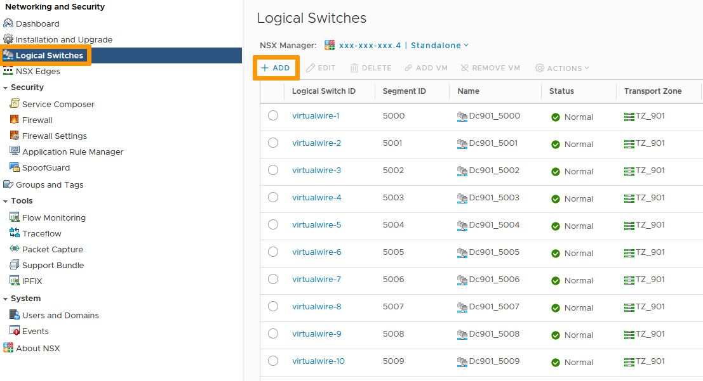
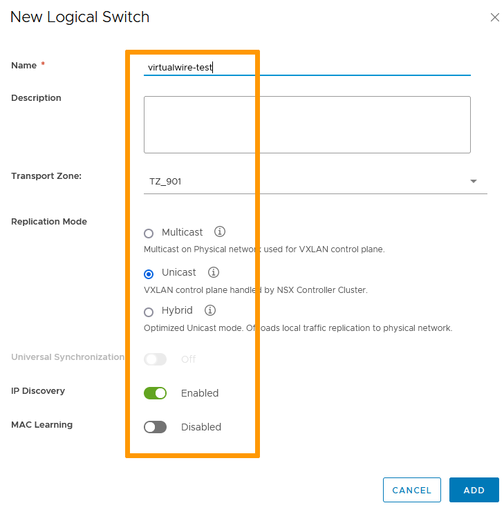

## Objectif

OVHcloud installe une base de 10 VxLANs sur la NSX Edge Gateway.

**Ce guide explique comment ajouter des VxLANs supplémentaires.**

## Prérequis

- Être contact administrateur de l'infrastructure [Hosted Private Cloud](https://www.ovhcloud.com/fr/enterprise/products/hosted-private-cloud/), afin de recevoir des identifiants de connexion.
- Avoir un identifiant utilisateur actif avec les droits spécifiques pour NSX (créé dans l'[espace client OVHcloud](https://www.ovh.com/auth/?action=gotomanager&from=https://www.ovh.com/fr/&ovhSubsidiary=fr))
- Avoir déployé une [NSX Edge Services Gateway](/pages/hosted_private_cloud/hosted_private_cloud_powered_by_vmware/nsx_deploying_edge_gateway)

## En pratique

Dans l'interface vSphere, rendez-vous dans le Tableau de bord `Mise en réseau et sécurité`{.action}.

{.thumbnail}

Sur la gauche de votre écran, naviguez vers `Commutateurs logiques`{.action}. 
La vue vous montre les VxLANs existants. 
Cliquez sur `+ Ajouter`{.action} pour en ajouter un.

{.thumbnail}

Nommez le nouveau commutateur logique et choisissez vos options:

- La **Zone de transport** définit quels hôtes un commutateur logique peut atteindre. Par défaut, OVHcloud crée une zone de transport par datacenter.
- Le **Mode de réplication** typique est monodiffusion, permettant la gestion du trafic entre les hôtes par les services NSX.
- La **Découverte d'adresses IP** empèche la saturation du trafic ARP dans les segments VxLANs et est recommandée. 
- L'**Apprentissage MAC** construit une table d’apprentissage VLAN/MAC sur chaque vNIC. Ce n'est recommandé que si vous utilisez des cartes réseau virtuelles effectuant la jonction VLAN.

Cliquez sur `Ajouter`{.action}.

{.thumbnail}

Votre VxLAN est à présent créé et fonctionnel, vous le retrouverez dans la vue des `commutateurs logiques`{.action}.

{.thumbnail}

Il est également visible dans la vue `Mise en réseau`{.action}.

{.thumbnail}

## Aller plus loin

Échangez avec notre communauté d'utilisateurs sur <https://community.ovh.com>.

