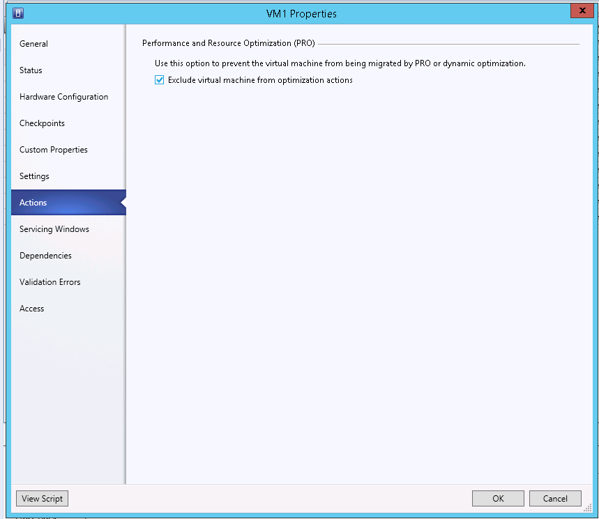

## Von OVH angebotene Konfiguration
In PRO enthalten ist die Dynamic Optimization, die eine automatische Verteilung der Last zwischen den verschiedenen Hosts eines Clusters erlaubt.
OVH stellt eine PRO Standardkonfiguration zur Verfügung:

{.thumbnail}
Die Dynamic Optimization wird alle 20 Minuten ausgeführt und migriert automatisch VMs von einem Host auf einen anderen, um den in den Einstellungen im Screenshot festgelegten Werten zu entsprechen.

## Eine VM von PRO ausschließen
Wenn Sie nicht möchten, dass eine VM automatisch von PRO mirgriert wird, können Sie diese ausschließen, in dem Sie folgendes Häkchen in den Einstellungen der VM setzen:

{.thumbnail}

## Anti-Affinitätsregeln
Im VMM können für jede VM Anti-Affinitätsregeln festgelegt werden. So können Sie spezifizieren, dass bestimmte VM nicht auf dem gleichen Host laufen sollen.

Begeben Sie sich dazu in die Einstellungen der VM und wählen Sie dort Hardware Configuration, Availability, Availability Sets aus:

{.thumbnail}
Erstellen Sie eine Property und fügen Sie sie im Abschnitt "Assigned Properties" hinzu:

{.thumbnail}
Wenden Sie die gleiche Vorgehensweise auf die anderen VM an, die Sie voneinander trennen möchten.

