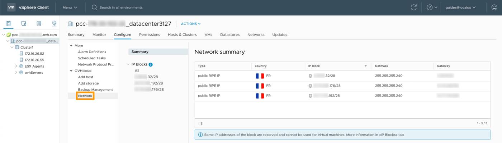

## Objetivo

OVHcloud ha desarrollado para sus clientes el plugin OVHcloud Network para ofrecer una gestión más precisa de las direcciones IP asociadas a la solución Hosted Private Cloud.

**Esta guía explica cómo utilizar el plugin OVHcloud Network en la solución Hosted Private Cloud.**

## Requisitos

- Tener una solución [Hosted Private Cloud](https://www.ovhcloud.com/es/enterprise/products/hosted-private-cloud/){.external}.
- Haber iniciado sesión en el [área de cliente de OVHcloud](https://ca.ovh.com/auth/?action=gotomanager&from=https://www.ovh.com/world/&ovhSubsidiary=ws).
- Tener un bloque de direcciones IP asociado a su Hosted Private Cloud.
- Tener acceso a la interfaz vSphere.

## Procedimiento

Una vez conectado a la interfaz vSphere, seleccione su datacenter en el menú de la izquierda. Acceda a la pestaña `Configure`{.action} y, en el menú de la izquierda, seleccione la opción  `Network`{.action} bajo el apartado OVHcloud para acceder a la interfaz «Network summary».

{.thumbnail}

Desde esta sección tendrá acceso a los bloques de IP e información básica sobre estos últimos. Haga clic en un bloque de IP para consultar todas las direcciones IP.

{.thumbnail}

Asimismo, puede consultar el registro inverso de cada dirección y su destino. Algunas direcciones aparecen como reservadas («Reserved»). Asegúrese de no utilizar estas **cinco IP reservadas para la configuración del bloque y la alta disponibilidad**, que son las siguientes:

- la primera IP, que anuncia el bloque en el router;
- la última IP, utilizada para **broadcast**;
- la penúltima, utilizada como **gateway**;
- las dos IP anteriores a la de gateway, que se utilizan como **HSRP** (Hot Standby Router Protocol) en los routers.

> [!warning]
> Algunas configuraciones con firewall virtual no permiten recuperar las direcciones MAC si el protocolo ARP no está autorizado.
>

A continuación puede personalizar los registros inversos de su dirección IP, por ejemplo, para configurar un servidor de correo. Haga clic en los tres puntos situados al principio de la línea correspondiente a la IP y seleccione `Edit Reverse`{.action}.

{.thumbnail}

Introduzca el registro inverso y haga clic en `Confirm`{.action}.

El registro inverso aparecerá en la tabla.

> [!primary]
>
> Este proceso de configuración también está disponible desde su [área de cliente de OVHcloud](https://ca.ovh.com/auth/?action=gotomanager&from=https://www.ovh.com/world/&ovhSubsidiary=ws). 
> 

## Más información

Interactúe con nuestra comunidad de usuarios en [https://community.ovh.com/en/](https://community.ovh.com/en/){.external}.
