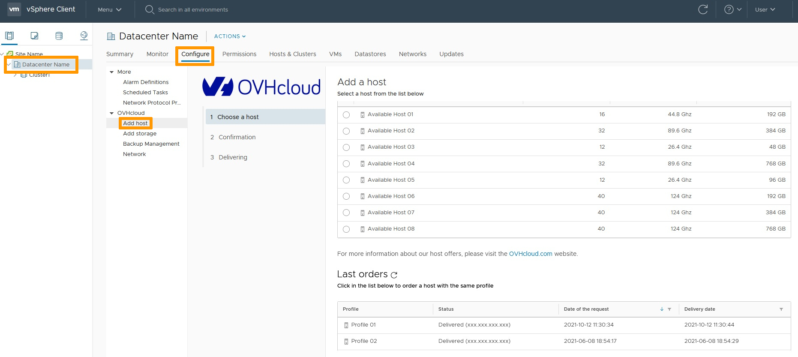
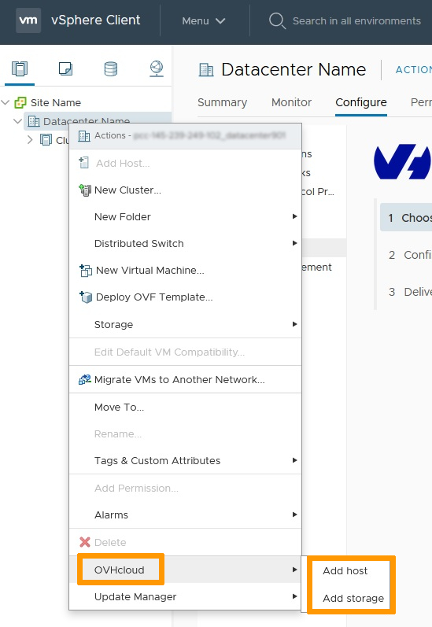

**Última actualización: 15/11/2021**

## Objetivo

El plugin OVHcloud permite añadir recursos dedicados a una infraestructura en cuestión de minutos.

**Esta guía explica cómo utilizar el plugin OVHcloud.**

## Requisitos

* Tener contratado un servicio [Hosted Private Cloud](https://www.ovhcloud.com/es-es/enterprise/products/hosted-private-cloud/){.external}.
* Estar conectado al cliente vSphere.

## Procedimiento

OVHcloud ofrece dos tipos de recursos dedicados con facturación por horas:

* servidores host
* datastores

En la pestaña `Hosts and Clusters`{.action} de la columna izquierda, seleccione un datacenter de la infraestructura. A continuación, abra la pestaña `Configure`{.action} del datacenter para acceder a los menús del plugin.

Para administrar sus servidores host, haga clic en `Add Host`{.action}. Aquí podrá consultar la información técnica de los servidores y contratar otros nuevos.

{.thumbnail}

Para administrar sus datastores, haga clic en `Add Storage`{.action}.

{.thumbnail}

Existe una forma alternativa de acceder a estos menús. Para ello, haga clic derecho en el datacenter de la infraestructura y seleccione `OVHcloud`{.action}.

{.thumbnail}

## Más información

Interactúe con nuestra comunidad de usuarios en <https://community.ovh.com/en/>.
