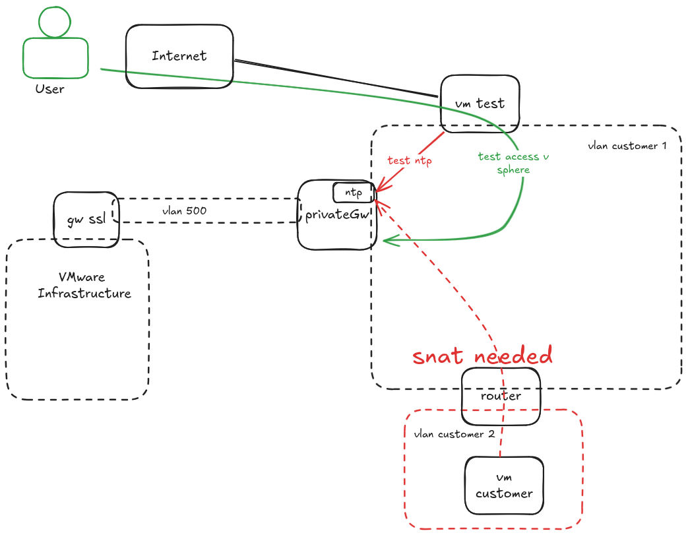
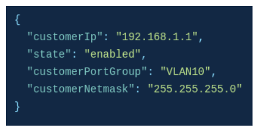
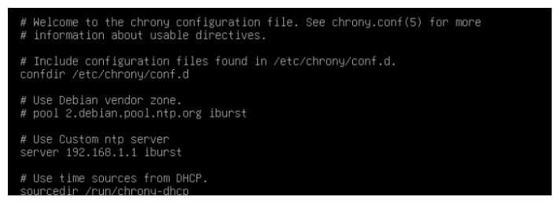
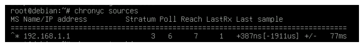
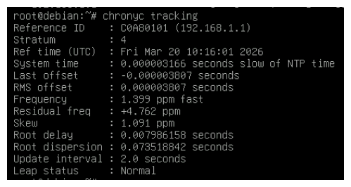

## Objectif

La private gateway vous permet d'utiliser un serveur NTP.

**Ce guide vous explique comment configurer le service NTP sur la private gateway de votre infrastructure Hosted Private Cloud.**

## Prérequis

- Posséder une offre [Hosted Private Cloud](/links/hosted-private-cloud/vmware).
- Avoir accès à l'interface de gestion vSphere.
- Avoir [activé la private gateway](/pages/hosted_private_cloud/hosted_private_cloud_powered_by_vmware/private_gateway/).
- Avoir [créé ses identifiants pour l'API OVHcloud](/pages/manage_and_operate/api/first-steps) et être connecté aux [API OVHcloud](/links/api).

## En pratique

### Architecture

La private gateway n'est pas routée par défaut. Seules les machines du même sous-réseau peuvent accéder directement au serveur NTP. Pour un accès depuis un autre réseau, il est nécessaire de mettre en place un source NAT.

{.thumbnail}

### Configurer le NTP sur la private gateway

#### Récupérer l'IP de la private gateway

Effectuez l'appel API suivant pour obtenir les informations de la private gateway et récupérer la valeur de `customerIp` :

> [!api]
>
> @api {v1} /dedicatedCloud GET /dedicatedCloud/{serviceName}/datacenter/{datacenterId}/privateGateway
>

{.thumbnail}

#### Installer chrony

Sur la VM concernée, lancez la commande suivante :

```shell
apt-get install chrony
```

#### Configurer chrony

Éditez le fichier `/etc/chrony.conf` en ajoutant l'IP du serveur de la private gateway et en enlevant la configuration par défaut.

{.thumbnail}

#### Redémarrer chrony

Redémarrez le service chrony :

```shell
systemctl restart chrony
```

#### Vérifier le client

Vérifiez que la VM se connecte bien au serveur :

```shell
chronyc sources
```

{.thumbnail}

Vérifiez que la synchronisation fonctionne :

```shell
chronyc tracking
```

{.thumbnail}

## Aller plus loin

Échangez avec notre [communauté d'utilisateurs](/links/community).
