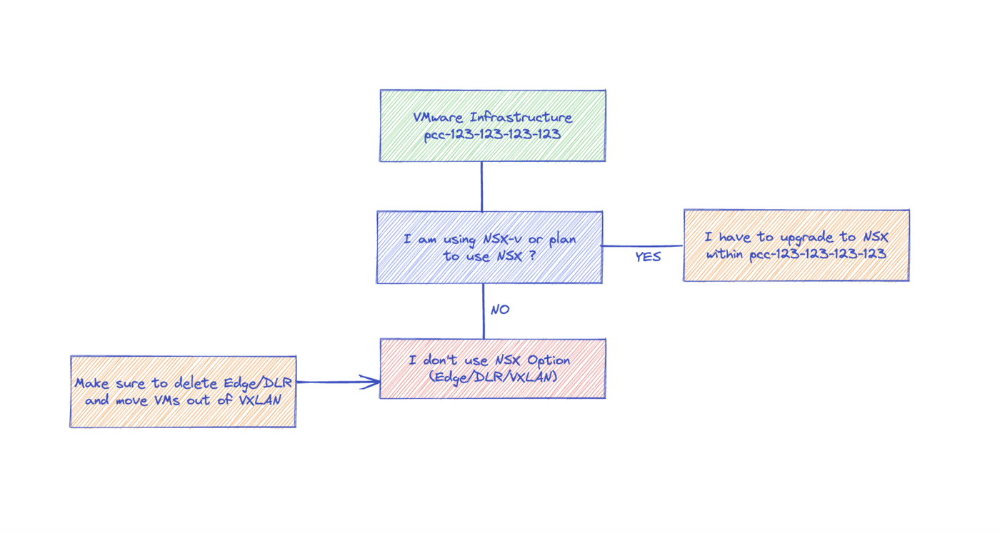
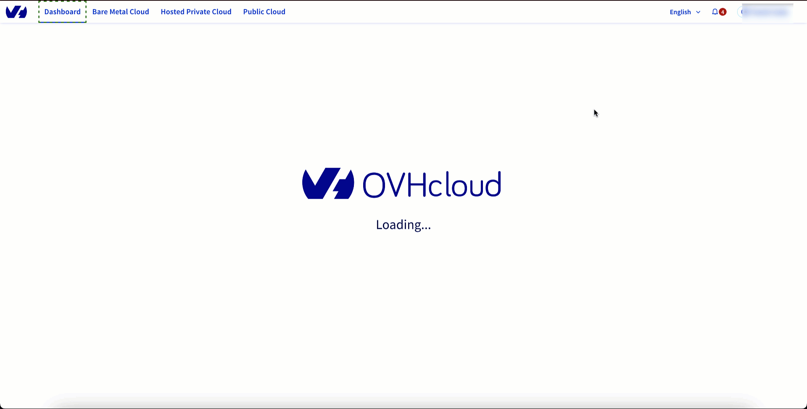
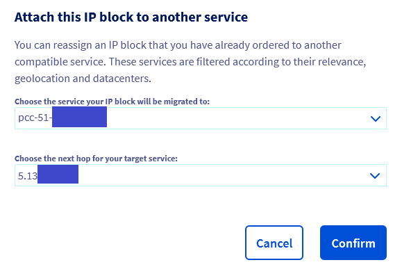

 

**Ce guide explique comment déplacer des machines virtuelles (VM) d'un virtual DataCenter (vDC) d'origine (PREMIER ou SDDC) vers un nouveau vDC de destination (VMware on OVHcloud).**

> [!warning]
>
> L'ajout d'un vDC de nouvelle génération et donc la possibilité de déplacer des VMs vers ce nouveau vDC n'est pas encore disponible pour toutes les infrastructures VMware car des mises à niveau et des opérations de maintenance sont en cours. Nous vous avertirons dès que cette possibilité vous sera accessible.
>

## Objectif

En 2023, OVHcloud a lancé 4 nouvelles gammes:

- **vSphere** : OVHcloud Managed VMware vSphere est notre solution la plus accessible pour les besoins de migration d'infrastructure, d'application, d'extension de datacentre ou de plan de reprise d'activité (avec les solutions Veeam ou Zerto disponibles en option).
- **Stockage hyperconvergé (vSAN)** : La solution Hyperconverged Storage répond à vos besoins de stockage ultra-puissant. Dotés de disques SSD NVMe, nos serveurs sont spécialement conçus pour répondre aux besoins des applications les plus exigeantes. Avec VMware vSAN, vous pouvez gérer votre stockage de manière évolutive, comme vous le feriez dans votre propre centre de données.
- **Network Security Virtualization (NSX)** : La solution Network Security est basée sur le logiciel de virtualisation de réseau et de sécurité VMware NSX (NSX-T). Vous pouvez gérer vos règles de sécurité, vos opérations et votre automatisation de manière cohérente dans vos différents environnements cloud. NSX sécurise vos logiciels, qu'ils soient hébergés sur des machines virtuelles ou dans des conteneurs, et réduit la menace des ransomwares grâce à la micro-segmentation.
- **Software-Defined Datacenter (NSX & vSAN)** : La solution Software-Defined Datacenter comprend des fonctionnalités de stockage hyperconvergé (vSAN) et de virtualisation du réseau et de la sécurité (NSX-T). Vous bénéficiez d’un environnement cloud optimal pour migrer et moderniser vos applications les plus critiques.

Vous pouvez désormais passer des gammes commerciales antérieures à 2020 aux nouvelles gammes tout en conservant la même infrastructure VMware (pcc-192-0-2-1) grâce à Storage Motion et vMotion.

Ce processus comporte deux aspects :

- L'infrastructure OVHcloud elle-même qui inclut le côté client de l'administration d'une infrastructure.
- L'infrastructure VMware, qui inclut l'ensemble de l'écosystème VMware.

## Prérequis

- Une infrastructure PCC (SDDC ou PREMIER)
- Être connecté à votre [espace client OVHcloud](https://www.ovh.com/auth/?action=gotomanager&from=https://www.ovh.com/fr/&ovhSubsidiary=fr){.external} dans la partie `Hosted Private Cloud`{.action}.
- Être connecté à votre interface d'administration vSphere

## En pratique

> [!primary]
>
> Si vous souhaitez être assistés par :
>
> - des partenaires OVHcloud, certifiés et experts sur nos produits, pour vous accompagner dans votre migration ou l'effectuer à votre place, veuillez cliquer sur [ce lien](https://www.ovhcloud.com/fr/private-cloud-migration/).
> - nos experts techniques OVHcloud pour un accompagnement sur mesure et vous conseiller à chacune des étapes de votre projet de migration, veuillez cliquer [ce lien](https://www.ovhcloud.com/fr/private-cloud-migration/).
>

Ce guide utilise les notions de **vDC d'origine** et de **vDC de destination**. Voici un index des tâches à réaliser:

[Etape 1 Concevoir votre infrastructure](#design) 
&ensp;&ensp;[Etape 1.1 Choisir votre gamme](#premoress) 
&ensp;&ensp;[Etape 1.2 Selectionner vos hosts (compute)](#selecthosts) 
&ensp;&ensp;[Etape 1.3 Selectionner vos datastores (storage)](#selectdatastores) 
[Etape 2 Construire votre nouvelle infrastructure](#build) 
&ensp;&ensp;[Etape 2.1 Ajouter un nouveau vDC de destination](#addvdc) 
&emsp;&emsp;[Etape 2.1.1 Vérifier l'éligibilité de vos services](#eligible) 
&emsp;&emsp;[Etape 2.1.2 Obtenir votre "serviceName"](#checkupgrade) 
&emsp;&emsp;[Etape 2.1.3 Obtenir votre "planCode"](#checkupgradeto) 
&emsp;&emsp;[Etape 2.1.4 Vérifiez que vous pouvez effectuer la mise à niveau avec vos "serviceName" et "planCode"](#snandpncheck) 
&emsp;&emsp;[Etape 2.1.5 Valider votre commande](#createorder) 
&ensp;&ensp;[Etape 2.2 Ajouter des nouveaux hosts et datastores](#addhostandds) 
&ensp;&ensp;[Etape 2.3 Convertir une datastore comme global](#converttoglobal) 
[Etape 3 Preparer votre vDC de destination dans le contexte OVHcloud](#preparevdcovhcontext) 
&ensp;&ensp;[Etape 3.1 Vérifier les caractéristiques héritées (Certifications, KMS, restrictions d'accès)](#checkovhcontext) 
&emsp;&emsp;[Etape 3.1.1 Certifications](#certs) 
&emsp;&emsp;[Etape 3.1.2 Key Management Server (KMS)](#kms) 
&emsp;&emsp;[Etape 3.1.3 Restrictions d'accès](#access) 
&ensp;&ensp;[Etape 3.2 Gérer les droits des utilisateurs](#userrights) 
&ensp;&ensp;[Etape 3.3 Activer les options Veeam Managed Backup & Zerto Disaster Recovery](#activateveeamzerto) 
&ensp;&ensp;[Etape 3.4 Vérifier votre réseau (vRack, IP publique)](#checknetwork) 
&emsp;&emsp;[Etape 3.4.1 vRack](#vrack) 
&emsp;&emsp;[Etape 3.4.2 Réseau publique](#publicnetwork) 
[Etape 4 Préparer votre vDC de destination dans le contexte VMware](#preparevdcvmwarecontext) 
&ensp;&ensp;[Etape 4.1 Reconfigurer VMware High Availability (HA)](#ha) 
&ensp;&ensp;[Etape 4.2 Reconfigurer VMware Distributed Resource Scheduler (DRS)](#drs) 
&ensp;&ensp;[Etape 4.3 Reconstruire vos resource pools](#respools) 
&ensp;&ensp;[Etape 4.4 Recréer vos Datastores Clusters (si pertinent)](#dsclusters) 
&ensp;&ensp;[Etape 4.5 Activer vSAN (si pertinent)](#vsan) 
&ensp;&ensp;[Etape 4.6 Recréer votre configuration réseau vSphere](#vspherenetwork) 
&ensp;&ensp;[Etape 4.7 Vérifier l'organisation de votre inventaire (si pertinent)](#inventory) 
&ensp;&ensp;[Etape 4.8 Migrer NSX-V vers NSX (si pertinent)](#nsx) 
&emsp;&emsp;[Etape 4.8.1 NSX Distributed Firewall](#dfw) 
&emsp;&emsp;[Etape 4.8.2 NSX Distributed Logical Router](#dlr) 
&emsp;&emsp;[Etape 4.8.3 NSX Edges](#edge) 
&emsp;&emsp;[Etape 4.8.3.1 Créer les T1 et les segments](#t1seg) 
&emsp;&emsp;[Etape 4.8.3.2 DHCP](#dhcp) 
&emsp;&emsp;[Etape 4.8.3.3 DNS](#dns) 
&emsp;&emsp;[Etape 4.8.3.4 Règles NAT](#nat) 
&emsp;&emsp;[Etape 4.8.3.5 Load Balancing NSX](#lb) 
&emsp;&emsp;[Etape 4.8.3.6 Pare-feu des passerelles T0 T1](#fwgw) 
&emsp;&emsp;[Etape 4.8.3.7 VPN](#vpn) 
&emsp;&emsp;[Etape 4.8.3.7.1 IPSec](#ipsec) 
&emsp;&emsp;[Etape 4.8.3.7.2 SSL VPN](#sslvpn) 
&emsp;&emsp;[Etape 4.8.3.8 Reconfiguration du bloc IP initial](#moveip) 
&ensp;&ensp;[Etape 4.9 Etendre la protection Zerto Disaster Recovery Protection (si pertinent)](#zerto) 
&emsp;&emsp;[Etape 4.9.1 VPG Source](#vpgsource) 
&emsp;&emsp;[Etape 4.9.2 VPG Destination](#vpgdest) 
[Etape 5 Déplacer vos machines virtuelles](#migrate) 
&ensp;&ensp;[Etape 5.1 Storage Motion](#svmotion) 
&ensp;&ensp;[Etape 5.2 vMotion](#vmotion) 
[Etape 6 Finaliser votre migration](#finalizemigration) 
&ensp;&ensp;[Etape 6.1 Reconfigurer Veeam Managed Backup (si pertinent)](#reconveeam) 
&ensp;&ensp;[Etape 6.2 Reconfigurer Zerto Disaster Recovery (si pertinent)](#reconzerto) 
&ensp;&ensp;[Etape 6.3 Recréer les règles d'affinité](#recreateaffinity) 
&ensp;&ensp;[Etape 6.4 Reconfigurer la Private Gateway (si pertinent)](#privategw) 
&ensp;&ensp;[Etape 6.5 Passer les hosts en mode maintenance](#hostmm) 
&ensp;&ensp;[Etape 6.6 Supprimer les anciens datastores](#removeoldds) 
&ensp;&ensp;[Etape 6.7 Supprimer les anciens hosts](#removeoldhosts) 
&ensp;&ensp;[Etape 6.8 Supprimer le vDC source](#removeoldvdc) 

### Etape 1 Concevoir votre infrastructure

À la fin de l'étape 1, vous devriez avoir une vision claire de la gamme commerciale 2023 vers laquelle vous souhaitez passer, ainsi que des hôtes et du stockage que vous souhaitez utiliser.

#### Etape 1.1 Choisir votre gamme

En tant que client Hosted Private Cloud VMware avec un hôte antérieur à 2020, vous souhaitez migrer vers VMware on OVHcloud.

- Si vous utilisez ou prévoyez d'utiliser [NSX](https://www.ovhcloud.com/fr/enterprise/products/hosted-private-cloud/nsx-datacenter-vsphere/) => vous devez effectuer une mise à niveau vers [Network Security Virtualization ou Software-Defined DataCenter](https://www.ovhcloud.com/fr/enterprise/products/hosted-private-cloud/)
- Si votre infrastructure VMware doit être [certifiée](https://www.ovhcloud.com/fr/enterprise/certification-compliance/) (HDS, PCI-DSS, HIPA) => vous devez effectuer une mise à niveau vers [VMware on OVHcloud](https://www.ovhcloud.com/fr/enterprise/products/hosted-private-cloud/)
- Si vous n'avez pas NSX sur votre infrastructure actuelle et que vous n'avez pas besoin de certifications => vous pouvez choisir [vSphere](https://www.ovhcloud.com/fr/enterprise/products/hosted-private-cloud/). 
- Les options Veeam Backup Managed et Zerto Disaster Recovery sont disponibles sur l'ensemble des gammes.

Attention, vous ne démarrez pas un nouveau service, il vous faudra commander vos ressources à l'unité. La création d'un nouveau vDC n'entraine pas la livraison de 2 hosts et 2 datastores.

{.thumbnail}

#### Etape 1.2 Sélectionner vos hosts (compute)

Vous avez maintenant choisi votre gamme commerciale.

Attention, ce choix n'est pas définitif, vous pouvez commencer par 2 hôtes de 96GB de RAM et passer à 3 hôtes de 192GB de RAM.

#### Etape 1.3 Sélectionner vos datastores (storage) 

Vous avez maintenant choisi votre gamme commerciale et vos hosts. Veuillez noter que certains de vos datastores actuels peuvent être compatibles avec les nouvelles gammes, c'est-à-dire que ces datastores peuvent être définis comme globaux. Un datastore global est un datastore partagé sur tous les clusters/vDC au sein d'une infrastructure VMware, c'est-à-dire partagé entre le vDC d'origine  et le vDC de destination. Vous pouvez utiliser l'API OVHcloud pour vérifier la compatibilité des datastores :

> [!api]
>
> @api {v1} /dedicatedCloud GET /dedicatedCloud/{serviceName}/datacenter/{datacenterId}/filer/{filerId}/checkGlobalCompatible
>

**Résultat attendu :** boolean

Si le retour API est `TRUE`, ce datastore est compatible avec les nouvelles gammes et vous pourrez le conserver. Vous pourrez le définir comme global par la suite dans le processus de mise à jour.
Si le retour API est `FALSE`, ce datastore n'est pas compatible, vous devrez commander de nouveaux datastores, [VMware On OVHcloud datastores](https://www.ovhcloud.com/fr/enterprise/products/hosted-private-cloud/datastores-nfs/). 
En fonction de vos besoins en capacité de stockage, vous pouvez choisir le type et le nombre de datastores à commander.

Il vous suffit de remplacer les datastores qui ne sont pas compatibles. Il vous sera possible de libérer les datastores qui ne sont pas compatibles à la fin du processus.

Veuillez noter que ce choix n'est pas définitif, vous pouvez commencer par 4x3Tb et passer à 2x6Tb par la suite.

### Etape 2 Construire votre nouvelle infrastructure

A la fin de l'étape 2, vous devriez avoir au sein de votre infrastructure VMware actuelle (pcc-192-0-2-1) un nouveau vDC de destination avec des hosts 2020 et des datastores globales.

#### Etape 2.1 Ajouter un nouveau vDC de destination

Vous pouvez ajouter un vDC de destination en procédant comme suit :

{.thumbnail}

> [!primary]
>
> Tant que vous n'aurez pas attribué les autorisations nécessaires aux utilisateurs sur le nouveau vDC, vous ne pourrez pas voir le nouveau vDC dans le client vSphere.
>

#### Etape 2.2 Ajouter des nouveaux hosts et datastores

Au sein de l'espace client OVHcloud, vous devriez voir votre nouveau vDC dans votre infrastructure. vous pouvez procéder à la commande des nouvelles ressources (sélectionnées à l'étape 1) dans le nouveau vDC de destination en suivant ce [guide d'informations sur la facturation Private Cloud](/pages/account_and_service_management/managing_billing_payments_and_services/facturation_private_cloud#ressources-mensuelles).

#### Etape 2.3 Convertir une datastore comme global

Vous avez maintenant de nouveaux datastores dans le nouveau vDC de destination ainsi que des datastores compatibles dans votre vDC existant (étape 1.3). Vous pouvez procéder à la conversion en datastore global.

Exécutez l'API OVHcloud pour convertir les datastores en global:

> [!api]
>
> @api {v1} /dedicatedCloud POST /dedicatedCloud/{serviceName}/datacenter/{datacenterId}/filer/{filerId}/convertToGlobal
>

**Résultat attendu :** Informations de tâche

### Etape 3 Préparer votre vDC de destination dans le contexte OVHcloud

#### Etape 3.1 Vérifier les caractéristiques héritées (Certifications, KMS, restrictions d'accès)

##### Etape 3.1.1 Certifications

Ces options sont activées par infrastructure VMware et s'appliquent à n'importe quel vDC.
Si une option a été activée, elle reste disponible sur le vDC de destination.

##### Etape 3.1.2 Key Management Server (KMS)

Cette option est à activer et configurer par infrastructure VMware et s'applique à n'importe quel vDC.
Si les machines virtuelles sont protégées par le chiffrement, elles restent protégées sur le vDC de destination.

##### Etape 3.1.3 Restrictions d'accès

Pour vous connecter à votre infrastructure VMware, vous pouvez choisir de bloquer l'accès au vSphere par défaut. Pour cela, consultez notre guide sur la [politique d'accès au vCenter](/pages/bare_metal_cloud/managed_bare_metal/vcenter-modify-access-policy).

Suite au changement de politique d'accès, si celle-ci est passée en « restreinte », le nouveau vDC héritera de la politique d'accès utilisée par le vDC d'origine.

#### Etape 3.2 Gérer les droits des utilisateurs

Dans le cycle de vie du vDC d'origine, une liste d'utilisateurs peut avoir été créée pour des besoins métiers, ou des besoins organisationnels. Ces utilisateurs seront également présents sur le nouveau vDC mais n'auront aucun droit sur ce nouveau vDC. Vous devrez donc attribuer les droits appropriés aux utilisateurs, en fonction de la configuration du vDC de destination.

Consultez à cet effet nos guides pour [changer les droits d'un utilisateur](/pages/hosted_private_cloud/hosted_private_cloud_powered_by_vmware/change_users_rights), [modifier le mot de passe d'un utilisateur](/pages/hosted_private_cloud/hosted_private_cloud_powered_by_vmware/changement_du_mot_de_passe_utilisateur) et [associer un e-mail à un utilisateur](/pages/hosted_private_cloud/hosted_private_cloud_powered_by_vmware/vsphere_edit_user).

#### Etape 3.3 Activer les options Veeam Managed Backup & Zerto Disaster Recovery

Ces options sont à activer et à configurer par vDC.
Vous devez activer la/les option(s) concernée(s) sur le nouveau vDC.

#### Etape 3.4 Vérifier votre réseau (vRack, IP publique)

##### Etape 3.4.1 vRack

> [!warning]
>
> Des VMnetworks situés dans la même région ne pourront pas être inter-connectés dans un vRack.
>

Par défaut, dans le cadre d'une migration, le nouveau vDC sera lié au même vRack que le vDC d'origine. Consultez notre guide sur [l'utilisation de Hosted Private Cloud au sein d'un vRack](/pages/hosted_private_cloud/hosted_private_cloud_powered_by_vmware/using_private_cloud_in_vrack).

##### Etape 3.4.2 Réseau publique

Les adresses IP publiques attachées au vDC d'origine seront automatiquement disponibles pour une utilisation dans le vDC de destination.

### Etape 4 Préparer votre vDC de destination dans le contexte VMware

#### Etape 4.1 Reconfigurer VMware High Availability (HA)

L'installation d'un nouveau vDC de destination implique de refaire la configuration du VMware High Availability (HA), notamment l'ordre et la priorité de boot. Consultez [notre guide sur sa configuration](/pages/hosted_private_cloud/hosted_private_cloud_powered_by_vmware/vmware_ha_high_availability).

Voici une liste d'éléments à prendre en compte :

- Réglages de monitoring du host
- Réglages de monitoring des VM
- Contrôle d'admission
- Options HA avancées
- Remplacements de VM

**Conseils d'automatisation :** L'applet de commande Powercli « Get-Cluster » renvoie des informations sur les paramètres de configuration HA et DRS qui peuvent être appliqués au cluster de destination avec l'applet de commande « Set-Cluster ».

#### Etape 4.2 Reconfigurer VMware Distributed Resource Scheduler (DRS)

L'installation d'un nouveau vDC de destination implique la reconfiguration de la fonction VMware DRS (Distributed Resource Scheduler), en particulier des règles d'affinité ou d'anti-affinité pour les groupes d'hôtes et de VMs. Consultez notre guide sur la [configuration de VMware DRS](/pages/hosted_private_cloud/hosted_private_cloud_powered_by_vmware/vmware_drs_distributed_ressource_scheduler_new).

Voici une liste des éléments à prendre en compte :

- Niveau d'automatisation
- Groupes de VMs / d'hôtes
- Règles d'affinité / d'anti-affinité des VMs / hôtes
- Remplacements des machines virtuelles

**Conseils d'automatisation :** [Ce fil de discussion de la communauté VMware](https://communities.vmware.com/t5/VMware-PowerCLI-Discussions/Backup-Restore-DRS-VM-affinity-anti-affinity-rules-can-these-be/td-p/733981/page/2) détaille les options d'exportation et d'importation des règles d'affinité via powercli.

#### Etape 4.3 Reconstruire vos resource pools

L'installation d'un nouveau vDC de destination nécessite la reconstruction des pools de ressources, notamment les réservations, les partages et les applications virtuelles. Cela s'applique également aux vApps et à toute configuration de commande de démarrage définie dans les vApps.

Pour plus d'informations, consultez la documentation de [VMware pour la gestion des pools de ressources](https://docs.vmware.com/fr/VMware-vSphere/7.0/com.vmware.vsphere.resmgmt.doc/GUID-60077B40-66FF-4625-934A-641703ED7601.html){.external}.

Voici une liste d'éléments à prendre en compte:

- Paramètres des partages CPU/mémoire
- Réservations CPU/mémoire
- Option évolutive CPU/Memory
- Limites CPU/mémoire

**Conseils d'automatisation :** L'applet de commande Powercli « Get-ResourcePool » rassemble les informations de la liste de ressources partagées et l'applet de commande « New-ResourcePool » recrée la liste de ressources partagées sur le vDC de destination.

#### Etape 4.4 Recréer vos Datastores Clusters (si pertinent)

Si des clusters de datastores sont présents dans le vDC d'origine, l'installation d'un nouveau vDC de destination peut nécessiter la recréation de ces clusters de datastores sur le vDC de destination, si le même niveau de structure et le SDRS sont nécessaires.

Voici une liste des éléments à prendre en compte:

- Niveau d'automatisation SDRS
- Espace SDRS, I/O, règle, stratégie, paramètres d'évacuation des VMs
- Règles d'affinité/anti-affinité SDRS
- Modifications des VMs SDRS

#### Etape 4.5 Activer vSAN (si pertinent)

Si vSAN était activé sur votre vDC d'origine, il sera nécessaire de l'activer à nouveau sur le vDC de destination. Consultez notre guide pour [mettre en œuvre l'hyperconvergence VMware avec vSAN](/pages/hosted_private_cloud/hosted_private_cloud_powered_by_vmware/vmware_vsan).

#### Etape 4.6 Recréer votre configuration réseau vSphere

L'installation d'un nouveau vDC de destination implique la recréation des groupes de ports virtuels de vRack sur le vDC de destination pour garantir la cohérence du réseau de VMs. Si des VLAN vRack sont en cours d'utilisation sur le vRack du vDC d'origine, ils peuvent être utilisés pour étendre le domaine L2 au vDC de destination afin de permettre un plan de migration plus échelonné. Pour plus d'informations, consultez notre guide sur l'[Utilisation du cloud privé dans un vRack](/pages/hosted_private_cloud/hosted_private_cloud_powered_by_vmware/using_private_cloud_in_vrack).

Voici une liste des éléments à prendre en compte:

- Type de VLAN de groupe de ports
- Paramètres de sécurité (**Important dans le cas où le mode promiscuité (*promiscuous mode*) est nécessaire**)
- Paramètres de Teaming et de Failover
- Allocation des ressources réseau du client

Pour plus d'informations, consultez le guide OVHcloud sur [comment créer un V(x)LAN dans un vRack](/pages/hosted_private_cloud/hosted_private_cloud_powered_by_vmware/creation_vlan#vlan-vrack) et la documentation de VMware sur [comment modifier les paramètres des groupes de ports distribués](https://docs.vmware.com/fr/VMware-vSphere/7.0/com.vmware.vsphere.networking.doc/GUID-FCA2AE5E-83D7-4FEE-8DFF-540BDB559363.html){.external}.

**Conseils d'automatisation :** L'applet de commande Powercli « Export-VDPortGroup » peut récupérer des informations de Portgroups virtuels distribués qui peuvent ensuite être importées dans le Distributed Switch de destination à l'aide de l'applet de commande « New-VDPortgroup -BackupPath ».

> [!warning]
>
> - Certaines appliances de routage virtuel telles que pfSense utilisent CARP pour fournir de la haute disponibilité.
> - Les VMs qui utilisent CARP auront besoin que le « *Promiscuous Mode* » soit activé dans les paramètres de sécurité d'un groupe de ports.
> - Vous pouvez peut activer ce paramètre sur le vRack vDS du vDC de destination.
> - Cependant, si le « *Promiscuous Mode* » doit être activé sur le portgroup « VM Network » du nouveau vDC, merci d'ouvrir un ticket auprès du support OVHcloud avant la migration, afin de maintenir la connectivité durant la migration.
>

#### Etape 4.7 Vérifier l'organisation de votre inventaire (si pertinent)

Pour des raisons organisationelles, les VMs, les hosts ou les datastores peuvent avoir été placés dans des répertoires.

Si cette organisation est toujours nécessaire, il vous faudra la créer à nouveau dans le vDC de destination.

#### Etape 4.8 Migrer NSX-V vers NSX (si pertinent)

Dans le cadre d'une migration NSX-V vers NSX, si vous utilisez un des services ci-dessous, voici comment effectuer cette migration en détails. 

> [!primary]
> Si vous avez besoin d'une assistance technique, notre équipe [Professional Services](https://www.ovhcloud.com/fr/professional-services/) peut vous accompagner dans votre démarche de reconstrusction de votre architecture réseau, au travers de prestations personnalisées.

Dans un premier temps, nous vous invitions à consulter notre documentation sur [les premiers pas avec NSX](/pages/hosted_private_cloud/hosted_private_cloud_powered_by_vmware/nsx-01-first-steps).

##### Etape 4.8.1 NSX Distributed Firewall

Le pare-feu distribué NSX protège automatiquement l'intégralité du vDC. L'outil Migration Coordinator permet de le faire, cependant un ticket doit être créé afin qu'un intervenant puisse le déclencher. Vous pouvez également faire appel à notre équipe [Professional Services](https://www.ovhcloud.com/fr/professional-services/) pour déclencher la procédure.

Il est extrêmement important de comprendre que les objets placés dans le pare-feu distribué correspondront à l'ID d'objet significatif en local. Par exemple, si un groupe de ports VLAN vRack est utilisé dans une règle dans le pare-feu distribué, il référencera le groupe de ports à partir du vDC d'origine uniquement et non à partir d'un groupe de ports vRack recréé dans le vDC de destination.

Il sera nécessaire de vérifier si le pare-feu distribué contient des objets significatifs en local et de modifier le pare-feu distribué afin qu'il puisse également voir les objets dans le nouveau vDC. Par exemple, une règle qui utilise un groupe de ports VLAN vRack à partir du vDC d'origine peut être modifiée pour utiliser à la fois le groupe de ports VLAN vRack d'origine et le nouveau groupe de ports VLAN vRack dans le vDC de destination.

Les objets devant être considérés :

- Clusters
- Datacenters
- Groupes de ports distribués
- Groupe de ports Legacy
- Resource Pool
- vApp

Pour plus d'informations, consultez notre documentation sur la [gestion du pare-feu distribué dans NSX](/pages/hosted_private_cloud/hosted_private_cloud_powered_by_vmware/nsx-05-manage-distributed-firewall).

##### Etape 4.8.2 NSX Distributed Logical Router

L'objet Distributed Logical Router de NSX V n'a pas de réel équivalent dans NSX. Pour migrer les Distributed Logical Routers, il faut directement faire le routage dans les Gateways T1 directement.

##### Etape 4.8.3 NSX Edges

De manière générale, en fonction du nombre de *Edges* déployées via NSX-V dans le vDC source, il conviendra de créer des T1 gateway dans NSX sur le vDC de destination. Cependant, il peut être aussi intéressant de prendre du recul afin de revoir l'architecture réseau mise en place pour faire correspondre au mieux les besoins dans le nouveau produit NSX. 

De plus, si votre production nécessite de n'avoir aucune interruption de service, des solutions peuvent être mises en place pour éviter ces coupures.

Dans ces deux cas et comme indiqué plus haut, notre équipe [Professional Services](https://www.ovhcloud.com/fr/professional-services/) peut vous accompagner dans cette démarche. Nos experts de cette équipe peuvent aussi utiliser le Migration Coordinator Tool pour générer un squelette réseau NSX basé sur votre ancienne architecture NSX-V afin d'accélérer / simplifier la procédure de migration.

##### Etape 4.8.3.1 Créer les T1 et les segments

Pour créer les T1, suivez [cette documentation](/pages/hosted_private_cloud/hosted_private_cloud_powered_by_vmware/nsx-10-add-new-tier1-gateway). Ce guide vous aiguillera aussi sur la façon de créer les segments. Avant de créer les segments, il est nécessaire de faire l'inventaire des VXLANs utilisés dans le vDC source et de créer un segment pour chaque VXLAN utilisé sur votre infrastructure.

Il suffit ensuite de les relier à la T0 fournie dans NSX.

Pour plus d'informations, consultez notre documentation sur la [gestion des segments dans NSX](/pages/hosted_private_cloud/hosted_private_cloud_powered_by_vmware/nsx-02-segment-management).

Il est aussi possible de créer des segments de type VLAN et les relier au vRack via la Transport Zone `ovh-tz-vrack`.

Par la suite, pour pouvoir contacter le vRack via NSX, il faut positionner les segments VLAN soit au niveau des T1, soit au niveau des T0 avec des interfaces de type Service.

##### Etape 4.8.3.2 DHCP

Pour recréer les DHCP et les associer à vos segments puis à vos T1, consultez notre guide sur la [configuration du DHCP dans NSX](/pages/hosted_private_cloud/hosted_private_cloud_powered_by_vmware/nsx-03-configure-dhcp-onsegment).

##### Etape 4.8.3.3 DNS

Pour recréer les DNS et les associer à vos T1, consultez notre guide sur la [configuration du redirecteur DNS dans NSX](/pages/hosted_private_cloud/hosted_private_cloud_powered_by_vmware/nsx-04-configure-dns-forwarder).

##### Etape 4.8.3.4 Règles NAT

Pour recréer vos règles NAT et les associer aux T1, consultez notre guide sur la [mise en place du NAT pour des redirections de ports avec NSX](/pages/hosted_private_cloud/hosted_private_cloud_powered_by_vmware/nsx-07-configure-nat-redirection).

##### Etape 4.8.3.5 Load Balancing NSX

Pour recréer vos Load Balancer, suivez les indications de notre guide sur la [configuration du Load Balancing dans NSX](/pages/hosted_private_cloud/hosted_private_cloud_powered_by_vmware/nsx-09-configure-loadbalancing).

##### Etape 4.8.3.6 Pare-feu des passerelles T0 T1

Pour recréer les règles de pare-feu associées à vos anciennes edges, consultez notre guide sur la [gestion du pare-feu des passerelles dans NSX](/pages/hosted_private_cloud/hosted_private_cloud_powered_by_vmware/nsx-06-manage-gateway-firewall).

##### Etape 4.8.3.7 VPN 

##### Etape 4.8.3.7.1 IPSec 

Pour recréer vos sessions IPsec, consultez notre guide sur la [mise en place d'un tunnel IPsec avec NSX](/pages/hosted_private_cloud/hosted_private_cloud_powered_by_vmware/nsx-12-configure-ipsec).

##### Etape 4.8.3.7.2 SSL VPN

Si vous utilisez la fonctionnalité SSL VPN, cette fonctionnalité n'existe malheureusement plus sur NSX. Des alternatives opensource sont néanmoins disponibles, telles que OpenVPN, OpenConnect VPN, WireGuard, etc.

Ces applications réseau sont à monter sur des VMs dédiées hébergées sur votre Hosted Private Cloud. Chaque client est ensuite à installer sur les postes des collaborateurs afin qu'ils puissent de nouveau accéder à leur VPN.

##### Etape 4.8.3.8 Reconfiguration du bloc IP initial

> [!warning]
> Cette étape entraine une interruption de service car tout le trafic sera redirigé vers la VIP de la T0.
> Vous devez décider si vous voulez faire pointer le bloc IP primaire de NSX-V vers la T0 de NSX avant ou après avoir migré vos VMs (cf [Etape 5.2](#vmotion))
>

Pour cette étape vous aurez besoin de deux éléments :

- le bloc IP initialement associé au vDC NSX-V.
- l'IP publique de la VIP associée à la T0 de NSX (visible dans `Networking`{.action} > `Tier-0 Gateways`{.action} > `ovh-T0-XXXX`{.action} > dépliez > `HA VIP Configuration`{.action} > cliquez sur `1`{.action} > section `IP Address / Mask`{.action})

Par la suite, depuis votre [espace client OVHcloud](https://www.ovh.com/auth/?action=gotomanager), suivez les indications de notre guide « [Déplacer une Additional IP](/pages/bare_metal_cloud/dedicated_servers/move-failover-ip) »  pour déplacer le bloc initial NSX-V sur le service PCC que vous migrez, tout en précisant comme *next hop* l'IP de la VIP de la T0 récupérée précédemment, comme sur l'exemple ci-dessous :

{.thumbnail}

#### Etape 4.9 Etendre la protection Zerto Disaster Recovery Protection (si pertinent)

Zerto Replication est configuré au niveau du vDC. Afin de protéger la charge de travail sur le nouveau vDC, certaines actions sont nécessaires.

> **Prérequis :**
>
> - Avoir un nouveau vDC
> - Disposer sous le nouveau vDC d'un cluster host avec le nombre de hosts requis (identique au cluster source et au minimum deux hosts)
> - Avoir sous le nouveau vDC un datastore accessible depuis les 2 hosts
> - Avoir activé Zerto Replication sur le nouveau vDC
>

Exécutez l'API OVHcloud pour préparer la migration :

> [!api]
>
> @api {v1} /dedicatedCloud POST /dedicatedCloud/{serviceName}/datacenter/{datacenterId}/disasterRecovery/zerto/startMigration
>

`{datacenterId}` est le **nouvel** id vDC, vous pouvez l'obtenir avec l'appel API suivant :

> [!api]
>
> @api {v1} /dedicatedCloud GET /dedicatedCloud/{serviceName}/datacenter
>

Une tâche est lancée sur l'infrastructure pour déployer vRA sur chacun des hosts du nouveau vDC. 

> [!warning]
>
> Attention, les hosts commandés sur le nouveau datacenter après avoir exécuté cet appel API ne disposeront plus de Z-VRA automatiquement.
> Dans ce cas précis, il faudra contacter le support afin de déployer les Z-VRA sur les nouveaux hosts. Ce changement ne va durer que le temps de migration de votre infrastructure, jusqu'à ce que vous utilisiez l'appel API de fin de migration Zerto [Step 6.2](#reconzerto).

Ensuite, Zerto Replication fonctionnera sur les deux datacentres :

- l'ancien est toujours en cours d'exécution et protège votre charge de travail
- le nouveau est prêt à accueillir votre charge de travail

L'étape suivante dépend de la configuration actuelle par [groupe de protection virtuelle](/pages/hosted_private_cloud/hosted_private_cloud_powered_by_vmware/zerto_virtual_replication_as_a_service) :

- source de la réplication
- destination de la réplication

##### Etape 4.9.1 VPG Source

Avec la migration sur le nouveau vDC, Zerto continuera de protéger la charge de travail avec vRA déployé sur le cluster et les hôtes cibles.

##### Etape 4.9.2 VPG Destination

Malheureusement, il n'y a aucun moyen de mettre à jour la configuration de VPG, la seule option est de supprimer le VPG et d'en créer un nouveau.

### Etape 5 Déplacer vos machines virtuelles

#### Etape 5.1 Storage Motion

Vous disposez désormais d'anciens datastores dans votre anciens vDC (non compatibles avec les nouvelles gammes) et de datastores globaux (anciens datastores compatibles ou nouveaux). Vous pouvez utiliser [Storage Motion](https://docs.vmware.com/en/VMware-vSphere/7.0/com.vmware.vsphere.vcenterhost.doc/GUID-AB266895-BAA4-4BF3-894E-47F99DC7B77F.html) pour déplacer une machine virtuelle (VM) et ses fichiers disque d'un datastore à une autre sans impact sur le fonctionnement de la VM.

#### Etape 5.2 vMotion

Comme le vDC d'origine et le vDC de destination se trouvent dans le même vCenter, VMware vMotion peut être utilisé à chaud ou à froid pour migrer des VMs.

**Hot vMotion** peut être utilisé lorsque le chipset du CPU est le même entre la source et la destination (par exemple Intel à Intel).

**Cold vMotion** peut être utilisé lorsque le chipset du CPU est différent entre la source et la destination (par exemple, AMD à Intel).

Voici une liste des aspects à prendre en compte:

- Chipsets de CPU hôte ESXi sur les vDC d'origine et de destination
- Modes EVC sur les clusters d'origine et de destination
- Les versions vDS sont les mêmes entre le vDC d'origine et le vDC de destination. Il est possible de mettre à jour le vDS vRACK du vDC d'origine. Pour le vDS avec le VM Network (VXLAN vDS), veuillez contacter le support afin que le vDS soit mis à jour.

> [!primary]
> Il est recommandé de tester le chemin de migration avec des VMs à faible impact ou de tester les VMs avant la migration de production.
>

### Etape 6 Finaliser votre migration

#### Etape 6.1 Reconfigurer Veeam Managed Backup (si pertinent)

Si l'application Veeam fournie par OVHcloud est actuellement utilisée pour sauvegarder les VMs sur le vDC d'origine, il sera nécessaire d'utiliser l'API OVHcloud pour vérifier à nouveau les tâches de sauvegarde après la migration des machines virtuelles sur le vDC de destination.

Voici comment procéder:

> [!primary]
>
> `{datacenterId}` est l'**ancien** id vDC, vous pouvez l'obtenir avec l'appel API suivant :
>
> > [!api]
> >
> > @api {v1} /dedicatedCloud GET /dedicatedCloud/{serviceName}/datacenter
> >
>

1\. Activez l'option Veeam Managed Backup sur le nouveau vDC depuis l'espace client OVHCloud.

2\. Migrez les machines virtuelles du vDC d'origine vers le vDC de destination.

3\. Exécutez l'API OVHcloud pour migrer vos backups vers le vDC de destination :

> [!warning]
>
> Cet appel API est à exécuter sur l'ancien vDC (vDC source).

> [!api]
>
> @api {v1} /dedicatedCloud POST /dedicatedCloud/{serviceName}/datacenter/{datacenterId}/checkBackupJobs
>

4\. Si vous n'aviez migré qu'une partie des machines virtuelles dont les sauvegardes sont activées, vous pouvez répéter les étapes 2 et 3 afin de transférer leurs piles de backups vers le nouveau vDC.

Avant de continuer, vous pouvez vérifier visuellement, dans le plug-in graphique Backup Management sur le nouveau vDC, que les piles de backup sont bien présentes et actives. Vous pouvez ensuite désactiver Veeam Backup sur l'ancien vDC. Cela peut se faire via l'appel API suivant :

> [!api]
>
> @api {v1} /dedicatedCloud POST /dedicatedCloud/{serviceName}/datacenter/{datacenterId}/backup/disable

> [!warning]
>
> Attention, ce dernier appel va supprimer l'option Veeam du vDC. Cela entraînera donc la destruction de tous les backup jobs / points de rétention qui seraient encore présents sur l'ancien vDC. 
> N'hésitez donc pas à utiliser d'abord l'appel API « checkBackupJobs » (mentionné dans l'étape n°3 ci-dessus) à plusieurs reprises afin de vous assurer de disposer des backups sur le nouveau vDC. 
> Si vous avez le moindre doute, contactez le support OVHcloud afin de contrôler les backup jobs.
>

#### Etape 6.2 Reconfigurer Zerto Disaster Recovery (si pertinent)

Exécutez l'API OVHcloud pour finaliser la migration :

> [!api]
>
> @api {v1} /dedicatedCloud POST /dedicatedCloud/{serviceName}/datacenter/{datacenterId}/disasterRecovery/zerto/endMigration
>

`{datacenterId}` est le **nouvel** id vDC, vous pouvez l'obtenir avec l'appel API suivant :

> [!api]
>
> @api {v1} /dedicatedCloud GET /dedicatedCloud/{serviceName}/datacenter
>

Une tâche est lancée pour :

- Vérifier si aucun VPG de destination n'existe encore sur le datacentre : ils DOIVENT être retirés.
- Basculer l'option Zerto Replication (souscription) de l'ancien vers le nouveau vDC.
- Retirer tous les vRA des hôtes sur l'ancien vDC.

#### Etape 6.3 Recréer les règles d'affinité

Les règles d'affinité sont basées sur des objets de VM de sorte que les règles ne peuvent être créées qu'après la migration des VMs vers le vDC de destination. Une fois la migration terminée, les règles d'affinité peuvent être réappliquées sur le vDC de destination.

**Conseils d'automatisation :** [Ce fil de discussion de communauté VMware](https://communities.vmware.com/t5/VMware-PowerCLI-Discussions/Backup-Restore-DRS-VM-affinity-anti-affinity-rules-can-these-be/td-p/733981/page/2) détaille les options d'exportation et d'importation des règles d'affinité via powercli.

#### Etape 6.4 Reconfigurer la Private Gateway (si pertinent)

Pour changer la Private Gateway de virtual datacenter (vDC), pour devez d'abord la désactiver en suivant les étapes du guide pour [désactiver la private gateway](/pages/hosted_private_cloud/hosted_private_cloud_powered_by_vmware/private_gateway#disablegw).

> [!warning]
>
> Si vous avez activé des certifications ou un niveau de sécurité qui requiert l'usage de la Private Gateway, vous seul êtes responsable de la réactivation de celle-ci (lancement de l'activation).
>

Puis activez de nouvelle celle-ci en en suivant les étapes du guide pour [activer la private gateway](/pages/hosted_private_cloud/hosted_private_cloud_powered_by_vmware/private_gateway#enablegw) et en choisissant le datacenterId du nouveau vDC.

#### Etape 6.5 Passer les hosts en mode maintenance

Vous devez mettre les hôtes en mode maintenance en procédant comme suit :

1. Dans le client vSphere, accédez à `Hosts and Clusters`{.action}.
2. Accédez à un `Host`{.action}.
3. Faites un clic droit sur le Host.
4. Accédez à `Maintenance Mode`{.action}.
5. Cliquez sur `Enter Maintenance Mode`{.action}.

Répétez l'action pour chaque hôte.

#### Etape 6.6 Supprimer les anciens datastores

À cette étape, on peut considérer qu'il n'y a plus de données et/ou de VM sur l'ancien vDC, donc on peut supprimer des ressources.

Dans les instructions suivantes, `{datacenterId}` est l'**ancien** id vDC, vous pouvez l'obtenir avec l'appel API suivant :

> [!api]
>
> @api {v1} /dedicatedCloud GET /dedicatedCloud/{serviceName}/datacenter
>

Avec l'API, obtenez la liste des ID du filer (datastore) :

> [!api]
>
> @api {v1} /dedicatedCloud GET /dedicatedCloud/{serviceName}/datacenter/{datacenterId}/filer
>

Puis pour chaque ID :

> [!api]
>
> @api {v1} /dedicatedCloud POST /dedicatedCloud/{serviceName}/datacenter/{datacenterId}/filer/{filerId}/remove
>

Dans le cas d'un datastore global, vous pouvez utiliser l'appel API suivant :

> [!api]
>
> @api {v1} /dedicatedCloud POST /dedicatedCloud/{serviceName}/filer/{filerId}/remove
>

Une tâche est créée pour chaque appel, vous pouvez suivre l'avancement avec :

> [!api]
>
> @api {v1} /dedicatedCloud GET /dedicatedCloud/{serviceName}/datacenter/{datacenterId}/filer/{filerId}/task/{taskId}
>

> [!warning]
>
> Attendez la fin complète des tâches avant de poursuivre.
>

#### Etape 6.7 Supprimer les anciens hosts

Dans les instructions suivantes, `{datacenterId}` est l'**ancien** id vDC, vous pouvez l'obtenir avec l'appel API suivant :

> [!api]
>
> @api {v1} /dedicatedCloud GET /dedicatedCloud/{serviceName}/datacenter
>

Avec l'API, obtenez la liste des ID d'hôte :

> [!api]
>
> @api {v1} /dedicatedCloud GET /dedicatedCloud/{serviceName}/datacenter/{datacenterId}/host
>

Puis pour chaque ID :

> [!api]
>
> @api {v1} /dedicatedCloud POST /dedicatedCloud/{serviceName}/datacenter/{datacenterId}/host/{hostId}/remove
>

Une tâche est créée pour chaque appel, vous pouvez suivre l'avancement avec :

> [!api]
>
> @api {v1} /dedicatedCloud GET /dedicatedCloud/{serviceName}/datacenter/{datacenterId}/host/{hostId}/task/{taskId}
>

> [!warning]
>
> Attendez la fin complète des tâches avant de poursuivre.
>

#### Etape 6.8 Supprimer le vDC source

Dans les instructions suivantes, `{datacenterId}` est l'**ancien** id vDC, vous pouvez l'obtenir avec l'appel API suivant :

> [!api]
>
> @api {v1} /dedicatedCloud GET /dedicatedCloud/{serviceName}/datacenter
>

Avec l'API, demandez la suppression du vDC :

> [!api]
>
> @api {v1} /dedicatedCloud DELETE /dedicatedCloud/{serviceName}/datacenter/{datacenterId}
>

## FAQ

Retrouvez ci-dessous une liste de questions fréquemment posées au sujet de la migration vDC.

> [!faq]
>
> Quels sont les impacts lors du partage de mes datastores entre mes vDC ?
>> Il n'y a aucun impact sur votre production, sur la facturation ou sur les snapshots ZFS. Cependant, il n'est actuellement pas possible d'annuler le partage d'un datastore. Nous modifierons cela plus tard.
> Est-ce que les VMs (avec IP publiques) seront accessibles depuis l'extérieur si elles sont dans le nouveau vDC quand les PFSENSE sont dans l'ancien vDC ?
>> Oui, le VM network est au niveau de l'infrastructure VMware et donc sur les 2 vDC.
> Est-il possible de mettre en place un PFSENSE dans l'ancien vDC et un autre dans le nouveau vDC ?
>> Oui, il est même nécessaire d'avoir 2 PFSENSE différents pour éviter les conflits d'IP.
> Les vxlan sont-ils disponibles sur les deux vDC ?
>> Les vxlan sont disponibles uniquement sur Premier et non sur Essentials.
> Nous n'utilisons pas NSX. La procédure de migration indique que les vDS source/destination doivent avoir la même version. Sur la source, notre unique vDS est en 6.0.0 donc j'imagine qu'il faut le mettre à jour. La documentation / la video / et l'interface indiquent qu'on peut le faire nous-mêmes sans coupure si c'est du vRack. Je pensais que c'était du vRack mais nous ne pouvons pas mettre à jour (le menu est grisé). Est-ce que ça signifie que c'est du vxlan ? Comment fait-on la différence entre vRack et vxlan ?
>> S'il est grisé, il s'agit sans doute du DVS publique (vmnetwork) /vxlan. Le DVS vrack est un second DVS avec le mot "vrack" a la fin. N'hésitez pas a ouvrir un ticket support afin que nous puissions confirmer cela avec vous et faire l'upgrade DVS si nécéssaire.
> Comment savoir si mes adaptateurs réseau sont VLAN ou VxLAN et compatibles avec Essentials ? Dans vSphere, je vois par exemple et sans plus de détails : vxw-dvs-74-virtualwire-20-sid-....
>> Tout ce qui est %-virtualwire-% est du vxlan.
> Si j'ai plusieurs VM qui passent par le même EDGE NSX, faudra-t-il faire la migration de l'ensemble des VM et du EDGE en même temps, au risque de ne plus avoir de liaison Internet sur certaines VM dans le cas contraire ?
>> Oui, il faudrait déplacer l'EDGE avec un redéploiement avant de déplacer les VMs. En fonction des cas, avec réseaux étendus ou pas, les 2 actions peuvent être séparées.
> Est-ce qu'on peut créer un pool DRS pour les datastores globaux ? Je crois avoir déjà essayé sans succès entre 2 vDC 2014 / 2016.
>> Il y a effectivement des limitations pour les datastores globaux. Nous conseillons de ne les utiliser que pour faire la migration entre les deux vDC,  d'avoir ensuite des datastores "standard" sur le nouveau vDC et de rendre les datastores globaux a la fin de la migration.
> Nous avons un SDDC 2016 avec 6 x 6 To SSD Acceleraded (commandés en 2021) avec "convert to global" disponible dans l'espace client OVHcloud. Peut-on les convertir en global et les garder en l'état dans le nouveau vDC (pour éviter la phase de storage vMotion) ? Note: les 6 DS sont dans un cluster de stockage.
>> Oui, si les VMs pointent sur ces DS, il n'y aura pas d'étapes de storage motion.
> Quelles sont les limitations/différences au niveau de la migration selon la gamme choisie (Essentials ou Premier)?
>> Il n'y a pas de différences entre un upgrade vers Essentials ou vers Premier. L'unique différence est présente sur les étapes liées au composant NSX. Ces étapes sont nécessaires pour un upgrade vers Premier et non pertinentes pour un upgrade vers Essentials.
> Combien de temps faut-il prévoir pour cette migration (en fonction du nombre de VM)?
>> Les vitesses constatées pour l'étape de Storage Motion sont entre 0.5 et 1To par heure. Concernant le vMotion, cela dépend fortement de la taille de la VM, en moyenne moins d'une minute; cela peut prendre jusqu'à 3 minutes pour les VM de plusieurs To.
> Quelles sont les licences Microsoft disponibles en mode SPLA ?
>> Les licences Windows (standard et datacentre) et SQL Server (standard et web) sont disponibles sur les offres 2020 en mode SPLA.
> Je dois upgrader 2 infrastructures VMware, actuellement utilisées dans le cadre d'un PRA zerto avec la réplication des données. Est-il nécessaire de faire d'abord un upgrade de mon infrastructure secondaire ou primaire ?
>> Il n'y a pas d'obligation, nous vous recommandons d'upgrader d'abord l'infrastructure secondaire pour maîtriser le processus avant d'upgrader l'infrastructure principale.
> Le plafond historique sur les ressources horaires sera-t-il toujours déployé ?
>> Non, le plafond de facturation horaire est désactivé sur les offres 2020 (Premier & Essentials). Toutes les anciennes gammes continueront à fonctionner avec le plafond de facturation horaire en place
> Le prix des anciennes offres va-t-il évoluer?
>> Non, il n'y a pas de modification tarifaire des anciennes offres prévue.
>  Dans quelle langue les Services Professionnels d'OVHcloud sont-ils disponibles ?
>> Les Services professionnels OVHcloud sont disponibles en français et en anglais.
> Est-ce que les Services Professionnels d'OVHcloud peuvent recréer mes comptes utilisateurs & configurations NSX pour moi ?
>> Nos Services Professionnels n'effectuent aucune opération sur l'infrastructure du client. Nous sommes là pour vous aider, vous guider et vous conseiller. Dans ce cas de figure, nous allons diriger notre client vers un partenaire qui pourra exécuter les opérations dans l'infrastructure client. 
> Quelle est la durée de vie des crédits du Pack of Technical Advice Services ?
>> Le pack est valide pour une durée de 3 mois à compter de la commande.
> Comment savoir combien d'heures de Crédits ont été utilisées et sont restantes ?
>> Votre interlocuteur commercial ou référent technique OVHcloud est en mesure de fournir ces informations.
> Que se passe-t-il si la session du service de conseil prend moins de temps que prévu ?
>> Une session est planifiée et comptabilisée en blocs de 1 heure. Par exemple, une session programmée sur 2 heures et durant 1,5 heure serait facturée sur 2 heures. Une session prévue pour 3 heures mais durant seulement 1,5 heure serait facturée à 2 heures.

## Aller plus loin

Si vous avez besoin d'une formation ou d'une assistance technique pour la mise en oeuvre de nos solutions, contactez votre commercial ou cliquez sur [ce lien](https://www.ovhcloud.com/fr/professional-services/) pour obtenir un devis et demander une analyse personnalisée de votre projet à nos experts de l'équipe Professional Services.

Échangez avec notre communauté d'utilisateurs sur <https://community.ovh.com/>.
