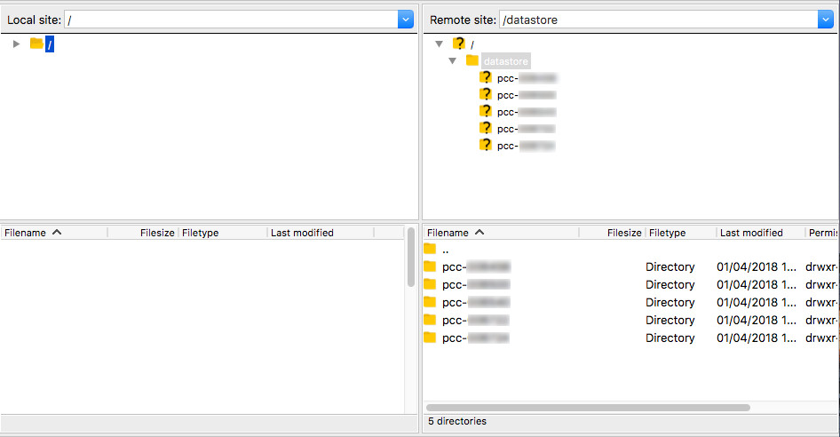
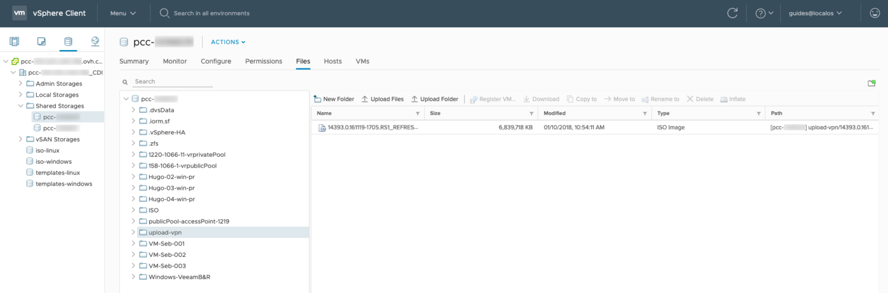

## Obiettivo

Accedere ai datastore via SFTP (Secure File Transfert Protocol) permette di aggiungere all’infrastruttura file locali di backup. È possibile connettersi a partire da un’interfaccia grafica utilizzando software come FileZilla, disponibile su Windows e Mac,  oppure tramite riga di comando su sistemi operativi Linux.

Questo metodo permette però di accedere esclusivamente alla cartella “upload-vpn” dei datastore: tutti i file non contenuti in questa directory non saranno quindi raggiungibili.

**Questa guida ti mostra come effettuare l’accesso in SFTP tramite interfaccia grafica o riga di comando.**

## Prerequisiti

- Essere contatto amministratore dell'infrastruttura [Hosted Private Cloud](https://www.ovhcloud.com/it/enterprise/products/hosted-private-cloud/) per ricevere le credenziali di accesso.
- Avere un utente attivo [creato nello Spazio Cliente OVHcloud](https://www.ovh.com/auth/?action=gotomanager&from=https://www.ovh.it/&ovhSubsidiary=it)

## Procedura

### Accedi tramite interfaccia grafica

Avvia il client FTP (nel nostro esempio, FileZilla) e inserisci questi parametri:

```
Host: [sftp://pcc-xxx-xxx-xxx-xxx.ovh.com] / Username: user / Password: password
```

{.thumbnail}

Una volta effettuato l’accesso, le cartelle locali saranno disponibili sulla sinistra e i datastore sulla destra:

{.thumbnail}

### Accedi da un’interfaccia a riga di comando

Avvia il terminale e verifica la corretta installazione del comando `sftp` scrivendo:

```sh
sftp
```

Il comando per effettuare l’accesso è il seguente:

```sh
sftp user@pcc-xxx-xxx-xxx-xxx.ovh.com
```

Verrà richiesto di inserire la password associata all’utente. Una volta connesso, è possibile ottenere la lista dei datastore eseguendo il comando `ls`:

```sh
sftp> ls pcc-000714
```

Esplora la lista dei datastore trovati con il comando precedente:

```sh
sftp> pcc-000714
```

Utilizza il comando `put` per esportare file dal datastore alle cartelle locali.

```sh
sftp> put /home/ubuntu-18.04-server-amd64.iso
/datastore/pcc-000714/ubuntu-18.04-server-amd64.iso  
```

Utilizza il comando `get` per importare file dalle cartelle locali al datastore.

```sh
sftp> get /datastore/pcc-00714/ubuntu-18.04-server-amd64.iso /home/
```

Il comando `exit` permette invece di terminare la sessione.

### Anteprima da vSphere

Dall’interfaccia vSphere è possibile visualizzare i contenuti di quanto inviato navigando nel datastore. Per effettuare questa operazione, clicca sul datastore in questione nella cartella “upload-vpn”:

{.thumbnail}

## Per saperne di più

Contatta la nostra Community di utenti all’indirizzo <https://community.ovh.com/en/>.
