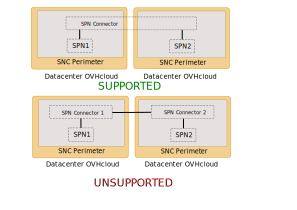

**Last updated 18th November, 2021**

## Objective

SPN Connector is the mecanism to assemble and inter-connect SPN of differents SecNumCloud zones and/or with VPN-SPN. This guide explains the concepts to understand its behavior.

## Instructions

### Basic rules

SPN can route trafic through SPN Connector:

* With another SPN in another Zone.
* With a VPN-SPN.
* NOT between two SPN of the same Zone.
* An SPN can not be connected to two SPN Connector.

{.thumbnail}

All routes are forwarded through SPN Connector, no ACL/filtering is possible.

### InterDC option

By default, SPN Connector can only inter-connect "local" SPN and VPN-SPN.

InterDC option: upgrade SPN Connector to "global" mode to allow connection between different zones.

{.thumbnail}

Inter-connection of two SPN connector (global or local) is not supported.

InterDC uses dedicated and secured optical lines using MACsec protocol.

{.thumbnail}

InterDC does not allow extension:

* of an SPN;
* of a VPN-SPN;
* of a Subnet.

Only forwarding of IP traffic (i.e routing) is supported through InterDC/SPN Connector.

## Go further

If you need training or technical assistance to implement our solutions, contact your sales representative or click on [this link](https://www.ovhcloud.com/en-gb/professional-services/) to get a quote and ask our Professional Services experts for assisting you on your specific use case of your project.

Join our community of users on <https://community.ovh.com/en/>.