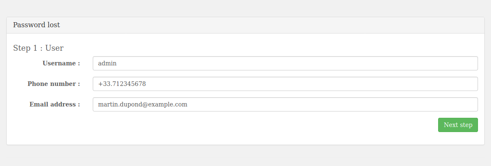
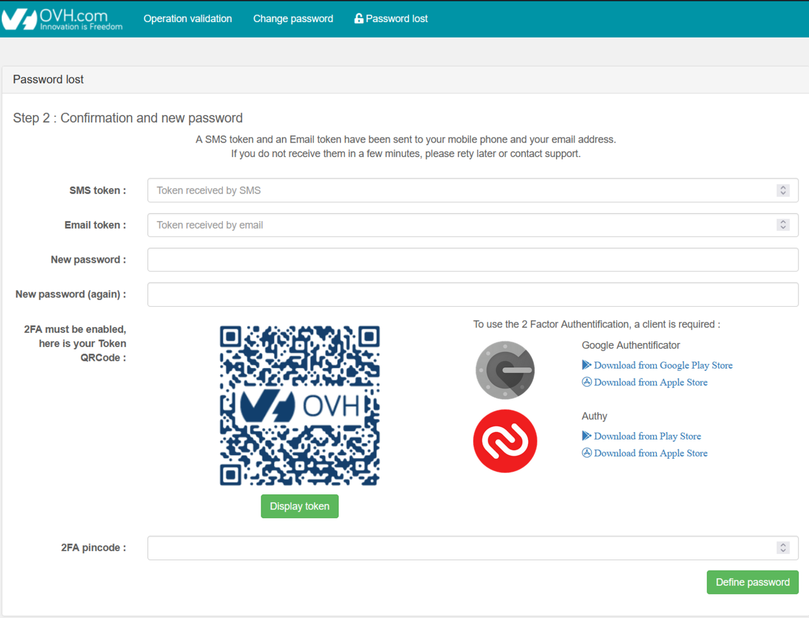

## Objective

Once your vSphere SecNumCloud environment is delivered, you need to configure access to it while maintaining the security level.

**This guide explains step by step what you need to do.**

## Requirements

- You must have a [Hosted Private Cloud SecNumCloud solution](https://www.ovhcloud.com/en-gb/hosted-private-cloud/vmware/){.external}.
- You must be logged in to the [OVHcloud Control Panel](/links/manager).
- You must be logged in to the [OVHcloud API](https://api.ovh.com/){.external}.
- You must have [created your OVHcloud API credentials](/pages/manage_and_operate/api/first-steps){.external}.

## Instructions

You have just received a delivery notification for your service.

This includes your login details, as in the example below:

```console
- IP address/name: pcc-192-0-2-1.ovh.com
- username: admin
- password: **********
```

You will note that there is no password in the email. You will define one at the end of step 2.

### Step 1 - Granting IP addresses to connect to the vCenter

For security reasons, the management interfaces are restricted by default.
You will need to authorize your private IP addresses (RFC1918) and public IP addresses to connect to vCenter.

The following guide will show you how to do this:

- [Authorize IPs to connect to vCenter](/pages/hosted_private_cloud/hosted_private_cloud_powered_by_vmware/autoriser_des_ip_a_se_connecter_au_vcenter)

### Step 2: Advanced security configuration

The following security measures are put in place when your service is delivered:

- All existing users of your Private Cloud will be disabled (during delivery, only the **admin** user is present)
- You will need to change the users' passwords so that they are re-enabled
- You will need to register for 2FA when changing users' passwords
- You will be able to change your users’ passwords only from the secure interface. You will no longer be able to do this via the OVHcloud Control Panel.

To do this, perform the following steps:

- The **admin** user must have up-to-date information and permission.
- In the `Users`{.action} tab, check that the phone number and email address have been correctly set for the **admin** user.
- The **admin** user must also have the '**token validator**' permission.
- If necessary, to modify the user, click the `...`{.action} button, then `Edit`{.action}.

Please refer to our [Introduction to the OVHcloud Hosted Private Cloud Control Panel](/pages/hosted_private_cloud/hosted_private_cloud_powered_by_vmware/manager_ovh_private_cloud) guide.

Access the service’s secure interface, e.g.: https://pcc-192-0-2-1.ovh.com/secure/ (be careful not to forget the final “/” of the address).

Click the `Password lost`{.action} button.

{.thumbnail}

A message indicates that you must be able to receive SMS messages to continue.
Click `start the process`{.action}.

{.thumbnail}

Enter the information requested for the **admin** account (it must be the same as the information previously added in the Control Panel) and click `Next step`{.action}.

{.thumbnail}

Within the interface, you will then need to:

- Enter the code received via SMS.
- Enter the code received by email.
- Enter a new password.
- Confirm it.
- Scan the QRcode with your preferred authentication application.
- Enter the code you have retrieved.

Finally, click the `Define password`{.action} button.

{.thumbnail}

Once the account has been activated and secured (2FA & password), you will need to confirm this account as a **token validator**. This way, you can validate sensitive operations on the infrastructure.

To do this, you will need to confirm that you want to continue with the operations via the following API call:

> [!api]
>
> @api {v1} /dedicatedCloud POST /dedicatedCloud/{serviceName}/securityOptions/resumePendingEnabling
>

By specifying:

- {serviceName}: the service name (e.g.: pcc-192-0-2-1)
- {option}: tokenValidation

You will then receive an SMS message to validate the **token validator** authorization on the phone number entered earlier.

Here is an example of an SMS sent:

```console
OVHcloud - Hosted Private Cloud - message for admin user.
The testTokenValidation (#1743283) operation on pcc-192-0-2-1 requires validation.
Operation Id: 1743283.
Confirmation token: 540427.
Validation interface: https://pcc-192-0-2-1.ovh.com/secure/operation-validation?task=1743283&token=540427
This token is valid for 15 minutes.
If you do not confirm this operation before it expires, it will be canceled and no action will be taken.
```

> [!warning]
>
> The token generated is only valid for 15 minutes.
> The next actions must be performed within this time limit, otherwise the task will be canceled once this time has elapsed.
>

The following guide will show you how to do this:

- [Validate an operation with a token](/pages/hosted_private_cloud/hosted_private_cloud_powered_by_vmware/interface-secure#confirm-an-operation-with-a-token)

At the end of this step, you will be able to log in to the vSphere interface and validate all sensitive operations on the infrastructure in the next steps.

### Step 3: Configure an IPSec VPN with NSX

You need to set up a VPN to allow you to connect via the internet to the private networks in your SecNumCloud environment.

The following guide will show you how to do this:

- [Setting up an IPsec tunnel with NSX](/pages/hosted_private_cloud/hosted_private_cloud_powered_by_vmware/nsx-12-configure-ipsec)

### Step 4: Enable the private gateway

We will now switch the vSphere management interface to one of the SecNumCloud environment’s private networks.

Once this step is complete, you can only connect to vCenter and the vSphere APIs via the private network in the SecNumCloud environment in which the Private Gateway has been deployed.

The following guide will show you how to do this:

- [Enable Private Gateway](/pages/hosted_private_cloud/hosted_private_cloud_powered_by_vmware/private_gateway)

### Step 5: Set up the KMS for encryption

Next, we will set up encryption for the virtual machines that will be hosted.

The prerequisite is to have a KMS compatible with the VMware vSphere solution.

Configure the KMS (VNKP) in vSphere using the following guide:

- [Enabling VM Encryption](/pages/hosted_private_cloud/hosted_private_cloud_powered_by_vmware/vm_encrypt)

### Step 6: Verify SecNumCloud compliance

Once you have completed the steps to secure the infrastructure, you will need to finalize the SecNumCloud activation.

To do this, you will need to launch the operation via the following API call:

> [!api]
>
> @api {v1} /dedicatedCloud POST /dedicatedCloud/{serviceName}/securityOptions/resumePendingEnabling
>

By specifying:

- {serviceName}: the service name (e.g.: pcc-192-0-2-1)
- {option}: snc

Return (truncated):

```json
{
    "taskId": 4091062,
    "name": "enableSecurityOption",
    "progress": 0,
    "state": "todo"
}
```

You will get a task that you can track using its **taskId** via the following API call:

> [!api]
>
> @api {v1} /dedicatedCloud GET /dedicatedCloud/{serviceName}/task/{taskId}
>

By specifying:

- {serviceName}: the service name (e.g.: pcc-192-0-2-1)
- {taskId}: the task number (example: 4091062)

Once it is complete, you can check that there is no action left to do via the following API call:

> [!api]
>
> @api {v1} /dedicatedCloud GET /dedicatedCloud/{serviceName}/securityOptions/pendingOptions
>

An empty list in return, as below, confirms that all actions have been performed on the environment and that it is fully operational:

```console
[ ]
```

## Go further

[Our SecNumCloud Connectivity guides](/products/network)

Join our community of users on <https://community.ovh.com/en/>.
