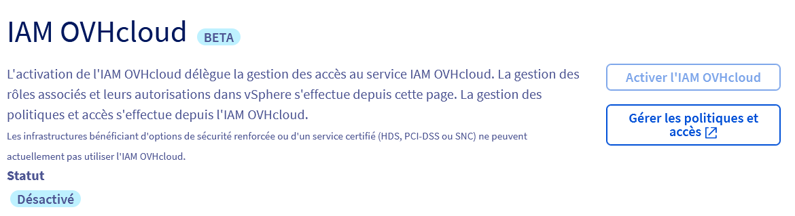
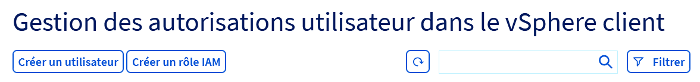
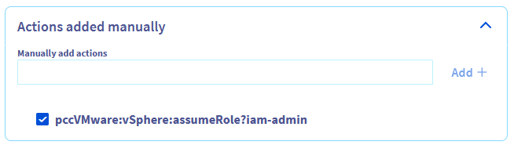
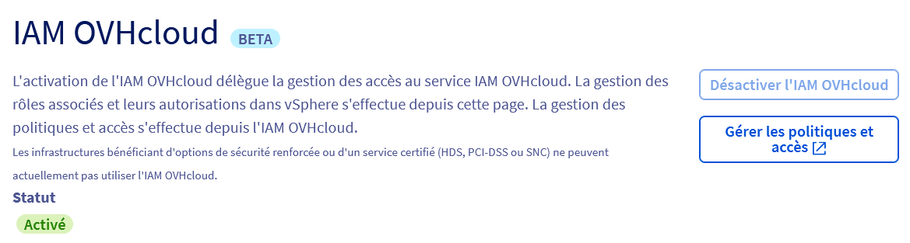

## Objectif

Ce guide vous permettra de connecter votre vSphere avec l'IAM OVHcloud.

Cela vous permettra :

- de vous connecter sur votre vSphere en utilisant un compte OVHcloud ;
- de gérer les niveaux de droits de vos utilisateurs aux travers des politiques IAM.

## Prérequis

- Disposer d'un [compte OVHcloud](/pages/account_and_service_management/account_information/ovhcloud-account-creation)
- Savoir [gérer les utilisateurs du compte](/pages/account_and_service_management/account_information/ovhcloud-users-management)
- Savoir [comment configurer des stratégies pour IAM](/pages/account_and_service_management/account_information/iam-policy-ui)

## En pratique

L'activation de l'IAM OVHcloud ne désactive pas vos utilisateurs Hosted Private Cloud existants, vous pourrez toujours les utiliser pour vous connecter directement aux différents éléments de votre Hosted Private Cloud, sans passer par l'IAM.

L'IAM d'OVHcloud n'est pas disponible sur les environnements disposant des options de sécurité avancée et de certifications (PCI-DSS, HDS, HIPAA, SNC).

### Activer l'IAM sur votre serveur

#### Via l'espace client

Dans le menu de gestion des utilisateur de votre environnment Hosted Private cloud, cliquer sur `Activer l'IAM OVHcloud`{.action}.

{.thumbnail}

Cette opération pourra prendre jusqu’à 30 minutes.

#### Via l'API

Vous pouvez activer l'option IAM sur votre Hosted Private Cloud depuis l'API OVHcloud. Exécutez l'appel suivant :

> [!api]
>
> @api {v1} /dedicatedCloud POST /dedicatedCloud/{serviceName}/iam/enable
>

Cette opération pourra prendre jusqu’à 30 minutes.

### Créer des rôles IAM

Une fois l'option activée, des rôles IAM sont créés par défaut et sont utilisable dans les politiques d'accès de l'IAM OVHcloud.

La gestion des permissions de vSphere de chaque rôle IAM s'effectue comme pour n'importe quel autre utilisateur de votre Hosted Private Cloud, via l'API ou dans l'[espace client OVHcloud](/pages/hosted_private_cloud/hosted_private_cloud_powered_by_vmware/change_users_rights)

#### Via l'espace client

Sur le menu de gestion des utilisateurs, cliquer sur "Créer un role IAM"

{.thumbnail}

Les rôles IAM sont préfixés par "iam-"

#### Via l'API
Vous pourrez créer vous même de nouveaux rôles en exécutant l'appel suivant : 

> [!api]
>
> @api {v1} /dedicatedCloud POST /dedicatedCloud/{serviceName}/iam/addRole
>

### Utilisation des politiques IAM

La création des policies IAM s'effectue depuis l'[IAM OVHcloud](/pages/account_and_service_management/account_information/iam-policy-ui). 

Chaque rôle IAM de votre Hosted Private Cloud correspond à une action IAM s'écrivant sous la forme "pccVMware:vSphere:assumeRole?**nom du role**".

Par exemple, pour le rôle **iam-admin**, l'action est "pccVMware:vSphere:assumeRole?**iam-admin**".

Cette action doit être indiquée dans la partie « Actions ajoutées manuellement » de la création de politique.

{.thumbnail}

### Désactiver l'IAM sur votre serveur

Il est possible de désactiver l'IAM d'OVHcloud sur votre Hosted Private Cloud

#### Via l'espace client

Dans le menu de gestion des utilisateur de votre environnment Hosted Private cloud, cliquer sur `Désactiver l'IAM OVHcloud`{.action}.

{.thumbnail}

#### Via l'API

Exécutez l'appel suivant pour désactiver la connexion avec l'IAM OVHcloud :

> [!api]
>
> @api {v1} /dedicatedCloud POST /dedicatedCloud/{serviceName}/iam/disable
>

## Aller plus loin

Échangez avec notre communauté d’utilisateurs sur <https://community.ovh.com/>.
