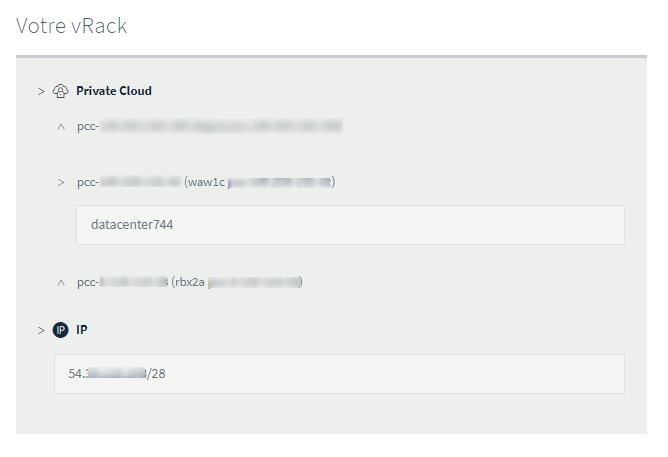

## Objective

The OVHcloud vRack feature makes it possible to connect different cloud services with each other, within one or more secure private networks (VLANs).

**This guide explains how to set this up with a Hosted Private Cloud infrastructure.**

## Requirements

- A [vRack](https://www.ovh.com/world/solutions/vrack/) service in your account or order one if needed
- Being an administrative contact of your [Hosted Private Cloud infrastructure](https://www.ovhcloud.com/en/enterprise/products/hosted-private-cloud/) to receive login credentials
- A user account with access to vSphere (created in the [OVHcloud Control Panel](https://ca.ovh.com/auth/?action=gotomanager&from=https://www.ovh.com/world/&ovhSubsidiary=we))

## Instructions

### OVHcloud Control Panel

After your [Hosted Private Cloud infrastructure](https://www.ovhcloud.com/en/enterprise/products/hosted-private-cloud/) is delivered, it will be displayed in the `vRack`{.action} section in your [OVHcloud Control Panel](https://ca.ovh.com/auth/?action=gotomanager&from=https://www.ovh.com/world/&ovhSubsidiary=we).

To access it, go to the `Bare Metal Cloud`{.action} section, click on `Network`{.action}, then on `vRack`{.action}. Select your vRack from the list and the "datacenter" will be automatically included into a vRack.

{.thumbnail}

You can move the "datacenter" of your Private Cloud to another vRack by selecting it and clicking on the `Move`{.action} button.

### vSphere client

In the vSphere client, you can find vRack-capable VLANs in the `Networks` section, located in the *vrack* folder.

> [!success]
>
> By default, OVHcloud delivers an infrastructure with 11 VLANs included (VLAN10 to VLAN20).
>

{.thumbnail}

You can change their settings or create them again by following [this guide](/pages/hosted_private_cloud/hosted_private_cloud_powered_by_vmware/creation_vlan).

You can then assign these *Distributed Port Groups* to the network interfaces of your virtual machines.

## Go further

Join our community of users on <https://community.ovh.com/en/>.
