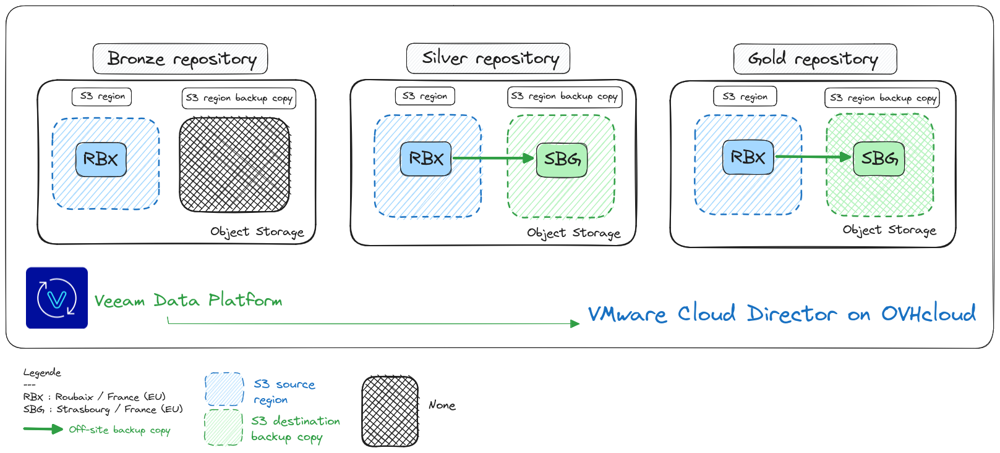

## Objective

**This guide will show you how to back up and restore with the Veeam Plug-in for VMware vCloud Director managed on OVHcloud.**

## Requirements

- An administrator vCloud Director account with a VCD Organization.
- A user with the Organization Administrator role to connect to the Veeam Data Platform Self-Service Portal (the new admin user in a virtual datacentre has the default role).
- You need to have read the VCD guides:
    - [VCD Basic concepts](/pages/hosted_private_cloud/hosted_private_cloud_powered_by_vmware/vcd-get-concepts)
    - [How to log in to your organization](/pages/hosted_private_cloud/hosted_private_cloud_powered_by_vmware/vcd-logging)
    - [How to use the VCD user interface](/pages/hosted_private_cloud/hosted_private_cloud_powered_by_vmware/vcd-getting-started)
- You must be familiar with how Veeam Backup works. 
- An understanding of the financial impact following the various load factors that apply when setting up this solution with VCD (see the [pricing grid for Veeam vCD on OVHcloud backups](/links/hosted-private-cloud/veeam-managed-backup).

## Instructions

Veeam Data Platform supports VCD. It uses the VMware Cloud Director API to back up the vApps and VMs and restore them directly in the VMware Cloud Director hierarchy.

The Veeam Data Platform service is available and ready to use for all 3 OVHcloud solutions (see the [features catalog](/pages/hosted_private_cloud/hosted_private_cloud_powered_by_vmware/vcd-get-concepts#key-features).

> [!warning]
>
> For the image processing and guest file system indexing options (compatible with the Veeam application) to work with Windows® virtual machines, the latest VMware tools must be installed. Linux VMs do not support application recognition or guest file system indexing.
>
> If you are using application-aware image processing for MS SQL or Oracle database backups, application-aware and item recovery options will not be supported. A full restore of the virtual machine must be performed, this implies a downtime window for all database users. You cannot manually restart an immutable backup failure. You must run an active full backup or wait for the next scheduled backup to run (see [Veeam documentation for more information](https://helpcenter.veeam.com/docs/backup/vsphere/vcloud_manage_backup.html?ver=120)).
>

### Step 1 - Backup with Veeam Data Platform

The **Veeam Data Platform** service has a VCD plugin to back up VMs and vApps from any Virtual Data Center (VDC) in the organization. It is available at the organization level for any VMware Cloud Director user with the organization administrator role.

/// details | Access the Veeam Data Platform administration console

When using VCD Data Protection integration with Veeam to create backup jobs, you can choose any VM instance from any virtual datacentre in the organization.

To access the Data Protection Portal with Veeam from Cloud Director, log in to the VCD Client Portal with a vCloud Director account with the appropriate rights.

In the menu of the top center bar, click `More`{.action} and select `Data Protection with Veeam`{.action}

{.thumbnail}

The Veeam VCD Plugin window will open with a grey/black headband.

{.thumbnail}

#### Repository

By default, you have the following repositories:

- **Bronze Repository**: This repository is based on the [OVHcloud Object Storage Standard](/links/public-cloud/object-storage) class. We will be using a bucket closer to your VCD environment.
- **Silver Repository**: This repository is based on the [OVHcloud Object Storage Standard](/links/public-cloud/object-storage) class. We will be using a Veeam SOBR (Scale-out Backup Repository) with performance tier buckets closer to your VCD environment, and a capacity tier from buckets in another OVHcloud region. We also use the Veeam SOBR copy mode to add the backups from the "performance extents" to the "capacity extents" as soon as they're created.
- **Gold Repository**: This repository is based on the [OVHcloud Object Storage High performance](/links/public-cloud/object-storage) class. This repository includes the previous options + OVHcloud Object Storage "High performance".

From the OVHcloud Control Panel, you can activate the `Gold Repository`.

All these repositories have a storage quota of 100 TB. You can reach out to the [support teams](https://help.ovhcloud.com/csm?id=csm_get_help) to increase this quota.

You can find ir an exemple of the primary and destination site used for off-site Veeam VCD backup copy (for the **Advanced/Premium** offers):

{.thumbnail}

- `Bronze Repository`: Roubaix (Europe)
- `Silver Repository`: Roubaix -> Strasbourg (Europe)
- `Gold Repository`: Roubaix -> Strasbourg (Europe)

No off-site backups copy are taken with the **Bronze** repository configuration.

You can find the zone matching in detail for all OVHcloud managed Veeam Data platform solutions:

|   Repository    |      Source       |    Destination     |   Offre cible    |
|:---------------:|:-----------------:|:------------------:|:----------------:|
|     Bronze      |   Roubaix (fr)    |        None        |     Classic      |
|     Bronze      |   Limburg (de)    |        None        |     Classic      |
|     Bronze      |    Warsaw (pl)    |        None        |     Classic      |
|     Bronze      |    Erith (uk)     |        None        |     Classic      |
|     Bronze      |  Strasbourg (fr)  |        None        |     Classic      |
|     Bronze      | Beauharnois (ca)  |        None        |     Classic      |
|     Silver      |   Roubaix (fr)    |  Strasbourg (fr)   | Advanced/Premium |
|     Silver      |   Limburg (de)    |  Strasbourg (fr)   | Advanced/Premium |
|     Silver      |    Warsaw (pl)    |    Limburg (de)    | Advanced/Premium |
|     Silver      |    Erith (uk)     |    Limburg (de)    | Advanced/Premium |
|     Silver      |  Strasbourg (fr)  |    Roubaix (fr)    | Advanced/Premium |
|     Silver      | Beauharnois (ca)  |   Cambridge (ca)   | Advanced/Premium |
|      Gold       |   Roubaix (fr)    |  Strasbourg (fr)   | Advanced/Premium |
|      Gold       |   Limburg (de)    |  Strasbourg (fr)   | Advanced/Premium |
|      Gold       |   Limburg (de)    |    Roubaix (fr)    | Advanced/Premium |
|      Gold       |    Erith (uk)     |    Limburg (de)    | Advanced/Premium |
|      Gold       |  Strasbourg (fr)  |    Roubaix (fr)    | Advanced/Premium |
|      Gold       | Beauharnois (ca)  | Cambridge/Tor (ca) | Advanced/Premium |

- **Data included in backups:**

When Veeam Backup & Replication performs backups of vApp and VMs, it also captures vApp metadata.

The metadata for virtual applications (vApp) and VMs includes:

- General information on the **vApps** (virtual applications) where the VMs reside, such as: **Name of the vApps**, **descriptions**, **description of the VMs**.
- Information on the **vApp** networks and the organizational networks to which the vApp is connected.
- The startup options of the **VM** (VM Startup options).
- User information.
- Lease.
- The quota.
- Storage templates.

The vApp/VM metadata is stored with the virtual machine content. Capturing vApp/VM metadata is important for recovery: without it, you will not be able to restore vApps and VMs to VMware Cloud Director.

- **Backup jobs:**

Backup jobs require 4 default settings:

1. Job parameters: Name / Deposit or Quota (Bronze/Silver/Gold: 100GB) / Description / Retention (Days/Restore point)
2. Virtual machines (VMs): Add or exclude virtual machines/vApp/vCloud Organization
3. Guest Processing: Application-aware processing / Guest file system indexing / Guest operating system credentials
4. Email notifications: Enabling email notifications

For virtual machines managed by VMware Cloud Director, Veeam Backup & Replication offers a special type of backup job: VMware Cloud Director backup jobs. VMware Cloud Director backup jobs process VMware Cloud Director objects, ensure their proper recovery, and support Cloud Director specific features.

- **How do I create a backup job with the Veeam Data Platform?**

You are about to create your first backup job using the Veeam Data Platform VCD plugin:

In the Veeam VCD console, click `More`{.action} and select `Data Protection with Veeam`{.action}

{.thumbnail}

Click `Jobs`{.action} then `Create`{.action}

{.thumbnail}

In the window that opens, specify the backup job name, description, and retention policy. Once you have defined the elements (Job name, description, retention), click `Next`{.action}.

{.thumbnail}

You then need to choose your virtual machine (VM). To do this, click `Add`{.action}.

{.thumbnail}

You can drill down into your VMware Cloud Director organization and select your VM.

Click `Next`{.action}.

{.thumbnail}

Your virtual machine will then appear in the list.

Click `Next.`{.action}

{.thumbnail}

> [!warning]
>
> The next step is vital, as it involves adding the *credentials* required for your VM.
> If you use the "Guest OS processing" settings, you must add your backup user ID and password according to your OS type.
>
> If you have SSH keys to add for Linux, you can do so.
>
> For Windows you can choose a standard account or a managed service account.

Click `Next`{.action}

{.thumbnail}

If necessary, you can add monitoring options for your backup tasks. Finally, click `Finish`{.action}.

{.thumbnail}

The backup job is listed.

### VM backup

**How do I back up a virtual machine with Veeam?**

> [!primary]
>
> No agent is required for Veeam Data Platform backups to work from a virtual machine or vApp.
>

> [!warning]
> To add a backup job from a VM (... action -> ... Add a task to Veeam), it must be created beforehand.
>

In the VMware Cloud Director console, click `Datacenter`{.action} , then `Virtual machines`{.action}.

Choose a VM. Click `Actions`{.action}, then `Data Protection with Veeam`{.action} and finally `Add a task to Veeam`{.action}.

{.thumbnail}

///

### Step 2 - Restore with Veeam Data Platform

/// details | How do I restore a VM?

Veeam Backup has several restore features:

- Application Awareness
- The strategy per VM (Policies)

**Data included in restores:**

Veeam Backup & Replication enables full recovery of VMs to VMware Cloud Director. You can restore separate VMs to vApps, as well as VM data.

Restore options include:

- Full restore for vApps and VMs: **Full restore for vApps and VMs**
- Restoration of VM disks: **VM files**
- Restoration of VM files: **VM disks**

In this case, perform a **Full (full/full)** restore.

#### Restoration of a VM

**Full restoration of a VM (virtual machine):**

With the OVHcloud Managed Backup service, you can restore standard VMs that are part of vApps, and standalone VMs that have been created in your OVHcloud VMware Cloud Director portal.

When you restore normal or standalone VMs in the vCloud Director hierarchy, the restoration process includes the following steps:

- Veeam uses the captured vApp metadata to define the vApp settings and the original location of the virtual machine in the VMware Cloud Director hierarchy.
- Veeam restores the VMs in the backup file to their original location or to another location. In addition, Veeam restores all VM settings.

**How do I restore a VM using the Veeam Data Platform VCD plugin?**

To perform a full restore, click `Entire VM Restore`{.action}

{.thumbnail}

In the window that pops up, click `Restore to the original location`{.action} to restore a full VM.

Then click `Next.`{.action}.

{.thumbnail}

In the final step, click `Finish`{.action}. If you wish, you can also launch the VM by ticking the `Power on VM automatically`{.action} box.

{.thumbnail}

This process is simplified with VCD, Veeam and OVHcloud.

**How do I restore a file using the Veeam Data Platform VCD plugin?**

- **File level restore**: This option is not yet available.

///

## Go further

If you need training or technical assistance to implement our solutions, contact your sales representative or click on [this link](/links/professional-services) to get a quote and ask our Professional Services experts for a custom analysis of your project.

Join our [community of users](/links/community).
