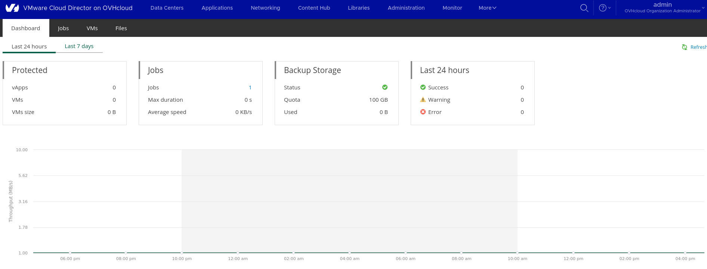

## Objectif

Le service Veeam Backup Data Protection est disponible et prêt à l'emploi dans les 3 offres OVH ([voir catalogues des fonctionnalitées](https://help.ovhcloud.com/csm/en-ie-vmware-vcd-concepts?id=kb_article_view&sysparm_article=KB0062559#features-of-vmware-cloud-director-at-ovhcloud)). Ce service s’intègre de manière transparente en tant que solution gérée pour aider votre entreprise à atteindre une haute disponibilité et fournit des points de récupération pour vos applications et vos données. En utilisant ce service, vous contrôlez la sauvegarde de toutes les machines virtuelles (VM) et vApp de votre infrastructure directement depuis la console VCD Veeam Data Protection.

### VCD / Veeam Backup compatibility

La version utilisé de Veeam Backup avec l'offre OVH est la `10.5` et doit être donc au minimum la `12.1` de Veeam Backup.

| VCD version |   Veeam version |
|-------------|:-:   
| 10.5.x 	    | 12.1 (build 12.1.0.2131)
| 10.4.x      | 12 (build 12.0.0.1420)
| 10.3.x      | 11a P20220302 (build 11.0.1.1261 P20220302)
| 10.2.x 	    | 11 (build 11.0.0.837)
| 10.1.2      | Unsupported due to a VMware-side bug.
| 10.1 	      | 10a (build 10.0.1.4854)

## Prérequis
- Un compte Vcloud Director administrateur
- Une Organisation VCD
- Un utilisateur avec le rôle Administrateur de l'organisation pour vous connecter au portail libre-service Veeam Data Protection. L'utilisateur admin d'un datacenter virtuel nouvellement configuré a le rôle par défaut.

Pour en savoir plus sur l'offre de sauvegarde avec Veeam avec OVH pour pouvez accéder à ce lien de la documentation officiel OVH ["Activer et utiliser Veeam Managed Backup"](Activer et utiliser Veeam Managed Backup)
S i vous ne savez pas comment vous connecter à la console d'administration Vcloud Director OVH je vous invite à lire ces documentations : 
- [VCD - Se connecter à son organisation](https://help.ovhcloud.com/csm/fr-vmware-vcd-logging-change-password?id=kb_article_view&sysparm_article=KB0062737)
- [VCD - Découvrez comment utiliser l'interface utilisateur de VCD](https://help.ovhcloud.com/csm/fr-vmware-vcd-getting-started-dashboard-overview?id=kb_article_view&sysparm_article=KB0062580)
- [VCD - Les concepts fondamentaux de VCD](https://help.ovhcloud.com/csm/fr-vmware-vcd-concepts?id=kb_article_view&sysparm_article=KB0062577)
## En pratique
[!primary] Si vous ne savez comment vous connecter au portail web de votre organisation, consultez d'abord ce guide.

### Limitation
> [!WARNING]
> 
> Pour que les options de traitement d'image et d'indexation du système de fichiers invité compatibles avec l'application Veeam fonctionnent pour les machines virtuelles Windows®, les outils VMware les plus récents doivent être installés sur les machines virtuelles. Les machines virtuelles Linux ne prennent pas en charge la reconnaissance des applications ou l'indexation du système de fichiers invité. 
> 
> Si vous utilisez le traitement d'images prenant en charge les applications pour les sauvegardes de base de données MS SQL ou Oracle, les options prenant en charge les applications et Restauration d'éléments ne sont pas prises en charge. L'opération de restauration doit effectuer une restauration complète de la machine virtuelle, ce qui nécessite une fenêtre de temps d'arrêt pour tous les utilisateurs de la base de données. Impossible de retenter manuellement un échec de sauvegarde immuable. Vous devez exécuter la sauvegarde complète active ou attendre l'exécution de la prochaine sauvegarde planifiée ([pour en savoir plus](https://helpcenter.veeam.com/docs/backup/vsphere/vcloud_manage_backup.html?ver=120)).

### Étape 1

###  Accéder à la console d'administration Veeam Backup Data Protection

Le service Veeam Backup Data Protection dispose d’une visibilité pour sauvegarder des machines virtuelles et des vApp à partir de n’importe quel Virtual Data Center (VDC) de l’organisation. Il est disponible au niveau de l'organisation pour tout utilisateur VMware Cloud Director ayant le rôle d'administrateur de l'organisation.

Lorsque vous utilisez l'intégration Veeam Data Protection VCD pour créer des tâches de sauvegarde, vous pouvez choisir n'importe quelle instance de machine virtuelle à partir de n'importe quel datacenter virtuel de l'organisation.

Pour accéder au portail Veeam Data Protection, cliquez sur `More -> Veeam Backup Data Protection` dans le volet de navigation du haut de la console administration (voir ci-dessous) :

{.thumbnail .h-600 .w-400} 

{.thumbnail .h-600 .w-400}

### Étape 2

### Comment sauvegarder une machine virtuelle avec Veeam Backup

> [!primary]
>
> Aucun agent n'est necessaire au fonctionnement des sauvegarde avec Veeam Backup Data Protection depuis une machine virtuelle ou une vApp.
>

Dans la console Vcloud Director, cliquez sur `Data Centers -> Virtual Machines`, choisissez une VM et cliquez sur `Action -> Data Protection with Veeam -> add to Veeam backup Job`(voir capture).

{.thumbnail .h-600 .w-400}

### Étape 3

Veam Backup dispose de plusieurs type restauration possible :

1. "Instant recovery"
2. "Entire VM Restore"
3. "Restore vApp"

Dans le cas actuel nous ferons une restauration de type "Full" (entière/complete).

### Comment restorer une VM avec Veeam Backup

#### Restauration "Full" d'une VM (machine virtuelle)

- Etape 1 : 

- {.thumbnail .h-600 .w-400}

- Etape 2 : 

- {.thumbnail .h-600 .w-400}

- Etape 3 : 

- {.thumbnail .h-600 .w-400}

## Aller plus loin

Échangez avec notre communauté d'utilisateurs sur <https://community.ovh.com/>.