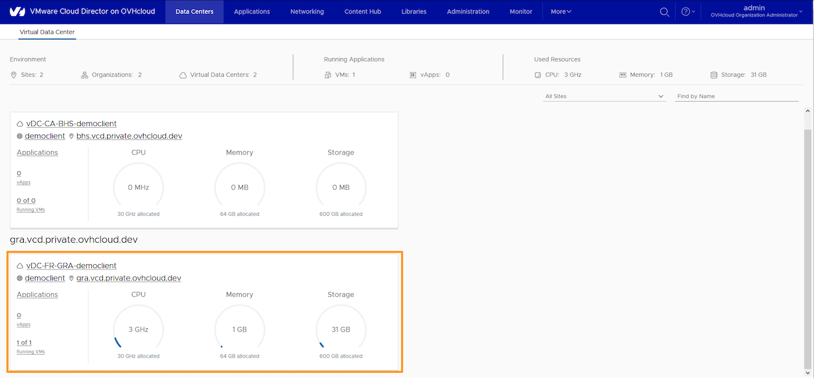
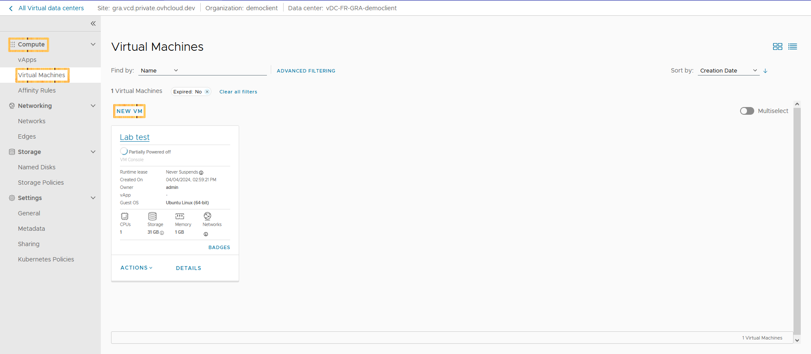
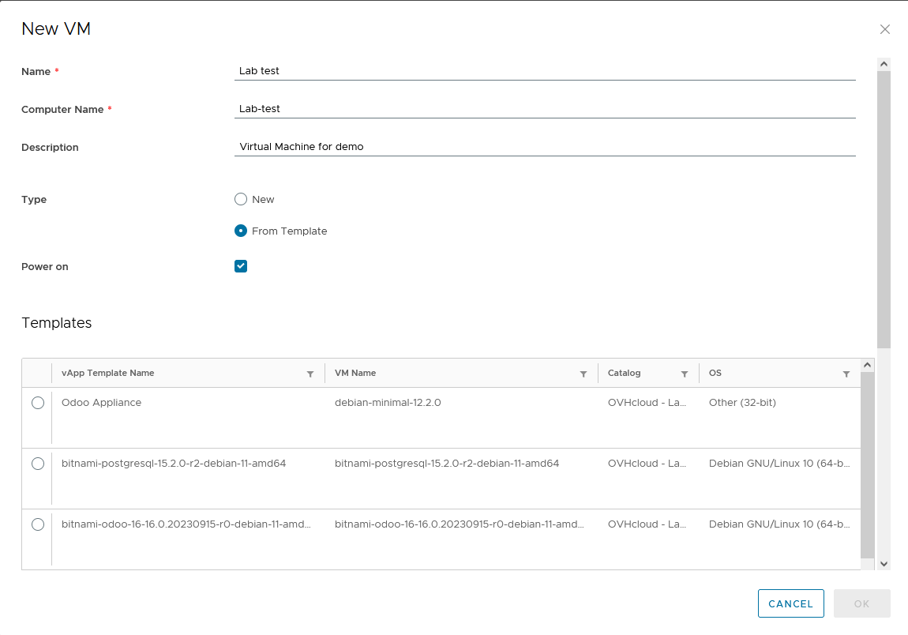
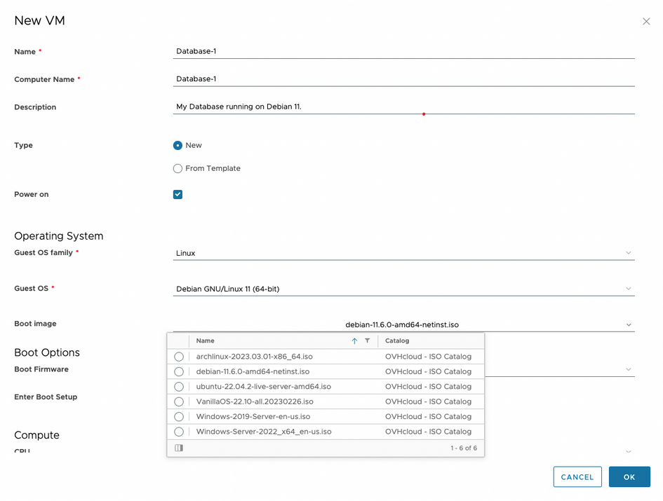
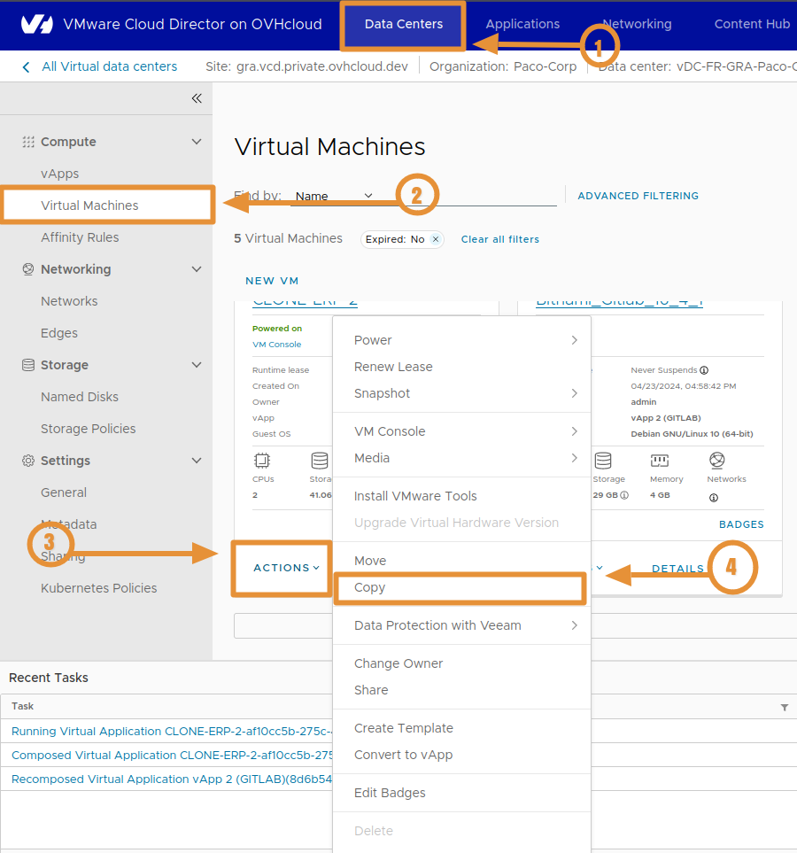
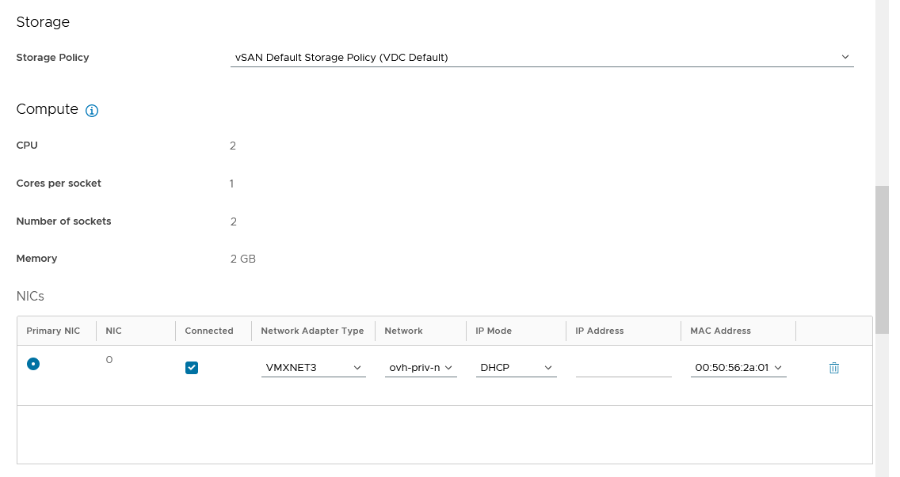
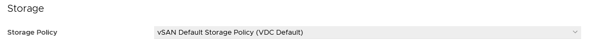
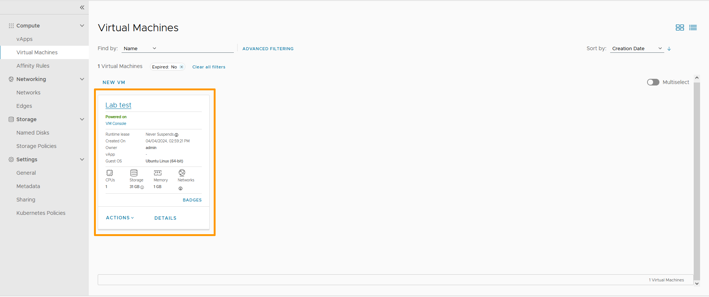

## Objectif

Ce guide vous détaille comment créer votre première machine virtuelle (VM) de deux méthodes :

- Création d'une machine virtuelle à partir d'un ISO
- Création d'une machine virtuelle grâce à un template

## Prérequis

- Avoir un VMware Cloud Director
- Un ISO d'un systeme d'exploitation

## En pratique

### Création d'une machine virtuelle

> [!warning]
> 
> Vous pouvez consulter le guide suivant pour connaitre les limitations VCD : [VMware Cloud Director - Les concepts fondamentaux de VCD](/pages/hosted_private_cloud/hosted_private_cloud_powered_by_vmware/vcd-get-concepts).
>

Pour créer votre machine virtuelle, accédez d'abord au datacenter où vous prévoyez de la déployer. Ensuite, naviguez vers la section `Calculer`{.action} > `Machines Virtuelles`{.action} > `Nouvelle VM`{.action}.

{.thumbnail}

{.thumbnail}

**Cliquez sur les onglets ci-dessous.**

> [!tabs]
> **À partir d'un Modèle**
>> Qu’est-ce qu’un **Modèle** (*Template*) ? Un modèle (*template*) est une machine virtuelle préconfigurée qui est utilisée pour en créer de nouvelles. Les quantités de mémoire, de vCPU, de cartes réseau (NIC) et d'espace de stockage sont déjà définis et ne peuvent pas être modifiés pendant le déploiement. Ne vous inquiétez pas, vous pourrez le modifier une fois le processus de déploiement terminé. Il s'agit d'un déploiement OVA basique.
>> Retournons à la création de notre machine virtuelle. Remplissez les champs requis, puis assurez-vous de sélectionner l'option `Type` sur `From Template`. Vous verrez alors un menu déroulant des différents modèles disponibles.  
>> {.thumbnail} 
>> Les templates disponibles ici font partie du catalogue OVHcloud pré-provisionné et peuvent être utilisés selon vos besoins. Nous fournissons de nombreuses et différentes distributions Linux avec et sans applications déjà installées. Nous avons également importé quelques modèles du [catalogue Bitnami](https://bitnami.com/stacks/virtual-machine). 
>> Dans la section `Propriétés personnalisées`, vous avez la possibilité de personnaliser différentes propriétés de votre machine virtuelle, telles qu'un utilisateur spécifique, le nom de domaine, son adresse IP et bien d'autres propriétés.
> **À partir d'un Nouveau**
>> Comme pour la création depuis un modèle (*template*), complétez les champs requis. Cependant, pour l'option `Type`, sélectionnez `Nouveau`.
>> Dans la section `Charger image`, vous retrouverez des ISO préconfigurés qui vous sont fournis.  
>> {.thumbnail} 
>> La section `Calculer` vous permet de configurer la quantité de vCPU et de mémoire souhaitée pour cette machine virtuelle.
> **À partir d'un Clone**
>> Qu’est-ce qu’un **Clone** ? Un Clone est une copie d'une machine virtuelle. Dans le cas d'une VM, les réglages disque associés à la machine utilisée. Il faut lancer la copie depuis la VM : cliquez sur `Applications` > `VM` > `Actions` > `Copier`, dans la section "Applications".
>> Attention, une vApp doit toujours être ajoutée sur VDC. Suivez le menu déroulant des différents réglages disponibles comme pour une creation de VM.  
>> {.thumbnail} 

Pour la section NIC, vous avez la possibilité de choisir le type de carte réseau en fonction de vos besoins. Le type par défaut (VMXNET3) est souvent un bon choix si vous n'avez pas d'exigences particulières.

En ce qui concerne la sélection du réseau, vous trouverez tous les réseaux disponibles dans votre organisation. Dans notre exemple, nous utiliserons `ovh-net-priv`, un réseau que nous avons préalablement créé pour vous. Nous avons activé un service DHCP sur ce réseau et l'avons configuré avec le sous-réseau `192.168.0.0/24`.

{.thumbnail}

La liste déroulante **« Mode IP »** vous propose différents modes d'attribution d'IP :

- **DHCP** : utilisez le serveur DHCP (votre VM doit gérer le DHCP même si vous le sélectionnez).
- **Statique (Pools IP)** : sélectionnez une IP dans le pool IP du réseau.
- **Statique (Manuel)** : vous devez définir l'IP manuellement.

> [!warning]
> Attention, ce mode IP vous permet uniquement d'organiser votre inventaire VCD mais vous devrez tout de même configurer l'adresse IP statique (ou DHCP) à l'intérieur même de la VM.
>

En ce qui concerne la section `Stratégies de stockage`{.action}, vous ne trouverez qu'une seule possibilité : la politique de stockage par défaut de vSAN.

Vous pouvez également ajouter des disques virtuels dans cette section si vous en avez besoin de plusieurs.

{.thumbnail}

Pour conclure, veuillez examiner toutes les informations fournies pour vous assurer de leur exactitude. Cliquez ensuite sur `OK`{.action} pour lancer le déploiement de la machine virtuelle. Une fois le déploiement terminé, vous verrez la nouvelle VM répertoriée dans le centre de données virtuel sélectionné.

{.thumbnail}

Si vous avez utilisé la méthode **From scratch** il ne vous reste plus qu'à allumer votre serveur et lancer l'installation de votre OS.

> **Création d'une machine virtuelle en images :**
>
> {.thumbnail}

## Aller plus loin

Si vous avez besoin d'une formation ou d'une assistance technique pour la mise en oeuvre de nos solutions, contactez votre commercial ou cliquez sur [ce lien](https://www.ovhcloud.com/fr/professional-services/) pour obtenir un devis et demander une analyse personnalisée de votre projet à nos experts de l’équipe Professional Services.

Échangez avec notre communauté d'utilisateurs sur <https://community.ovh.com>.