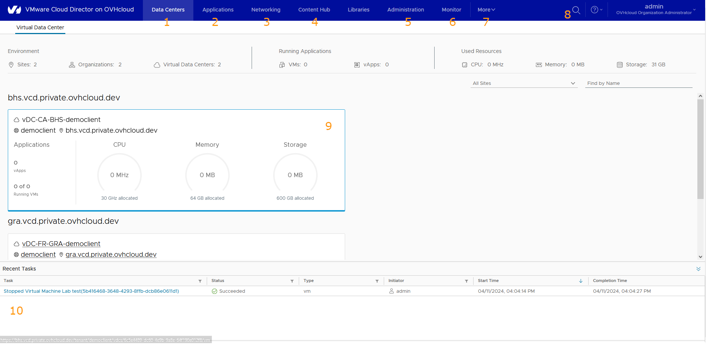
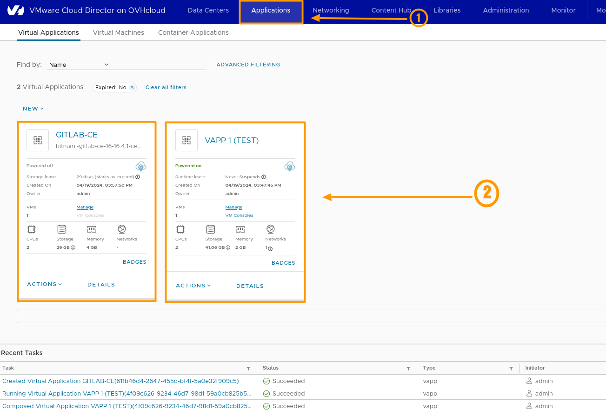
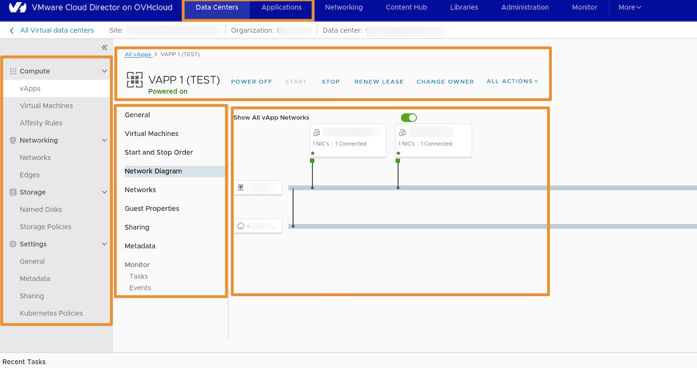
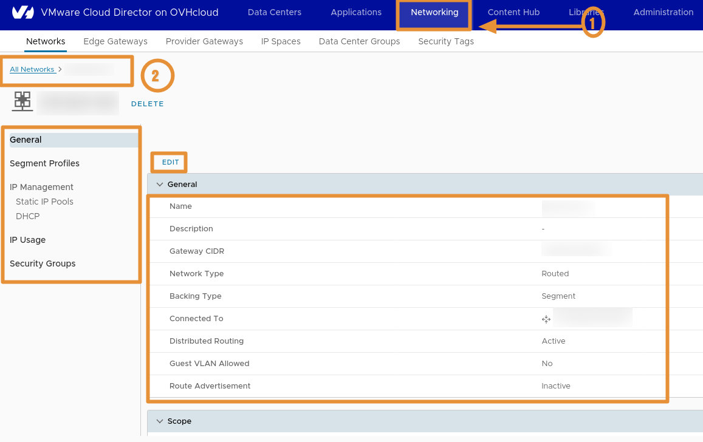
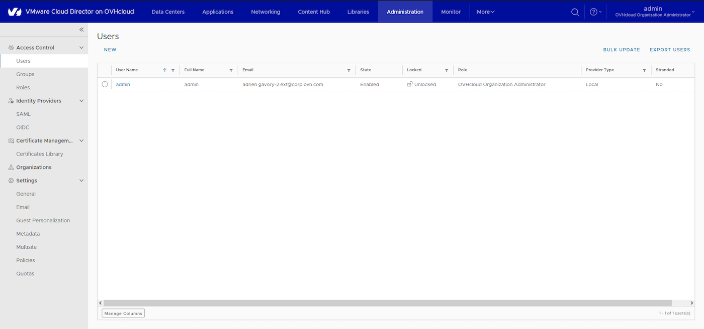
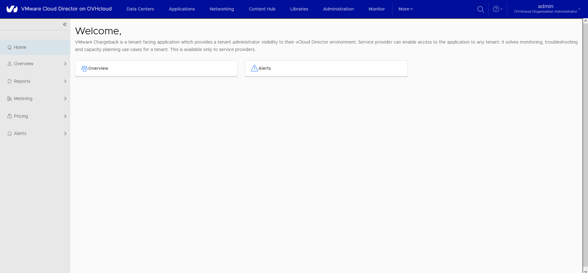
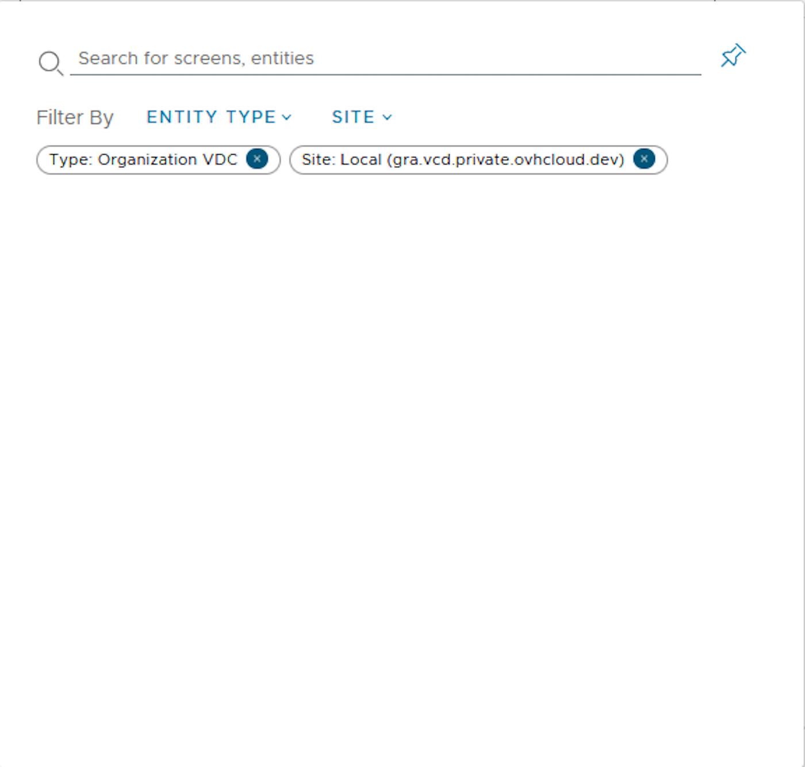
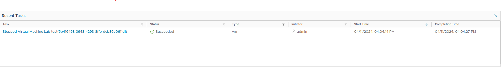

## Objectif

**Ce guide vous présente les différentes sections de l'interface de VMware Cloud Director.** 

La version utilisé pour l'ensemble de nos produit Vcloud Director (VCD) est la `version 1.5`

## Prérequis

>[!primary]
> Si vous ne savez comment vous connecter au portail web de votre organisation, consultez d'abord [ce guide](/pages/hosted_private_cloud/hosted_private_cloud_powered_by_vmware/vcd-logging).

- Une connaissance pratique des réseaux Linux, vSphere, Windows et IP est nécessaire pour configurer et gérer vCD
- Avoir un compte VMware Cloud Director administrateur
- Avoir une infrastructure VMware Cloud Foundation (VCF)
  - vSphere et des ressources NSX (selon offre)
  - VSan (selon offre)

## En pratique

VMware vCloud Director (vCD) est un logiciel de déploiement, d’automatisation et de gestion de ressources d’infrastructure virtuelle dans des environnements cloud multi-tenants.

[comment]: <> (Réécriture de l'introduction "En pratique" pour accès plus le propos sur le service que fournis OVH afin de se démarquer de VMware)
VMware vCloud Director (VCD) par OVH Cloud permet d'avoir un service reuni au sein d'une même organisation managé.

>[!primary]
> Une fois connecté à votre interface web, vous serez accueillis par un tableau de bord affichant vos **vDC**, ainsi qu'un résumé détaillé de votre utilisation des ressources (10). En haut de l'écran, vous trouverez également une barre de navigation regroupant les différentes options de paramétrage disponibles pour vCloud Director (VCD).

{.thumbnail}

Les différentes sections disponibles :

1. **Data Centers**
2. **Applications**
3. **Networking**
4. **Content Hub**
5. **Administration**
6. **Monitor**
7. **More**
8. **Loupe**
9. **Tâches effectuées**
10. **Ressources utilisées**

### Datacenters

{.thumbnail}

Retrouvez dans cette sections tous vos datacenters virtuels (**vDC**) commandés avec différents emplacements de datacenters, un bref suivi de votre consommation de ressources et du nombre de vApps/VM en cours d’exécution.
Dans cette section vous retrouvez un bandeau sur votre gauche, le même que vous retrouvez quand vous cliquez sur une de vos : `Virtual Applications | Virtual Machines | Container Applications`{.action}. depuis la section **"Application"** :

Cliquez pour voir les sections :

Compute :

- `vApps`{.action}.
- `Virtual Machines`{.action}.
- `Affinity Rules`{.action}.

Networking :

- `Networks`{.action}.
- `Edges`{.action}.

Storage :

- `Named disks`{.action}.
- `Storage Policies`{.action}.

Settings :

- `General`{.action}.
- `Metadata`{.action}.
- `Sharing`{.action}.
- `Kubernetes Policies`{.action}.

### Applications

Cette section vous permet de profiter d'une vision d'ensemble complète de tous vos vApps et machines virtuelles sur vos centres de données virtuels (vcd) : créez, accédez et supprimez des vApps ou des machines virtuelles en toute simplicité.

L'utilisation des vApps est une des fonctionnalitées unique de Vcloud Director (VCD). Il permet de créer de grouper un ensemble de machines virtuelles, de conteneurs au sein de la même Virtual Application (vApp). Mais aussi aller granulairement créer des rêgles d'affinités/anti-affinités au sein de ces vApp (réseau, firewall, templating etc).
Nous retrouvons comme réglages pour ces vApp, les fonctionnalitées classiques de Vsphere/NSX pour réseau et le stockage que l'on peut appliquer à cet console Web centralisé (orchestrator).

Il est par exemple possible de copier une vApp d'un Data Center à un autre, pour une migration d'application d'un site à un autre.

Voici la vu globale de la section "Application" dans cette capture : 

{.thumbnail}

Voici les 3 éléments principaux de la section Application, vous pouvez aussi voir que quand vous cliquez sur l'une de vos vApp vous serez redirigé dans la section Data Center :

Application

- `Virtual Applications`
- `Virtual Machines`
- `Container Applications`

{.thumbnail}

### Networking

La mise en réseau de Cloud Director permet au fournisseur et au client de l'organisation de créer et de consommer des ressources de mise en réseau à partir d'un environnement vSphere ou NSX. 
Par conséquent, les clients peuvent créer des segments réseaux et configurer des services finement avec ou sans DHCP, effectuer du pare-feu NAT mais aussi utiliser les intégrations de load-balancing par exemple.

Vous pouvez voir après cette capture que les fonctionnalitées les plus avancées proposées par VMware depuis toutes ces années sont présente dans Vcloud Director (VCD) au sein d'une même console central d'administration.

Voici la vu globale dans cette capture :

{.thumbnail}

Dans cette section, vous retrouvez tous les composants réseau de vos environnements VCD :

- `Réseaux`
- `Edge Gateways`
- `Provider Gateways`
- `IP Spaces`
- `Data Center Groups`
- `Security Tags`

#### vCloud Director supporte trois types de réseaux :
- Réseaux externes
- Organisation de Réseaux de Datacenters virtuels
- Réseaux vApp

Voici une capture animé (gif), des réglages réseau géré depuis la section "Data Centers" pour une `Edge Gateway`:

{.thumbnail}

#### vCloud Director supporte trois types de réseaux :
- Réseaux externes
- Organisation de Réseaux de Datacenters virtuels
- Réseaux vApp

### Content Hub

Cette section vous permet d'administrer vos catalogues : créez, supprimez ou téléchargez des fichiers ISO, des modèles OVA, ou bien utilisez tout simplement les modèles préconfigurés disponibles dans le catalogue OVHcloud.

{.thumbnail}

Cliquez pour déroulez le contenue de votre section "Content Hub" :

Content Hub

- `Welcome to Content Hub`
- `Content`
- `Catalogs`
- `Manage Ressources`

### Libraries

{.thumbnail}

Cliquez pour déroulez le contenue de votre section "Libraries" :

Libraries

- `Content Libraries`
- `Services`

### Administration

{.thumbnail}

Vous avez la possibilité de gérer ici les utilisateurs de votre organisation, de créer des rôles et des groupes et de configurer un fournisseur d'identification (OIDC/SAML). Vous pouvez également paramétrer des stratégies d'alertes et d'expiration par e-mail pour vos applications.

Dans cette section, vous retrouvez tous les composants d'administration de votre organisation VCD :

Cliquez pour déroulez le contenue de votre section "Administration" :

Access Control

- `Users`
- `Groups`
- `Roles`

Identity Providers

- `SAML`
- `OIDC`

Certificates Management

- `Certificates Library`

Organizations :

Settings :

- `General`
- `Email`
- `Guest Personalization`
- `Metadata`
- `Multisite`
- `Policies`
- `Quotas`

### Monitoring

{.thumbnail}

Dans cette section, vous pouvez accéder à l'historique complet de toutes les tâches et événements survenus dans votre organisation. Vous pouvez utiliser les filtres pour retrouver plus facilement les tâches/événements souhaités.

### More

{.thumbnail}

Dans cette section, accédez aux plugins essentiels : Veeam pour la protection des données afin de sauvegarder votre infrastructure, et le *Operations Manager* pour obtenir un détail exhaustif de votre consommation.

### Loupe

{.thumbnail}

Utilisez cette fonction pour rechercher des composants au sein de votre organisation. Les points verticaux vous offrent la possibilité de vous déconnecter, de modifier votre mot de passe et de gérer vos préférences utilisateur.

### Tâches effectuées

{.thumbnail}

Consultez ici toutes les actions récentes effectuées au sein de votre organisation.

## Aller plus loin

Si vous avez besoin d'une formation ou d'une assistance technique pour la mise en oeuvre de nos solutions, contactez votre commercial ou cliquez sur [ce lien](https://www.ovhcloud.com/fr/professional-services/) pour obtenir un devis et demander une analyse personnalisée de votre projet à nos experts de l’équipe Professional Services.

Échangez avec notre communauté d'utilisateurs sur <https://community.ovh.com>.