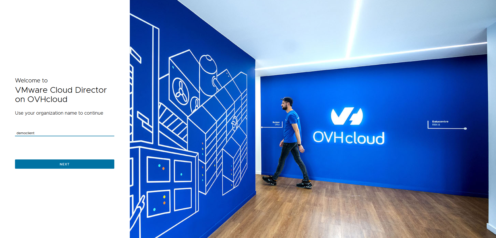
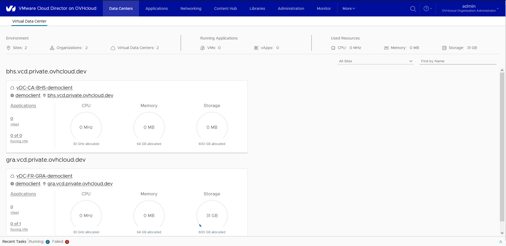
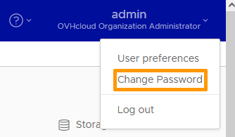
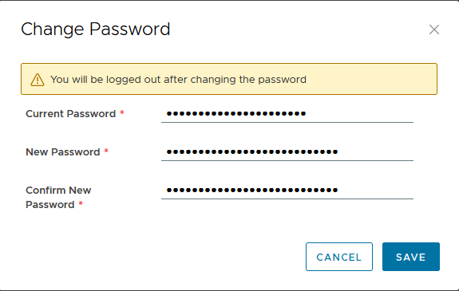

## Objective

**This guide provides step-by-step instructions on how to log in to VMware Cloud Director.**

## Requirements

- A web browser
- The delivery email

## Instructions

### First login

Open your web browser and go to this [url](https://vcloud.vcd.ovh).
You will be redirected to the vCD login page. Enter your organization name (provided in the account creation email).

> [!success]
>
> You can go to your organization's login page with this URL: `https://vcloud.vcd.ovh/tenant/{your-org}`.

{.thumbnail}

You will now be prompted to enter your username and password in the appropriate fields (this information is provided in the creation email).

Click the `Log in`{.action} button to access VMware Cloud Director.

{.thumbnail}

You will be redirected to your organization’s dashboard, which we will describe in [this guide](/pages/hosted_private_cloud/hosted_private_cloud_powered_by_vmware/vcd-getting-started).

{.thumbnail}

### Change password

Once logged in, look for a link or button labeled **OVHcloud Organization Administrator Admin** or similar. This is located in the upper-right corner of the user interface.

{.thumbnail}

Select the `Change Password`{.action} option from the drop-down menu.

{.thumbnail}

You will be prompted to enter your old password and your new password.

Fill in the fields and click `SAVE`{.action}.

{.thumbnail}

When you change your password, you should receive a confirmation email.

## Go further

If you need training or technical assistance to implement our solutions, contact your sales representative or click on [this link](https://www.ovhcloud.com/en-au/professional-services/) to get a quote and ask our Professional Services experts for a custom analysis of your project.

Join our community of users on <https://community.ovh.com/en/>.