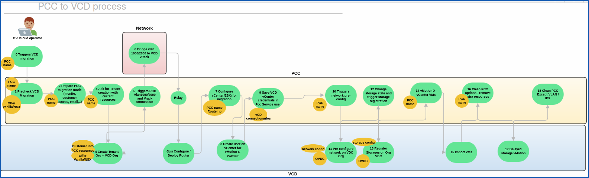

> [!primary]
>
> VCD on OVHcloud is currently in alpha phase. This guide may be incomplete. Our team remains available on our dedicated Discord channel: <https://discord.gg/ovhcloud>.
>

## Objective

**Find out how to migrate to VMware Cloud Director on OVHcloud, and which specific cases need to be identified.**
**The purpose of this guide is to write the most difficult scenarios that can complicate migrations within VCD on OVHcloud.**

## Requirements

> [!primary]
>
> If you are unsure how to log in to your organization’s web portal, first read the guide “[How to log in to VCD](/pages/hosted_private_cloud/hosted_private_cloud_powered_by_vmware/vcd-logging)”.
>

- A web browser (preferably with a Chromium base and translation enabled in english).
- A VMware Cloud Director account with admin user rights (check that your user account has sufficient rights).
- You must have followed the guide: - [VMware Cloud Director - VCD fundamental concepts](/pages/hosted_private_cloud/hosted_private_cloud_powered_by_vmware/vcd-get-concepts)”.
- You must be an administrator of at least two VCD organizations on the VCD on OVHcloud organization.
- You must have established a link between these two organizations.

## In practice

/// details | Introduction

Welcome to the complete guide on migrating to VMware Cloud Director within the VMware on OVHcloud ecosystem.

This guide aims to address the most challenging and nuanced use cases that IT professionals may encounter during the migration process.

Whether you are moving workloads from hosted private cloud on OVHcloud environments, other cloud providers, or upgrading existing systems.

This guide provides step-by-step solutions and best practices to ensure a smooth and successful transition.

Our goal is to tackle the difficult scenarios that often complicate migration, by providing insights and strategies from real-world experiences.

With this guide, you will be equipped to navigate the complexities of VMware Cloud Director on OVHcloud migrations with confidence and efficiency.

//

### Step 1 - Migrate from vSphere managed on OVHcloud to VCD on OVHcloud

/// details | How do I migrate from vSphere managed (PCC) on OVHcloud to VCD on OVHcloud?

**Dedicated Cloud to VCD Schema:**

{.thumbnail}

### Acceptance criteria

### Step 2 - Les cas particuliers de migration VCD

/// details | Quelle sont les cas particuliers de migration VCD ?

| Step             | Check                                                                               | Actions                                                                                                                                                                                                                                  |
|------------------|-------------------------------------------------------------------------------------|------------------------------------------------------------------------------------------------------------------------------------------------------------------------------------------------------------------------------------------|
| DURING MIGRATION | CARP (avertissement) to be coded                                                    | Detection + VCD implementation side → Jira to create Kevin Le Ner step 12 public documentation                                                                                                                                           |
| DURING MIGRATION | 	Scale0 on PCC (NSX-T 4.0.1) → (coche)                                              | 	                                                                                                                                                                                          |
| DURING MIGRATION | 	Edge, Backup infra, zerto infra, private GW... (OVH vms) Virtual Machines → (coche) | 	Do not migrate                                                                                                                                                                                                                          |
| PRECHECK         | Multi vDC (avertissement)                                                           | 	Public documentation, if datacenter empty → ignore else only one customer, contact him and block                                                                                                                                        |
| PRECHECK         | FT (coche)                                                                          | Detection + error? + mail or detection + mail + disable FT on PCC side + migra → Kevin Le Ner to check with PM → public documentation + disable FT on PCC side + migrate VM                                                              |
| PRECHECK         | DRS Affinity/Anti affinity rules (avertissement)                                    | Partial only VMs, distinction between required and preferred in VCD, what do we take by default? → detection + VCD implementation side → (avertissement) public documentation VM ↔ host won't be migrated and migrate VMs affinity rules |
| PRECHECK         | 	Check special devices (CD...) → (coche)                                            | Public documentation, notify customer + mail to ask customer to remove device                                                                                                                                                            |
| PRECHECK         | 	Datastores cluster → (coche)                                                       | Public documentation, notify customer and ignore                                                                                                                                                                                         |
| PRECHECK         | Memory over-commitment (avertissement)                                              | Public documentation, detect + error + mail to ask customer to add resources or add free resources Kevin Le Ner  ???                                                                                                                     |
| PRECHECK         | 	Resource pools → 2 use cases, (avertissement)                                      | Public documentation, no notion on VCD, remove and document → ok                                                                                                                                                                         |
| PRECHECK         | 	Security option (erreur)                                                           | 	Public documentation and detect security option linked to certification and block                                                                                                                                                       |
| PRECHECK         | 	Encrypted VM disks (erreur)	                                                       | Public documentation and detect and block                                                                                                                                                                                                |
| PRECHECK         | 	Hosts freespare and hourly                                                         | Public documentation, notify customer and retry maintenance 1hx24, go in error state and CCO to contact customer (to check with Thibaut Gillardeau )                                                                                     |
| PRECHECK         | 	Check NSX-v usage                                                                  | 	Public documentation can not be migrated if edges and DFW, block migration for now, to be processed in another wave (we will check whether it can be managed manually → 15 occurrences with usage)                                      |
| PRECHECK         | 	Check HCX usage (erreur)                                                           | 	Public documentation can not be migrated. feature must be disabled prior migration                                                                                                                                                      |
HCX usage (erreur)	public documentation can not be migrated. feature must be disabled prior migration