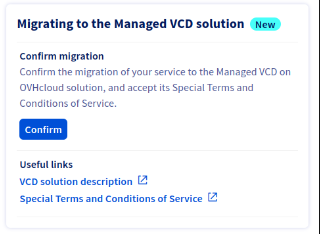

> [!primary]
>
> VCD on OVHcloud est actuellement en phase alpha. Ce guide peut donc évoluer et être mis à jour à l'avenir avec les avancées de nos équipes en charge de ce produit.
>

## Objectif

**L’objectif de ce guide est de vous fournir les informations nécessaires sur les migrations vers VMware Cloud Director on OVHcloud.**

## Prérequis

- Posséder une offre VMware vSphere on OVHcloud.
- Avoir accès à [l'espace client OVHcloud](/links/manager) et être administrateur technique de l'infrastructure VMware vSphere on OVHcloud.

## En pratique

Ce guide pratique a pour but de vous fournir des informations et des solutions sur le processus de migration de vos services VMware vSphere on OVHcloud vers une offre VMware Cloud Director on OVHcloud.

Il détaille également les prérequis pour chaque cas d'utilisation et le cas échéant, vous explique les éxigences pour migrer.

|                                  **Images**                                   | **Étapes**                                                                                                                                                                                                                                                                                                                                                                                                                                                                                                                                                                                                                                                               |
|:-----------------------------------------------------------------------------:|:-------------------------------------------------------------------------------------------------------------------------------------------------------------------------------------------------------------------------------------------------------------------------------------------------------------------------------------------------------------------------------------------------------------------------------------------------------------------------------------------------------------------------------------------------------------------------------------------------------------------------------------------------------------------------|
| {thumbnail} | 1. Avant toute migration, il est important de vérifier la checklist des cas d'utilisations particuliers ci-dessous et de vous conformer aux recommandations associées. 2. Une fois que vous aurez rempli ces exigences, vous pouvez vous connecter à l'espace client OVHcloud afin de signer (dans le bloc prévu à cet effet) les conditions particulières de l'environnement prévu à être migré (C&P). Un e-mail de confirmation vous sera envoyé avec un lien et un mot de passe temporaire pour accéder à VCD on OVHcloud. 3. Les équipes OVHcloud migreront les VMs du datacenter (vDC) choisie, en utilisant un chemin de migration à chaud (vMotion).  |

Ce déplacement à chaud permettra de limiter au minimum les coupures de vos réseaux publics ou privés. Les réseaux privés sont les plus susceptibles d'être affectés, de l'ordre de quelques minutes de coupure.

Vos machines virtuelles resteront opérationnelles pendant la migration, sans temps d'arrêt. Néanmoins, il existe un risque de perte de certains paquets réseau lors du vMotion.

Cette migration doit s’effectuer sans impact notable pour la plupart des applications, mais nous vous recommandons de les superviser étroitement tout au long du processus.

Pour rappel, si vous décidez de passer à l’offre VCD, les nouveaux tarifs ne seront pas appliqués à vos serveurs/hôtes existants. Nous couvrirons l'augmentation du prix de la licence jusqu'à ce que la migration soit terminée.

### Étape 1 - Avant la migration (obligatoire)

#### Demandes faites avant le 1er septembre 2024

> [!primary]
> 
> La migration de vos environnements actuels VMware vSphere on OVHcloud peut être réalisée dès réception de votre demande.
> 
> **Important** : les conditions particulières (C&P) disponibles depuis début septembre 2024 dans l'espace client doivent être signées pour que la migration soit réalisée par les équipes OVHcloud.
>

Nous vous invitons à revoir la démonstration du produit et le webinaire pour vous familiariser avec cette nouvelle offre.

Vous retrouverez toutes les informations nécessaires sur nos pages dédiées à VCD :

- [Webinar - Managed VMware Cloud Director on OVHcloud (vidéo EN)](https://vimeo.com/936590009/b52b3ba8ce)
- [Webinar - VMware by Broadcom New Offerings and Opportunities (vidéo EN)](https://www.youtube.com/watch?v=aS2A9AhjnMg)
- [OVHcloud.com - VMware Cloud Director on OVHcloud (FR)](https://www.ovhcloud.com/fr-ca/lp/vmware-vcd-evolution/)
- [OVHcloud Labs - VMware Cloud Director on OVHcloud (EN)](https://labs.ovhcloud.com/en/vmware-cloud-director/)

Les migrations seront effectuées en 4 vagues, à partir du mois de septembre, selon les services actifs dans votre environnement.

Le calendrier prévisionnel, compatible avec ces environnements lors de la migration, est le suivant :

| **Vagues** |     **Dates**     | **Offres cible** | **NSX** | **vRack** | **vSAN** | **Microsoft (SPLA) on OVHcloud** | **Résumé des environnements compatibles avec la migration**                                                                                          |                                                                                                                
|:----------:|:-----------------:|:----------------:|:-------:|:---------:|:--------:|:------------------------------------:|:-----------------------------------------------------------------------------------------------------------------------------------------------------|
|     ❶      | **Novembre 2024** |    `Standard`    |    ❌    |     ❌     |    ❌     |                  ❌                   | - **Sans** licence VM Microsoft Windows (SPLA) fournie par OVHcloud - **Sans** NSX - **Sans** High performance storage (vSAN)                 |
|     ❷      | **Décembre 2024** |    `Standard`    |    ❌    |     ❌     |    ❌     |                  ✅                   | - **Avec** licence VM Microsoft Windows (SPLA) fournie par OVHcloud - **Sans** NSX - **Sans** High performance storage (vSAN)                 |
|     ❸      | **Janvier 2024**  |    `Advanced`    |    ✅    |     ✅     |    ❌     |                  ✅                   | - **Avec** licence VM Microsoft Windows (SPLA) fournie par OVHcloud - **Avec** NSX + vRack support - **Sans** High performance storage (vSAN) |
|     ❹      | **Février 2024**  |    `Premium`     |    ✅    |     ✅     |    ✅     |                  ✅                   | - **Avec** licence Microsoft Windows (SPLA) fournie par OVHcloud - **Avec** NSX + vRack support - **Avec** High performance storage (vSAN)    |

Au cours de ce processus, vos données resteront inchangées, à l'exception du vSAN Storage. Vos adresses IP resteront inchangées également.

La date de migration vous sera communiquée par e-mail au minimum 15 jours avant le début de la migration.

Nous vous invitons à lire le guide [VMware Cloud Director - Les concepts fondamentaux de VCD](/pages/hosted_private_cloud/hosted_private_cloud_powered_by_vmware/vcd-get-concepts) pour voir les fonctionnalités incluses dans chaque vague de migration de vos environnements.

#### Demandes faites après le 1er septembre 2024

> [!primary]
>
> Les demandes de migration faites après le 1er septembre 2024 ont les mêmes prérequis que pour toutes les autres demandes de migrations évoquées dans ce guide.
>
> Vous devrez faire votre demande par le biais d'un [ticket au support](https://help.ovhcloud.com/csm?id=csm_get_help), ce qui vous permettra d'obtenir toutes les informations et de signer les termes et conditions de l'offre (C&P).
>

Nous vous informerons ensuite de la date de migration et réaliserons celle-ci. 

Pour rappel, vous pouvez consulter et accepter les conditions particulières de l'offre VCD on OVHcloud dans votre espace client depuis début septembre.

#### Checklist avant migration

- **Cas particuliers bloquants\*** :

Le tableau ci-dessous vous présente chacun des cas particuliers et des points bloquants, ainsi que les niveaux de criticité qu'il convient de mettre en conformité avant toute demande de migration formulée auprès des équipes du support OVHcloud.

| **Checklist** | **Cas d'usages**                                     | **Objectifs**                                                     | **Informations complémentaires**                                                                                                                                                                                                                                 | **Aides et références**                                                                                                                                                                                |
|:-------------:|:-----------------------------------------------------|:------------------------------------------------------------------|:-----------------------------------------------------------------------------------------------------------------------------------------------------------------------------------------------------------------------------------------------------------------|:-------------------------------------------------------------------------------------------------------------------------------------------------------------------------------------------------------|
|      1️⃣      | 🏢🏢 `Multi-vDC`                                     | Migrer les VMs, vApp vers un seul vDC                             | - Ne peut être migré que si votre architecture ne dispose que d'un seul vDC (à ce jour).   Si ce n’est pas le cas, assurez-vous en avant de transférer toutes vos données (VMs, vApp) dans le vDC qui sera utilisé pour la migration par les équipes OVHcloud. | [Migration d'une infrastructure vers un nouveau vDC](/pages/hosted_private_cloud/hosted_private_cloud_powered_by_vmware/service-migration-vdc)                                                         |
|      2️⃣      | 📜 `Options PCI-DSS, SecNumCloud et HDS non actives` | Pas de solution à ce jour                                         | - Ne peut pas être migré si vos charges de travail VMware vSphere on OVHcloud sont certifiées PCI-DSS, HDS ou qualifiées SecNumCloud à ce jour.                                                                                                                      |                                                                                                                     |
|      3️⃣      | 🔐 `Chiffrement VMs (KMS/OKMS ou vNKP)`              | Déchiffrer ou désactiver la politique de chiffrement pour les VMs | - Il n'est pas possible à ce jour d'effectuer la migration avec des VMs, vApp chiffrées dans VMware vSphere on OVHcloud.                                                                                                                                         | [Activation du chiffrement des machines virtuelles (VM Encryption)](/pages/hosted_private_cloud/hosted_private_cloud_powered_by_vmware/vm_encrypt)                                                     |
|      4️⃣      | 💾 `Zerto`                                           | Pas de solution à ce jour                                         | - Si vous utilisez les solutions Zerto (réplication de données pour la reprise d'activité en cas de désastre), vous ne pouvez pas faire fonctionner cette technologie avec VCD (à ce jour).                                                                        | [Mise en place de Zerto Virtual Replication entre deux centres de données OVHcloud](/pages/hosted_private_cloud/hosted_private_cloud_powered_by_vmware/zerto_virtual_replication_as_a_service)         |

\***Bloquant** : empêche toute migration possible vers VCD on OVHcloud.

- **Cas particuliers non-bloquants** :

| **Checklist** | **Cas d'usages**                             | **Objectifs**                                                                                                                                        | **Informations complémentaires**                                                                                                                                                                                          | **Aides et références**                                                                                                                                                                                |
|:-------------:|:---------------------------------------------|:-----------------------------------------------------------------------------------------------------------------------------------------------------|:--------------------------------------------------------------------------------------------------------------------------------------------------------------------------------------------------------------------------|:-------------------------------------------------------------------------------------------------------------------------------------------------------------------------------------------------------|
|      5️⃣      | 🚫 `FT (tolérance aux pannes)`               | Désactiver la FT (Fault Tolerance) des VMs dans VMware vSphere on OVHcloud                                                                           | - Faites un clic droit sur vos VMs et sélectionnez `Fault Tolerance`{.action} > `Désactiver Fault Tolerance`{.action} dans VMware vSphere on OVHcloud                                                                                   | [Tolerance aux pannes VMware](/pages/bare_metal_cloud/managed_bare_metal/vmware_fault_tolerance)                                                                                                       |
|      6️⃣      | ⚠️ `Règles d'affinité/anti-affinité DRS`     | Reconstitution des règles d’affinité/anti-affinité dans VCD on OVHcloud                                                                              | - Pour être conservées, les règles d’affinité/anti-affinité DRS devront être recrées manuellement par vos soins dans VCD on OVHcloud après migration (à ce jour).                                                           | [VMware DRS distributed resource scheduler](/pages/bare_metal_cloud/managed_bare_metal/vmware_drs_distributed_resource_scheduler)                                                                      |
|      7️⃣      | 📀 `Périphériques spéciaux (CD, DVD, etc..)` | Débrancher tous les équipements spéciaux dans VMware vSphere on OVHcloud                                                                             | - Tous les périphériques spéciaux (CD, DVD, etc.) doivent être retirés avant la migration, sinon ils seront enlevés par le processus de migration (à ce jour).                                                            | [Modifier les ressources d’une machine virtuelle](/pages/hosted_private_cloud/hosted_private_cloud_powered_by_vmware/modify_hardware_configuration_of_vm)                                              |
|      8️⃣      | 🛢 `Clusters de datastore`                   | Suppression de toutes les règles de clustering dans VMware vSphere on OVHcloud                                                                       | - Les règles de clustering devront être enlevés avant la migration car cette notion n'existe plus avec VCD on OVHcloud                                                                                                    | [Création de cluster et activation EVC](/pages/hosted_private_cloud/hosted_private_cloud_powered_by_vmware/create_cluster_enable_evc)                                                                  |
|      9️⃣      | 🔄 `Sur-allocation de mémoire`               | Prévoyez ou faites évoluer vos besoins en ressources dans VCD on OVHcloud. Ou optimisez vos besoins avant de migrer (côté control panel vSphere) | - Car vous ne pourrez pas sur-engager (over commit) de ressources au sein de VCD on OVHcloud. Ce concept n'existe pas.                                                                                                    | [Modification des ressources d'une machine virtuelle](/pages/hosted_private_cloud/hosted_private_cloud_powered_by_vmware/modify_hardware_configuration_of_vm)                                          |
|      🔟       | 🔗 `Pools de ressources (partage)`           | Remplacer par les vApp dans VCD on OVHcloud                                                                                                          | - Les pools de ressources seront perdus après la migration car cette notion n'existe plus côté VCD on OVHcloud. Nous recommandons à la place l'utilisation des concepts de vApp au sein du control panel VCD on OVHcloud. | [Utilisation de vApps dans le control panel VCD on OVHcloud](https://docs.vmware.com/en/VMware-Cloud-Director/10.6/VMware-Cloud-Director-Tenant-Guide/GUID-AC48FB5E-4ADC-4835-AACE-B949B297A147.html)  |
|      ⏸️       | 🆓 `Hosts + Datastore`                       | Libération des ressources (hôtes + datastore) dans VMware vSphere on OVHcloud                                                                        | - Les ressources (hôtes + datastore) gratuites "Freespare" et à l'heure "Hourly" doivent être libérées avant la migration, ou converties en ressources mensuelles ("Monthly").                                             | [Informations de facturation du Hosted Private Cloud](/pages/account_and_service_management/manage_billing_payment_and_services/facturation_private_cloud)                                             |

### Étape 2 - Après la migration

Voici un rappel des tâches qu'il vous reste à mener, une fois la migration effectuée (si vous êtes dans les cas d'usages suivants).

#### Post action (non-obligatoire, seulement si cas d'usage présent)

| **Post actions** | **Cas d'usages**                             | **Objectifs**                                                                                                                                                          | **Aides et références**                                                                                                                                                                                                                                                                                                           |
|:----------------:|:---------------------------------------------|:-----------------------------------------------------------------------------------------------------------------------------------------------------------------------|:----------------------------------------------------------------------------------------------------------------------------------------------------------------------------------------------------------------------------------------------------------------------------------------------------------------------------------|
|       1️⃣        | 🏢🏢 `Multi-vDC`                             | Re-migrer les données des VMs, vApp vers vos datastore multi-vDc dans VCD on OVHcloud si vous êtes dans ce cas d'usage                                                 |                                                                                                                                                                                                                                                                                                                                   |
|       5️⃣        | 🚫 `FT (tolérance au pannes)`                | Réactiver la FT (Fault Tolerance) sur les VMs dans VCD on OVHcloud                                                                                                     | - Faites un clic droit sur vos VMs et sélectionnez `Fault Tolerance` > `Activer Fault Tolerance` dans VCD on OVHcloud.                                                                                                                                                                                                        |
|       6️⃣        | ⚠️ `Règles d'affinité/anti-affinité DRS`     | Reconstituer les règles d’affinités/anti-affinités dans VCD on OVHcloud                                                                                                | - [Créer une règle d'affinité de machine virtuelle dans VMware Cloud Director on OVHcloud](https://docs.vmware.com/fr/VMware-Cloud-Director/10.5/VMware-Cloud-Director-Tenant-Guide/GUID-950F736F-76D5-4522-8E08-CF6727FC569C.html)                                                                                               |
|       7️⃣        | 📀 `Périphériques spéciaux (CD, DVD, etc..)` | Rébrancher tous les équipements spéciaux nécessaire au bon fonctionnement des VMs dans VCD on OVHcloud                                                                 | - Car tous les périphériques spéciaux (CD, DVD, etc.) doivent être retirés avant la migration. [Insérer un support dans une machine virtuelle dans le VMware Cloud Director on OVHcloud](https://docs.vmware.com/fr/VMware-Cloud-Director/10.5/VMware-Cloud-Director-Tenant-Guide/GUID-01E3E275-D076-464D-BDE3-65F19A0793AD.html) |
|       3️⃣        | 🔐 `Chiffrement VMs (KMS/OKMS ou vNKP)`      | Réactiver la politique de chiffrement pour les VMs dans VCD on OVHcloud avec votre solutions définie (KMS/OKMS/vNKP) après migration et lancer le chiffrement des VMs. | - Car il n'est pas possible à ce jour d'effectuer la migration avec des VMs, vApp chiffrées. L'import ou la configuration de votre solution de chiffrement (KMS/OKMS, vNKP) doit être réalisé avant activation du chiffrement des VMs dans VCD on OVHcloud                                                                    |

#### Managed Veeam for VCD (obligatoire)

**Configuration du répertoire de stockage**

Après la migration, vous devrez configurer votre nouvelle implémentation de stockage **Veeam Data Platform** avec les paramètres adéquats.

Ces paramètres pourront être personnalisés en fonction des niveaux de services choisis :

| **Repository**&nbsp;&nbsp;&nbsp;&nbsp; | **Offres cible** | **Commentaires**                                                                                    |
|:---------------------------------------|:----------------:|:----------------------------------------------------------------------------------------------------|
| 🥉 `Bronze Repository (100 To)`        |    `Standard`    | - **Standard Object Storage**                                                                       |
| 🥈 `Silver Repository (100 To)`        |    `Advanced`    | - **Standard Object Storage** avec copie de sauvegarde hors site                                    |
| 🥇 `Gold Repository (100 To)`          |    `Premium`     | - **High Performance Object Storage** avec copie de sauvegarde hors site et 14 points d’immuabilité |

Tous ces dépôts (*repositories*) ont un quota de stockage de **100 To**. Vous pouvez contacter les équipes de [support](https://help.ovhcloud.com/csm?id=csm_get_help) pour augmenter ce quota.

Pour plus d'informations, consultez le guide : [VMware Cloud Director - Sauvegarde avec Veeam Data Platform](/pages/hosted_private_cloud/hosted_private_cloud_powered_by_vmware/vcd-backup)

## Aller plus loin

Vous pouvez aller plus loin en lisant ces guides, afin de mieux connaitre les avantages de VCD on OVHcloud :

- [VMware Cloud Director - Premiers pas](/pages/hosted_private_cloud/hosted_private_cloud_powered_by_vmware/vcd-getting-started)
- [VMware Cloud Director - Les concepts fondamentaux de VCD](/pages/hosted_private_cloud/hosted_private_cloud_powered_by_vmware/vcd-get-concepts)
- [VMware Cloud Director - Foire aux questions](/pages/hosted_private_cloud/hosted_private_cloud_powered_by_vmware/vcd-faq)
- [VMware Cloud Director - Se connecter depuis le control panel VCD](/pages/hosted_private_cloud/hosted_private_cloud_powered_by_vmware/vcd-logging)
- [VMware Cloud Director - Concepts réseau et bonnes pratiques](/pages/hosted_private_cloud/hosted_private_cloud_powered_by_vmware/vcd_network_concepts)
- [VMware Cloud Director - Création de composants réseaux via VCD on OVHcloud](/pages/hosted_private_cloud/hosted_private_cloud_powered_by_vmware/vcd_network_creation)
- [VMware Cloud Director - Sauvegarde avec Veeam Data Platform](/pages/hosted_private_cloud/hosted_private_cloud_powered_by_vmware/vcd-backup)

Si vous avez besoin d'une formation ou d'une assistance technique pour la mise en œuvre de nos solutions, contactez votre Technical Account Manager ou demandez une analyse personnalisée de votre projet à nos experts de l’équipe [Professional Services](/links/professional-services).

Posez des questions, donnez votre avis et interagissez directement avec l’équipe qui construit nos services Hosted Private Cloud sur le canal [Discord](https://discord.gg/ovhcloud) dédié.

Échangez avec notre [communauté d'utilisateurs](/links/community).
