

> [!primary]
>
> VCD on OVHcloud est actuellement en phase alpha. Ce guide peut donc être incomplet. Notre équipe reste disponible sur notre canal Discord dédié: <https://discord.gg/ovhcloud>.
>

## Objectif

**Découvrez comment effectuer la migration d'un service vSphere managé au sein de VMware Cloud Director on OVHcloud, ainsi que les cas particuliers à mettre au jour.**

## Prérequis

- Un navigateur Web (avec de préférence une base Chromium et la traduction activée en français).
- Avoir souscrit à une offre et être contact administrateur ou technique de l'infrastructure [Hosted Private Cloud VMware on OVHcloud](https://www.ovhcloud.com/fr/enterprise/products/hosted-private-cloud/).
- Avoir un compte VMware Cloud Director avec des droits utilisateurs admin (vérifiez que votre compte utilisateur dispose des droits suffisants).
- Avoir suivi les guides : 
  - « [VMware Cloud Director - Les concepts fondamentaux de VCD](/pages/hosted_private_cloud/hosted_private_cloud_powered_by_vmware/vcd-get-concepts) ».
  - « [VMware Cloud Director - Network - Concepts](/pages/hosted_private_cloud/hosted_private_cloud_powered_by_vmware/vcd_network_concepts) ».
- Avoir une bonne connaissance du réseau au sein de l'univers OVHcloud, vous pouvez consulter la page: <https://www.ovhcloud.com/fr/network/>.
- Être administrateur d'au moins une ou deux organisations VCD sur la plateforme VCF on OVHcloud et les services vSphere managé (Hosted Private Cloud VMware on OVHcloud ou PCC) afin d'avoir les droits suffisant pour effectuer la migration des données (déchiffrement, etc..).
- Être connecté à [l'espace client](/links/manager).

## En pratique

> [!primary]
> 
> Attention cette migration peut prendre jusqu'à plusieurs heures, cela dépend du volume de données à migrer. 
> 

Bienvenue dans le guide complet sur la migration vers VMware Cloud Director au sein de l'écosystème VMware on OVHcloud. 

Ce guide vise à aborder les cas d'utilisations les plus difficiles et les plus nuancés que vous pouvez rencontrer au cours d'un processus de migration à chaud. 

Les charges de travail migrées ici sont des environnements vSphere managé on OVHcloud (Hosted Private Cloud VMware on OVHcloud -> PCC) à faire migrer sur une infrastructure VMware Cloud Director (VCF). Ce guide vous détails étapes par étapes la création d'un vMotion de vos machines virtuelles à chaud entre les réseaux publiques et privées sans perte de connectivités.

Notre objectif est aussi de nous attaquer à ce cas de migration et aux scénarios difficiles qui compliquent souvent les migrations à chaud, en offrant des perspectives et des stratégies tirées d'expériences réelles. 

Vous serez ainsi équipé pour naviguer dans les complexités des migrations de VMware Cloud Director on OVHcloud en toute confiance et avec efficacité.

## Étape 1 - Migration entre des systèmes vCenter Server
or
## Étape 1 - Migration hybride vSphere/vCenter managé vers du VCD managé (OVHcloud)

/// details | Comment va s'effectuer la migration vSphere/vCenter vers VCD ?

Le but est de migrer toutes les instances vSphere managé on OVHcloud existantes qui sont marqués avec le tag **"VCDMigrationPath"**.

Ces instances clientes proviennent principalement des offres **Essential** et **SDDC** mais nous pouvons avoir des références **PRE/NSX/vSphere** et même vSAN pour les premiers hosts vSAN.

### Les schémas de migration vers VCD

**ÉTAPE 1**
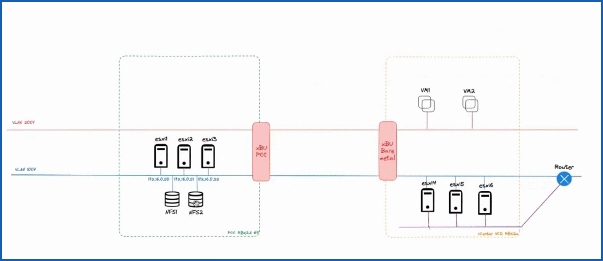{.thumbnail}

**Étape 2**
{.thumbnail}

**Étape 3**
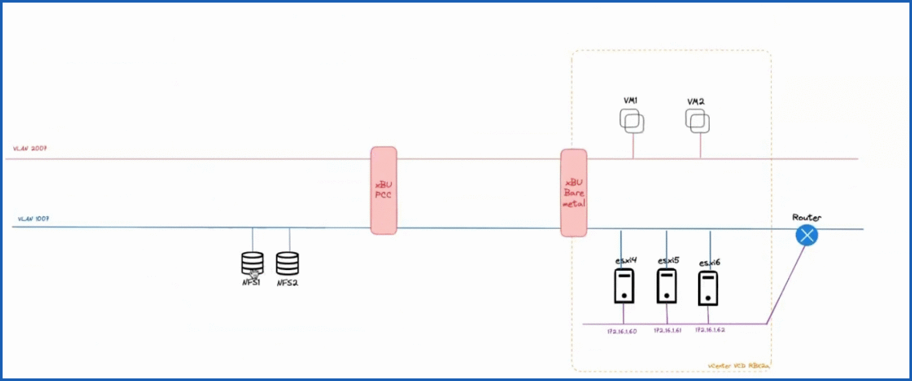{.thumbnail}

En tant que propriétaire de la migration VCD, nous souhaitons configurer vCenter et ESXi sur le vSphere managé OVHcloud et le routeur sur le VCD afin de pouvoir ensuite effectuer une migration vCenter croisée (cross vCenter).

### Résumé des scenarios et offres pour la migration vers VCD

**Offres ESS**

Cas de migration facile:
- Réseau public
- vlan vRack

**Offres SDDC 2016**

Cas de migration avec usage de NSX-v:
- Réseau public
- vxlan
- vlan vRack

**Offres SDDC 2018 

Cas de migration avec usage de NSX-v:
- Réseau public
- vxlan
- vlan vRack

**Offres RE**

Cas de migration avec usage de NSX-v:
- Réseau public
- vxlan
- vlan vRack

**Offres vSphere**

Cas de migration facile):
- Réseau public
- vlan vRack

**Offres NSX**

Cas de migration très difficile):
- pre created networks
- Réseau public
- vlan vRack

Nous allons démarrer avec une procédure d'exemple de migration de machines virtuelles vSphere managé (réseau public + vlan vRack) vers VCD. 

Un cas facile, qui vous permet de voir comment fonctionne le processus de migration.

### Depuis le control panel OVHcloud

Pour accéder au vSphere managé (Hosted Private Cloud VMware on OVHcloud) depuis le control panel OVHcloud, vous devez vous rendre dans la "web interface".

Connectez-vous à votre [espace client OVHcloud](/links/manager) avec un compte administrateur.

Et cliquez sur l'onglet de la bar de navigation du menu principal: `Hosted Private Cloud`{.action}.

Sélectionnez votre infrastructure: `VMware > Mon vSphere managé (pcc) > Informations générales`{.action}.

Puis cliquez sur le lien de redirection: `Interface web`{.action}.

Une fois connecté sur l'interface web vSphere/vCenter. Nous pouvons commencer les réglages nécessaires à la migration de nos VM d'un point A (vSphere/vCenter managé pcc) à un point B (vSphere/vCenter managé VCD).

Votre utilisateur vSphere ou role IAM vSphere a besoin des droits suivants:

| **Droit**                           | **Rôle**             |
|-------------------------------------|----------------------|
| **Accès vSphere**                   | Opérateur            |
| **Accès au vmNetwork**              | Opérateur            |
| **Accès au V(x)Lans**  (si NSX)     | Opérateur            |
| **Ip FailOver**                     | oui (si nécessaire)  |
| **IP**                              | oui (si nécessaire)  |
| **Interface NSX** (si NSX)          | oui (si nécessaire)  |
| **Gestion du chiffrement** (si KMS) | oui  (si nécessaire) |

#### Politique de stockage (non vMotion)

Pour que la politique de stockage puisse taguer les disques souhaités, il faut l'avoir configuré au préalable.

#### Politique de stockage (vMotion)

#### Comment créer un tag (une balise) pour vos datastore afin de les migrer ?

Le Storage vMotion permet de modifier l'emplacement de stockage des fichiers de la machine virtuelle et cela en conservant la machine virtuelle sous tension. Il est possible de déplacer la machine virtuelle complètement ou disque par disque.

Pour la création de la politique de tag (balise).

Allez dans la console vSphere, puis cliquez en haut à gauche sur: {.thumbnail}

Ensuite, cliquez sur : `Balises et attributs personnalisés`{.action}

Et pour créer une balise, cliquez sur : `NOUVEAU`{.action}

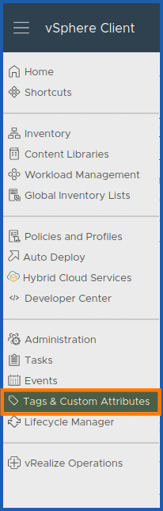{.thumbnail}

Vous devez créer une nouvelle catégorie si vous n'en avez pas. 

Cliquez donc sur: `créer une nouvelle catégorie`{.action}

- **Nom:** tag_migration
- **Description:** Politique de tag pour migration VCD

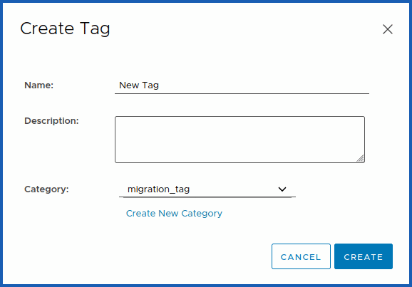{.thumbnail}

Sélectionnez uniquement le type d'objet associé à la balise **"Datastore"** pour cette catégorie: `Datastore`{.action}

Choisissez un nom de préference avec une convention de nommage (minuscule et _ pour les éspaces )et une description.

- **Nom:** category_datastore
- **Description:** Catégorie datastore pour migration vers VCD

Puis cliquez sur: `CREER`{.action}

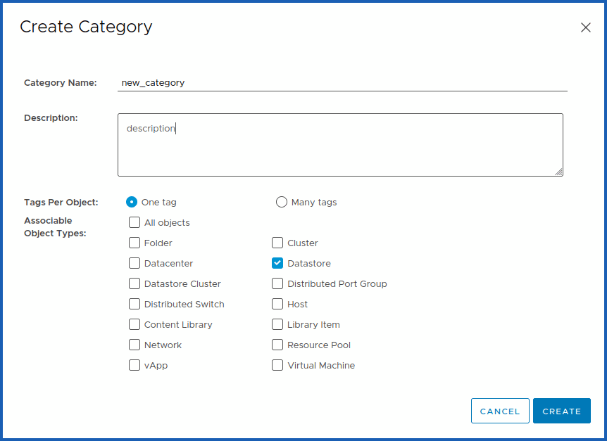{.thumbnail}

Et pour terminer encore sur: `CREER`{.action}

{.thumbnail}

Votre balise (tag) est créé.

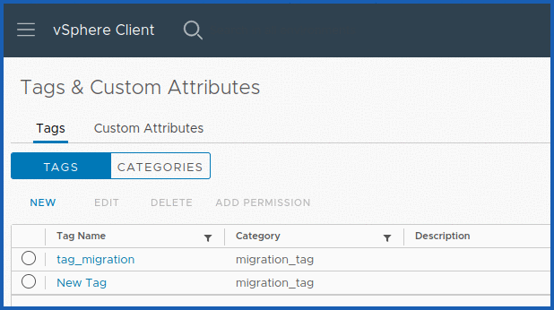{.thumbnail}

#### Comment tagger vos datastore ?

Pour attribuer le tag aux ressources souhaitées pour la migration.

Sélectionnez vos ressources souhaitées depuis l'inventaire disques et cliquez sur: `Actions`{.action}

Puis cliquez sur: `Balises et attributs personnalisés > Assigner une balise`{.action}

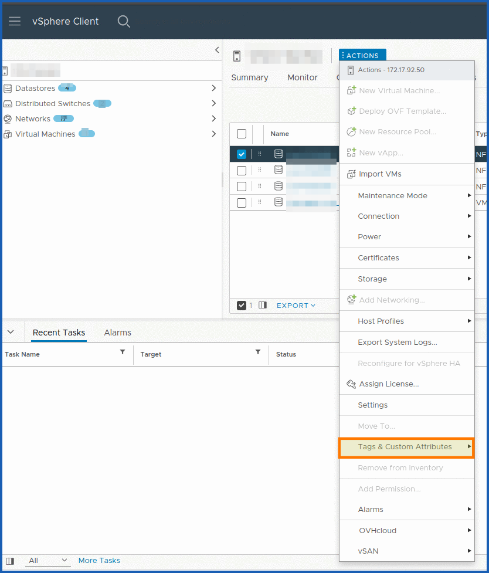{.thumbnail}

Il en vous reste plus qu'ajouter la balise que vous avez précédemment créé: `tag_migration`{.action}

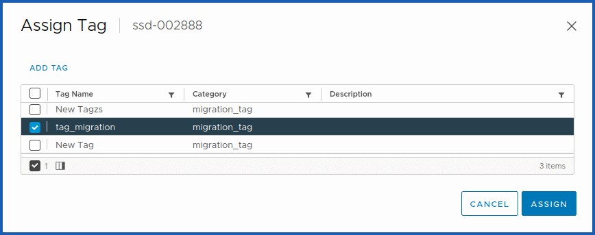{.thumbnail}

Et cliquer sur: `ASSIGNER`{.action}

Vous pouvez confirmer que le tag est bien assigné, depuis l'inventaire global du datastore, dans le sous-menu:  `Liste de l'inventaire globale > Ressources > Datastores`{.action} 

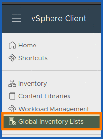{.thumbnail}

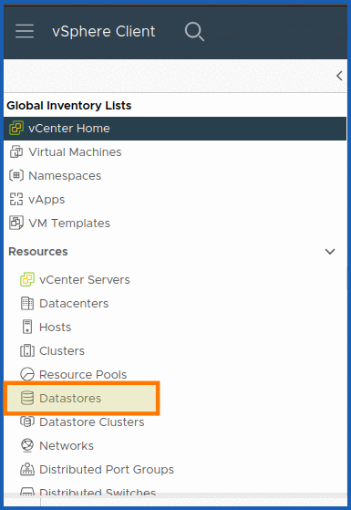{.thumbnail}

Et en cliquant sur un de vos disques: `ssd-XXXXXXX`{.action}

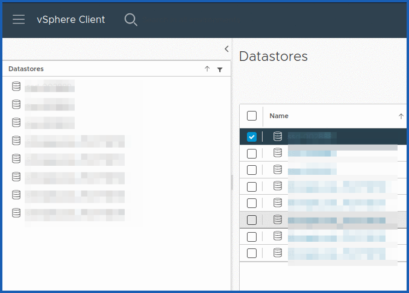{.thumbnail}

Vous constaterez que dans le sommaire de votre disque datastore, vous avez la balise associée ("assigned Tag").

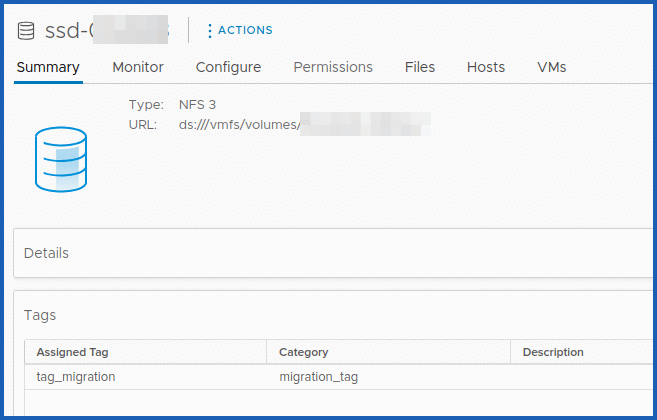{.thumbnail}

Faite le pour l'ensemble de vos datastores à migrer.

#### Comment tagger vos datastore avec une policy ?

#### Migration de VM (à chaud)

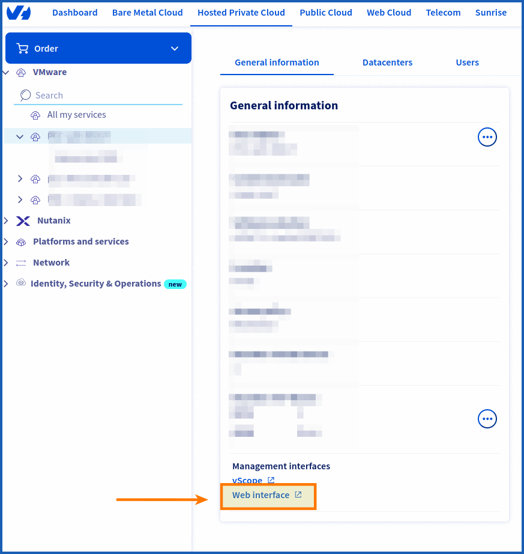{.thumbnail}

Vous pouvez vous connecter avec IAM ou en utilisateur local.

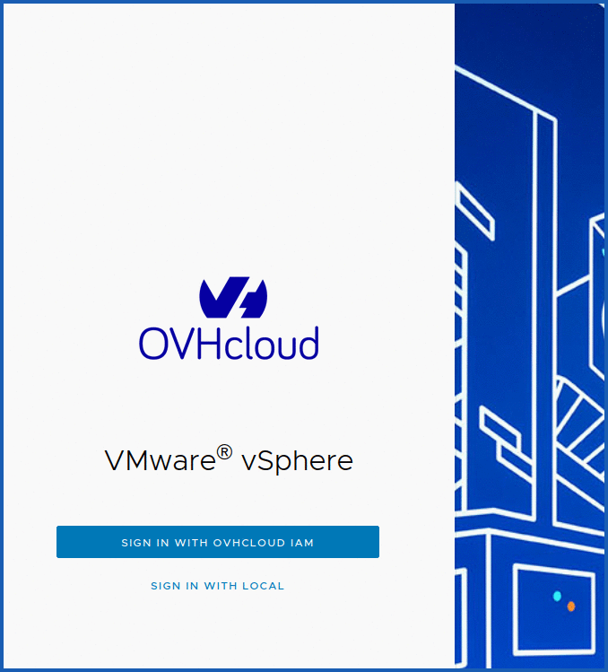{.thumbnail}

Nous vous invitons parallèlement à lancer des: `ping`{.action} depuis des invites de commandes (avec **openssh** par exemple), afin de verifier que vous n'avez pas de perte de connexion entre vos VM et internet.

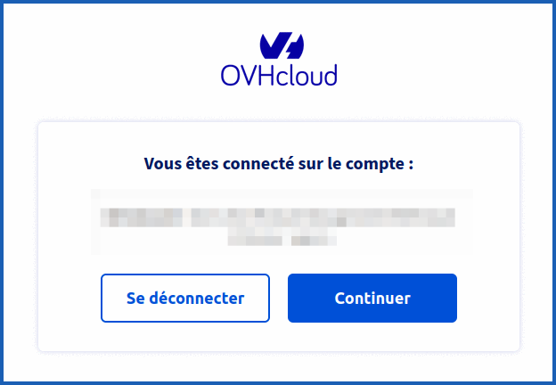{.thumbnail}

Vous devez ensuite choisir les machines virtuelles que vous voulez migrer. Sélectionnez votre cluster vSphere/vCenter, allez dans `VM`{.action}.

Cochez (sélectionnez) les machines virtuelles que vous souhaitez migrer.

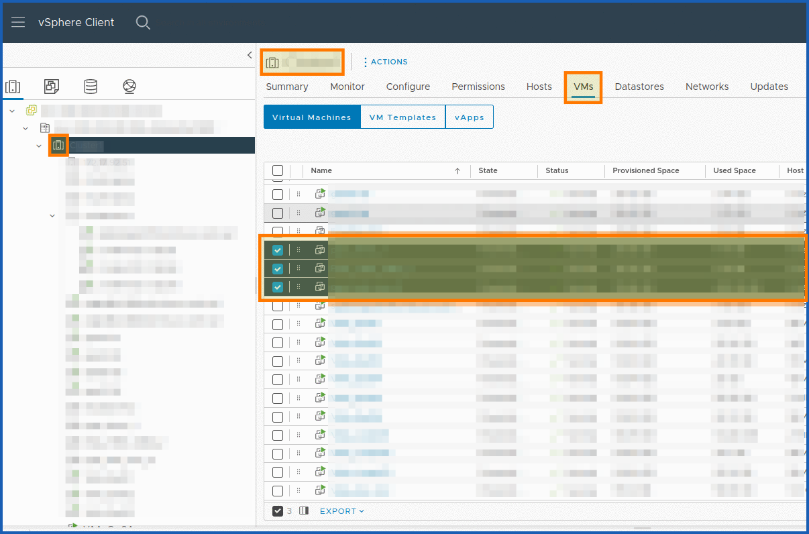{.thumbnail}

Puis, faites un clic droit sur les VM sélectionnnés et cliquez sur `Migrer...`{.action}

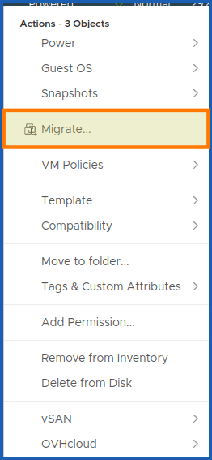{.thumbnail}

Une fois que vous avez cliquez sur: `Migrer...`{.action}

{.thumbnail}

Une fenêtre vous demande si vous voulez migrer toutes les VM selectionnées.

Cliquez sur: `Oui`{.action}

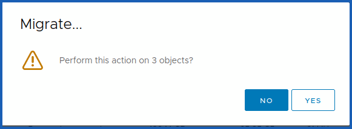{.thumbnail}

Vous arrivez à l'interface de migration vSphere/vCenter. Dans le cas actuel, nous voulons migrer les machines virtuelles vers un serveur vCenter Server non lié au domaine SSO actuel.

Choisissez donc: `Exportation entre vCenter Server`{.action}

Puis cliquez sur: `SUIVANT`{.action}

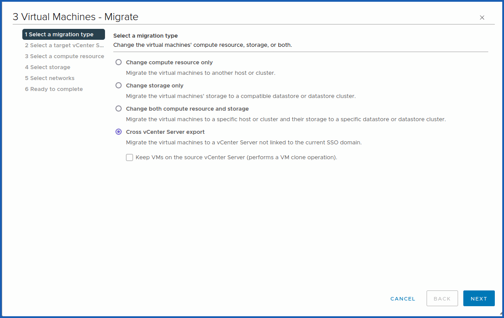{.thumbnail}

La configuration vCenter à utiliser pour VCD est:

- **Vcenter Server adresse:** exemple (**vcenter-gra.vcd.priv.ovhcloud.beta**).
- **Nom d'utilisateur: exemple (**admin@domain.local) -> si vous utilisez IAM (IAM.OVHCLOUD.COM\user123.il1234-ovh)
- **Mot de passe:** XXX -> Avec IAM, le mot de passe doit être celui du control panel manager OVHcloud.

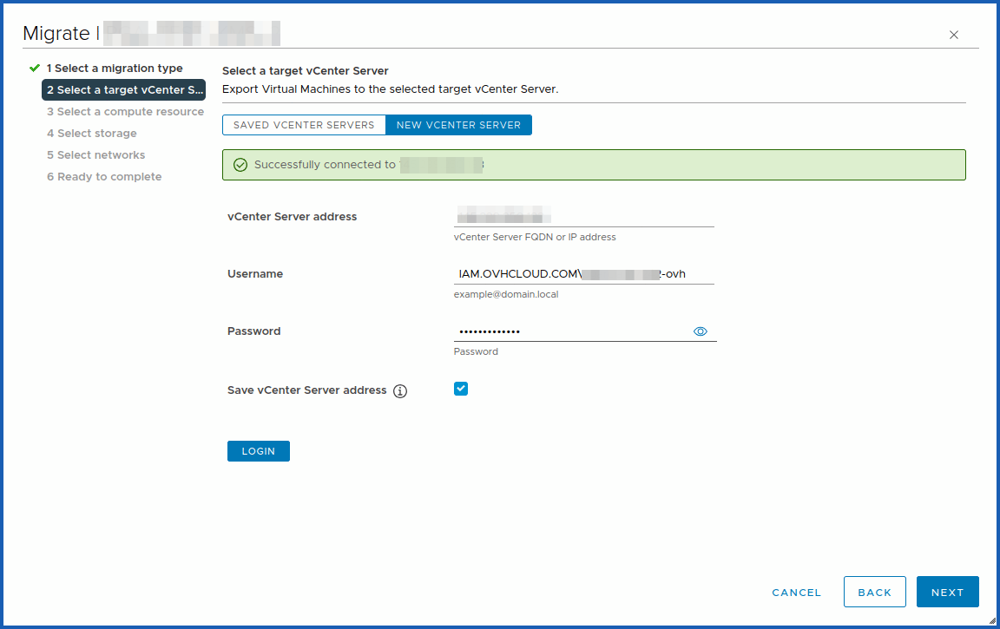{.thumbnail}

Vous devez ici, choisir le centre de données de destination.

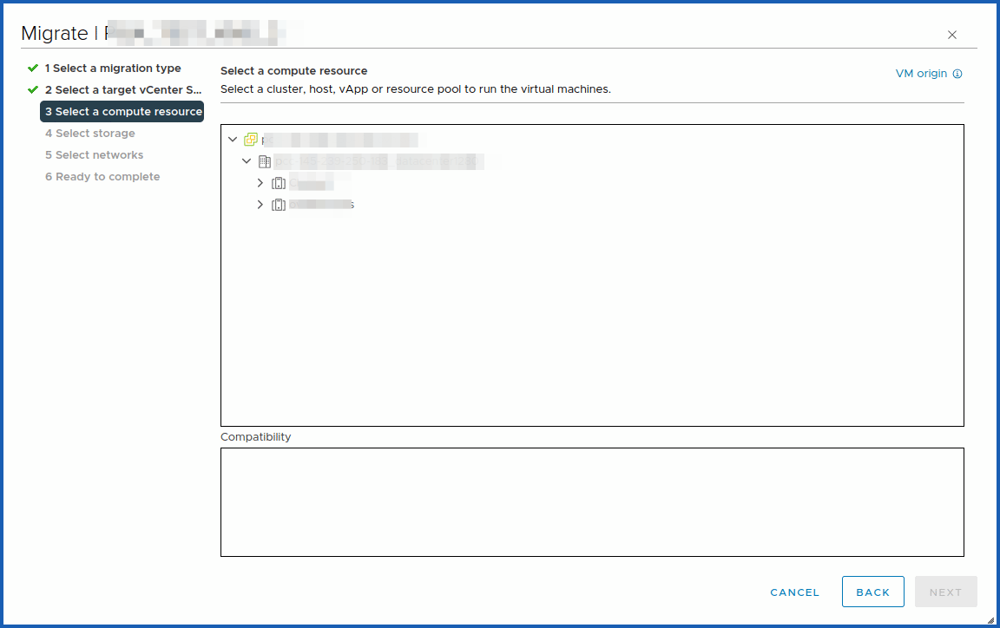{.thumbnail}

Vous avez à cette étape les hôtes, cluster et vSphere managé (pcc) de destination disponible pour la migration.

Sélectionnez les ressources que vous souhaitez, puis cliquez sur: `SUIVANT`{.action}

Vous pouvez verifier l'origine des machines virtuelles en cliquant sur `VM Origin`{.action}

Un test de compatibilité est effectué lors de la selections des ressources de destination. Dans le cadre de compatibilité.

Si tout est bon vous constaterez que les check sont en `Réussite`{.action}

Cliquez ensuite sur: `SUIVANT`{.action}

Vous devez sélectionner ici le datastore cible. Choisissez celui que vous souhaitez, puis cliquez sur `SUIVANT`{.action}

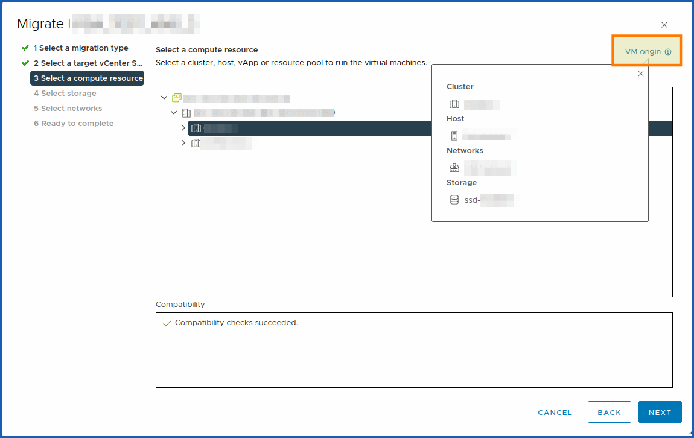{.thumbnail}

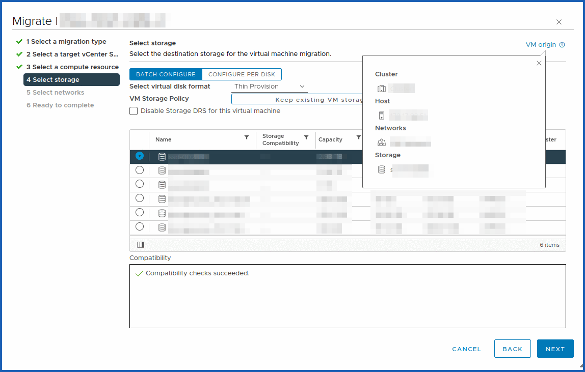{.thumbnail}

Nous arrivons à l'étape de sélection du réseau cible. Vous avez préalablement branché le réseau publique VCD avec le réseau vSphere managé (pcc) afin de pouvoir migrer les données (VM).

Il ne vous reste plus qu'à importer ces réseaux dans les sources de destination de la migration.

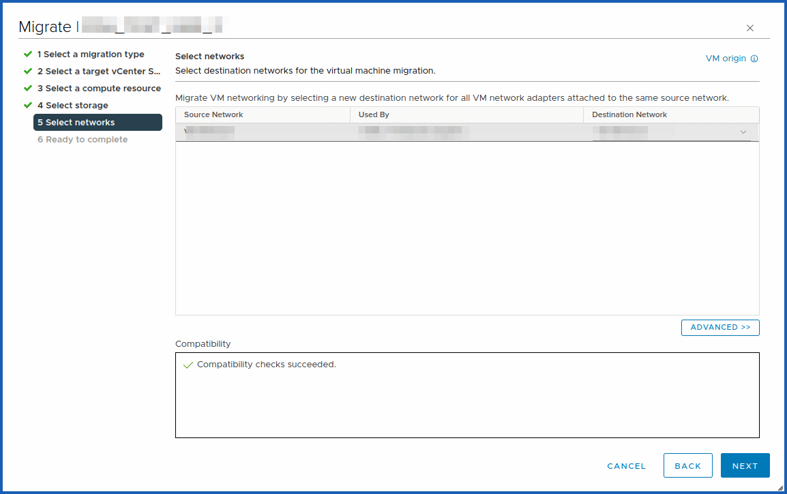{.thumbnail}

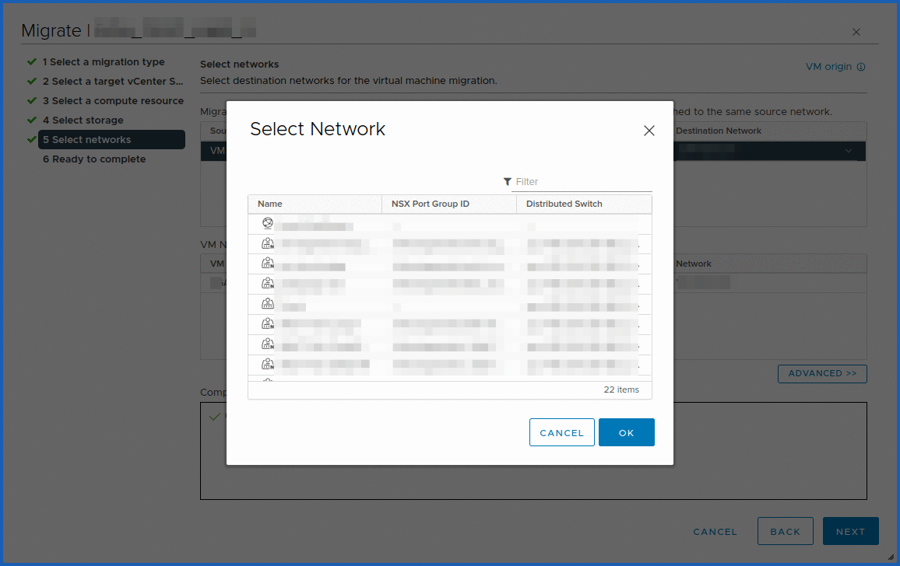{.thumbnail}

Choisissez le bon réseau puis cliquez sur: `OK`{.action}

Et pour terminer l'étape du réseau cible lors de cette migration de VM, cliquez sur: `SUIVANT`{.action}

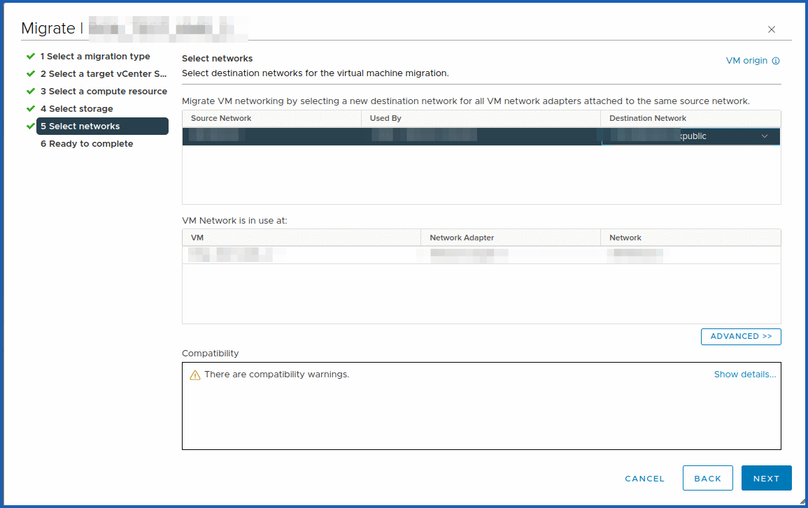{.thumbnail}

#### Import des VM vSphere dans VCD

Depuis le control panel VCD, allez dans: `Centre de données`{.action}, puis dans `Calculer > vApp`{.action}

Cliquez sur `NOUVEAU`{.action}, `Import depuis vCenter`{.action}

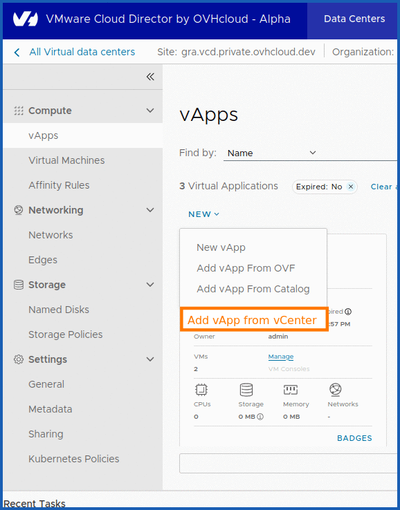{.thumbnail}

///

## Étape 2 - Les cas particuliers

/// details | Quelles sont les cas particuliers de migration ?

**Tableau de migration - Tous les cas d'utilisations:**

| Steps            | Migration type  | Stockage  | Use cases                                                                                          | Manual actions to launch                                                                                                                                                                                                                   | Client actions | OVHcloud actions | Commentaires                                                                                                                                                                | Référence à une documentation technique |
|------------------|-----------------|-----------|----------------------------------------------------------------------------------------------------|--------------------------------------------------------------------------------------------------------------------------------------------------------------------------------------------------------------------------------------------|----------------|------------------|-----------------------------------------------------------------------------------------------------------------------------------------------------------------------------|-----------------------------------------|
| Pre-check        | vMotion (hot)   | NFS/VMFS  | - CARP (Common address redundancy protocol) to be coded.                                           | - Detection + Implementation on VCD side for this use cases.                                                                                                                                                                               | None           | Yes              | After migration the vSphere managed hosts won't exist anymore.                                                                                                              |                                         | 
| Pre-check        | vMotion (hot)   | NFS/VMFS  | - Scale0 on PCC (NSX-T 4.0.1) → ✅  (can be migrated)                                               | 	- Ignore this profil and remove them (pcc ?), in relation to this use cases.                                                                                                                                                              | None           | Yes              | After migration the vSphere managed hosts won't exist anymore.                                                                                                              |                                         |                                                                                                                                                                                                                                                                                                                                                  
| Pre-check        | vMotion (hot)   | NFS/VMFS  | - Edge, Backup infra, zerto infra, private GW... (OVH vms) Virtual Machines → ✅  (can be migrated) | 	- Do not migrate this uses cases, to difficult.                                                                                                                                                                                           | None           | Yes              | After migration the vSphere managed hosts won't exist anymore.                                                                                                              |                                         |                                                                                                                                                                                                                                                                                                                                               
| Pre-check        | vMotion (hot)   | NFS/VMFS  | - Multi vDC -> Warning with this use case (check comments).                                        | 	- Read this guide, if datacenter is empty → Ignore other only if only one case (client) should migrate to VCD. Lets contact and block the relation with this use cases.                                                                   | None           | Yes              | After migration the vSphere managed hosts won't exist anymore.                                                                                                              |                                         |                                                                                                                                                                                                                                                                                                                                                 
| Pre-check        | vMotion (hot)   | NFS/VMFS  | - FT  ✅ -> Can be migrated                                                                         | - Detection + Errors + E-Mail or detection + E-Mail + Disable FT on PCC side + Migration in relation with this use cases.                                                                                                                  | None           | Yes              | After migration the vSphere managed hosts won't exist anymore.                                                                                                              |                                         |                                                                                                                                                                                                                                                                                                                                                 
| Pre-check        | vMotion (hot)   | NFS/VMFS  | - DRS Affinity/Anti affinity rules (warning, be carefull with migration).                          | - Partial only VMs, distinction between required and preferred in VCD, what do we take by default → detection + VCD implementation side → (avertissement) public documentation VM ↔ host won't be migrated and migrate VMs affinity rules. | None           | Yes              | After migration the vSphere managed hosts won't exist anymore.                                                                                                              |                                         |                                                                                                                                                                                                                                                                                                                                                   
| Pre-check        | vMotion (hot)   | NFS/VMFS  | - Check special devices (CD...) → ✅                                                                | - Read this guide informations   And notify customer, send E-Mail before migration to this related use cases.                                                                                                                          | None           | Yes              | After migration the vSphere managed hosts won't exist anymore.                                                                                                              |                                         |                                                                                                                                                                                                                                                                                                                                                   
| Pre-check        | vMotion (hot)   | NFS/VMFS  | - Datastores cluster → ✅   (read guide, this cases are validated).                                 | - Read this guide, informations in relation to this use cases.                                                                                                                                                                             | Yes            | Yes              | Notifier client et ignorer. After migration the vSphere managed hosts won't exist anymore. After migration the vSphere managed hosts won't exist anymore.                   |                                         |                                                                                                                                                                                                                                                                                                                                                   
| Pre-check        | vMotion (hot)   | NFS/VMFS  | - Memory over-commitment (warning, be carefull with this use case).                                | - Read this guide, informations in relation to this use cases.                                                                                                                                                                             | Yes            | Yes              | Détecter + Erreurs + E-Mail    Demander au client pour ajouter ou libérer les ressources. After migration the vSphere managed hosts won't exist anymore.                |                                       
| Pre-check        | vMotion (hot)   | NFS/VMFS  | - Resource pools → 2 use cases, (warning, be carefull with migration, check comments).             | - Read this guide, informations in relation to this use cases.                                                                                                                                                                             | None           | Yes              | Pas de notion sur VCD   Enlever et documenter.  After migration the vSphere managed hosts won't exist anymore.                                                          |                                         |                                                                                                                                                                                                                                                                                                                                                   
| Pre-check        | vMotion (hot)   | NFS/VMFS  | - Security option (erreur, check comments)                                                         | 	- Read this guide and detect security option linked to certification and block, in relation to this use cases.                                                                                                                            | None           | Yes              | After migration the vSphere managed hosts won't exist anymore.                                                                                                              |                                         |                                                                                                                                                                                                                                                                                                                                                    
| During migration | vMotion (hot)   | NFS/VMFS  | - Encrypted VM disks (check comments)	                                                             | - Decipher data before migration, detection and block (limit the time the data is deciphered). In relation to this use cases.                                                                                                              | Yes            | Yes              | Uncipher VM. After migration the vSphere managed hosts won't exist anymore.                                                                                                 |                                         |                                                                                                                                                                                                                                                                                                                                                   
| Pre-check        | vMotion (hot)   | NFS/VMFS  | - Zerto (errors with Zerto use cases) → list block (warning, be carefull on migration with Zerto)  | 	- Warning with 8 use cases like this. Also read this guide informations related to this use case. In relation to this use cases.                                                                                                          | None           | Yes              | After migration the vSphere managed hosts won't exist anymore.                                                                                                              |                                         |                                                                                                                                                                                                                                                                                                                                                   
| Pre-check        | vMotion (hot)   | NFS/VMFS  | - Hosts freespare and hourly                                                                       | - Ask client for migration. After 01h24 it passes in error state CCO. Ask client in relation to this use cases.                                                                                                                            | None           | Yes              | After migration the vSphere managed hosts won't exist anymore.                                                                                                              |                                         |                                                                                                                                                                                                                                                                                                                                                   
| Pre-check        | vMotion (hot)   | NFS/VMFS  | - Check NSX-v usage (warning, be carefull with migration in some NSX-v cases)                      | 	- Read this guide. And becareful because cannot be migrated if Edge and DFW, currently blocking migration, are processed in another wave (we will check if it can be managed manually → 15 occurrences with usage).                       | None           | Yes              | After migration the vSphere managed hosts won't exist anymore.                                                                                                              |                                         |                                                                                                                                                                                                                                                                                                                                                  
| Pre-check        | vMotion (hot)   | NFS/VMFS  | - Check HCX usage (can not be migrated).                                                           | 	- Read this guide information in relation to this use cases.                                                                                                                                                                              | None           | Yes              | - Impossible de migrer la documentation publique. La fonctionnalité doit être désactivée avant la migration. After migration the vSphere managed hosts won't exist anymore. |                                         |                                                                                                                                                                                                                                                                                                                                                                            

### Listing des cas particuliers

### Multi vDC

Dans le cas d'une migration multi-vDC, 

Multi nic vMotion

### Le chiffrement/déchiffrement de VM avant/après migration

Si vos données sont chiffrées, vous devez les déchiffrer avant la migration. Voici la procédure de déchiffrement des machines virtuelles avant migration:

Le même service vSphere Trust Authority doit être configuré sur l'hôte de destination ?

### DRS Affinity/Anti affinity rules

DRS Affinity/Anti affinity rules ?

### Zerto 

Car Zerto (erreur) → list block  ?

### Resource pools 

→ 2 use cases ?

### Memory over-commitment (avertissement)

///
## Aller plus loin

Si vous avez besoin d'une formation ou d'une assistance technique pour la mise en œuvre de nos solutions, contactez votre Technical Account Manager ou [rendez-vous ici](/links/professional-services) pour obtenir un devis et demander une analyse personnalisée de votre projet à nos experts de l’équipe Professional Services.

Posez des questions, donnez votre avis et interagissez directement avec l’équipe qui construit nos services Hosted Private Cloud sur le [channel Discord](<https://discord.gg/ovhcloud>) dédié.

Rejoindre et échangez avec notre [communauté d'utilisateurs OVHcloud](/links/community).
