

> [!primary]
> 
> VCD on OVHcloud is currently in Alpha phase. This guide may be incomplete.
>

## Objective

**The guide details the fundamental principles and notions of networking within VMware Cloud Director on OVHcloud.**

## Requirements

> [!primary] 
> 
> If you are unsure how to log in to your organization's web portal, first refer to the guide: [How to log in to VCD](/pages/hosted_private_cloud/hosted_private_cloud_powered_by_vmware/vcd-logging).
>

- A web browser (with a preference of chromium based one, and translation enabled in English)
- A VMware Cloud Director account with required user rights (check that your user account has sufficient rights).
- You need to have followed the guide: "[VMware Cloud Director - Basic VCD concepts](/pages/hosted_private_cloud/hosted_private_cloud_powered_by_vmware/vcd-get-concepts)".

## Instructions

/// details | Introduction to networking within VCD.

In this introductory guide, we will explore:

- The different networking concepts within VMware Cloud Director on OVHcloud.
- The notions of optimizing network space such as IP space, Edge gateways, datacentre groups for example.

To ensure a flexible and secure network infrastructure in a versatile cloud environment, VMware Cloud Director uses a layered networking architecture that includes four categories of networks:

- **External networks**.
- **Organizational vDC networks**.
- **Datacentre group networks**.
- **vApp networks**.

Most of these networks require additional infrastructure elements such as **"Edge Gateways"** and **Network Pools"**.

The VCD control panel has a network banner with 6 sections: 

- `Network`
- `Edge Gateways`
- `Provider Gateways`
- `IP Spaces`.
- `Data Center Groups`
- `Security Tags`

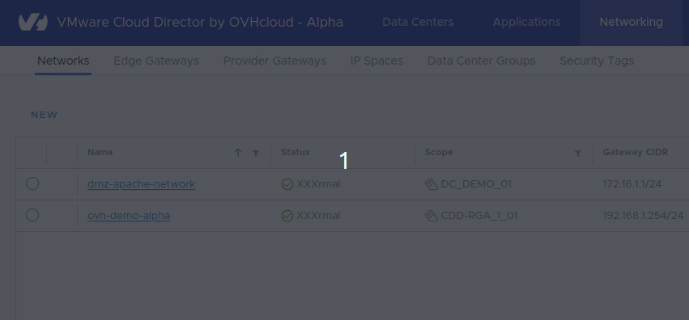{.thumbnail}

As well as a network section within each vDC in `Data Center Groups > My vDC Name > Networking > Network > Edge Gateway`.

///

### Step 1 - Network offers and features

/// details | What capabilities, features and functions are offered? 

**VCD on OVHcloud networking capabilities**

Here are the main network features offered with the VCD on OVHcloud solutions.

| Features                        	| Standard 	| Advanced 	| Premium 	| Comments                                                                                                                                                                                           	                        |
|---------------------------------	|----------	|----------	|---------	|-----------------------------------------------------------------------------------------------------------------------------------------------------------------------------------------------------------------------------|
| Routing & Switching IPv4        	| ✅        	| ✅        	| ✅       	| - Network segments. distributed & non distributed routing.   - Routed Network with or without NAT/BGP/DHCP/DNS/Static routes.   - Cross vDC networking on the same site.   - **Not supported:** OSPF, VRF Lite. 	 |
| Public IPv4 Range               	| ✅        	| ✅        	| ✅       	| 	                                                                                                                                                                                                                           |
| Private Network - vRack support 	| ✅        	| ✅        	| ✅       	| - in Roadmap                                                                                                                                                                                                  	             |
| Routing & Switching IPv6        	|          	|          	|         	| - in Roadmap                                                                                                                                                                                         	                      |
| VPN                             	|          	| ✅        	| ✅       	| - L2VPN, VPN IPsec Policy Based Not Supported: SSL VPN, Routed based IPsec VPN.                                                                                                                      	                     |
| Load Balancing                  	|          	|          	|         	| - Not supported with native VCD network capabilities                                                                                                                                                 	                      |
| Advanced Load Balancing         	|          	|          	|         	| - in Roadmap                                                                                                                                                                                         	                      |                                                                                          	|

**Network features**

Here is a comparison of the 3 solutions offered by VMware Cloud Director on OVHcloud.

|              | Advanced Network & Security | vSAN Storage |
|:------------:|:---------------------------:|:------------:|
| Standard VCD |              -              |      -       |
| VCD Advanced |              ✅              |      -       |
| VCD Premium  |              ✅               |       ✅       |

Here we see that only the advanced networking and security features within VCD on OVHcloud are available in the **Advanced and Premium** offers.

///

### Step 2 - Concepts and best practices

/// details | What are the best practices within the VCD control panel?

**Recommendations in network space design and administration**

| Design Recommendation                                                                                                 | Design Justification                                               | Design Involvement                                        |
|-----------------------------------------------------------------------------------------------------------------------|--------------------------------------------------------------------|-----------------------------------------------------------|
| Create one or more Edge Gateways (Level 1 Gateways) per organization vDC.                                             | Enables networking services for the organization's vDC.            | None.                                                     |
| Create datacenter groups, if there is a need to have Org vDC networks spanning multiple Org vDC's in an organization. | Simplifies Org vDC cross-functional connectivity.                  | Requires creation of datacenter groups in the VCD tenant. |
| Use the IP Spaces feature instead of traditional IP block addressing.                                                 | Note: The delivery of all Spaces IP features spans several phases. | None.                                                     |

**The network within VCD (concept)**

The types of network supported within an organization’s vDC:

| Datacentre network  | Description                                                                                                                                                                                                                                                                                                                                                                                                                                                                                                                                                                                                                                                                                                                                                                           |
|---------------------|---------------------------------------------------------------------------------------------------------------------------------------------------------------------------------------------------------------------------------------------------------------------------------------------------------------------------------------------------------------------------------------------------------------------------------------------------------------------------------------------------------------------------------------------------------------------------------------------------------------------------------------------------------------------------------------------------------------------------------------------------------------------------------------|
| Direct              | - An organization’s vDC network that has a direct connection to one of the external networks that are provisioned by the system administrator and rely on vSphere resources.      - Direct networks are supported for organization VDCs that rely on NSX. Direct networks are accessible by multiple organization VDCs.   Virtual machines belonging to different organization VDCs can connect to this network and see the traffic.       - A direct network provides direct Layer 2 connectivity to virtual machines outside of the organization VDC.     - Virtual machines outside of this organization VDC can connect directly to the virtual machines inside the organization VDC.      Note: Only OVHcloud can add a direct organization VDC network. |
| Isolated (Internal) | - Isolated networks can only be accessed by the same organization vDC.     - Only virtual machines located in this organization vDC can connect to the internal organization VDC network and see the traffic for it.    - Isolated networks are supported for organizational VDCs that rely on NSX or NSX Data Center for vSphere.  The isolated organization VDC network provides an organization VDC with an isolated private network to which multiple virtual machines and vApp can connect.     This network does not provide connectivity to virtual machines outside of the organization VDC. Machines outside the organization VDC cannot connect to machines inside the organization VDC.                                                                  |
| Routing             | - Routed networks can only be accessed by the same organization vDC.     - Only virtual machines inside this organization vDC can connect to this network.      - This network also provides controlled access to an external network. As a system administrator or organization administrator, you can configure Network Address Translation (NAT), Firewall, and VPN settings to make certain virtual machines accessible from the external network.    Routed networks are supported for organizational VDCs that rely on NSX or NSX Data Center for vSphere.                                                                                                                                                                                                    |

Organizational virtual datacentre (vDC) networks enable **vApps**/VMs to communicate with each other or with networks external to the organization.

Organization vDC networks provide direct or routed connections to external networks, or can be isolated from external networks and other organization vDC networks. Routed connections require an **Edge Gateway** and a **network pool** in the organization vDC.

A recently created organization vDC does not have any available networks.

**Network pools (concept)**

A network pool is a set of isolated layer 2 network segments that you can use to design vApp networks and various types of vDC networks to suit your requirements.

Network pools must be set up before organization vDC networks and vApp networks. In their absence, the only network option for an organization is to connect directly to an external network.

**IP spaces (recommended)**

> [!primary]
> 
> You can use a new way to manage your IP space in VMware Cloud Director on OVHcloud with the new IP space management subsystem.
> 
> An Edge gateways can only connect to provider gateways that use IP spaces.
> 

An IP space consists of a set of non-overlapping IP address ranges and small CIDR. blocks that are reserved and used when consuming the IP space lifecycle. An IP space can be IPv4 or IPv6, but not both.

Since version (10.4.1), IP spaces have been part of the new features. and are recommended for your network space needs.

There are two types of IP spaces that you can use as the Organization Administrator user:

- **Public IP space**: A public IP space is used by multiple organizations and is controlled by the Service Provider through a quota-based system.
- **Private IP space**: Private IP spaces are dedicated to a single tenant: a private IP space is used only by an organization specified when the IP space was created. For this organization, the consumption of IP addresses is unlimited.

{.thumbnail}

#### Via the VCD control panel

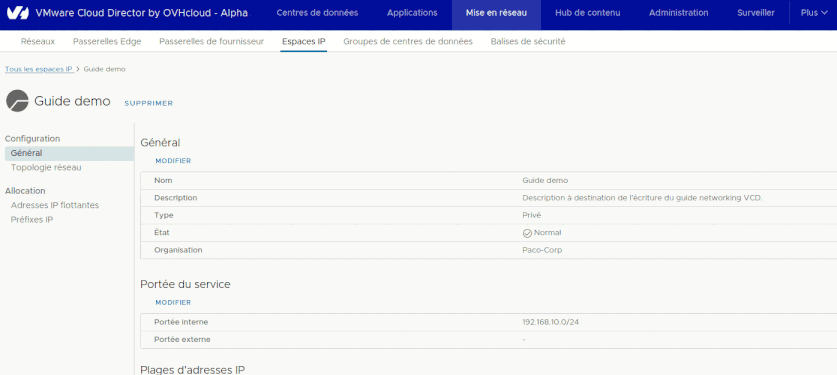{.thumbnail}

**Configuration:**

- `General`{.action}.
- `Network Topology`{.action}.

**Allocation:**

- `Floating IPs`{.action}.
- `IP Prefixes`{.action}.

**IP prefixes (recommended)**

You can set an IP prefix for automatic or manual use and prevent VMware Cloud Director from randomly assigning it.

If you no longer use an IP prefix that has been allocated to your IP space, you can free it up in the pool.

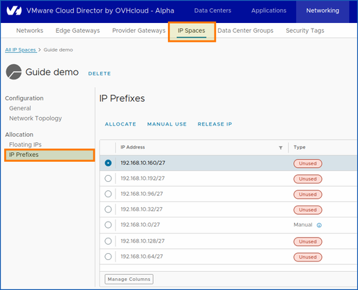{.thumbnail}

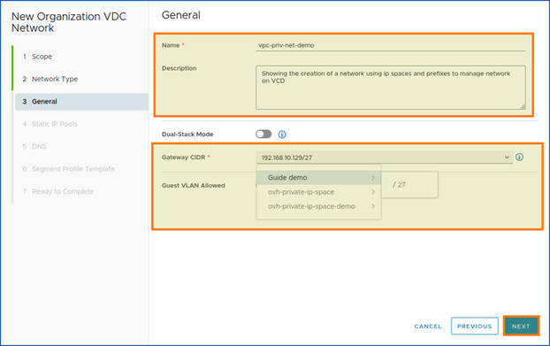{.thumbnail}

**Network topologies (concept)**

You can view the network topology from the VCD control panel by clicking on: `Networking | IP Spaces | IP space's name | Configuration | Network Topology`{action}

Network topologies are used to configure IP spaces to enable north-south traffic.

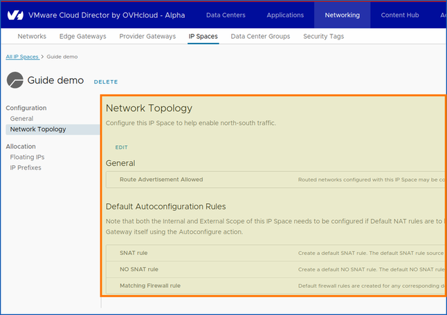{.thumbnail}

**Default auto-configuration rules:**

- Note that the internal and external scope of IP spaces must be configured if the default NAT rules are to be generated automatically. Default rules can be configured automatically on Edge Gateways and Provider Gateways by manually triggering them on them using the "Automatic Configuration" action.

**Datacentre groups (recommended)**

Datacentre group networks are a type of organizational vDC networks that are shared between one or more vDCs and to which vApps can connect.

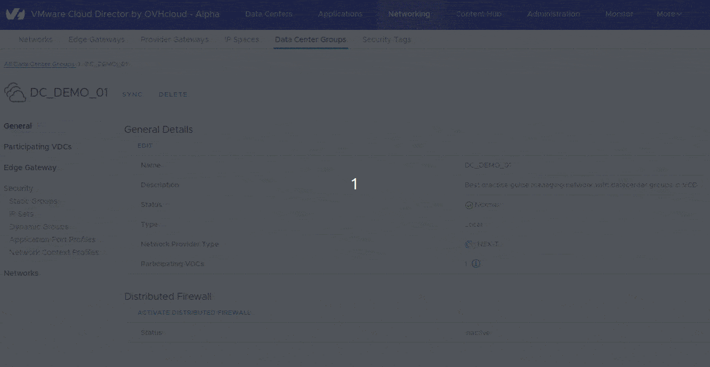{.thumbnail}

When creating a network, you can join your datacentre group, which will then provide connectivity to the vApps/VMs of all participating vDC.

**Synchronization (optional)**

You can also synchronize them. This synchronization action will check all associated vDC to ensure that they are always realized and correctly configured.

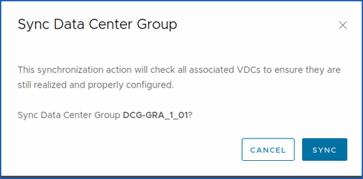{.thumbnail}

**Create or import network into datacenter group (optional)**

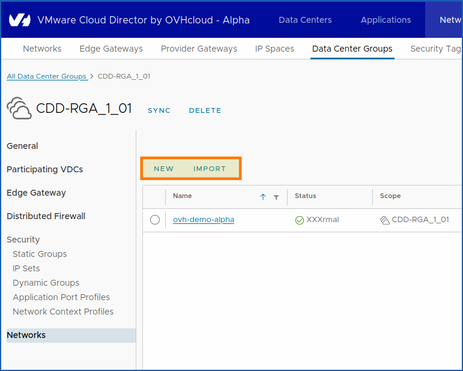{.thumbnail}

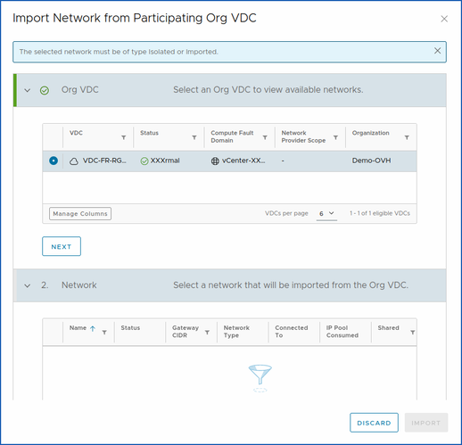{.thumbnail}

**Edge gateways (required)**

VCD Edge Gateway allows an organization vDC network to route connectivity to internal networks, network address translation (NAT), firewall, IPsec tunnel mounting,

- **VCD supports**: `IPv4 and IPv6` Edge Gateways.

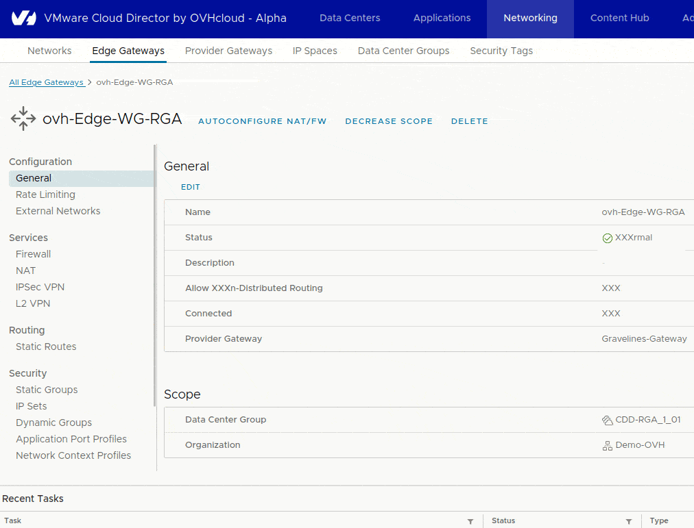

**DHCP mode (optional)**

> [!primary]
> 
> Warning: **DHCP** must be enabled and configured in a network in order to work properly if you need it.
>

DHCP automates the assignment of IP addresses to virtual machines connected to the organization's vDC networks.

**Three modes are available:**

- **Network:** A new DHCP service directly associated with this network is used to obtain the DHCP IPs. Use network mode if the network is isolated or if you plan to detach the network from the perimeter.
- **Relay:** DHCP messages are relayed from virtual machines to designated DHCP servers in your physical DHCP infrastructure.
- **Gateway:** The Edge Gateway DHCP service is used to obtain DHCP IPs.

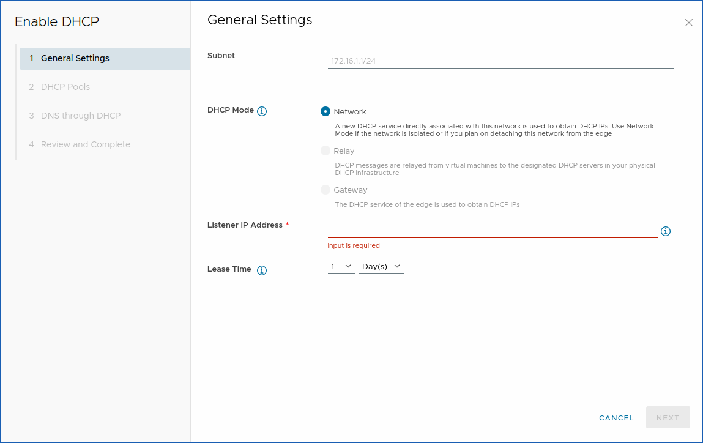

**vApp networks (concept)**

vApp networks allow virtual machines to communicate with each other or, by connecting to an organizational vDC network, with virtual machines in other vApps.

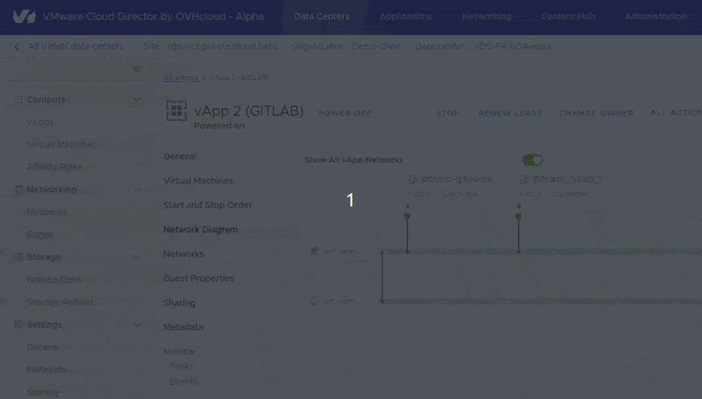

///

### Step 4 - Limitations

/// details | What are the known network limitations?

From a general point of view, the only limitations you can find within VCD on OVHcloud are those of a managed service.

A little less granularity when it comes to low-level configuration.

Of course, this can impact advanced networking features, although these features may be included in future phases.

**IPsec VPN Limitations**

When adding an IPsec tunnel, the parameter of adding a route-based IPsec session (route based IPsec tunnel) is not supported within VCD on OVHcloud to date (see: [docs / VMware NSX / NSX administration guide / Adding an IPSec session based on a route](https://knowledge.broadcom.com/external/article/319147/vmware-cloud-director-nsx-feature-suppor.html){.external}).

**Provider gateways limitations**

Provider gateways are clearly visible, but cannot be modified (like a managed service).

**NSX limitations**

You do not have access to the NSX control panel for your Hosted Private VMware Cloud Director on OVHcloud.

**Load Balancer limitations**

The features of Load Balancing within VCD on OVHcloud are not available at the moment.

**IAM limitations**

IAM is not available within VMware Cloud Director on OVHcloud at this time.

///

## Go further

You can now follow the steps in the following guide: [“Guide 2 - VMware Cloud Director on OVHcloud - Network - Creating network components via the VCD on OVHcloud control panel”](/pages/hosted_private_cloud/hosted_private_cloud_powered_by_vmware/vcd_network_creation).

**Networking for VMware Cloud Director on OVHcloud - Guide index:**

- « Guide 1: VMware Cloud Director on OVHcloud - Network - Concepts »
- [« Guide 2: VMware Cloud Director on OVHcloud - Network - Creating network components via the control panel VCD on OVHcloud »](/pages/hosted_private_cloud/hosted_private_cloud_powered_by_vmware/vcd_network_creation).
- **Coming soon** : « Guide 3 - VMware Cloud Director on OVHcloud - Network - How to create an IPsec tunnel with VCD on OVHcloud? »
- **Coming soon** : « Guide 4 - VMware Cloud Director on OVHcloud - Network - How to operate an IP block with VCD on OVHcloud? »
- **Coming soon** : « Guide 5 - VMware Cloud Director on OVHcloud - Network - How to use distributed firewalling (East - West)? »

**Useful network concept**

To strengthen your network knowledge within the OVHcloud universe, visit our website page: <https://www.ovhcloud.com/pt/network/>.

If you require training or technical assistance in implementing our solutions, please contact your sales representative or click on [this link](/links/professional-services) for a quote and request a custom analysis of your project from our Professional Services team experts.

Ask questions, give your feedback and interact directly with the team building our Hosted Private Cloud services on the dedicated Discord channel: <https://discord.gg/ovhcloud>. 

To join and exchange with our [community of users](/links/community).
