

> [!primary]
> 
> VCD on OVHcloud is currently in Alpha phase. This guide may be incomplete. Our team remains available on our dedicated Discord channel: <https://discord.gg/ovhcloud>.
>

## Objective

**This network guide explains how to create, configure and effectively manage your network (IP spaces, Edge gateways and providers, and private network) from the VCD on OVHcloud control panel.**

## Requirements

> [!primary]
> 
> If you are unsure how to log in to your organization's web portal, first refer to the guide: [How to log in to VCD](/pages/hosted_private_cloud/hosted_private_cloud_powered_by_vmware/vcd-logging).
>

- A web browser (with a preference of chromium based one, and translation enabled in English).
- A VMware Cloud Director on OVHcloud (Alphase phase) account with sufficient rights.

You need to have read the VCD guides:

- [VMware Cloud Director - Networking - Network concepts VMware Cloud Director on OVHcloud](/pages/hosted_private_cloud/hosted_private_cloud_powered_by_vmware/vcd_network_concepts).
- [VMware Cloud Director - The fundamentals of VCD](/pages/hosted_private_cloud/hosted_private_cloud_powered_by_vmware/vcd-get-concepts).
- [VMware Cloud Director - Connect to your organization](/pages/hosted_private_cloud/hosted_private_cloud_powered_by_vmware/vcd-logging).

## Instructions

Before creating a network, the main concept to understand with VMware Cloud Director is the IP space. For example, consider the default one created with your VCD organization:

**The internal scope** represents the entire IP of your future network, e.g.: `192.168.0.0/24`{.action}.

- IP ranges are IPs that you can request individually for your services (VMs not using DHCP for example). None here.
- IP prefixes are the IP subnet that you can use in your Edge Gateway, for example.
- IP ranges and IP prefixes cannot overlap and must be within the Internal Scope.

### Step 1: Create the IP space (recommended)

> [!primary]
> 
> You can use a new method of managing your IP space in VMware Cloud Director with the new IP space management subsystem.
>

/// details | How to create an IP space with VMware Cloud Director on OVHcloud?

To connect to your VCD environment, follow the guide: [How to connect to VCD](/pages/hosted_private_cloud/hosted_private_cloud_powered_by_vmware/vcd-logging).

1\. Next, click `Network | IP Spaces | New`{.action}.

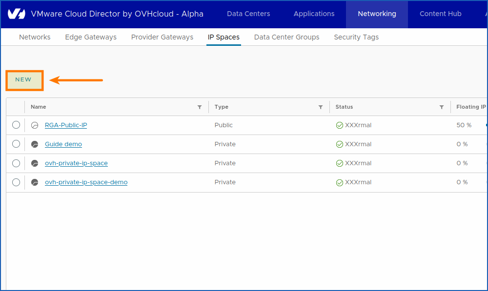{.thumbnail}

You will find the window for creating **an IP space** for your network, and choose the name you want:

**Example:**

- **Name**: `IP Space 01`.
- **Description**: `Private | Public IP Space`.

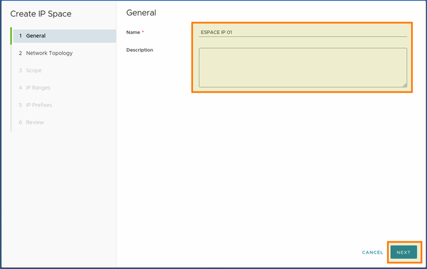{.thumbnail}

2\. Leave the following options disabled for now (Find more information about what is covered by future phases on the [OVHcloud user community](/links/community) forum, or on the Discord channel: <https://discord.com/invite/ovhcloud>).

{.thumbnail}

3\. Choose the perimeter (ported/extended), (internal/external), with which you want to access your network:

- **Internal Scope**: Represents the IPs used in this local datacentre, south of Provider Gateway. The IPs in this scope are used to configure services and networks.
- **External Scope**: Represents IPs used outside the datacentre, north of Provider Gateway. This value is used when automatically generating default SNAT rules.

Then click `NEXT`{.action}.

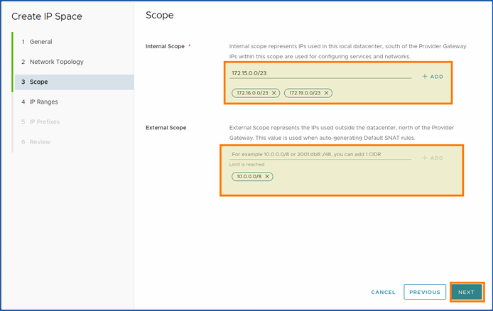{.thumbnail}

The IP ranges must correspond to the internal scope of this IP space (the range of IPs you want to make available for your machines).

4\. Click `ADD`{.action}.

Example: `172.19.0.2-172.19.0.100`.

Then click `NEXT`{.action}.

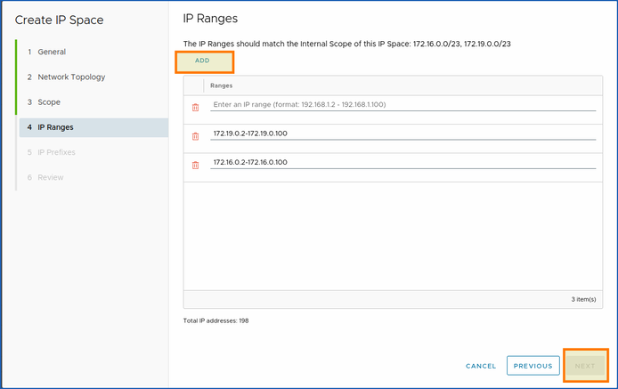{.thumbnail}

IP prefixes must match the internal scope of this IP space:

5\. Click `ADD`{.action}.

Then add your sequences and prefixes.

Example: `10.0.0.0/23 | 1`.

You can increase or decrease your number of prefixes with the (up/down) arrow: 

The sequence addition is automatically added as a preview if it is conclusive.

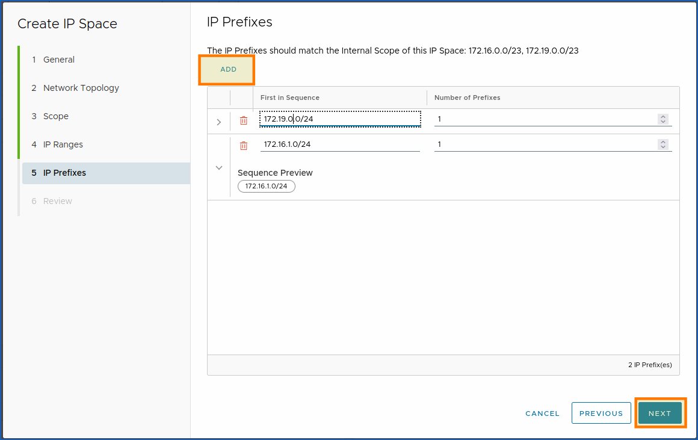{.thumbnail}

Click `NEXT`{.action} to complete step 5.

6\. The final section is a thorough review of all the settings you have made. You can then check and confirm your choice by clicking on the button `FINISH`{.action}.

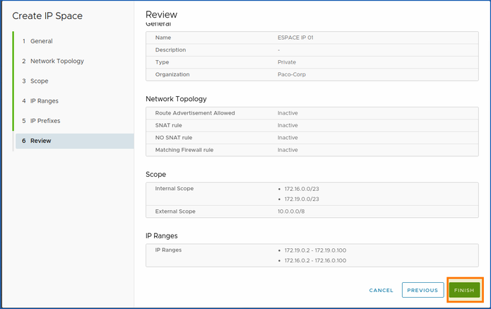{.thumbnail}

Next, we will move on to the VCD section: `VCD | Network | IP Space`{.action} to `VCD Network | Network`{.action}.

///

### Step 2 - Create a datacentre group (optional)

> [!primary]
> 
> You can use a new method of managing your IP space in VMware Cloud Director with the new IP space management subsystem.
>

/// details | How do I create a datacentre group?

**Use cases:**

This step is optional, but recommended for the vast majority of use cases (e.g. when two VDC networks need to add up).

We will now create a datacentre group to optimize the management of our network with this new VCD feature.

Go to the Networking section by clicking `Networking | Data Center Groups`{.action}.

Then click on `NEW`{.action}.

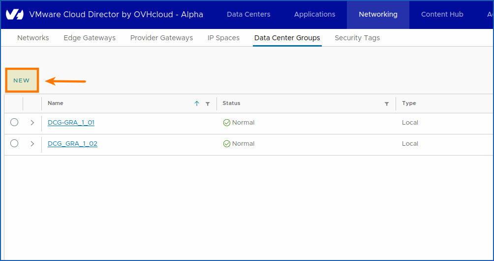{.thumbnail}

Select a vDC that will be part of the group. When you select a startup vDC, you can create a group in which this vDC can participate.

1\. Choose the vDC you want, then click on `NEXT`{.action}.

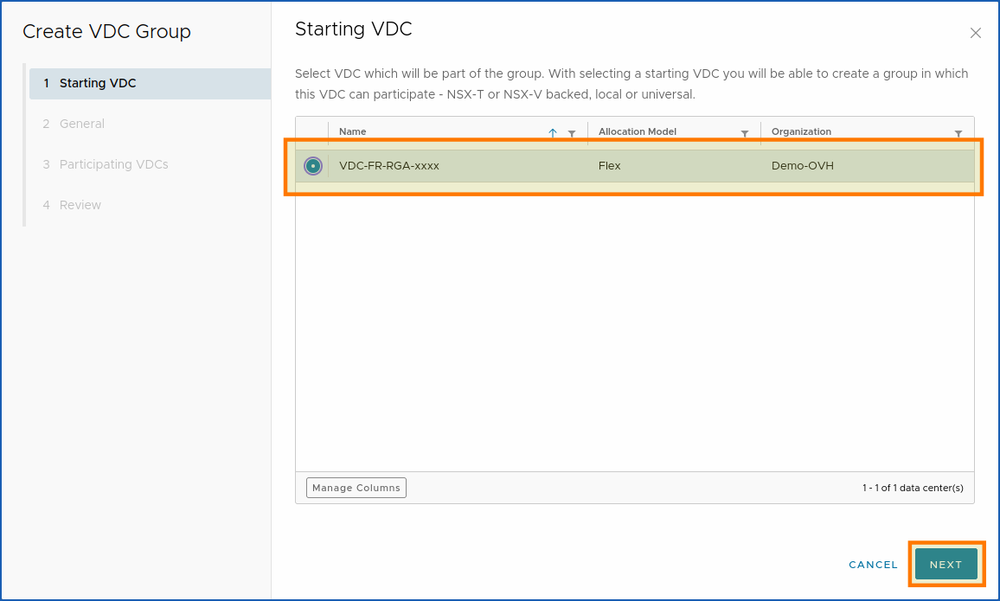{.thumbnail}

2\. In section 2, choose the name of your datacentre group and a short description, then click on `NEXT`{.action}.

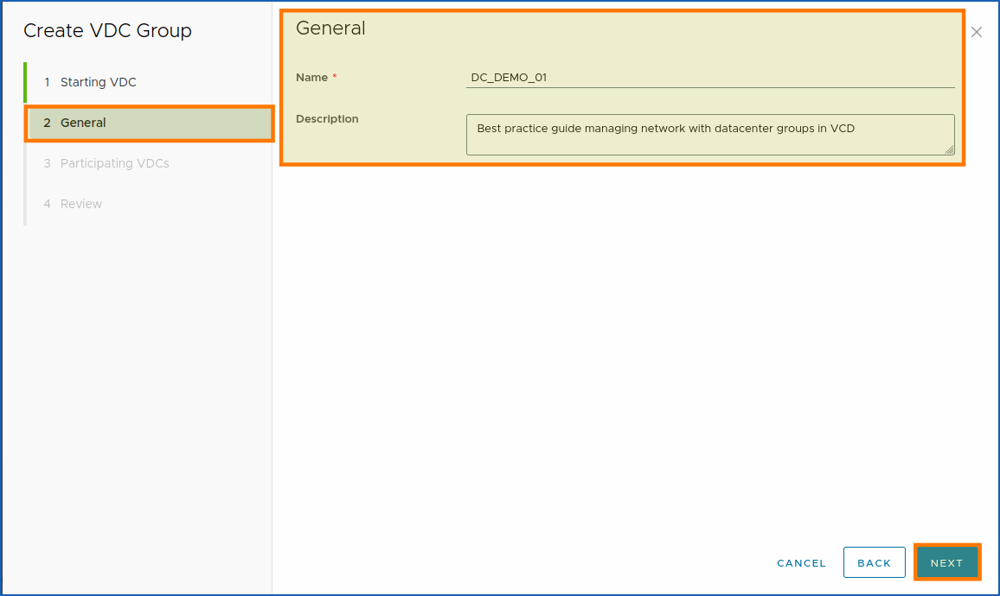{.thumbnail}

3\. Next, select the additional vDCs that you want to be part of the group, then click on `NEXT`{.action}.

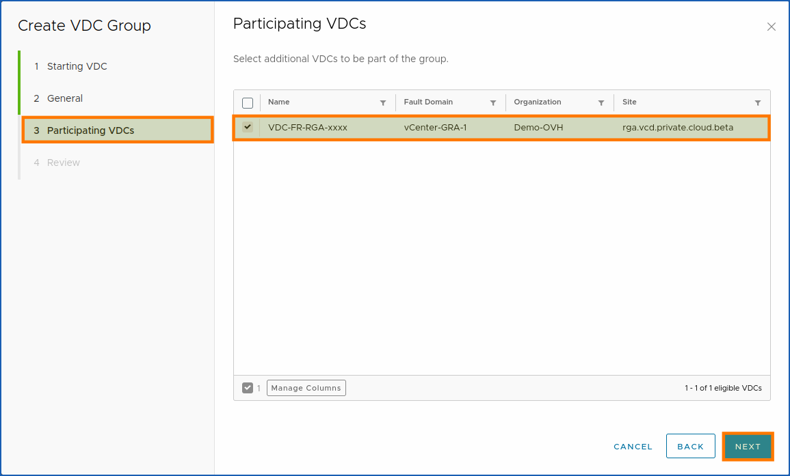{.thumbnail}

Finally, click on `FINISH`{.action}.

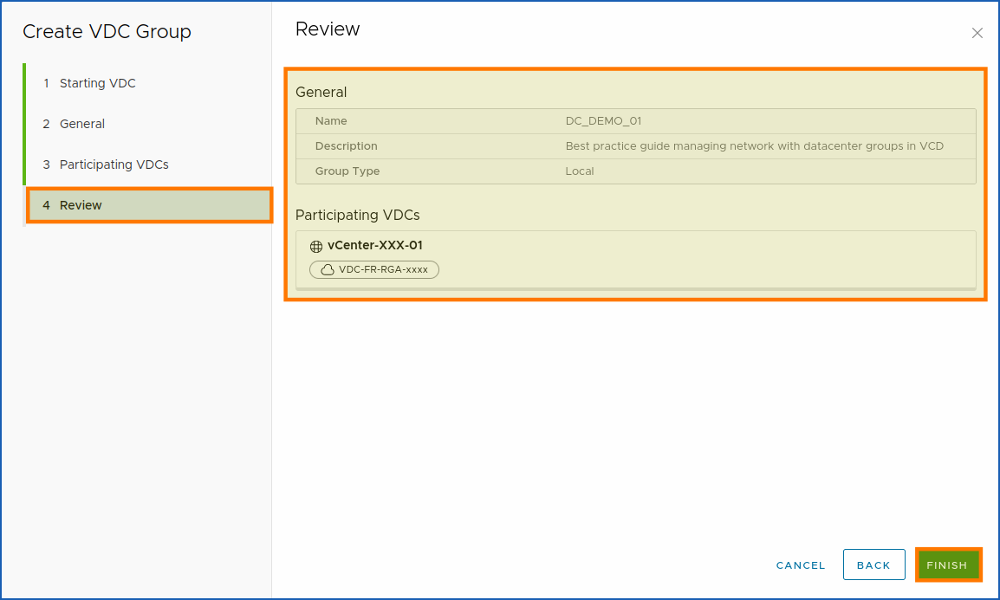{.thumbnail}

///

### Step 3 - Create an Edge Gateway (optional)

/// details | How do I create an Edge Gateway with VMware Cloud Director on OVHcloud?

This step is necessary, otherwise you will not be able to finish creating your network in step 3.

We will now create an **Edge Gateway** so that our IP space can be accessed via the private network, which we will create in the third subpart of this step.

To access the Edge Gateways section, click on `Networking | Edge Gateways`{.action}.

To create a new Edge Gateway, click on `NEW`{.action}.

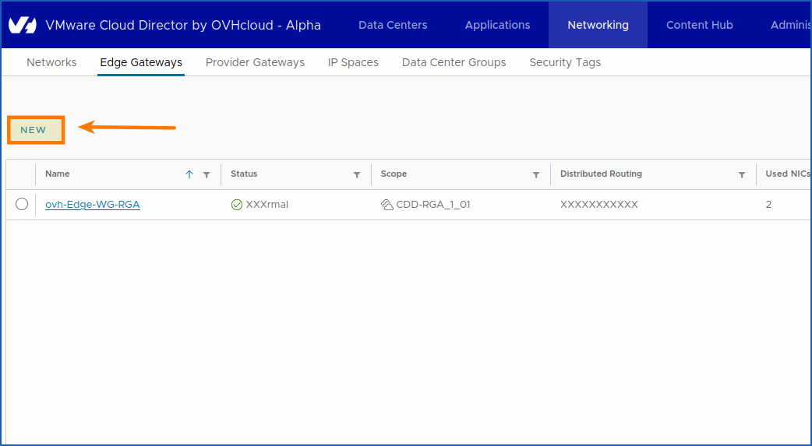{.thumbnail}

Here, you will see the window for creating an **Edge Gateway** for your VCD environment:

You can then choose between: `Organization Virtual Data Center`{.action} or `Data Center Group`{.action}.

- **Organization Virtual Datacenter**: Provides connectivity for VMs in the selected vDC only.
- **Datacentre Group**: Provides connectivity for the VMs of all virtual domain controllers participating in the datacentre group.

1\. Choose `Organization Virtual Data Center`{.action} or `Data Center Group`{.action} to select the virtual datacentre with which you want to install your new **Edge Gateway**.

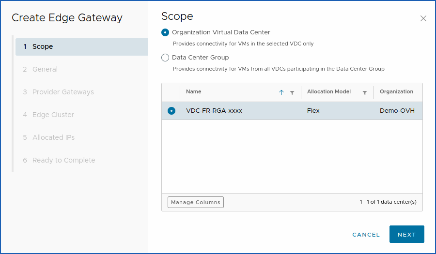{.thumbnail}

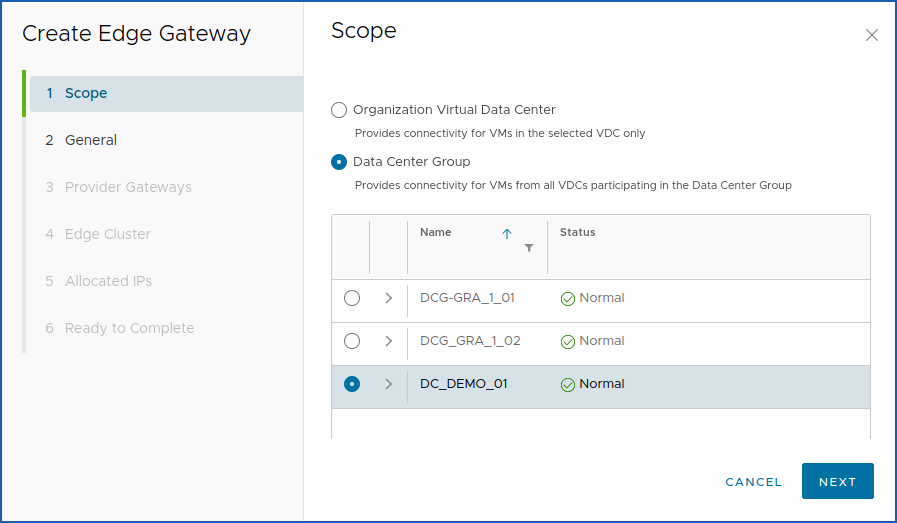{.thumbnail}

2\. After the general section, you can name your **edge gateway** in any way you want:

**Example:**

- **Name:** `ovh-Edge-GW-GRA`.
- **Description:** `Edge Gateway private network dmz zone 1 (Graveline, Roubaix, etc..)`.

Next, click on `Use IP Spaces`{.action}.

This forces the use of IP spaces with the Provider gateways and optimize the application of new intelligent VCD network space management techniques.

When done, click on `NEXT`{.action}.

3\. We will now move to sub-part 3 of the Edge gateway creation which is the choice of the `Provider Gateways`{.action}.

Choose the default gateway for your vDC provider: `graveline-gateway`{.action}.

Once you have chosen (step 3: Create an Edge Gateway), click `NEXT`{.action}.

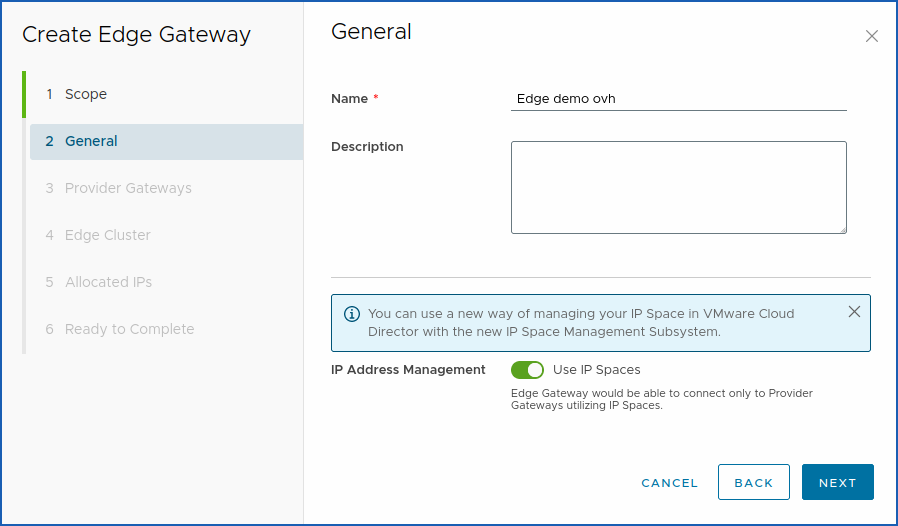{.thumbnail}

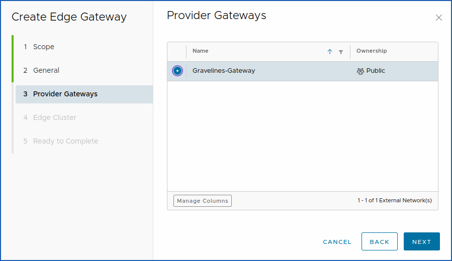{.thumbnail}

4\. Choose the Edge Cluster option to create this provider Edge Gateway:

The parameter: `Use the Tier-0 Gateway provider edge cluster`{.action} means that the edge cluster of the selected Tier-0 provider gateway will be used in order to keep the shortest network path.

When you have chosen your settings (step 4), click on `NEXT`{.action}.

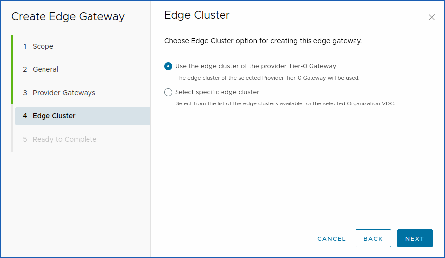{.thumbnail}

Once you have added the settings, you can check that everything is correct in section 5: `Ready to Complete`{.action}.

Finally, (step 5: Create an Edge Gateway) click on `FINISH`{.action}.

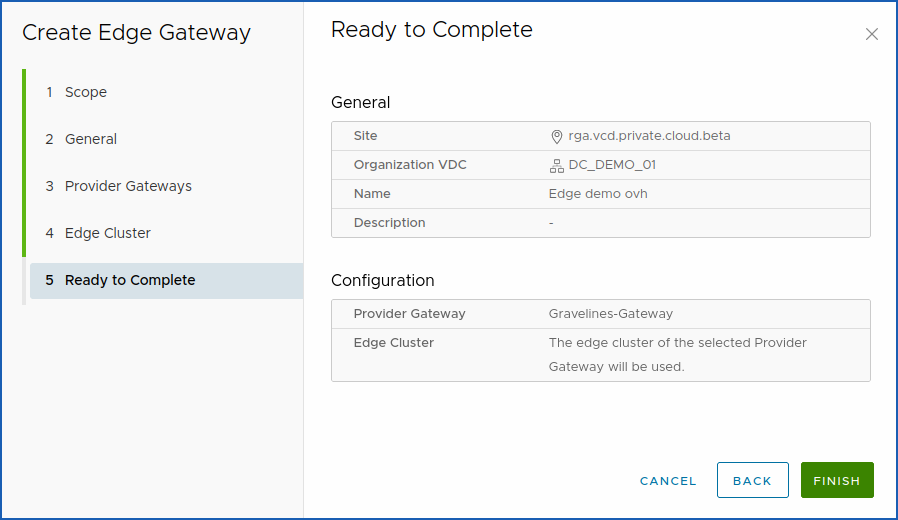{.thumbnail}

///

### Step 4 - Create a private network

/// details | How do I create a network with VMware Cloud Director on OVHcloud?

We will now create a new network and attach our preconfigured settings.

Go to the Networking section by clicking `Networking | Networks`{.action}.

Then click on: `NEW`{.action}.

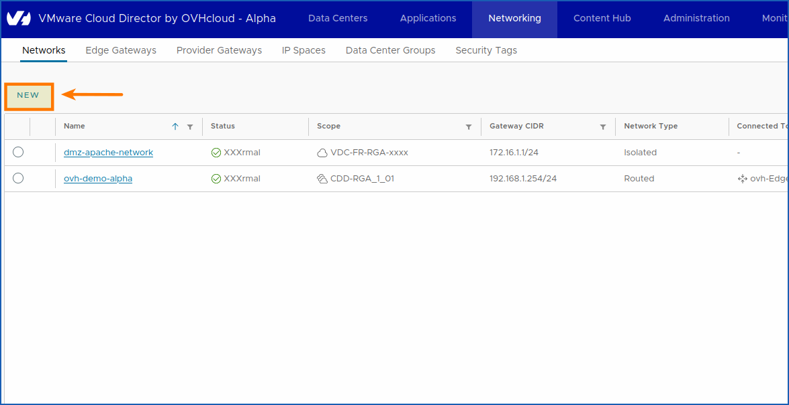{.thumbnail}

1\. You will find this after the Scope 1 section.

You can choose between:

- **Organization Virtual Datacenter**: Provides connectivity for VMs in the selected vDC only.
- **Datacentre Group**: Provides connectivity for the VMs of all virtual domain controllers participating in the datacentre group.

Select **the vDC Virtual Datacenter Organization** or the **Datacenter Group** in the scope in which you want to create your network.

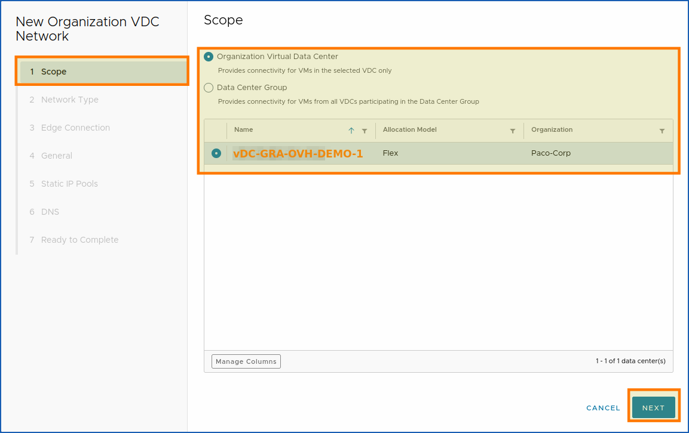{.thumbnail}

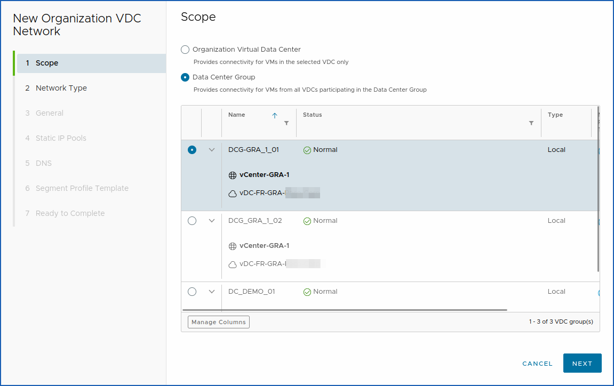{.thumbnail}

Next, select the type of network you want to create.

**What choices are available?**

You can create a **routed** or **isolated Network** type to suit your needs.

The **"routed"** allows incoming traffic, while the **"isolated"** forbids it.

**VCD definition:**

- **Routed**: This type of network provides controlled access to machines and networks outside of the vDC or vDC group through an edge gateway.
- **Isolated**: This type of network provides a fully isolated environment, accessible only by this organization's vDC or vDC group.

For a routed network, if your `VDC-FR/US/CA-GRA-XXX-XXX` vDC does not have an Edge Gateway available, you will get this error:

> [!warning]
> 
> The vDC “vDC-FR-GRA-XXXX-Corp” has no Edge Gateway available.
>

You can either create another **"Edge Gateway"**, or use the **"Datacenter Groups"** available to provide connectivity for the VMs of all participating vDCs.

The **Routed** (through an "ovh-Edge-GW-GRA" Edge Gateway) type of network provides controlled access to machines and networks outside of the vDC or vDC group through an edge gateway.

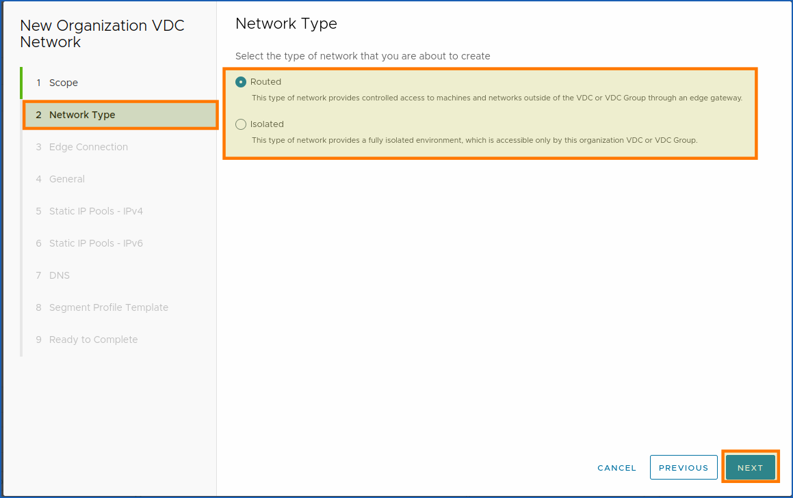{.thumbnail}

2\. In the `Edge Gateways`{.action} section, you will see your previously created Edge gateway: `ovh-Edge-gra-demo`.

- **Distributed Routing**: Edge gateway must have non-distributed routing enabled.

This would disable distributed routing so that all VM traffic passes through the service router.

Choose your **Edge Gateway** by clicking on the available round button (white) to the left. Then, once finished, click `NEXT`{.action}.

To conclude, click on `NEXT`{.action}.

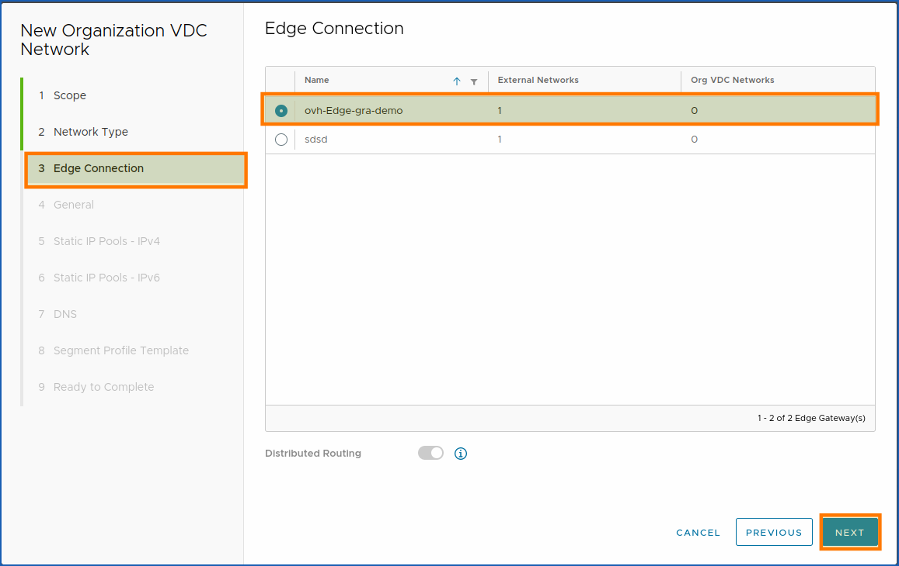{.thumbnail}

3\. In the general section, you can add the name of your network, a description, and the IP space created earlier.

If it has been created, it will automatically appear in the list (see next screenshot: CIDR. Gateway*).

- **Network**: `ovh-private-ip-space-demo > /24`.

**Dual-Stack Mode**: Enables the network to have one IPv4 subnet and one IPv6 subnet.

> [!warning]
> 
> You cannot undo the activation of dual stack networking mode.
>

We don't need IPv6 at all, so we choose to leave this option disabled.

To continue (step 3: Create a private network), click on `NEXT`{.action}.

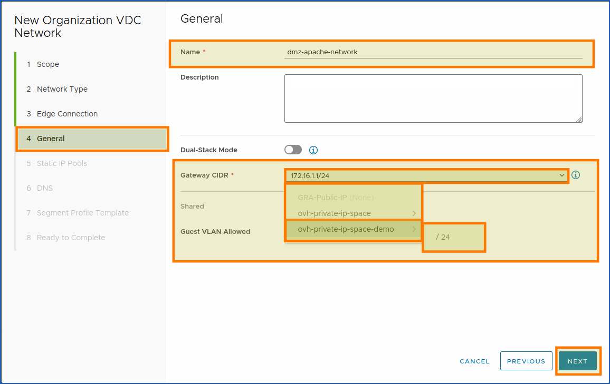{.thumbnail}

4\. Here, you can allocate your network’s IP range. We choose to allocate 98 IPs:

- `172.16.1.2-172.16.1.100`.

Once your IP range has been allocated, check that there is no space before and after the dash
between the two IP ranges:

- `172.16.1.2**->-<-**172.16.1.100`.

As well as at the beginning and end of your 2 IPs, ->**172.16.1.2**<- and ->**172.16.1.100**<-.

- **Example**: `172.16.1.2-172.16.1.100`.

To continue, click on `NEXT`{.action}.

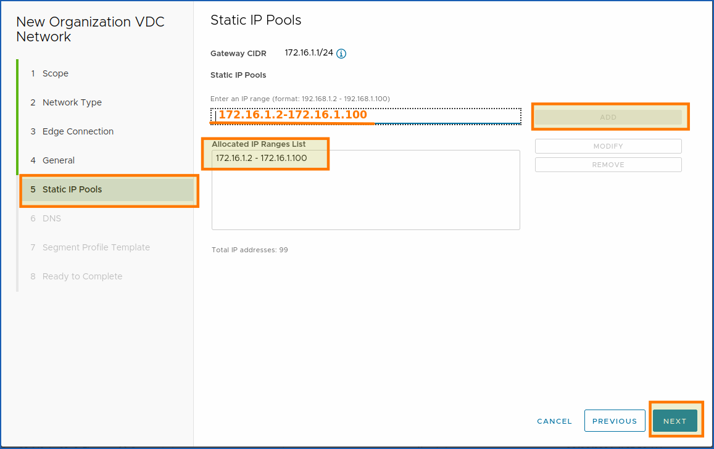{.thumbnail}

5\. In the fifth section, add the DNS servers for your network.

For security reasons, we have decided to blur them here.

But you can leave those used by default in the Hosted Private Cloud VMware on OVHcloud universe:

|             |DNS           |
|-------------|--------------|
| **Primary** | 213,186,33,99 |
| Secondary   | not used.    |
| Suffix      | not used.    |

To continue with step 5 (creating a private network), click on `NEXT`{.action}.

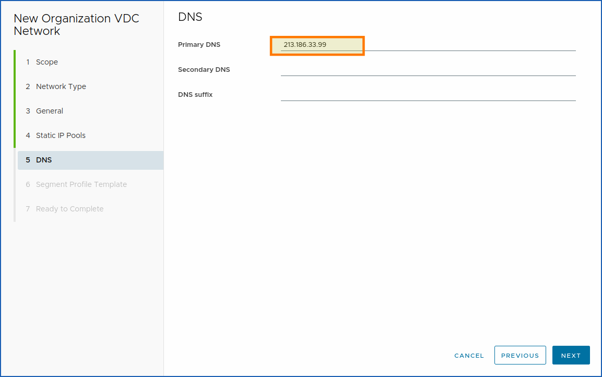{.thumbnail}

6\. (Optional) Segment profile templates can be defined here.

This can be used for advanced networking needs (e.g. with pfSense: Promiscuous mode).

There are **3 modes**:

- **Not defined (the mode in this guide).**
- **Allow-DHCP.**
- **Promiscuous mode.**

| Model details        | Promiscuous mode              |
|----------------------|-------------------------------|
| IP address discovery | NSX-T Default Segment Profile |
| MAC Discovery        | Promiscuous mode              |
| SpoofGuard           | NSX-T Default Segment Profile |
| Quality of service   | NSX-T Default Segment Profile |
| Segment Security     | NSX-T Default Segment Profile |

| Model details        | Allow-DHCP                    |
|----------------------|-------------------------------|
| IP address discovery | NSX-T Default Segment Profile |
| MAC Discovery        | Promiscuous mode              |
| SpoofGuard           | NSX-T Default Segment Profile |
| Quality of service   | NSX-T Default Segment Profile |
| Segment Security     | Allow-DHCP                    |

Custom segment profiles are required in a number of specific situations.

**These include:**

- MAC or IP learning must be enabled for nested environments.
- Custom security profiles to allow DHCP traffic from a network
- Enabling spoofing protection

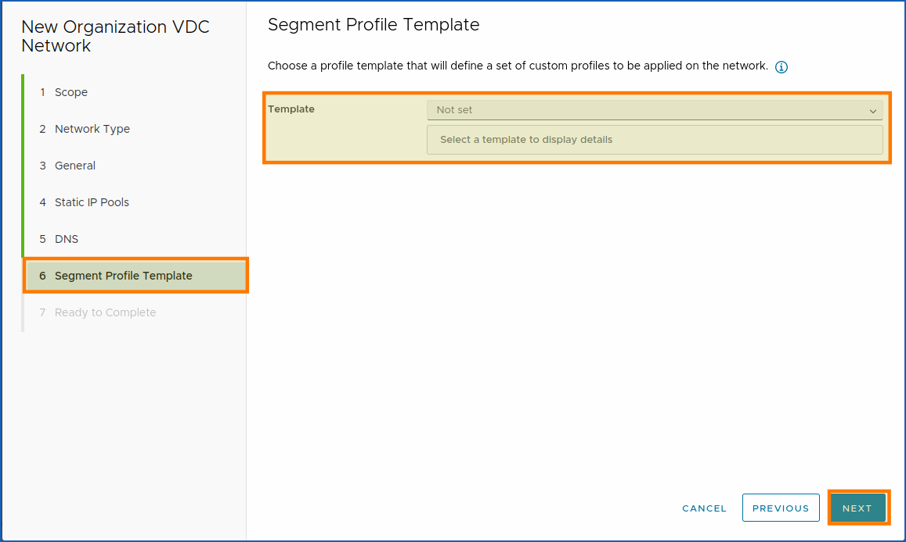{.thumbnail}

7\. Depending on your choice of configuration, you can go to step 7 or 8.

**Exemple:**

- **Step 7**: With "Segment Profile Template".
- **Step 8**: Without "Segment Profile Template".

Do a final check of the settings you defined, then click `FINISH`{.action}.

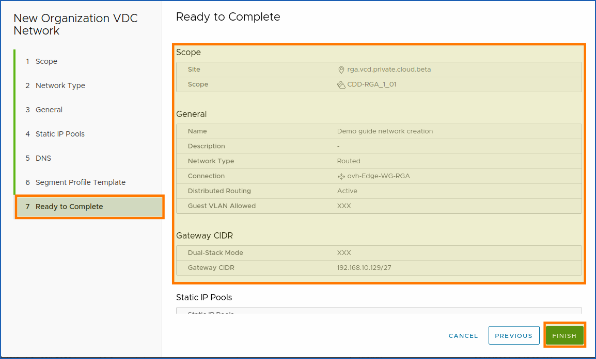{.thumbnail}

Your network is now fully created and ready to use.

///

## Go further

You can now follow the steps of the next guide :
- **Coming soon:** Guide 3 - VMware Cloud Director on OVHcloud - Network - How to create an IPsec tunnel with VCD on OVHcloud ?.

If you experience any network issues within VCD on OVHcloud, please read our guide "[VMware Cloud Director on OVHcloud - Network - Concepts](/pages/hosted_private_cloud/hosted_private_cloud_powered_by_vmware/vcd_network_concepts)".

If you require training or technical assistance in implementing our solutions, contact your sales representative or [click here](/links/professional-services) for a quote and request a custom analysis of your project from our Professional Services team experts.

Ask questions, give your feedback and interact directly with the team building our Hosted Private Cloud services on the dedicated Discord channel: <https://discord.gg/ovhcloud>.

Join our [community of users](/links/community).