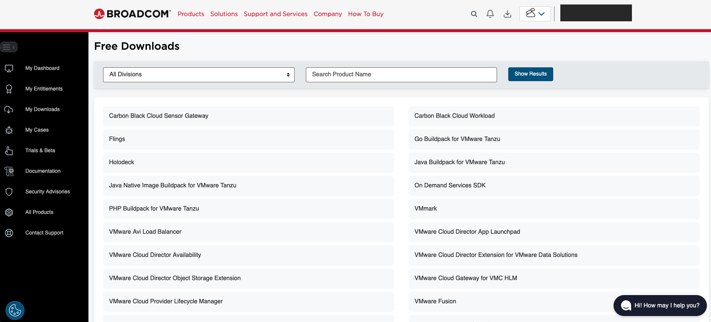
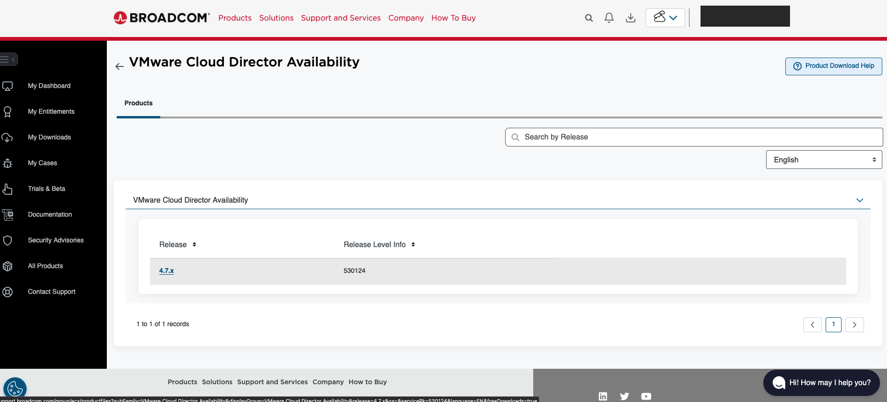
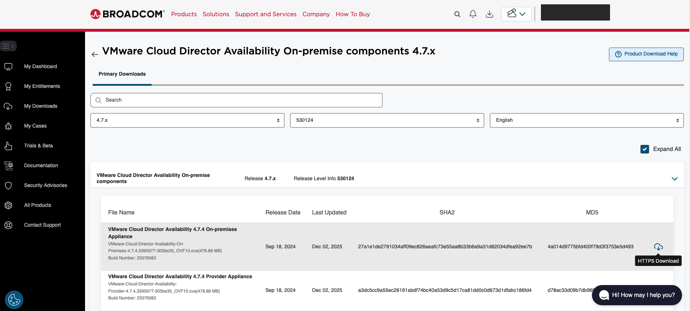
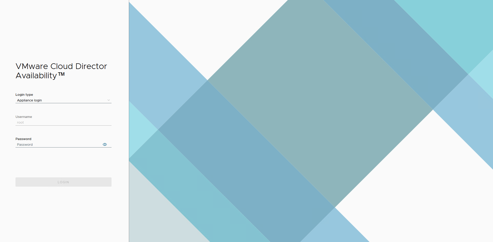
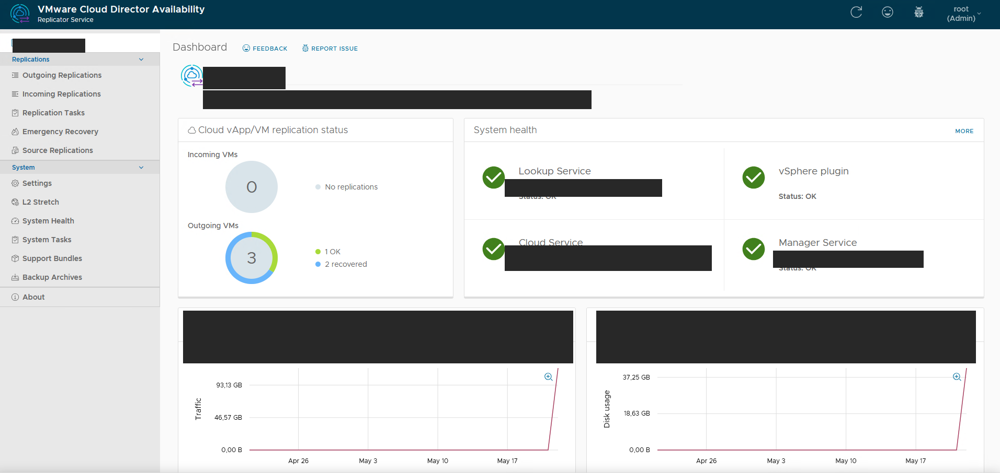
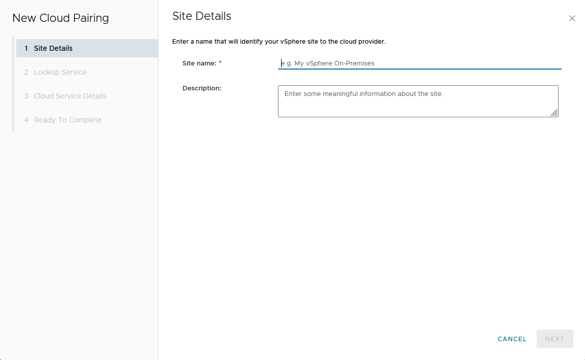
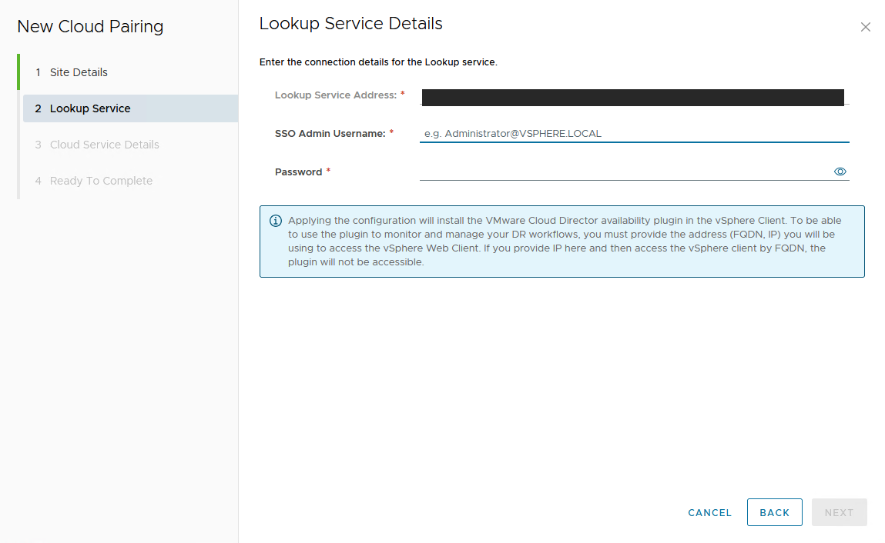
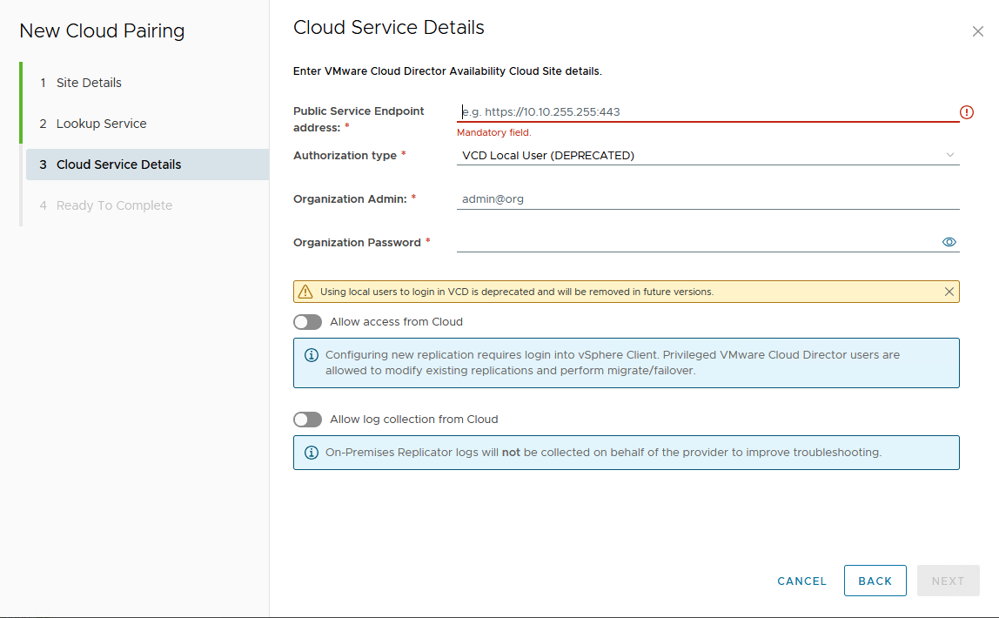

## Objectif

OVHcloud propose une fonctionnalité de migration pour le produit Public VCFaaS reposant sur **VMware Cloud Director Availability (VCDA)**. Cette solution permet aux clients VMware disposant d'un environnement vSphere ou VMware Cloud Director on-premise de migrer leurs machines virtuelles vers leur organisation Public VCFaaS chez OVHcloud.

**Ce guide vous présente la fonctionnalité, son architecture et les étapes de préparation : téléchargement de l'appliance VCDA, déploiement local et initialisation.**

> [!primary]
>
> Une fois ce guide terminé, consultez le guide [Lancer une première migration vers votre Public VCFaaS](/pages/hosted_private_cloud/hosted_private_cloud_powered_by_vmware/vcda-trigger-migration) pour déclencher votre première migration.

## Prérequis

- Disposer d'une organisation [Public VCFaaS](/links/hosted-private-cloud/vmware-vcd-organization) active.
- Disposer d'un environnement source VMware vSphere ou VMware Cloud Director on-premise.
- Avoir un compte sur le portail [Broadcom Support](https://support.broadcom.com/) pour télécharger l'appliance **VMware Cloud Director Availability**.
- Disposer des droits d'administrateur sur votre vCenter source (utilisateur SSO).

## En pratique

### Comprendre la fonctionnalité de migration Public VCFaaS

La migration Public VCFaaS s'appuie sur **VMware Cloud Director Availability (VCDA)**, une solution VMware dédiée à la réplication et à la migration de machines virtuelles entre environnements vSphere et Cloud Director.

Concrètement, vous déployez une **appliance VCDA on-premise** dans votre infrastructure source. Cette appliance se charge de :

- établir un canal sécurisé (tunnel) vers le service VCDA hébergé par OVHcloud du côté Public VCFaaS ;
- répliquer les disques des VMs sélectionnées vers votre organisation ;
- exécuter la bascule (migration) une fois la réplication terminée.

#### Architecture de la solution

Le schéma ci-dessous décrit les flux entre votre site source et votre organisation Public VCFaaS :

```
┌──────────────────────────────────┐               ┌──────────────────────────────────────┐
│      Site client (on-premise)    │               │           OVHcloud - Public VCFaaS   │
│                                  │               │                                      │
│   ┌──────────┐    ┌───────────┐  │   Réplication │    ┌─────────────────────────────┐   │
│   │ vSphere  │    │   VCDA    │  │   (HTTPS/443) │    │   VCDA Cloud Service        │   │
│   │   ou     │───▶│ on-premise│  │═══════════════│═══▶│   (hébergé par OVHcloud)    │   │
│   │   VCD    │    │ appliance │  │               │    └─────────────┬───────────────┘   │
│   └──────────┘    └───────────┘  │               │                  │                   │
│                                  │               │                  ▼                   │
│                                  │               │    ┌─────────────────────────────┐   │
│                                  │               │    │   Organisation VCD          │   │
│                                  │               │    │   (vDC client)              │   │
│                                  │               │    └─────────────────────────────┘   │
└──────────────────────────────────┘               └──────────────────────────────────────┘
```

> [!primary]
>
> L'appliance VCDA on-premise est **gratuite** et fournie par Broadcom. Aucune licence supplémentaire n'est nécessaire côté OVHcloud pour utiliser la fonctionnalité de migration de Public VCFaaS.

### Étape 1 : Télécharger l'appliance VCDA On-Premise

Connectez-vous au portail [Broadcom Support](https://support.broadcom.com/group/ecx/free-downloads) avec votre compte.

Dans la page `Free Downloads`{.action}, recherchez la rubrique **VMware Cloud Director Availability**.

{.thumbnail}

Sélectionnez la dernière version disponible (`4.7.x` au moment de la rédaction de ce guide).

{.thumbnail}

Téléchargez ensuite le fichier **VMware Cloud Director Availability On-premises Appliance** (fichier OVA). Conservez ce fichier, il sera utilisé à l'étape suivante.

{.thumbnail}

### Étape 2 : Déployer l'appliance dans votre infrastructure source

Une fois le fichier OVA téléchargé, déployez-le dans votre environnement source.

> [!primary]
>
> Pour les étapes détaillées de déploiement d'un template OVF sur vSphere, consultez le guide [Déployer un template OVF](/pages/hosted_private_cloud/hosted_private_cloud_powered_by_vmware/ovf_template).
>
> Pour la documentation officielle Broadcom détaillant l'installation de l'appliance VCDA on-premise (prérequis, options de déploiement, configuration initiale), consultez le guide [Deploying the On-Premises to Cloud Director Replication Appliance](https://techdocs.broadcom.com/us/en/vmware-cis/live-recovery/cloud-director-availability/4-7/on-prem-availability-install-config-and-upgrade-guide-4-7/installing-and-configuring-vcav-on-premises/deploying-the-vcda-on-prem-appliance.html).

Lors du déploiement, prêtez attention aux paramètres suivants :

- **Network** : sélectionnez un réseau permettant à l'appliance de joindre :
    - votre vCenter / VCD source (Lookup Service) ;
    - le service VCDA d'OVHcloud sur internet (HTTPS / port 443).
- **IP configuration** : attribuez une adresse IP statique à l'appliance pour faciliter son accès ultérieur.
- **Root password** : définissez un mot de passe fort respectant les bonnes pratiques de sécurité.

### Étape 3 : Se connecter au portail d'administration de l'appliance

Une fois l'appliance déployée et démarrée, accédez à son interface web depuis un navigateur :

```
https://<IP-de-l-appliance>
```

Authentifiez-vous avec le login **root** et le mot de passe défini lors du déploiement.

{.thumbnail}

### Étape 4 : Initialiser l'appliance

Une fois connecté, l'interface VMware Cloud Director Availability s'affiche. Dans la section **Getting Started**, cliquez sur `Run the initial setup wizard`{.action} pour lancer l'assistant d'initialisation.

Dans la fenêtre `Initial Setup`{.action}, renseignez les informations suivantes :

|Champ|Description|Exemple|
|---|---|---|
|**Site name**|Nom descriptif identifiant votre site source|`mon-site-onprem`|
|**Lookup Service Address**|URL du Lookup Service de votre vCenter|`https://<VCENTER-IP-OU-FQDN>/lookupservice/sdk`|
|**SSO Admin Username**|Utilisateur avec droits administrateur SSO|`administrator@vsphere.local`|
|**Password**|Mot de passe du compte SSO|*(votre mot de passe)*|

Cliquez sur `Apply`{.action}, puis acceptez le certificat serveur lorsqu'il est proposé.

L'installation initiale se termine ensuite automatiquement. À l'issue de la procédure, le tableau de bord principal de l'appliance s'affiche :

{.thumbnail}

Vérifiez dans la section **System health** que les services suivants sont au statut **OK** :

- Lookup Service
- vSphere plugin
- Cloud Service
- Manager Service

> [!warning]
>
> Si l'un des services est en erreur, vérifiez :
>
> - la connectivité réseau entre l'appliance et votre vCenter ;
> - la validité des identifiants SSO renseignés ;
> - que l'appliance dispose d'une sortie internet sur le port `443`.

### Étape 5 : Appairer l'appliance avec votre organisation Public VCFaaS

L'appairage (pairing) consiste à déclarer le service VCDA cloud d'OVHcloud comme site distant de votre appliance on-premise. Cette opération s'effectue depuis l'interface VCDA on-premise via un assistant guidé.

Depuis le menu de gauche, cliquez sur `Settings`{.action}. Dans la liste des sites distants, cliquez sur `New Cloud Pairing`{.action} pour ouvrir l'assistant.

#### Étape 5.1 : Site Details

Renseignez les informations identifiant votre site auprès du fournisseur cloud :

|Champ|Description|Exemple|
|---|---|---|
|**Site name**|Nom descriptif de votre site vSphere on-premise|`mon-site-onprem`|
|**Description**|Description libre du site|*(optionnel)*|

{.thumbnail}

Cliquez sur `Next`{.action}.

#### Étape 5.2 : Lookup Service

Renseignez les informations de connexion au **Lookup Service** de votre vCenter source :

|Champ|Description|Exemple|
|---|---|---|
|**Lookup Service Address**|URL du Lookup Service de votre vCenter|`https://<VCENTER-IP-OU-FQDN>:443/lookupservice/sdk`|
|**SSO Admin Username**|Utilisateur avec droits administrateur SSO|`administrator@vsphere.local`|
|**Password**|Mot de passe du compte SSO|*(votre mot de passe)*|

{.thumbnail}

> [!warning]
>
> L'application de la configuration installe le plugin **VMware Cloud Director Availability** dans votre vSphere Client. Pour pouvoir utiliser le plugin, l'adresse renseignée (FQDN ou IP) doit correspondre à celle que vous utiliserez pour accéder au vSphere Web Client.

Cliquez sur `Next`{.action}.

#### Étape 5.3 : Cloud Service Details

Renseignez les informations de connexion au service VCDA OVHcloud associé à votre organisation Public VCFaaS :

|Champ|Description|Valeur|
|---|---|---|
|**Public Service Endpoint address**|URL publique du service VCDA OVHcloud|*Fournie par OVHcloud lors de l'activation*|
|**Authorization type**|Type d'authentification à utiliser|`VCD Local User`{.action}|
|**Organization Admin**|Utilisateur administrateur de votre organisation Public VCFaaS|`<utilisateur>@<organisation>`|
|**Organization Password**|Mot de passe du compte|*(votre mot de passe)*|

Vous pouvez également activer les options suivantes :

- **Allow access from Cloud** : autorise OVHcloud à modifier les réplications existantes et à effectuer les opérations de migration/failover depuis le portail Cloud Director ;
- **Allow log collection from Cloud** : autorise la collecte des logs de l'appliance on-premise par OVHcloud à des fins de support.

{.thumbnail}

Cliquez sur `Next`{.action}.

#### Étape 5.4 : Ready To Complete

Vérifiez le récapitulatif de l'appairage puis cliquez sur `Finish`{.action} pour finaliser la configuration.

Une fois l'appairage effectué, le site cloud OVHcloud apparaît dans la liste des sites distants de votre appliance. Vous pouvez maintenant lancer votre première migration en suivant le guide [Lancer une première migration vers votre Public VCFaaS](/pages/hosted_private_cloud/hosted_private_cloud_powered_by_vmware/vcda-trigger-migration).

## Aller plus loin

- [Lancer une première migration vers votre Public VCFaaS](/pages/hosted_private_cloud/hosted_private_cloud_powered_by_vmware/vcda-trigger-migration)
- [Découvrez comment utiliser l'interface utilisateur de Public VCF as-a-Service](/pages/hosted_private_cloud/hosted_private_cloud_powered_by_vmware/vcd-getting-started)
- [Documentation officielle VMware Cloud Director Availability](https://techdocs.broadcom.com/us/en/vmware-cis/cloud-director/vmware-cloud-director-availability.html)

Si vous avez besoin d'une formation ou d'une assistance technique pour la mise en œuvre de nos solutions, contactez votre commercial ou cliquez sur [ce lien](/links/professional-services) pour obtenir un devis et demander une analyse personnalisée de votre projet à nos experts de l'équipe Professional Services.

Échangez avec notre [communauté d'utilisateurs](/links/community).
