## Objective

OVHcloud offers a VM migration feature to Public VCFaaS based on **VMware Cloud Director Availability (VCDA)**. This feature allows you to migrate your VMs from a vSphere or VCD on-premise environment to your Public VCFaaS organization.

**This guide walks you through your first migration: data replication, monitoring, and the final cutover (migration) to your Public VCFaaS organization.**

## Requirements

- An active [Public VCFaaS](/links/hosted-private-cloud/vmware-vcd-organization) organization.
- The migration option enabled on your organization from your [OVHcloud Control Panel](/links/manager).
- A **VCDA On-Premise** appliance deployed, configured and paired with your Public VCFaaS organization. If this is not yet the case, refer to the [Public VCFaaS Migration - Getting Started](/pages/hosted_private_cloud/hosted_private_cloud_powered_by_vmware/vcda-getting-started) guide.
- A user account on your Public VCFaaS organization with enough rights to manage replications.

## Instructions

### Workflow overview

The migration workflow has three main steps:

```
┌──────────────────────┐     ┌──────────────────────┐     ┌──────────────────────┐
│   Step 1             │     │   Step 2             │     │   Step 3             │
│   Start the          │────▶│   Wait for the       │────▶│   Trigger the final  │
│   replication        │     │   replication to     │     │   migration          │
│   (source → target)  │     │   reach Healthy      │     │   (cutover)          │
└──────────────────────┘     └──────────────────────┘     └──────────────────────┘
```

The operations can be driven from two interfaces:

- **Your on-premise VCDA appliance UI**, for source-side operations (recommended for this guide);
- **The VMware Cloud Director UI** of your Public VCFaaS organization, through the **Availability plugin**.

#### Accessing the Availability plugin in VMware Cloud Director

From your Public VCFaaS organization, open the VCD portal and click `More`{.action} > `Availability`{.action} to access the VCDA plugin:

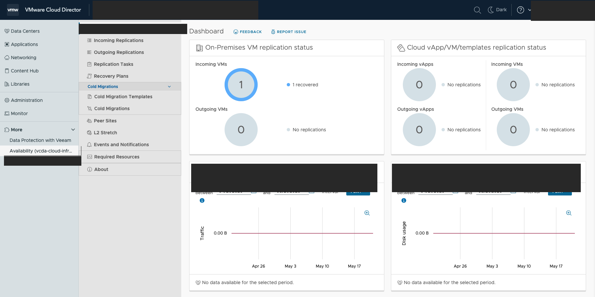{.thumbnail}

The plugin shows the status of inbound and outbound replications for your organization.

### Step 1: Start the replication

In this example, we trigger the migration **from** the on-premise VCDA appliance **to** the Public VCFaaS organization.

Log in to your on-premise VCDA appliance interface (`https://<appliance-IP>`) with the `root` account.

In the left menu, click `Outgoing Replications`{.action}, then the `vApp`{.action} tab.

Click the `New migration`{.action} button (cloud icon with an upward arrow) to start the wizard.

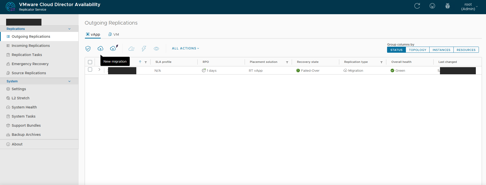{.thumbnail}

#### Authentication to the target organization

The wizard prompts you to authenticate against the Public VCFaaS organization that will be the migration target.

Enter:

- **Username**: your username on the Public VCFaaS organization (in the `user@organization` format);
- **Password**: the associated password.

Click `LOGIN`{.action}.

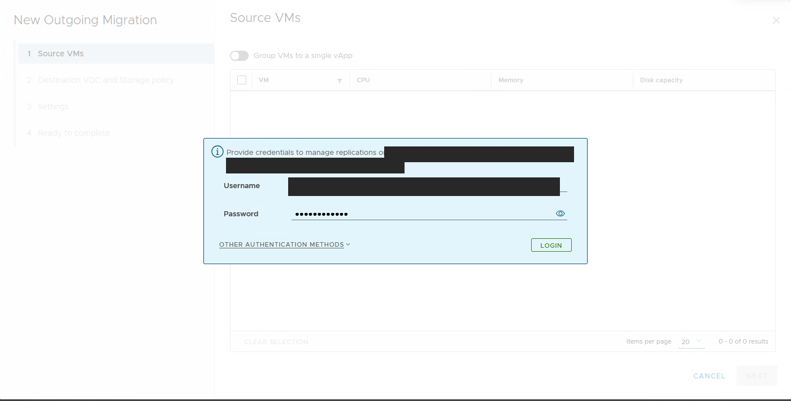{.thumbnail}

#### Step 1.1: Selecting source VMs

Select the source vCenter from the `Select VMs to replicate from`{.action} dropdown, then tick the virtual machine(s) you want to migrate.

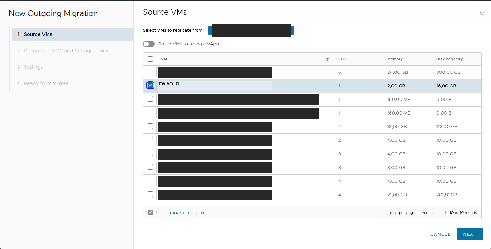{.thumbnail}

Click `Next`{.action}.

#### Step 1.2: Destination vDC and storage policy

Select the target **virtual datacenter (vDC)** in your Public VCFaaS organization and the **storage policy** to use for the migrated VMs.

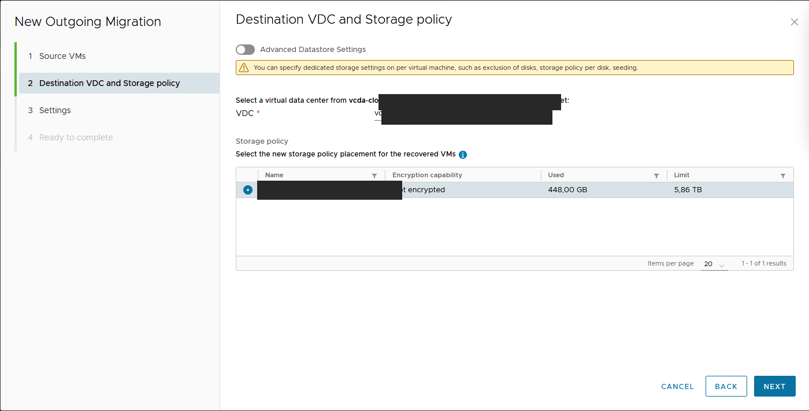{.thumbnail}

Click `Next`{.action}.

#### Step 1.3: Replication settings

This step allows you to adjust the replication settings:

- **Compress replication traffic**: enable it only on limited bandwidth links (increased CPU usage);
- **Delay start synchronization**: to postpone the start of the initial synchronization;
- **VDC policy settings**: placement and sizing policies to apply on the target (leave `None`{.action} to keep the original configuration).

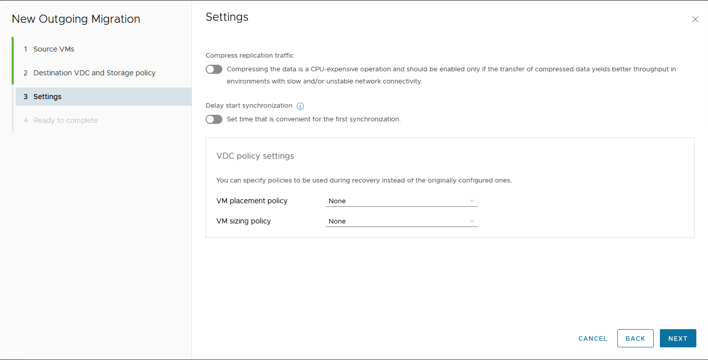{.thumbnail}

Click `Next`{.action}.

#### Step 1.4: Summary

The wizard displays a summary of the upcoming migration. Check:

- the selected VMs;
- the source and destination sites;
- the vDC and storage policy;
- the sizing and placement policies.

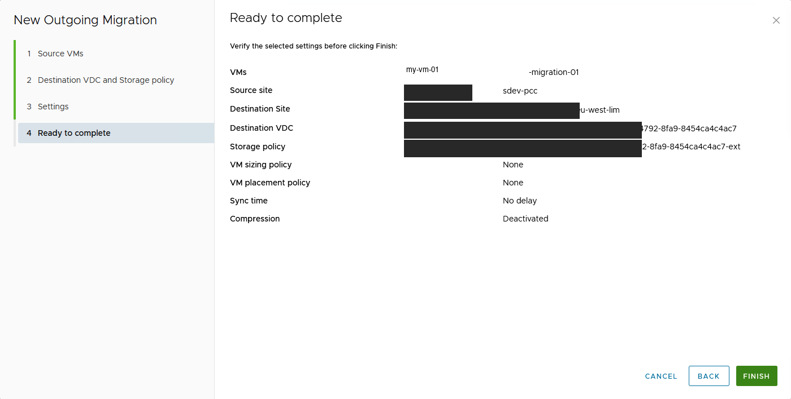{.thumbnail}

Click `Finish`{.action} to start the replication.

### Step 2: Monitor the replication progress

Once the replication is started, it appears in the `Outgoing Replications`{.action} list with the **Synchronizing** state.

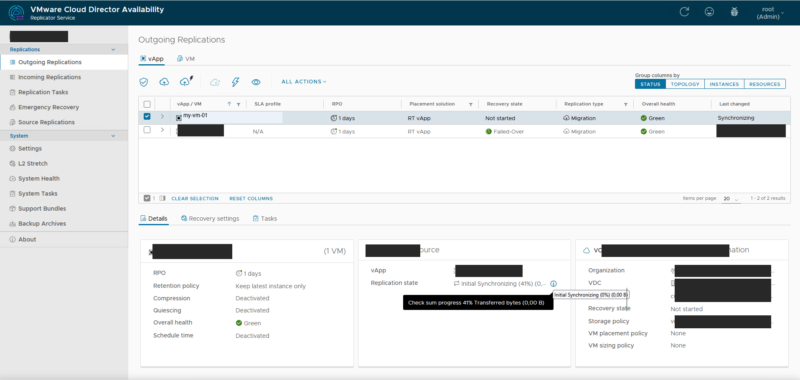{.thumbnail}

The replication details show:

- the checksum progress (block verification);
- the transferred bytes;
- the status of the source-side and target-side components.

> [!warning]
>
> Wait until the replication reaches the **Healthy** state before triggering the final migration. The initial replication time depends on disk sizes and available bandwidth.

When the replication is ready to be cut over, the state becomes **Healthy** and the **Recovery state** shows **Not started**:

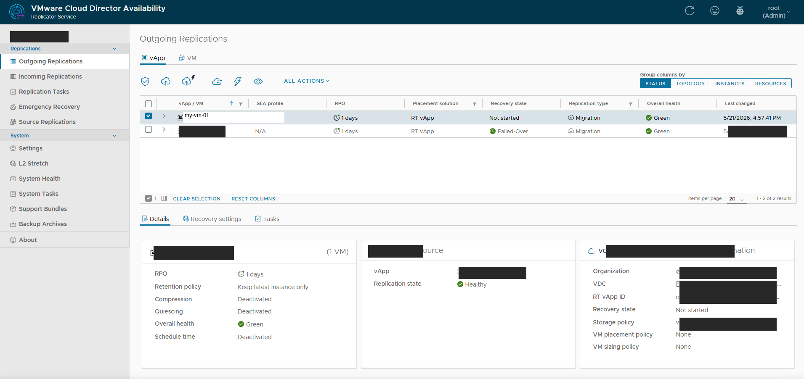{.thumbnail}

### Step 3: Trigger the migration

Once the replication is in the **Healthy** state, you can trigger the cutover.

Select the replication in the list, then click `ALL ACTIONS`{.action} > `Migrate`{.action}.

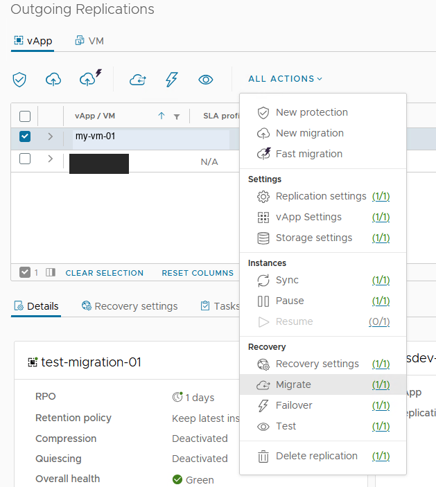{.thumbnail}

#### Step 3.1: Migration settings

Configure the cutover parameters:

- **Power settings**: tick `Power on recovered vApps`{.action} to automatically start the VMs on the target side after the cutover;
- **Network Settings**:
    - `Apply preconfigured network settings on migrate`{.action}: applies the network settings defined in the recovery profile;
    - `Connect all VMs to network`{.action}: simply reconnects the VMs to the chosen network;
- **VDC policy settings**: placement, sizing and storage policies to use on the target.

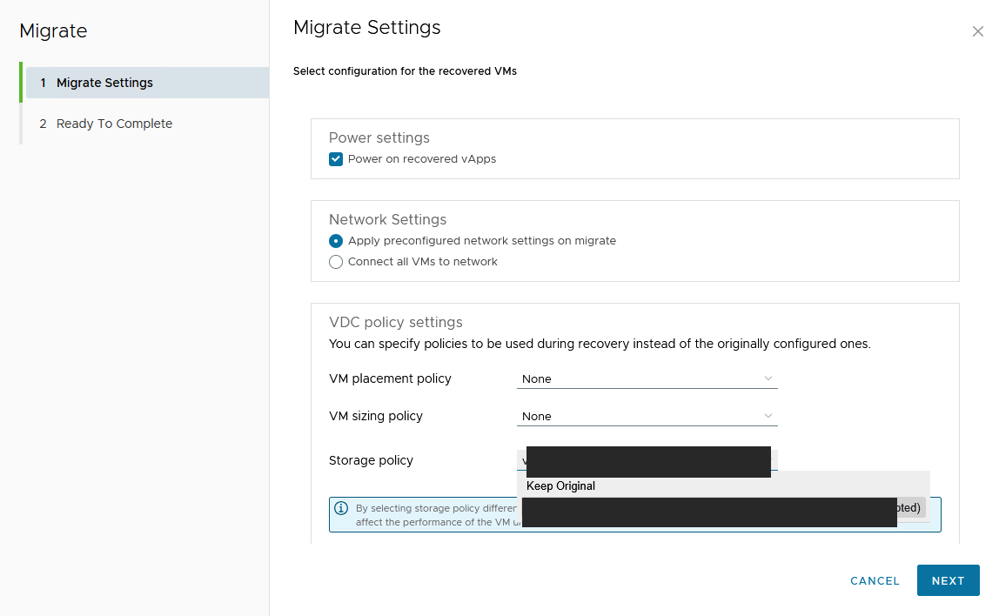{.thumbnail}

Click `Next`{.action}.

#### Step 3.2: Confirmation

Check the summary:

- the vApps to migrate;
- the recovery site;
- the network settings;
- the storage policy.

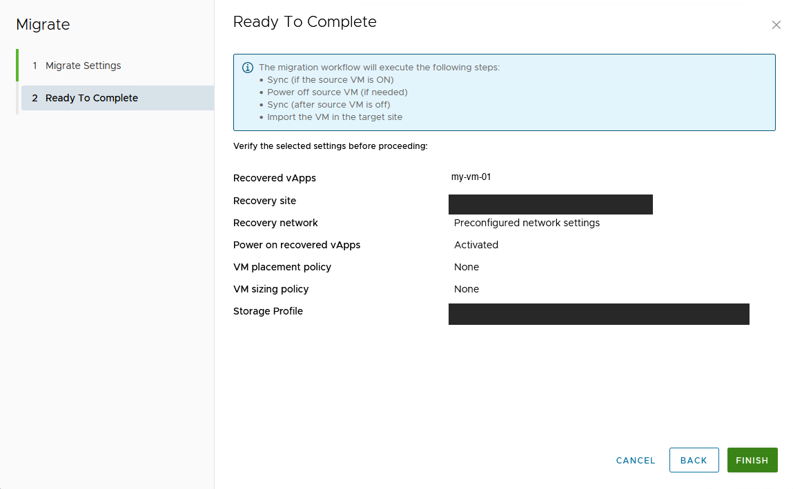{.thumbnail}

> [!primary]
>
> The migration workflow automatically performs the following steps:
>
> 1. Final synchronization (if the source VM is powered on);
> 2. Shutdown of the source VM;
> 3. Final synchronization (once the source VM is off);
> 4. Import of the VM into the target site.

Click `Finish`{.action} to start the migration.

#### Monitoring the migration

The cutover appears in the replication list with the **Migrate** state and a progress percentage:

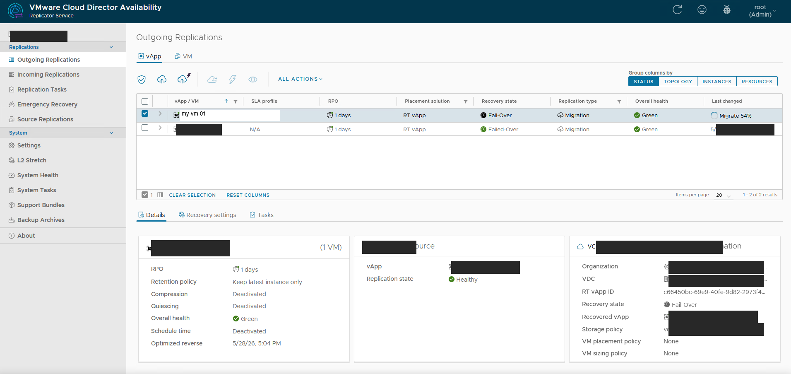{.thumbnail}

#### Migration completed

Once the migration is finalised, the VM appears in your Public VCFaaS organization and the replication state changes to **Failed-Over** in the **Incoming Replications** view of the VCD portal:

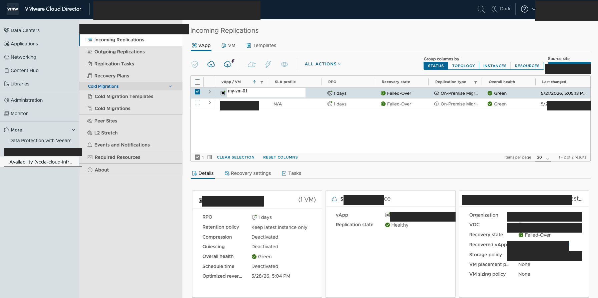{.thumbnail}

You can now find your migrated VMs directly in your Public VCFaaS vDC, ready to use.

## Go further

- [Public VCFaaS Migration - Getting Started](/pages/hosted_private_cloud/hosted_private_cloud_powered_by_vmware/vcda-getting-started)
- [How to use the Public VCF as-a-Service user interface](/pages/hosted_private_cloud/hosted_private_cloud_powered_by_vmware/vcd-getting-started)
- [Official VMware Cloud Director Availability documentation](https://techdocs.broadcom.com/us/en/vmware-cis/cloud-director/vmware-cloud-director-availability.html)

If you need training or technical assistance to implement our solutions, please contact your sales representative or click [here](/links/professional-services) to get a quote and ask for a custom analysis of your project from our Professional Services experts.

Join our [community of users](/links/community).
